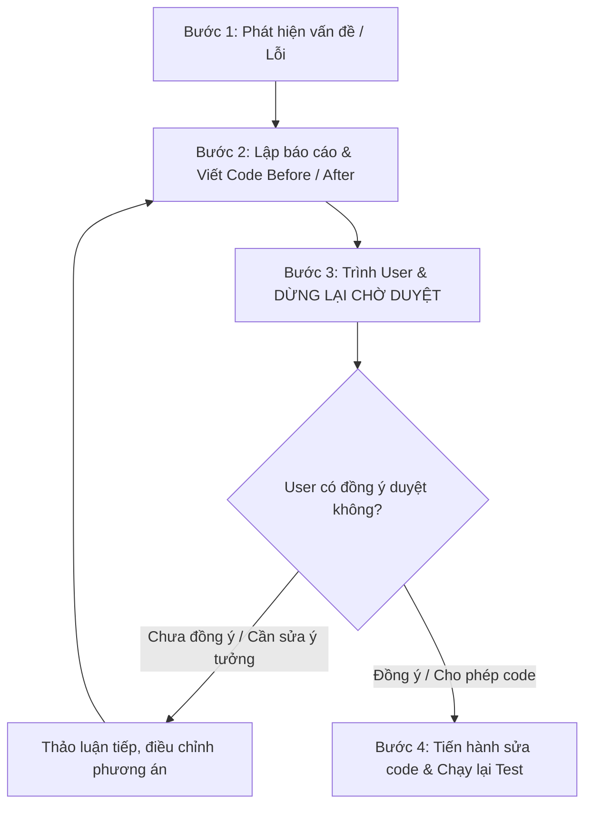

# Quy Trình Nghiêm Ngặt: Đề Xuất - Thẩm Định - Duyệt Trước Khi Sửa Code (Strict Propose-Review-Approve Workflow)

Kỹ năng này quy định quy trình làm việc bắt buộc giữa AI Assistant và Lập trình viên (User) trong toàn bộ dự án: **Tuyệt đối không được tự ý sửa code khi chưa được User phê duyệt.**

---

## 1. Nguyên Tắc Cốt Lõi (Golden Rules)

1. **KHÔNG TỰ Ý CHỈNH SỬA CODE:** 
   * Tuyệt đối không gọi các công cụ sửa code (`replace_file_content`, `multi_replace_file_content`, `write_to_file` trên các file mã nguồn `.java`, `.jsp`, `.sql`, `.js`, `.css`) khi User chưa đưa ra hiệu lệnh cho phép.
2. **MINH BẠCH VẤN ĐỀ & GIẢI PHÁP:** 
   * Mọi đề xuất thay đổi, sửa lỗi (bug fix) hay thêm tính năng đều phải được giải thích rõ nguyên nhân, hậu quả và phương án khắc phục.
3. **BẮT BUỘC CÓ BẢNG SO SÁNH TRƯỚC VÀ SAU (BEFORE & AFTER):** 
   * Luôn trình bày chi tiết đoạn mã hiện tại và đoạn mã đề xuất thay thế.
4. **LƯU VÀO TÀI LIỆU RIÊNG (`.md`):** 
   * Ghi nhận đầy đủ vào file báo cáo markdown độc lập trong `docs/` để User dễ dàng đọc, kiểm tra và lưu vết.
5. **CHỈ HÀNH ĐỘNG KHI CÓ HIỆU LỆNH DUYỆT:** 
   * Chỉ tiến hành sửa code sau khi User đọc xong và phản hồi đồng ý (ví dụ: *"Ok đúng ý tôi rồi tiến hành code đi"*).

---

## 2. Quy Trình 4 Bước Chuẩn (Standard 4-Step Procedure)



### Bước 1: Phát Hiện Vấn Đề & Phân Tích Nguyên Nhân
* Khi chạy test case phát hiện lỗi hoặc khi bàn thảo ý tưởng mới:
  * Xác định chính xác vị trí file, số dòng gây ra lỗi.
  * Phân tích rõ nguyên nhân gốc rễ (Root Cause) và tác động tiêu cực đến hệ thống.
  * **Hành động bị cấm:** Không được tiện tay sửa file code ngay tại bước này.

### Bước 2: Lập Báo Cáo & Soạn Thảo Đoạn Code Đề Xuất
* Trình bày rõ phương án giải quyết:
  * Lý do chọn giải pháp này.
  * Tác động đến CSDL, hiệu năng và trải nghiệm người dùng (UX).
* Soạn thảo bảng / khối so sánh code trực quan:
  ```java
  // ==================== TRƯỚC KHI SỬA (BEFORE) ====================
  // File: RoomDAO.java (dòng 60)
  WHERE p.TrangThai NOT IN ('Dirty', 'Cleaning', 'Damaged')

  // ==================== SAU KHI SỬA (AFTER) ====================
  // File: RoomDAO.java (dòng 60)
  WHERE p.TrangThai <> 'Damaged'
  ```
* Ghi lại nội dung này vào file báo cáo `.md` (nếu User yêu cầu báo cáo riêng).

### Bước 3: Trình Bày Cho User & DỪNG LẠI CHỜ DUYỆT
* Gửi nội dung báo cáo hoặc link file markdown cho User.
* Đặt câu hỏi lịch sự: *"Bạn xem phương án và đoạn code đề xuất trên đã đúng ý chưa? Nếu đồng ý, xin hãy cho phép để tôi tiến hành sửa code."*
* **Dừng gọi mọi tool sửa file. Tuyệt đối không tự ý build hoặc chạy deploy.**

### Bước 4: Thực Thi Code & Kiểm Thử Lại Sau Khi Được Duyệt
* Khi User đưa ra hiệu lệnh cho phép (ví dụ: *"Tiến hành code cho tôi"* hoặc *"Đồng ý phương án"*):
  * Dùng `replace_file_content` hoặc `multi_replace_file_content` để áp dụng chính xác đoạn code đã được duyệt.
  * Rebuild ứng dụng, reload Tomcat.
  * Chạy lại bộ test case để kiểm chứng lỗi đã được khắc phục 100% và không phát sinh lỗi hồi quy.
  * Báo cáo kết quả kiểm thử sau khi hoàn thành cho User.

---

## 3. Mẫu Trình Bày Chuẩn Dành Cho AI Assistant

Khi phát hiện lỗi hoặc đề xuất tính năng mới, AI Assistant phải luôn dùng mẫu chuẩn sau:

> ### 📋 ĐỀ XUẤT THAY ĐỔI / KHẮC PHỤC LỖI
> 
> **1. Vấn đề phát hiện:**  
> [Mô tả lỗi hoặc điểm nghẽn nghiệp vụ]
> 
> **2. Nguyên nhân:**  
> [Chỉ ra file và dòng code gây lỗi]
> 
> **3. Phương án giải quyết:**  
> [Giải thích logic mới]
> 
> **4. Đoạn code trước và sau khi sửa:**  
> ```diff
> - Đoạn code cũ (Before)
> + Đoạn code mới (After)
> ```
> 
> **5. File báo cáo chi tiết:**  
> [Đường dẫn file .md nếu có]
> 
> *(Dừng lại ở đây và chờ User xác nhận cho phép trước khi thực thi)*
