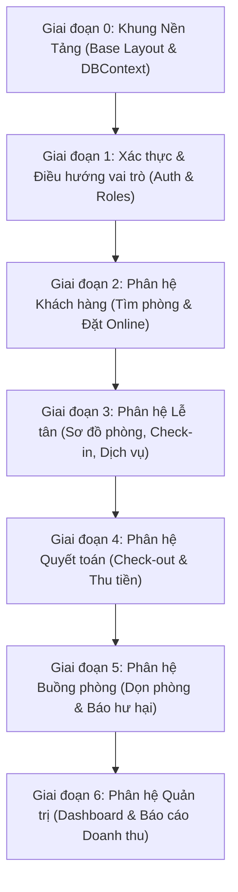

# KẾ HOẠCH LỘ TRÌNH PHÁT TRIỂN GIAO DIỆN (UI) THEO THỨ TỰ "VỪA LÀM VỪA TEST"
**Dự án:** Hệ Thống Quản Lý Khách Sạn (Hotel Management System) — Nhóm 10  
**Môn học:** Lập Trình Web & Hệ Quản Trị Cơ Sở Dữ Liệu — HCMUTE  
**Mục tiêu:** Xây dựng giao diện tuần tự theo chu trình nghiệp vụ thực tế, màn hình trước tạo tiền đề dữ liệu để kiểm thử ngay lập tức cho màn hình sau mà không cần fake dữ liệu thủ công.

---

## 🧭 NGUYÊN TẮC XẾP HÀNG & PHƯƠNG PHÁP KIỂM THỬ CUỐN CHIẾU

Một dự án quản lý khách sạn có chu trình vận hành khép kín (**The Hotel Guest Cycle**):
$$\text{Đăng nhập} \longrightarrow \text{Tìm & Đặt phòng} \longrightarrow \text{Check-in nhận phòng} \longrightarrow \text{Dùng dịch vụ} \longrightarrow \text{Quyết toán & Check-out} \longrightarrow \text{Dọn buồng phòng} \longrightarrow \text{Báo cáo Quản lý}$$

Do đó, các màn hình UI được chia làm **6 Giai đoạn (Phases)**. Cứ xong 1 Phase là có thể mở trình duyệt chạy thử (Live Test) ngay:

---

## 📌 BẢNG TỔNG HỢP LỘ TRÌNH 6 GIAI ĐOẠN

---

## 🚀 CHI TIẾT TỪNG GIAI ĐOẠN PHÁT TRIỂN & KỊCH BẢN TEST

---

### 🟢 GIAI ĐOẠN 0: KHUNG NỀN TẢNG & KẾT NỐI (FOUNDATION)
* **Ý nghĩa:** Chuẩn bị sẵn bộ khung giao diện để tất cả các màn hình sau tái sử dụng, không phải viết lại HTML/CSS lặp đi lặp lại.
* **Các thành phần UI cần xây dựng:**
  1. `views/common/header.jsp` & `footer.jsp`: Thẻ meta, link CSS, JS, logo khách sạn.
  2. `views/common/navbar.jsp`: Thanh menu hiển thị theo trạng thái đăng nhập (Khách vãng lai / Đã đăng nhập).
  3. `assets/css/style.css`: Màu sắc chủ đạo (sang trọng: xanh navy `#1a365d`, vàng kim `#c5a880`, trắng `#ffffff`), font chữ Inter/Roboto, component alert thông báo.
* **Kiểm thử ngay (Test Step):**
  - Mở trang `index.html` hoặc `home.jsp` kiểm tra layout chuẩn, responsive mượt mà trên cả máy tính và điện thoại.

---

### 🟢 GIAI ĐOẠN 1: ĐĂNG NHẬP & PHÂN QUYỀN VAI TRÒ (AUTHENTICATION)
* **Ý nghĩa:** Cần có danh tính người dùng thì mới biết ai đang đặt phòng (`MaKH`), ai làm thủ tục (`MaNV`), ai dọn phòng (`Housekeeper`).
* **Các thành phần UI cần xây dựng:**
  1. `views/common/login.jsp`: Giao diện Form đăng nhập đẹp mắt (Tên đăng nhập / Email, Mật khẩu, hiển thị thông báo lỗi khi sai thông tin).
  2. `views/common/register.jsp`: Form đăng ký tài khoản khách hàng mới (Họ tên, SĐT, CCCD, Email, Mật khẩu).
* **Đối tượng Backend & DB liên kết:**
  - `TAIKHOAN`, `KHACHHANG`, `NHANVIEN`, `VAITRO`.
  - Filter: `AuthenticationFilter` & `AuthorizationFilter`.
* **Kịch bản kiểm thử ngay (Test Case):**
  - **Test 1.1:** Đăng nhập với tài khoản Khách hàng (`an.nguyen@gmail.com` / `1234`) $\to$ Tự động chuyển hướng vào Portal Khách hàng.
  - **Test 1.2:** Đăng nhập Lễ tân (`huong.reception` / `1234`) $\to$ Tự động chuyển hướng vào Màn hình Lễ tân.
  - **Test 1.3:** Đăng nhập Buồng phòng (`nhung.housekeeper` / `1234`) $\to$ Chuyển vào Màn hình Buồng phòng.
  - **Test 1.4:** Đăng nhập Quản lý (`vinh.manager` / `1234`) $\to$ Chuyển vào Dashboard Quản trị.
  - **Test 1.5:** Thử lấy link trang Quản lý paste vào trình duyệt của Khách hàng $\to$ Bị chặn lại (403 Forbidden hoặc đá về trang Login).

---

### 🟢 GIAI ĐOẠN 2: PHÂN HỆ KHÁCH HÀNG — TÌM PHÒNG & ĐẶT PHÒNG TRỰC TUYẾN
* **Ý nghĩa:** Tạo ra đơn đặt phòng (`BOOKING`) đầu tiên để làm nguyên liệu cho Lễ tân check-in ở giai đoạn tiếp theo.
* **Các thành phần UI cần xây dựng:**
  1. `views/guest/home.jsp`: Banner tìm kiếm nhanh (**Search Bar** gồm: Ngày nhận, Ngày trả, Số lượng khách, Hạng phòng).
  2. `views/guest/room_list.jsp`: Danh sách kết quả phòng trống (hiển thị ảnh, diện tích, loại giường, giá/đêm, nút "Chọn đặt phòng").
  3. `views/guest/booking_form.jsp`: Màn hình xác nhận đặt phòng & tóm tắt số đêm, tổng chi phí dự kiến.
  4. `views/guest/booking_history.jsp`: Màn hình "Lịch sử đặt phòng của tôi" (danh sách đơn đã đặt, trạng thái đơn, mã hóa đơn).
* **Đối tượng Backend & DB liên kết:**
  - View `v_DanhSachPhongKhaDung`.
  - Function `fn_TraCuuPhongTrongTheoYeuCau`, `fn_KiemTraPhongTrongTrongKhoang`, `fn_LichSuDatPhongKhachHang`.
  - Procedure `sp_TaoDonDatPhongOnline` (hoặc Transaction `sp_Transaction_TaoBookingTronGoi`).
  - Trigger `trg_Check_XungDotDatPhong`, `trg_TuDongTaoHoaDonKhiDatPhong`.
* **Kịch bản kiểm thử ngay (Test Case):**
  - **Test 2.1:** Chọn ngày nhận/trả $\to$ Danh sách chỉ hiện các phòng `Available` và không bị trùng lịch.
  - **Test 2.2:** Bấm đặt phòng $\to$ Báo thành công, sinh mã `BK_...`.
  - **Test 2.3:** Kiểm tra DB SQL Server $\to$ Bản ghi đã vào `BOOKING`, `BOOKING_PHONG`, và Trigger 5 đã **tự động sinh sẵn 1 Hóa đơn `HOADON`** tương ứng ở trạng thái `ChuaThanhToan`.
  - **Test 2.4:** Mở trang "Lịch sử đặt phòng" $\to$ Đơn phòng vừa đặt hiển thị ngay trên bảng.

---

### 🟢 GIAI ĐOẠN 3: PHÂN HỆ LỄ TÂN — SƠ ĐỒ PHÒNG, CHECK-IN & GỌI DỊCH VỤ
* **Ý nghĩa:** Lễ tân nhận khách đến khách sạn, bàn giao phòng và thêm đồ ăn/dịch vụ phát sinh trong kỳ nghỉ.
* **Các thành phần UI cần xây dựng:**
  1. `views/receptionist/room_map.jsp`: **Sơ đồ phòng trực quan (Room Grid Map)**: Các ô phòng chia theo tầng/loại phòng, có màu sắc trực quan:
     - 🟩 **Xanh lá:** `Available` (Phòng trống sạch).
     - 🟥 **Đỏ:** `Occupied` (Đang có khách ở).
     - 🟨 **Vàng:** `Dirty` / `Cleaning` (Phòng bẩn / đang dọn).
     - ⬛ **Xám:** `Damaged` (Phòng hư hỏng).
  2. `views/receptionist/checkin_modal.jsp`: Popup / Màn hình Check-in (Tìm đơn theo mã booking hoặc SĐT khách, bấm "Xác nhận nhận phòng").
  3. `views/receptionist/order_service.jsp`: Màn hình gọi thêm dịch vụ (Chọn mã phòng, chọn dịch vụ: Buffet, Nước ngọt, Spa... nhập số lượng).
* **Đối tượng Backend & DB liên kết:**
  - Index `IX_PHONG_TrangThai_MaLoaiPhong`, Index `IX_KHACHHANG_SoDT_CCCD`.
  - Procedure `sp_CheckInNhanPhong` (hoặc Transaction `sp_Transaction_CheckInNhanPhong`).
  - Procedure `sp_GoiThemDichVu`.
  - Trigger `trg_DongBoTrangThaiPhongCheckIn`.
* **Kịch bản kiểm thử ngay (Test Case):**
  - **Test 3.1:** Lễ tân tìm đơn vừa tạo ở Giai đoạn 2 $\to$ Bấm "Check-in".
  - **Test 3.2:** Quan sát sơ đồ phòng $\to$ Phòng đó lập tức **đổi từ màu Xanh sang màu Đỏ (`Occupied`)** nhờ Trigger 3.
  - **Test 3.3:** Khách gọi 2 lon nước ngọt + 1 vé Spa $\to$ Thêm dịch vụ thành công, dữ liệu được ghi vào `BOOKING_DICHVU`.

---

### 🟢 GIAI ĐOẠN 4: PHÂN HỆ THU NGÂN — QUYẾT TOÁN, CHECK-OUT & IN HÓA ĐƠN
* **Ý nghĩa:** Hoàn tất kỳ lưu trú, thu tiền của khách, in hóa đơn và bàn giao phòng cho bộ phận buồng phòng.
* **Các thành phần UI cần xây dựng:**
  1. `views/receptionist/checkout.jsp`: Màn hình quyết toán hóa đơn (Hiển thị chi tiết tiền phòng + danh sách tiền dịch vụ đã gọi, tổng tiền thực tế).
  2. `views/receptionist/payment_modal.jsp`: Popup thu tiền (Chọn hình thức: Tiền mặt, Thẻ ngân hàng, Chuyển khoản; nhập số tiền khách đưa).
  3. `views/receptionist/invoice_print.jsp`: Mẫu in hóa đơn thanh toán (Hóa đơn VAT/phiếu thanh toán thanh lịch để in ra giấy hoặc xuất PDF).
* **Đối tượng Backend & DB liên kết:**
  - View `v_CongNoHoaDonKhachHang`.
  - Function `fn_TinhTongTienThucTePhaiTra`, `fn_TinhTienPhongBooking`, `fn_TinhTienDichVuBooking`.
  - Procedure `sp_QuyetToanVaCheckOut` & `sp_GhiNhanThanhToan`.
  - Trigger `trg_CapNhatTrangThaiHoaDon`, `trg_TuDongDonPhongSauCheckOut`.
* **Kịch bản kiểm thử ngay (Test Case):**
  - **Test 4.1:** Bấm chọn phòng cần trả $\to$ Màn hình hiển thị chính xác tổng tiền: Tiền phòng (số đêm $\times$ giá) + Dịch vụ (lon nước + spa ở GĐ 3).
  - **Test 4.2:** Thu ngân nhập thanh toán tiền mặt $\to$ Trạng thái hóa đơn chuyển sang `DaThanhToanDu` nhờ Trigger 6.
  - **Test 4.3:** Xác nhận Check-out $\to$ Phòng trên sơ đồ lập tức **chuyển từ Đỏ sang Vàng (`Dirty`)**, đồng thời một nhiệm vụ dọn phòng mới tự động xuất hiện trong bảng `NHIEMVUDOPHONG` nhờ Trigger 4.

---

### 🟢 GIAI ĐOẠN 5: PHÂN HỆ BUỒNG PHÒNG — DỌN PHÒNG & BIÊN BẢN HƯ HẠI
* **Ý nghĩa:** Nhân viên buồng phòng tiếp nhận phòng bẩn vừa check-out ở Giai đoạn 4 để dọn dẹp và nghiệm thu phòng sạch đưa vào kinh doanh tiếp.
* **Các thành phần UI cần xây dựng:**
  1. `views/housekeeper/task_list.jsp`: Màn hình danh sách phòng cần dọn hôm nay (Lọc phòng `ChoXuLy` và `DangDon`).
  2. `views/housekeeper/clean_action.jsp`: Thao tác chuyển tiến độ:
     - Nút "Bắt đầu dọn" (`NhanViec`).
     - Nút "Hoàn thành - Phòng sạch sẽ" (`KhongThietHai`).
     - Nút "Báo cáo sự cố hư hại" (`CoThietHai`).
  3. `views/housekeeper/damage_report.jsp`: Form lập biên bản hư hại (Chọn đồ bị hỏng: vỡ gương, hỏng máy lạnh; nhập mô tả hiện trạng).
* **Đối tượng Backend & DB liên kết:**
  - View `v_DanhSachPhongCanDonDep`, `v_DanhSachPhongHuHaiCanBaoTri`.
  - Procedure `sp_CapNhatTienDoDonPhong`.
  - Transaction `sp_Transaction_HoanTatDonPhongVaLapBienBan`.
* **Kịch bản kiểm thử ngay (Test Case):**
  - **Test 5.1:** Housekeeper đăng nhập $\to$ Thấy ngay căn phòng vừa check-out ở GĐ 4 đang ở trạng thái `ChoXuLy`.
  - **Test 5.2:** Bấm "Bắt đầu dọn" $\to$ Phòng đổi sang màu cam `Cleaning`.
  - **Test 5.3 (Nhánh 1 - Sạch):** Bấm "Hoàn thành sạch sẽ" $\to$ Phòng lập tức chuyển về màu xanh `Available` $\to$ Quay lại Giai đoạn 2 kiểm tra: Khách hàng lại tìm thấy và đặt được phòng này bình thường!
  - **Test 5.4 (Nhánh 2 - Hỏng):** Bấm "Báo cáo hư hại" (chọn vỡ gương) $\to$ Phòng chuyển sang `Damaged` (khóa phòng), biên bản tự động lưu vào `BAOCAOHUHAI` và `CHITIETBAOCAOHUHAI`.

---

### 🟢 GIAI ĐOẠN 6: PHÂN HỆ QUẢN LÝ — DASHBOARD & BÁO CÁO KINH DOANH
* **Ý nghĩa:** Tổng hợp toàn bộ dữ liệu phát sinh từ Giai đoạn 2 đến Giai đoạn 5 thành biểu đồ và bảng biểu tài chính trực quan cho Ban Giám đốc.
* **Các thành phần UI cần xây dựng:**
  1. `views/manager/dashboard.jsp`:
     - Thẻ KPI: Tỷ lệ lấp đầy phòng hôm nay (%), Số phòng đang có khách, Số phòng trống, Số phòng đang dọn/hỏng.
     - Biểu đồ tròn cơ cấu trạng thái phòng.
  2. `views/manager/revenue_report.jsp`:
     - Báo cáo chốt ca ngày: Doanh thu thực thu phân tách theo Tiền mặt / Chuyển khoản / Thẻ.
     - Báo cáo doanh thu tháng & năm.
  3. `views/manager/service_analytics.jsp`: Thống kê Top dịch vụ gia tăng được tiêu thụ nhiều nhất và đem lại doanh thu cao nhất.
  4. `views/manager/damage_management.jsp`: Màn hình theo dõi các phòng đang hư hỏng chờ kỹ thuật xử lý.
* **Đối tượng Backend & DB liên kết:**
  - View `v_TyLeLapDayPhong`, `v_BaoCaoDoanhThuTheoThang`, `v_ThongKeDichVuBanChay`.
  - Procedure `sp_BaoCaoTongHopKinhDoanhTheoNgay`, `sp_BaoCaoTongHopKinhDoanhThang`.
  - Function `fn_DoanhThuTheoKhoangThoiGian`.
  - Index `IX_THANHTOAN_ThoiDiemThanhToan`.
* **Kịch bản kiểm thử ngay (Test Case):**
  - **Test 6.1:** Mở Dashboard $\to$ Số phòng `Occupied`, `Dirty`, `Available` khớp 100% với các bước vừa thao tác ở GĐ 2, 3, 4, 5.
  - **Test 6.2:** Xem báo cáo doanh thu hôm nay $\to$ Xuất hiện đúng khoản tiền thu được từ hóa đơn check-out ở Giai đoạn 4.
  - **Test 6.3:** Xem thống kê dịch vụ $\to$ Hiện đúng số lon nước ngọt và vé spa đã gọi ở Giai đoạn 3.

---

## 📈 MA TRẬN ÁNH XẠ TIẾN ĐỘ THỰC HIỆN

| Thứ tự ưu tiên | Giao diện (UI) | Lớp Controller (Servlet) | Lớp Service & DAO | Đối tượng Database tương ứng |
| :---: | :--- | :--- | :--- | :--- |
| **Ưu tiên 1** | Layout dùng chung & Đăng nhập | `AuthServlet` | `AccountService`, `TaiKhoanDAO` | `TAIKHOAN`, `VAITRO`, `KHACHHANG`, `NHANVIEN` |
| **Ưu tiên 2** | Tìm phòng & Đặt phòng Online | `BookingServlet`, `RoomSearchServlet` | `BookingService`, `PhongDAO` | `v_DanhSachPhongKhaDung`, `sp_TaoDonDatPhongOnline` |
| **Ưu tiên 3** | Sơ đồ phòng & Check-in & Dịch vụ | `ReceptionServlet`, `CheckInServlet`, `ServiceServlet` | `CheckInService`, `BookingDichVuDAO` | `sp_CheckInNhanPhong`, `sp_GoiThemDichVu`, `trg_DongBoTrangThaiPhongCheckIn` |
| **Ưu tiên 4** | Quyết toán hóa đơn & Check-out | `CheckOutServlet`, `PaymentServlet` | `PaymentService`, `HoaDonDAO`, `ThanhToanDAO` | `v_CongNoHoaDonKhachHang`, `sp_QuyetToanVaCheckOut`, `sp_GhiNhanThanhToan` |
| **Ưu tiên 5** | Buồng phòng dọn dẹp & Báo hư hại | `HousekeepingServlet` | `HousekeepingService`, `NhiemVuDoPhongDAO` | `v_DanhSachPhongCanDonDep`, `sp_CapNhatTienDoDonPhong` |
| **Ưu tiên 6** | Dashboard Quản lý & Báo cáo | `DashboardServlet`, `ReportServlet` | `ReportService` | `v_TyLeLapDayPhong`, `v_BaoCaoDoanhThuTheoThang`, `sp_BaoCaoTongHopKinhDoanhTheoNgay` |

---

## 🏆 KẾT LUẬN & ĐỀ XUẤT BẮT ĐẦU

Lộ trình trên đảm bảo:
1. **Không bao giờ bị nghẽn:** Không cần viết dữ liệu mẫu giả lập, dữ liệu do chính bạn thao tác từ màn hình trước sẽ đổ trực tiếp sang màn hình sau.
2. **Kiểm tra được toàn bộ 100% các Function, Stored Procedure, Trigger và View** đã viết trong cơ sở dữ liệu.
3. **Thuyết trình đồ án mạch lạc:** Khi chấm đồ án, bạn có thể demo trực tiếp từ A $\to$ Z theo đúng 1 câu chuyện người thật việc thật trước mặt giảng viên.
