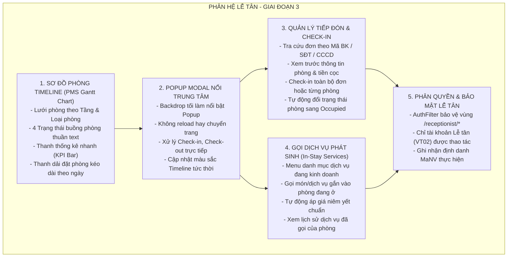

# KẾ HOẠCH THỰC THI & KIỂM THỬ GIAI ĐOẠN 3 (PHASE 3)
## PHÂN HỆ LỄ TÂN (RECEPTIONIST PORTAL): SƠ ĐỒ PHÒNG TIMELINE, POPUP CHECK-IN & GỌI DỊCH VỤ PHÒNG

> **Đề Án Môn Học:** Lập Trình Web / Hệ Quản Trị Cơ Sở Dữ Liệu (DBMS330284) - HCMUTE  
> **Dự Án:** Hệ Thống Quản Lý Khách Sạn (Hotel Management System) - Nhóm 10  
> **Phiên Bản Tài Liệu:** 1.0  
> **Trạng Thái:** Sẵn sàng thẩm định & phê duyệt trước khi lập trình  

---

## 1. MỤC ĐÍCH ĐẠT ĐƯỢC CỦA GIAI ĐOẠN 3

Giai đoạn 3 là mắt xích cốt lõi kết nối giữa **khách hàng đặt phòng trực tuyến (Phase 2)** và **bộ phận vận hành thực tế tại quầy khách sạn**. Mục đích chính cần đạt được bao gồm:

1. **Sơ đồ hóa không gian khách sạn theo thời gian thực (Real-time PMS Gantt Timeline Grid):** Cung cấp giao diện Sơ đồ phòng trực quan dạng trục thời gian (Timeline), giúp lễ tân nắm bắt ngay lập tức tình trạng của từng căn phòng (Trống sạch, Đang có khách ở, Phòng bẩn chờ dọn, Đang dọn, Hư hỏng) và dải thời gian đặt phòng của khách theo tuần/ngày.
2. **Cơ chế tương tác Popup Nổi Trung Tâm (Centered Modal Dialog):** Khi lễ tân nhấp vào bất kỳ điểm nào trên Timeline của phòng (ô phòng hoặc thanh đặt phòng), một Popup Modal nổi bật xuất hiện ngay chính giữa màn hình với nền mờ phía sau (Backdrop Overlay) để xử lý toàn bộ nghiệp vụ (Check-in, Check-out, Gọi dịch vụ) mà không cần chuyển hướng trang.
3. **Quy trình Check-in nhanh gọn & chính xác:** Tiếp đón khách hàng tại quầy lễ tân, tra cứu nhanh đơn đặt phòng từ Giai đoạn 2 qua Mã Booking, SĐT hoặc CCCD, xác nhận giao phòng và chuyển trạng thái phòng sang `Occupied` một cách tự động thông qua Database Triggers/Transactions.
4. **Cung cấp & Ghi nhận dịch vụ gia tăng (In-Stay Service Ordering):** Phục vụ các nhu cầu phát sinh trong kỳ nghỉ của khách (Buffet sáng, Nước giải khát minibar, Dịch vụ giặt ủi, Spa, Xe đưa đón...), ghi nhận chính xác vào bảng `BOOKING_DICHVU` theo đúng phòng hoặc theo cả đoàn.
5. **Bảo toàn tính toàn vẹn dữ liệu cho Giai đoạn 4 (Thu ngân & Quyết toán):** Đảm bảo mọi dịch vụ phát sinh và thời điểm Check-in thực tế được lưu vết chặt chẽ chuẩn 3NF, sẵn sàng để phân hệ Thu ngân tính toán hóa đơn tổng hợp và thu tiền ở Phase 4.

---

## 1.1. QUY CHUẨN THIẾT KẾ UI: TUYỆT ĐỐI KHÔNG DÙNG ICON / EMOJI
Theo chỉ thị thiết kế của dự án, giao diện Phân hệ Lễ tân tuân thủ phong cách **Tối giản & Chuyên nghiệp (Minimalist & Clean Enterprise UI)**:
* **Tuyệt đối không dùng Icon:** Không dùng icon hình ảnh, không dùng icon font (FontAwesome, Material Icons, Bootstrap Icons), và không dùng ký tự Emoji trên toàn bộ giao diện người dùng.
* **Phân biệt trạng thái bằng Text Badge & Màu nền CSS:**
  * Trạng thái buồng phòng hiển thị bằng Text Badge có màu nền đặc trưng:
    * `[Đã dọn]` (Nền xanh lá, chữ trắng - Sạch sẽ sẵn sàng đón khách).
    * `[Bẩn]` (Nền vàng đậm, chữ đen - Chờ nhân viên buồng phòng dọn).
    * `[Đang dọn]` (Nền xanh lam, chữ trắng - Nhân viên đang dọn dẹp).
    * `[Bảo trì]` (Nền xám/đen, chữ trắng - Phòng hỏng hóc, tạm khóa).
  * Trạng thái đặt phòng hiển thị bằng thanh màu thuần túy kèm chữ:
    * Thanh màu Xanh lá: Đơn đặt trước đang chờ nhận (`DaXacNhan`).
    * Thanh màu Đỏ: Khách đang lưu trú tại phòng (`DaCheckIn` / Đang ở).
    * Thanh màu Cam: Khách có lịch trả phòng hôm nay.
    * Khoảng trắng: Phòng trống (`Available`).
* **Nút bấm & Hành động thuần Text:** Mọi nút bấm và liên kết chỉ sử dụng nhãn chữ tiếng Việt rõ nghĩa: `[Đặt phòng mới]`, `[Tìm kiếm]`, `[Check-in]`, `[Check-out]`, `[Thêm dịch vụ]`, `[Đóng]`, `[Lưu dịch vụ]`, `[Quay lại]`.

---

## 2. DANH SÁCH CÁC CHỨC NĂNG SẼ ĐƯỢC XÂY DỰNG



### 2.1. Chức năng 1: Sơ đồ Timeline Quản lý đặt phòng thời gian thực (PMS Gantt Timeline Grid)
* **Giao diện ma trận trục thời gian (PMS Gantt Chart):**
  * **Trục hoành (Top Header):** Hiển thị các ngày trong tuần (T2 đến CN, ví dụ: 29/09 -> 05/10), mỗi ngày chia nhỏ thành các mốc giờ (00, 04, 08, 12, 16, 20h) kèm thanh điều hướng `[< Tuần trước]` và `[Tuần sau >]`.
  * **Trục tung (Left Column):** Danh sách phòng gom nhóm theo Tầng (Tầng 1, Tầng 2, Tầng 3, Tầng 4). Cột bên trái hiển thị rõ Số phòng kèm **Badge trạng thái buồng phòng dạng chữ thuần túy**:
    * `[Đã dọn]` (Nền xanh lá - `Available` / Sạch sẽ, sẵn sàng đón khách).
    * `[Bẩn]` (Nền vàng - `Dirty` / Phòng vừa trả, chờ dọn dẹp).
    * `[Đang dọn]` (Nền xanh lam - `Cleaning` / Nhân viên buồng phòng đang dọn).
    * `[Bảo trì]` (Nền xám - `Damaged` / Phòng tạm khóa do hư hại thiết bị).
  * **Khu vực Timeline (Dải thanh đặt phòng):** Mỗi đơn đặt phòng là một thanh màu kéo dài từ ngày/giờ nhận đến ngày/giờ trả:
    * **Thanh màu Xanh lá:** Khách đã đặt trước (`DaXacNhan`), đang chờ đến quầy làm thủ tục nhận phòng.
    * **Thanh màu Đỏ:** Khách đang lưu trú tại phòng (`DaCheckIn` / Đang ở).
    * **Thanh màu Vàng/Cam:** Khách có lịch trả phòng hôm nay.
    * **Khoảng trắng:** Biểu thị khoảng thời gian phòng trống, có thể bấm vào để đặt phòng nhanh tại quầy.
* **Thanh điều khiển & Lọc nhanh (Filter Toolbar):**
  * Ô tìm kiếm đa năng: Tên khách, SĐT, số phòng, mã booking.
  * Dropdown Tầng/Cơ sở, Dropdown Từ ngày - Đến ngày, Dropdown Trạng thái dọn buồng phòng.
  * Nút chuyển chế độ xem: `[ Timeline ]` (mặc định) và `[ Danh sách ]`.

### 2.2. Chức năng 2: Cơ chế Tương tác: Popup Modal Nổi Trung Tâm (Centered Modal Dialog)
* **Trải nghiệm người dùng (UX):** Khi Lễ tân nhấp vào bất kỳ điểm nào trên thanh đặt phòng hoặc ô phòng trên Timeline:
  * Toàn bộ màn hình Timeline phía sau được phủ một lớp nền mờ tối (Backdrop Overlay) giúp tập trung tối đa.
  * Một **Popup Modal nổi bật ngay chính giữa màn hình**, hiển thị đầy đủ thông tin lưu trú, dịch vụ và các nút thao tác.
  * Lễ tân không phải chuyển trang, không bị mất dấu vị trí trên Timeline. Sau khi xác nhận hoặc đóng Popup, trạng thái phòng trên Timeline phía sau lập tức cập nhật màu sắc mà không reload trang.
* **3 Kịch bản xử lý trực tiếp trong Popup:**
  * **Kịch bản A (Chưa nhận phòng - Thanh Xanh):** Hiển thị nút **[Xác nhận Check-in Nhận Phòng]**, cho phép tích chọn thêm dịch vụ đón tiếp (buffet sáng, xe đưa đón). Bấm xác nhận -> Phòng lập tức đổi sang màu Đỏ.
  * **Kịch bản B (Đang ở - Thanh Đỏ):** Hiển thị chi tiết khách, số đêm, bảng dịch vụ đã dùng, nút **[Thêm dịch vụ phòng]** và nút **[Check-out Trả phòng]**.
  * **Kịch bản C (Gọi dịch vụ):** Chuyển sang form chọn món minibar/ăn uống/spa, chọn số lượng (+/-), tự động tính tiền và lưu vào `BOOKING_DICHVU`.

### 2.3. Chức năng 3: Tra cứu & Quản lý danh sách đón tiếp Check-in
* **Bảng điều khiển đón tiếp hôm nay:**
  * Hiển thị danh sách các đơn đặt phòng ở trạng thái `DaXacNhan` có ngày nhận phòng là hôm nay hoặc quá hạn chưa check-in.
* **Thanh tìm kiếm đơn đặt phòng đa năng:**
  * Tìm kiếm tức thời theo: Mã Booking (`BK001`, `BK...`), Số điện thoại khách hàng, Số CCCD/Hộ chiếu, hoặc Họ tên khách.
* **Chi tiết phiếu nhận phòng (Check-in Preview Modal):**
  * Thông tin khách đại diện và danh sách các phòng được phân bổ trong đơn.
  * Ngày nhận - ngày trả dự kiến, số đêm lưu trú.
  * Tình trạng thanh toán cọc ban đầu từ Phase 2.

### 2.4. Chức năng 4: Quy trình Check-in nhận phòng tại quầy (Check-in Engine)
* **Thao tác Check-in linh hoạt:**
  * *Check-in trọn gói:* Tiếp nhận toàn bộ các phòng trong đơn đặt phòng cùng lúc.
  * *Check-in từng phòng:* Hỗ trợ các đơn đặt nhiều phòng (multi-room) khi các thành viên trong đoàn đến nhận phòng ở các khung giờ khác nhau.
* **Xác thực và ghi nhận:**
  * Bắt buộc có thông tin nhân viên lễ tân trực ca tiếp nhận (`MaNV`).
  * Cập nhật thời điểm check-in thực tế: `NgayCheckInThucTe = GETDATE()`.
  * Chuyển trạng thái đơn đặt phòng từ `DaXacNhan` sang `DaCheckIn`.
* **Kích hoạt tự động hóa CSDL:**
  * Trigger `trg_DongBoTrangThaiPhongCheckIn` trong CSDL lập tức đổi trạng thái phòng tương ứng sang `Occupied`.
  * Sơ đồ phòng đổi ngay ô phòng sang màu Đỏ (`Occupied`) mà không cần can thiệp thủ công.

### 2.5. Chức năng 5: Gọi thêm Dịch vụ gia tăng tại phòng (In-Stay Service Ordering)
* **Danh mục dịch vụ khả dụng:**
  * Hiển thị các dịch vụ đang được áp dụng (`DICHVU.TrangThai = 'ApDung'`) kèm đơn giá niêm yết (Buffet sáng, Giặt ủi cao cấp, Vé Spa thư giãn, Đồ uống minibar...).
* **Quy trình gọi dịch vụ:**
  * Lễ tân chọn phòng đang lưu trú (`Occupied`).
  * Chọn dịch vụ cần gọi và nhập số lượng (> 0).
  * Hệ thống tự động tính thành tiền tạm tính = `DonGia * SoLuong`.
  * Ghi nhận vào bảng `BOOKING_DICHVU` với `NguoiThem = 'NhanVien'`, `MaNV = [Lễ tân đang trực]`.
* **Xem lịch sử sử dụng dịch vụ:**
  * Xem danh sách tất cả các món đồ/dịch vụ đã gọi của một phòng hoặc toàn bộ đơn booking trong suốt kỳ nghỉ.

---

## 3. CÁCH THỨC THỰC THI & KIẾN TRÚC KỸ THUẬT (EXECUTION ARCHITECTURE)

Hệ thống được xây dựng tuân thủ kiến trúc phân lớp chuẩn Enterprise Java Web (MVC Pattern):

```mermaid
flowchart TD
    subgraph UI ["Tầng Giao Diện (JSP + CSS/JS Thuần)"]
        V1["room_map.jsp (Sơ đồ phòng Timeline + KPI)"]
        V2["checkin_modal.jsp (Popup tra cứu & Check-in)"]
        V3["order_service_modal.jsp (Popup gọi dịch vụ phòng)"]
    end

    subgraph Controller ["Tầng Điều Khiển (Servlets)"]
        C1["ReceptionistRoomMapServlet (/receptionist/room-map)"]
        C2["ReceptionistCheckInServlet (/receptionist/checkin)"]
        C3["ReceptionistServiceServlet (/receptionist/service)"]
        C4["ReceptionistRoomDetailApiServlet (/api/receptionist/room-detail)"]
    end

    subgraph Service ["Tầng Dịch Vụ Nghiệp Vụ (Service Layer)"]
        S1["RoomMapService (Tổng hợp ma trận phòng & KPI)"]
        S2["CheckInService (Kiểm tra hợp lệ & Điều phối Check-in)"]
        S3["ServiceOrderService (Nghiệp vụ áp giá & Ghi nhận dịch vụ)"]
    end

    subgraph DAO ["Tầng Truy Xuất Dữ Liệu (DAO Layer)"]
        D1["RoomDAO (Quản lý trạng thái phòng & Lấy sơ đồ)"]
        D2["BookingDAO (Thủ tục Check-in & Cập nhật Booking)"]
        D3["ServiceDAO (Danh mục dịch vụ & BOOKING_DICHVU)"]
    end

    subgraph DB ["Cơ Sở Dữ Liệu SQL Server (DBMS)"]
        DB1[("Bảng PHONG, LOAIPHONG, BOOKING, BOOKING_PHONG")]
        DB2[("Bảng DICHVU, BOOKING_DICHVU")]
        DB3[("Trigger trg_DongBoTrangThaiPhongCheckIn")]
        DB4[("Procedure sp_CheckInNhanPhong / sp_GoiThemDichVu")]
    end

    UI --> Controller
    Controller --> Service
    Service --> DAO
    DAO --> DB
```



### 3.1. Thiết kế Mô Hình Dữ Liệu (DTO / View Models)
1. **`RoomTimelineDTO`:** Chứa thông tin phòng (`maPhong`, `tenPhong`, `loaiPhong`, `soTang`, `trangThaiPhong`) kèm danh sách các dải đặt phòng (`bookingBars`) trong tuần.
2. **`BookingBarDTO`:** Thông tin dải đặt phòng (`maBooking`, `tenKhach`, `sdt`, `ngayCheckIn`, `ngayCheckOut`, `trangThaiBooking`, `mauSacThanh`).
3. **`RoomMapKpiDTO`:** Chứa số liệu thống kê tổng thể (`tongSoPhong`, `soPhongAvailable`, `soPhongOccupied`, `soPhongDirty`, `soPhongCleaning`, `soPhongDamaged`, `tiLeLapDay`).
4. **`CheckInRequestDTO`:** Dữ liệu gửi lên khi check-in (`maBooking`, `maPhong`, `maNV`).
5. **`ServiceOrderDTO`:** Dữ liệu gọi thêm dịch vụ (`maBooking`, `maPhong`, `maDichVu`, `soLuong`, `donGia`, `maNV`).

### 3.2. Thiết kế Tầng DAO & Tận dụng Tài nguyên SQL Hiện có
* **Kế thừa Procedure & Trigger SQL đã có sẵn:**
  * Gọi Procedure `sp_CheckInNhanPhong` (hoặc `sp_Transaction_CheckInNhanPhong`): Thực hiện cập nhật `NgayCheckInThucTe`, chuyển trạng thái đơn sang `DaCheckIn`.
  * Trigger `trg_DongBoTrangThaiPhongCheckIn`: Tự động cập nhật `PHONG.TrangThai = 'Occupied'` ngay khi `NgayCheckInThucTe` được ghi nhận.
  * Gọi Procedure `sp_GoiThemDichVu`: Tự động áp giá dịch vụ từ bảng `DICHVU` và sinh mã `BDV...` an toàn.
* **Cơ chế Fallback & Khóa chính:** Đồng bộ hàm sinh mã `KeyGenerator.generateBookingDichVuId()` với chuẩn CSDL để tránh xung đột Primary Key.

---

## 4. KẾ HOẠCH CHIA NHỎ CHỨC NĂNG ĐỂ DỄ DÀNG CODE & KIỂM THỬ

Để đảm bảo quá trình phát triển diễn ra mạch lạc, không bị quá tải và kiểm thử được ngay sau mỗi bước (theo đúng nguyên tắc Agile/TDD), Giai đoạn 3 được chia nhỏ thành **4 Sprint độc lập**:

```text
+---------------------------------------------------------------------------------+
|                                 GIAI ĐOẠN 3 (PHASE 3)                           |
+---------------------------------------------------------------------------------+
        |
        +---> SPRINT 3.1: Sơ đồ Timeline Buồng phòng & Bộ lọc trạng thái (Room Grid Map)
        |
        +---> SPRINT 3.2: Tra cứu đơn & Popup Modal Check-in nhận phòng (Check-in Engine)
        |
        +---> SPRINT 3.3: Danh mục & Popup Gọi dịch vụ phòng phát sinh (Service Ordering)
        |
        +---> SPRINT 3.4: Bảo mật phân quyền Lễ tân & Kiểm thử tích hợp E2E (Acceptance)
```

---

### SPRINT 3.1: SƠ ĐỒ TIMELINE BUỒNG PHÒNG & BỘ LỌC TRẠNG THÁI (ROOM GRID MAP)
* **Mục tiêu:** Xây dựng hoàn chỉnh giao diện ma trận phòng theo tầng, hiển thị đúng 4 màu sắc trạng thái và thanh KPI thống kê phòng, không dùng icon.
* **Các bước triển khai Code:**
  1. Tạo `RoomTimelineDTO.java`, `BookingBarDTO.java` và `RoomMapKpiDTO.java` trong package `dto/receptionist`.
  2. Bổ sung phương thức `getRoomTimelineData(Date tuNgay, Date denNgay)` và `getRoomMapKpi()` trong [`RoomDAO.java`](file:///d:/Learn/College/Lap%20trinh%20web/HotelManagerSystem/src/main/java/com/mycompany/hotelmanagersystem/dao/room/RoomDAO.java).
  3. Cập nhật [`ReceptionistPortalServlet.java`](file:///d:/Learn/College/Lap%20trinh%20web/HotelManagerSystem/src/main/java/com/mycompany/hotelmanagersystem/controller/receptionist/ReceptionistPortalServlet.java) (hoặc `ReceptionistRoomMapServlet.java`) để truyền danh sách phòng và KPI sang JSP.
  4. Nâng cấp giao diện [`views/receptionist/room_map.jsp`](file:///d:/Learn/College/Lap%20trinh%20web/HotelManagerSystem/src/main/java/com/mycompany/hotelmanagersystem/views/receptionist/room_map.jsp):
     * Thanh KPI Bar ở trên cùng (Available, Occupied, Dirty, Cleaning, Damaged).
     * Bộ lọc Tab theo Tầng (Tầng 1, 2, 3, 4) và Bộ lọc theo Trạng thái bằng JavaScript nhanh không cần reload trang.
     * Khối hiển thị ô phòng dạng thẻ tối giản, sử dụng Text Badge và thanh màu thuần túy.
* **Kế hoạch kiểm thử Sprint 3.1 (5 Test Cases):**
  * `TC3.1.1`: Truy cập `/receptionist/room-map` trả về HTTP 200 và render đầy đủ các tầng.
  * `TC3.1.2`: Kiểm tra thanh KPI đếm chính xác số lượng phòng theo từng trạng thái khớp 100% với CSDL.
  * `TC3.1.3`: Lọc phòng theo Tầng 2 hiển thị chính xác các phòng P201, P202, P203...
  * `TC3.1.4`: Lọc theo trạng thái `Dirty` hiển thị chính xác các phòng đang chờ dọn dẹp.
  * `TC3.1.5`: Kiểm tra giao diện tuân thủ 100% không chứa bất kỳ icon hoặc ký tự emoji nào.

---

### SPRINT 3.2: TRA CỨU ĐƠN & POPUP MODAL CHECK-IN NHẬN PHÒNG (CHECK-IN ENGINE)
* **Mục tiêu:** Xây dựng tính năng tra cứu đơn đặt phòng và cơ chế Popup Modal nổi chính giữa màn hình để thực hiện thủ tục Check-in nhận phòng.
* **Các bước triển khai Code:**
  1. Tạo `CheckInRequestDTO.java` và phương thức tìm kiếm đơn theo từ khóa trong [`BookingDAO.java`](file:///d:/Learn/College/Lap%20trinh%20web/HotelManagerSystem/src/main/java/com/mycompany/hotelmanagersystem/dao/booking/BookingDAO.java).
  2. Xây dựng `ReceptionistCheckInServlet.java` tiếp nhận POST request check-in.
  3. Xây dựng API `ReceptionistRoomDetailApiServlet.java` trả về JSON chi tiết phòng/booking để đổ vào Popup Modal.
  4. Viết mã JavaScript hiển thị Centered Popup Modal khi nhấp vào ô phòng hoặc thanh booking trên Timeline.
  5. Gọi Stored Procedure `sp_CheckInNhanPhong` và xác thực trigger cập nhật trạng thái phòng sang `Occupied`.
* **Kế hoạch kiểm thử Sprint 3.2 (5 Test Cases):**
  * `TC3.2.1`: Tra cứu đơn theo Mã Booking `BK001` trả về chính xác tên khách và danh sách phòng.
  * `TC3.2.2`: Tra cứu đơn theo SĐT hoặc CCCD khách hàng trả về đúng thông tin đơn đặt trước.
  * `TC3.2.3`: Nhấp vào phòng trên Timeline mở Popup Modal nổi chính giữa màn hình kèm Backdrop mờ tối.
  * `TC3.2.4`: Nhấn nút `[Xác nhận Check-in]` cập nhật đơn sang `DaCheckIn` và phòng tự động đổi sang `Occupied`.
  * `TC3.2.5`: Chặn Check-in đơn đặt phòng chưa tới hạn hoặc đã bị hủy trước đó.

---

### SPRINT 3.3: DANH MỤC & POPUP GỌI DỊCH VỤ PHÒNG PHÁT SINH (IN-STAY SERVICES)
* **Mục tiêu:** Xây dựng Popup Modal gọi đồ uống/dịch vụ phát sinh gắn vào phòng đang lưu trú, tự động tính tiền và lưu vào CSDL.
* **Các bước triển khai Code:**
  1. Xây dựng `ServiceOrderDTO.java` và phương thức lấy danh mục dịch vụ `ApDung` trong `ServiceDAO.java`.
  2. Bổ sung phương thức gọi dịch vụ vào `BookingDAO.java` kế thừa Procedure `sp_GoiThemDichVu`.
  3. Xây dựng `ReceptionistServiceServlet.java` xử lý thêm dịch vụ cho phòng đang `Occupied`.
  4. Tích hợp màn hình Popup Gọi dịch vụ: Cho phép chọn loại dịch vụ, điều chỉnh số lượng (+/-), tự động nhân đơn giá.
* **Kế hoạch kiểm thử Sprint 3.3 (5 Test Cases):**
  * `TC3.3.1`: Lấy danh sách dịch vụ hiển thị đầy đủ tên dịch vụ, đơn giá niêm yết (DV01, DV02, DV04, DV05...).
  * `TC3.3.2`: Gọi 2 lon nước ngọt (`DV05`) cho phòng đang ở P201 -> Ghi nhận thành công vào `BOOKING_DICHVU`.
  * `TC3.3.3`: Kiểm tra số tiền được tính đúng: `ThanhTien = DonGia * SoLuong`.
  * `TC3.3.4`: Chặn gọi dịch vụ cho phòng chưa check-in hoặc phòng trống (trả về cảnh báo lỗi nghiệp vụ rõ ràng).
  * `TC3.3.5`: Chặn nhập số lượng dịch vụ không hợp lệ (<= 0 hoặc ký tự chữ).

---

### SPRINT 3.4: BẢO MẬT PHÂN QUYỀN LỄ TÂN & KIỂM THỬ TÍCH HỢP E2E (ACCEPTANCE)
* **Mục tiêu:** Đảm bảo an ninh phân quyền chặt chẽ và chạy thông suốt toàn bộ chuỗi nghiệp vụ từ Khách đặt online (Phase 2) sang Lễ tân đón tiếp (Phase 3).
* **Các bước triển khai Code:**
  1. Rà soát [`AuthFilter.java`](file:///d:/Learn/College/Lap%20trinh%20web/HotelManagerSystem/src/main/java/com/mycompany/hotelmanagersystem/filter/AuthFilter.java): Đảm bảo các route `/receptionist/*` chỉ cho phép vai trò `VT02` (Lễ tân) hoặc Quản trị viên truy cập.
  2. Ghi nhận đúng `MaNV` của Lễ tân đang đăng nhập vào tất cả các giao dịch Check-in và Thêm dịch vụ.
  3. Hoàn thiện CSS/JS thông báo trực quan (Toast, Loading, Responsive trên màn hình máy tính bảng lễ tân).
* **Kế hoạch kiểm thử Sprint 3.4 (5 Test Cases):**
  * `TC3.4.1`: Khách hàng thường (`VT01`) cố tình truy cập `/receptionist/room-map` bị chặn HTTP 403 Forbidden.
  * `TC3.4.2`: Người dùng chưa đăng nhập truy cập vùng lễ tân bị chuyển hướng về `/login`.
  * `TC3.4.3`: **Luồng E2E liên phân hệ (Phase 2 -> Phase 3):**
    * *Bước 1:* Khách hàng đặt phòng P101 từ web -> Tạo đơn `BK...` thành công.
    * *Bước 2:* Lễ tân mở Sơ đồ phòng -> Tìm thấy đơn vừa đặt trên Timeline.
    * *Bước 3:* Lễ tân bấm Check-in -> Phòng P101 chuyển sang màu đỏ `Occupied`.
    * *Bước 4:* Lễ tân gọi 1 suất Buffet sáng cho P101 -> Dịch vụ được gắn vào đơn.
  * `TC3.4.4`: Dữ liệu công nợ trong View `v_CongNoHoaDonKhachHang` cập nhật chính xác bao gồm tiền phòng và tiền dịch vụ vừa gọi.
  * `TC3.4.5`: Kiểm tra sẵn sàng bàn giao Giai đoạn 4: Đơn booking ở trạng thái `DaCheckIn` với đầy đủ phòng và dịch vụ sẵn sàng để Thu ngân Check-out quyết toán.

---

## 5. TỔNG HỢP TIÊU CHÍ NGHIỆM THU GIAI ĐOẠN 3 (DEFINITION OF DONE)

Một tính năng trong Giai đoạn 3 chỉ được coi là hoàn tất khi thỏa mãn 5 tiêu chí:
1. **Giao diện chuẩn thẩm mỹ cao & Tuyệt đối không dùng icon:** Sơ đồ phòng trực quan, màu sắc phân biệt rõ ràng, không giật lag, responsive, tuyệt đối không dùng icon/emoji theo đúng quy chuẩn thiết kế.
2. **Kế thừa và khớp chuẩn CSDL 100%:** Sử dụng đúng các bảng (`PHONG`, `BOOKING`, `BOOKING_PHONG`, `DICHVU`, `BOOKING_DICHVU`), trigger và procedure đã định nghĩa ở đề án DBMS.
3. **Tuân thủ quy tắc an toàn mã nguồn:** Mọi thay đổi đều được phân tích, trình bày Before/After và User duyệt trước khi viết code theo đúng quy tắc `.agents/rules/GEMINI.md`.
4. **Bộ kiểm thử tự động 20 Test Cases (TC3.1.1 -> TC3.4.5) đạt 100% PASS.**
5. **Có biên bản nghiệm thu và báo cáo thực thi chi tiết** cập nhật vào thư mục `TaiLieu_DuAn/02_Web_Application/BaoCao_ThucThi/`.

---

## 6. BẢN PHÁC THẢO GIAO DIỆN WIREFRAME THUẦN TEXT (KHÔNG DÙNG ICON)

### 6.1. Màn Hình Chính: Sơ Đồ Phòng Timeline (PMS Gantt Timeline Grid)

```text
+------------------------------------------------------------------------------------------------------------------------------------+
| HOTEL MANAGEMENT SYSTEM - PHAN HE LE TAN                                                           Nhan vien: Nguyen Van A (NV02)  |
| [ So do phong Timeline ]    [ Danh sach don dat ]    [ Khach dang luu tru ]    [ Bao cao ngay ]                   [ Dang xuat ]    |
+------------------------------------------------------------------------------------------------------------------------------------+
| THANH THONG KE BUONG PHONG (KPI BAR):                                                                                              |
| Tong so phong: 20  |  [Da don]: 12  |  [Dang co khach]: 5  |  [Ban cho don]: 2  |  [Dang don]: 1  |  [Bao tri]: 0  | Ti le day: 25% |
+------------------------------------------------------------------------------------------------------------------------------------+
| THANH DIEU KHIEN & BO LOC:                                                                                                         |
| Tu khoa: [ Tim theo ten / SDT / Ma BK       ]  Tang: [ Tat ca tang  ]  Trang thai: [ Tat ca trang thai ]   [ Tim kiem ]          |
| Che do xem: [ Timeline (Tuan) ]  [ Danh sach ]       Dieu huong: [ < Tuan truoc ]  Tuan: 29/09 -> 05/10/2026  [ Tuan sau > ]      |
+------------------------------------------------------------------------------------------------------------------------------------+
| CHU GIAI MAU SAC THANH DAT PHONG:                                                                                                 |
| [ Thanh Xanh La ]: Dat truoc cho nhan   |  [ Thanh Do ]: Dang o luu tru   |  [ Thanh Cam ]: Tra phong hom nay   |  [ Trang ]: Phong trong  |
+------------------------------------------------------------------------------------------------------------------------------------+
| PHONG       | TRANG THAI | T2 (29/09)   | T3 (30/09)   | T4 (01/10)   | T5 (02/10)   | T6 (03/10)   | T7 (04/10)   | CN (05/10)   |
+-------------+------------+--------------+--------------+--------------+--------------+--------------+--------------+--------------+
| -- TANG 1 --                                                                                                                       |
| P101 (Don)  | [Da don]   |              |              | [========= BK003: Mai Duc Quang =========]   |              |              |
| P102 (Don)  | [Ban]      |              |              |              |              |              |              |              |
| P103 (Doi)  | [Da don]   |              |              |              |              |              |              |              |
| P104 (Doi)  | [Dang don] |              |              |              |              |              |              |              |
+-------------+------------+--------------+--------------+--------------+--------------+--------------+--------------+--------------+
| -- TANG 2 --                                                                                                                       |
| P201 (Don)  | [Da don]   |              |              |              |              |              |              |              |
| P202 (Don)  | [Da don]   | [==================== BK001: Tran Ngoc Khiem ====================]          |              |              |
| P203 (Doi)  | [Da don]   |              |              |              |              |              |              |              |
| P204 (Doi)  | [Bao tri]  |              |              |              |              |              |              |              |
+-------------+------------+--------------+--------------+--------------+--------------+--------------+--------------+--------------+
| -- TANG 3 --                                                                                                                       |
| P301 (Vip)  | [Da don]   |              |              |              |              |              |              |              |
| P302 (Vip)  | [Da don]   |              | [=================== BK002: Le Thi Mai ===================]  |              |              |
+-------------+------------+--------------+--------------+--------------+--------------+--------------+--------------+--------------+
```

### 6.2. Popup Modal Chi Tiết Phòng Đang Lưu Trú (Phòng 202)

```text
+---------------------------------------------------------------------------------------+
| THONG TIN CHI TIET PHONG DANG LUU TRU - P202                                      [ Dong ] |
+---------------------------------------------------------------------------------------+
| Ma Booking   : BK001                              Trang thai phong: [Dang co khach]   |
| Khach dai dien: Tran Ngoc Khiem                   So dien thoai   : 0912.345.678      |
| So giay to    : 079202001234 (CCCD)                So nguoi        : 1 nguoi lon       |
| Thoi gian o   : 29/09 (14:00) -> 03/10 (12:00)    Luu tru         : 4 dem (Dem thu 2) |
| ------------------------------------------------------------------------------------- |
| DANH SACH DICH VU DA SU DUNG TAI PHONG:                                               |
|  - DV05: Nuoc ngot lon minibar         | SL: 2  | Don gia: 30.000 d  | TT:  60.000 d  |
|  - DV01: Buffet sang cao cap           | SL: 1  | Don gia: 150.000 d | TT: 150.000 d  |
|  Tong: Tong tien dich vu hien tai: 210.000 d                                             |
| ------------------------------------------------------------------------------------- |
| TINH HINH THANH TOAN:                                                                 |
|  - Tien phong (4 dem):  1.800.000 d                                                   |
|  - Tien dich vu      :    210.000 d                                                   |
|  - Da coc truoc      :    900.000 d (Qua chuyen khoan Online)                         |
|  Tong: Con phai thanh toan khi tra phong: 1.110.000 d                                    |
| ------------------------------------------------------------------------------------- |
| Ghi chu le tan: [ Khach muon doi sang phong thoang gio hon neu co phong trong       ] |
|                                                                                       |
|         [ THEM DICH VU PHONG ]        [ CHECK-OUT TRA PHONG ]        [ DONG ]         |
+---------------------------------------------------------------------------------------+
```

### 6.3. Popup Modal Xác Nhận Check-in Nhận Phòng (Phòng 101)

```text
+---------------------------------------------------------------------------------------+
| XAC NHAN THU TUC CHECK-IN NHAN PHONG - P101                                       [ Dong ] |
+---------------------------------------------------------------------------------------+
| Ma don: BK003  -  Khach: MAI DUC QUANG  -  SDT: 0987.654.321                          |
| Thoi gian o: 01/10 (14:00) -> 03/10 (12:00) (2 dem)                                  |
| Phong giao : [ P101 - Standard Giuong Don - Tang 1 - [Da don] ]                       |
| Tien phong : 900.000 d (Da thanh toan truoc qua chuyen khoan Online)                  |
| ------------------------------------------------------------------------------------- |
| THU TUC TIEP NHAN TAI QUAY:                                                           |
| [x] Da doi chieu ban goc CCCD/Ho chieu cua khach                                      |
| [x] Da giao 02 chia khoa the tu cho khach                                             |
|                                                                                       |
| NHU CAU THEM DICH VU NGAY KHI CHECK-IN:                                               |
| [ ] Dat them Buffet sang (150.000 d/nguoi/ngay)                                       |
| [ ] Dat truoc dich vu xe dua don san bay                                              |
|                                                                                       |
| Ghi chu: [ Khach muon nhan phong tang thap, yen tinh                                ] |
| ------------------------------------------------------------------------------------- |
| Luu y: Sau khi xac nhan, phong P101 tren Timeline se lap tuc chuyen sang MAU DO.       |
|                                                                                       |
|         [ XAC NHAN CHECK-IN & GIAO PHONG ]                     [ HUY BO ]             |
+---------------------------------------------------------------------------------------+
```

### 6.4. Popup Modal Gọi Thêm Dịch Vụ Tại Phòng (In-Stay Service Ordering)

```text
+---------------------------------------------------------------------------------------+
| GOI THEM DO UONG / DICH VU - PHONG 202 (Khach: Tran Ngoc Khiem)                   [ Dong ] |
+---------------------------------------------------------------------------------------+
|                                                                                       |
|  1. CHON DANH MUC:   [x] Minibar/Do uong   [ ] An uong Buffet   [ ] Spa & Giat ui     |
|                                                                                       |
|  2. CHON MON/DICH VU:                                                                 |
|  +-------------------------------------------------------------------+--------------+ |
|  | Dich vu: [ Nuoc Ngot Lon Minibar (DV05)                         ]| Don gia:     | |
|  |          [ Ca Phe Hoa Tan (DV03)                                 ]| 30.000 d/lon | |
|  |          [ Giat Ui Nhanh Lay Lien (DV02)                         ]|              | |
|  +-------------------------------------------------------------------+--------------+ |
|                                                                                       |
|  3. SO LUONG:                                                                         |
|      [ Giam ]   [  02  ]   [ Tang ]  (Lon)                                                  |
|                                                                                       |
|  4. TAM TINH TIEN:                                                                    |
|      Tong: 02 lon  x  30.000 d  =  60.000 d                                              |
|                                                                                       |
|  5. NGUON YEU CAU:                                                                    |
|      [x] Khach goi tu dien thoai phong        [ ] Le tan them truc tiep               |
|                                                                                       |
|  Ghi chu: [ Khach muon lay them 1 xo da lanh                                        ] |
| ------------------------------------------------------------------------------------- |
| Luu y: Tien dich vu se tu dong ghi vao CSDL va cong don vao hoa don thanh toan.        |
|                                                                                       |
|              [ LUU DICH VU VAO PHONG ]               [ QUAY LAI ]                     |
+---------------------------------------------------------------------------------------+
```

---

## 7. THIẾT KẾ CHI TIẾT API PHÂN HỆ LỄ TÂN (RECEPTIONIST API SPECIFICATION)

Để phục vụ giao diện Sơ đồ phòng tương tác thời gian thực và các Popup Modal không cần tải lại trang, hệ thống cung cấp 5 API Endpoints chuẩn REST/JSON:

### 7.1. Bảng Tổng Hợp API Endpoints Phân Hệ Lễ Tân

| Phương Thức | Đường Dẫn Endpoint | Chức Năng Nghiệp Vụ | Dữ Liệu Trả Về |
|:---|:---|:---|:---|
| `GET` | `/receptionist/room-map` | Render trang JSP Sơ đồ Timeline buồng phòng & KPI | HTML View |
| `GET` | `/api/receptionist/timeline` | Lấy dữ liệu ma trận phòng và các thanh booking theo tuần | JSON (`rooms`, `kpi`) |
| `GET` | `/api/receptionist/room-detail` | Lấy chi tiết phòng đang chọn (khách, đêm ở, dịch vụ đã dùng) | JSON (`roomDetail`) |
| `POST` | `/api/receptionist/checkin` | Xác nhận thực hiện thủ tục Check-in nhận phòng tại quầy | JSON (`status`, `message`) |
| `POST` | `/api/receptionist/order-service` | Gọi thêm dịch vụ phát sinh gắn vào phòng đang lưu trú | JSON (`status`, `newServiceId`) |
| `GET` | `/api/receptionist/services` | Lấy danh mục dịch vụ đang áp dụng kèm đơn giá | JSON (`servicesList`) |

---

### 7.2. Đặc Tả Chi Tiết Từng API Endpoint

#### 1. Lấy dữ liệu Timeline tuần: `GET /api/receptionist/timeline`
* **Query Params:**
  * `startDate`: Ngày bắt đầu tuần (Định dạng: `yyyy-MM-dd`, ví dụ: `2026-09-29`).
  * `endDate`: Ngày kết thúc tuần (Định dạng: `yyyy-MM-dd`, ví dụ: `2026-10-05`).
  * `tang` (tùy chọn): Lọc theo tầng (`1`, `2`, `3`, `4`).
* **Response Mẫu (HTTP 200 OK):**
```json
{
  "status": "success",
  "data": {
    "kpi": {
      "tongSoPhong": 20,
      "soPhongAvailable": 12,
      "soPhongOccupied": 5,
      "soPhongDirty": 2,
      "soPhongCleaning": 1,
      "soPhongDamaged": 0,
      "tiLeLapDay": "25%"
    },
    "rooms": [
      {
        "maPhong": "P101",
        "tenPhong": "Phòng 101",
        "tenLoaiPhong": "Standard Giường Đơn",
        "tang": 1,
        "trangThaiBuongPhong": "Available",
        "trangThaiHienThi": "[Đã dọn]",
        "bookingBars": [
          {
            "maBooking": "BK003",
            "tenKhach": "Mai Đức Quang",
            "sdt": "0987654321",
            "ngayCheckIn": "2026-10-01 14:00",
            "ngayCheckOut": "2026-10-03 12:00",
            "trangThai": "DaXacNhan",
            "mauSac": "green"
          }
        ]
      },
      {
        "maPhong": "P202",
        "tenPhong": "Phòng 202",
        "tenLoaiPhong": "Standard Giường Đơn",
        "tang": 2,
        "trangThaiBuongPhong": "Available",
        "trangThaiHienThi": "[Đã dọn]",
        "bookingBars": [
          {
            "maBooking": "BK001",
            "tenKhach": "Trần Ngọc Khiêm",
            "sdt": "0912345678",
            "ngayCheckIn": "2026-09-29 14:00",
            "ngayCheckOut": "2026-10-03 12:00",
            "trangThai": "DaCheckIn",
            "mauSac": "red"
          }
        ]
      }
    ]
  }
}
```

---

#### 2. Lấy chi tiết phòng để hiển thị Popup: `GET /api/receptionist/room-detail`
* **Query Params:**
  * `maPhong`: Mã phòng cần xem (ví dụ: `P202`).
* **Response Mẫu (HTTP 200 OK):**
```json
{
  "status": "success",
  "data": {
    "maPhong": "P202",
    "tenPhong": "Phòng 202",
    "tang": 2,
    "loaiPhong": "Standard Giường Đơn",
    "trangThaiPhong": "Occupied",
    "bookingInfo": {
      "maBooking": "BK001",
      "tenKhach": "Trần Ngọc Khiêm",
      "sdt": "0912345678",
      "cccd": "079202001234",
      "ngayCheckInDuKien": "2026-09-29 14:00",
      "ngayCheckOutDuKien": "2026-10-03 12:00",
      "ngayCheckInThucTe": "2026-09-29 14:15",
      "soDem": 4,
      "tienPhong": 1800000,
      "tienDaCoc": 900000,
      "ghiChu": "Khách muốn đổi sang phòng thoáng gió hơn nếu có"
    },
    "servicesUsed": [
      {
        "maBookingDichVu": "BDV001",
        "maDichVu": "DV05",
        "tenDichVu": "Nước ngọt lon minibar",
        "soLuong": 2,
        "donGia": 30000,
        "thanhTien": 60000,
        "ngayGoi": "2026-09-29 20:30"
      },
      {
        "maBookingDichVu": "BDV002",
        "maDichVu": "DV01",
        "tenDichVu": "Buffet sáng cao cấp",
        "soLuong": 1,
        "donGia": 150000,
        "thanhTien": 150000,
        "ngayGoi": "2026-09-30 07:00"
      }
    ],
    "tongTienDichVu": 210000,
    "tamTinhConLai": 1110000
  }
}
```

---

#### 3. Thực hiện thủ tục Check-in: `POST /api/receptionist/checkin`
* **Request Header:** `Content-Type: application/json`
* **Request Body:**
```json
{
  "maBooking": "BK003",
  "maPhong": "P101",
  "ghiChu": "Đã đối chiếu bản gốc CCCD và giao 02 chìa khóa thẻ từ"
}
```
* **Response Mẫu Thành Công (HTTP 200 OK):**
```json
{
  "status": "success",
  "message": "Thực hiện Check-in nhận phòng P101 thành công!",
  "data": {
    "maBooking": "BK003",
    "maPhong": "P101",
    "trangThaiBooking": "DaCheckIn",
    "trangThaiPhong": "Occupied",
    "ngayCheckInThucTe": "2026-10-01 09:30:00"
  }
}
```
* **Response Mẫu Thất Bại (HTTP 400 Bad Request):**
```json
{
  "status": "error",
  "errorCode": "INVALID_CHECKIN_STATUS",
  "message": "Đơn đặt phòng BK003 không ở trạng thái Chờ nhận phòng (DaXacNhan)!"
}
```

---

#### 4. Gọi thêm dịch vụ tại phòng: `POST /api/receptionist/order-service`
* **Request Header:** `Content-Type: application/json`
* **Request Body:**
```json
{
  "maBooking": "BK001",
  "maPhong": "P202",
  "maDichVu": "DV05",
  "soLuong": 2,
  "ghiChu": "Khách gọi từ điện thoại phòng, xin thêm 1 xô đá lạnh"
}
```
* **Response Mẫu Thành Công (HTTP 200 OK):**
```json
{
  "status": "success",
  "message": "Gọi thêm dịch vụ thành công!",
  "data": {
    "maBookingDichVu": "BDV015",
    "maBooking": "BK001",
    "maPhong": "P202",
    "tenDichVu": "Nước ngọt lon minibar",
    "soLuong": 2,
    "donGia": 30000,
    "thanhTien": 60000
  }
}
```

---

#### 5. Lấy danh mục dịch vụ đang áp dụng: `GET /api/receptionist/services`
* **Response Mẫu (HTTP 200 OK):**
```json
{
  "status": "success",
  "data": [
    {
      "maDichVu": "DV01",
      "tenDichVu": "Buffet sáng tự chọn",
      "loaiDichVu": "Ăn uống",
      "donGia": 150000,
      "donViTinh": "Suất"
    },
    {
      "maDichVu": "DV02",
      "tenDichVu": "Giặt ủi nhanh lấy liền",
      "loaiDichVu": "Dịch vụ phòng",
      "donGia": 80000,
      "donViTinh": "Kg"
    },
    {
      "maDichVu": "DV03",
      "tenDichVu": "Cà phê hòa tan minibar",
      "loaiDichVu": "Đồ uống",
      "donGia": 20000,
      "donViTinh": "Gói"
    },
    {
      "maDichVu": "DV05",
      "tenDichVu": "Nước ngọt lon minibar",
      "loaiDichVu": "Đồ uống",
      "donGia": 30000,
      "donViTinh": "Lon"
    }
  ]
}
```

---

## 8. KẾT LUẬN & ĐỀ XUẤT BẮT ĐẦU TRIỂN KHAI

Tài liệu Kế hoạch Thực thi & Kiểm thử Giai đoạn 3 đã hoàn thiện đầy đủ mọi góc độ kỹ thuật:
1. **Kiến trúc rõ ràng:** Tuân thủ mô hình Enterprise MVC, phân tách rành mạch Controller - Service - DAO - Database.
2. **Thiết kế UI tinh gọn:** Tuyệt đối không dùng Icon/Emoji, sử dụng Text Badge trực quan và cơ chế Centered Popup Modal sang trọng, tiện dụng cho lễ tân.
3. **Kế hoạch TDD 4 Sprint & 20 Test Cases:** Sẵn sàng để triển khai và kiểm thử tự động từng bước theo đúng tiêu chuẩn chất lượng cao nhất.

Sau khi Kế hoạch này được User thẩm định và phê duyệt, nhóm sẽ bắt đầu thực thi **Sprint 3.1: Sơ đồ Timeline Buồng phòng & Bộ lọc trạng thái (Room Grid Map)**.\n