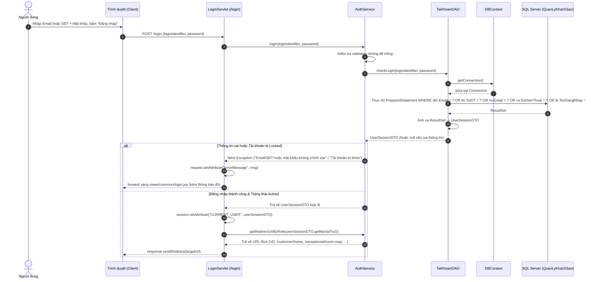
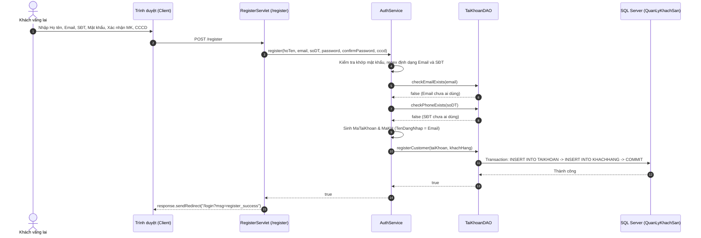
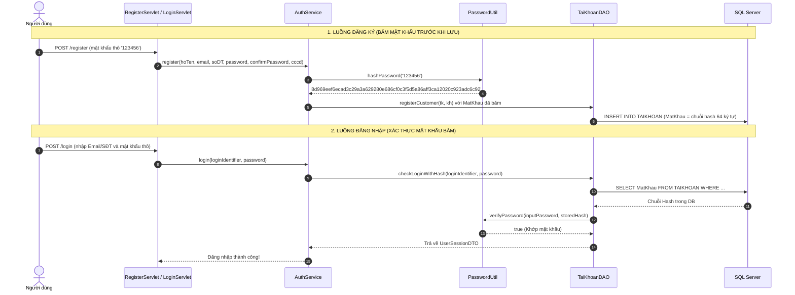

# BÁO CÁO THỰC THI GIAI ĐOẠN 1: ĐĂNG NHẬP & PHÂN QUYỀN VAI TRÒ (AUTHENTICATION & AUTHORIZATION)
*(Phiên bản cập nhật: Đăng nhập LINH HOẠT bằng EMAIL hoặc SỐ ĐIỆN THOẠI đã đăng ký — Loại bỏ hoàn toàn Username tự do)*

**Dự án:** Hệ Thống Quản Lý Khách Sạn (Hotel Management System) — Nhóm 10  
**Môn học:** Lập Trình Web (JSP/Servlet) & Hệ Quản Trị CSDL — HCMUTE  
**Người lập:** AI Assistant  
**Trạng thái:** ⏳ **ĐANG TRÌNH DUYỆT (CHỜ PHÊ DUYỆT TỪ LẬP TRÌNH VIÊN TRƯỚC KHI VIẾT CODE)**  

---

## MỤC LỤC
1. [Mục Tiêu & Quy Tắc Nghiệp Vụ Cốt Lõi](#1-mục-tiêu--quy-tắc-nghiệp-vụ-cốt-lõi)
2. [Sơ Đồ Luồng Dữ Liệu & Chu Trình Tương Tác Giữa Các Lớp (Sequence Diagrams)](#2-sơ-đồ-luồng-dữ-liệu--chu-trình-tương-tác-giữa-các-lớp-sequence-diagrams)
3. [Danh Sách Các Class Sinh Ra & Phân Định Trách Nhiệm Chi Tiết](#3-danh-sách-các-class-sinh-ra--phân-định-trách-nhiệm-chi-tiết)
4. [Các Chức Năng Mới & Các Chức Năng Cũ Bị Thay Đổi / Nâng Cấp](#4-các-chức-năng-mới--các-chức-năng-cũ-bị-thay-đổi--nâng-cấp)
5. [Đặc Tả Chi Tiết Từng Bước Thực Hiện & Toàn Bộ Mã Nguồn Dự Kiến](#5-đặc-tả-chi-tiết-từng-bước-thực-hiện--toàn-bộ-mã-nguồn-dự-kiến)
   - [Bước 1: Các Entity Model & DTO (TaiKhoan, VaiTro, KhachHang, NhanVien, UserSessionDTO)](#bước-1-các-entity-model--dto)
   - [Bước 2: Tầng DAO (TaiKhoanDAO.java - checkLogin tìm theo Email hoặc SĐT)](#bước-2-tầng-dao-taikhoandaojava)
   - [Bước 3: Tầng Nghiệp Vụ Service (AuthService.java - Validate Email & SĐT)](#bước-3-tầng-nghiệp-vụ-service-authservicejava)
   - [Bước 4: Tầng Điều Khiển Servlet (LoginServlet, LogoutServlet, RegisterServlet)](#bước-4-tầng-điều-khiển-servlet)
   - [Bước 5: Bộ Lọc Bảo Mật Phân Quyền (AuthFilter.java)](#bước-5-bộ-lọc-bảo-mật-phân-quyền-authfilterjava)
   - [Bước 6: Giao Diện Người Dùng (login.jsp, register.jsp, error_403.jsp, navbar.jsp)](#bước-6-giao-diện-người-dùng)
6. [Kịch Bản Kiểm Thử Giai Đoạn 1 (Live Test Checklist)](#6-kịch-bản-kiểm-thử-giai-đoạn-1-live-test-checklist)
7. [Bổ Sung Nâng Cấp: Cơ Chế Băm Mật Khẩu (Password Hashing) Với PasswordUtil](#7-bổ-sung-nâng-cấp-cơ-chế-băm-mật-khẩu-password-hashing-với-passwordutil)
8. [Xin Ý Kiến Phê Duyệt](#8-xin-ý-kiến-phê-duyệt)

---

## 1. MỤC TIÊU & QUY TẮC NGHIỆP VỤ CỐT LÕI

### 1.1. Quy tắc đăng nhập: Email HOẶC Số điện thoại (SĐT)
* Khi đăng nhập vào hệ thống, người dùng **chỉ được phép sử dụng chính xác Địa chỉ Email HOẶC Số điện thoại** mà họ đã dùng khi đăng ký tài khoản.
* Loại bỏ hoàn toàn khái niệm "tên người dùng / username" tự do đặt (như `user123`, `admin99`), giúp trải nghiệm đăng nhập hiện đại giống các nền tảng khách sạn / đặt phòng thực tế (Agoda, Booking.com, Traveloka).
* Hệ thống sẽ tự động phân tích chuỗi nhập vào:
  - Nếu người dùng nhập Email (chứa `@`): Tìm kiếm theo Email.
  - Nếu người dùng nhập Số điện thoại (dãy số 10 ký tự): Tìm kiếm theo SĐT.
  - Cả 2 cách đều định danh ra cùng 1 tài khoản duy nhất.

### 1.2. Quy tắc đăng ký tài khoản khách hàng mới
* Form đăng ký yêu cầu bắt buộc:
  1. **Họ và tên:** Tên thật của khách hàng.
  2. **Địa chỉ Email:** Bắt buộc, duy nhất (không trùng lặp trong hệ thống).
  3. **Số điện thoại:** Bắt buộc, duy nhất (10 số, dùng để liên hệ nhận phòng và làm tài khoản đăng nhập).
  4. **Mật khẩu & Xác nhận mật khẩu:** Bảo mật tài khoản.
  5. **Số CCCD / CMND:** Thông tin bắt buộc phục vụ khai báo lưu trú theo quy định khách sạn.
* Hệ thống tự động gán `TenDangNhap = Email` trong bảng `TAIKHOAN`, đồng thời liên kết chặt chẽ với `KHACHHANG(Email, SoDT)`.

---

## 2. SƠ ĐỒ LUỒNG DỮ LIỆU & CHU TRÌNH TƯƠNG TÁC GIỮA CÁC LỚP (SEQUENCE DIAGRAMS)

### 2.1. Luồng Đăng Nhập Linh Hoạt (Email hoặc SĐT)



### 2.2. Luồng Đăng Ký Khách Hàng (Email & SĐT bắt buộc)



---

## 3. DANH SÁCH CÁC CLASS SINH RA & PHÂN ĐỊNH TRÁCH NHIỆM CHI TIẾT

| Tên Class / Tệp tin | Nơi sinh ra (Package / Thư mục) | Nhiệm vụ cụ thể | Tương tác với ai |
| :--- | :--- | :--- | :--- |
| **`TaiKhoan.java`** | `model` | Entity ánh xạ bảng `TAIKHOAN`. Cột `tenDangNhap` lưu địa chỉ email của người dùng. | `TaiKhoanDAO`, `AuthService`. |
| **`VaiTro.java`** | `model` | Entity ánh xạ bảng `VAITRO` (`MaVaiTro`, `TenVaiTro`). | Liên kết với `TaiKhoan`. |
| **`KhachHang.java`** | `model` | Entity ánh xạ bảng `KHACHHANG` (`MaKH`, `MaTaiKhoan`, `HoTen`, `Email`, `SoDT`, `CCCD`). | Được dùng khi lưu thông tin khách đăng ký mới. |
| **`NhanVien.java`** | `model` | Entity ánh xạ bảng `NHANVIEN` (`MaNV`, `MaTaiKhoan`, `HoTen`, `Email`, `SoDienThoai`,...). | Định danh nhân viên Lễ tân, Buồng phòng, Quản lý. |
| **`UserSessionDTO.java`** | `dto` | Đối tượng mang dữ liệu phiên đăng nhập lưu trong `HttpSession`. Chứa: `MaTaiKhoan`, `Email`, `SoDT`, `MaVaiTro`, `TenVaiTro`, `HoTen`, `MaDinhDanh` (`MaKH` hoặc `MaNV`). | Được lưu vào `session`, được `AuthFilter`, mọi Controller và `navbar.jsp` đọc. |
| **`TaiKhoanDAO.java`** | `dao` | Thực thi JDBC SQL: `checkLogin(loginIdentifier, password)` (tìm kiếm theo Email hoặc Số điện thoại), `checkEmailExists(email)`, `checkPhoneExists(phone)`, `registerCustomer(tk, kh)`. | Gọi `DBContext.getConnection()`, trả về `UserSessionDTO` cho `AuthService`. |
| **`AuthService.java`** | `service` | Logic nghiệp vụ xác thực: validate email và số điện thoại, kiểm tra trùng email/sđt, kiểm tra khớp mật khẩu, kiểm tra tài khoản `Locked`, phân luồng URL điều hướng theo vai trò. | Gọi `TaiKhoanDAO`, được gọi bởi `LoginServlet`, `RegisterServlet`. |
| **`LoginServlet.java`** | `controller` (`/login`) | GET: Hiển thị form `login.jsp`. POST: Nhận `loginIdentifier` (Email hoặc SĐT) & `password`, gọi `AuthService`, lưu `UserSessionDTO` vào `session`, điều hướng theo vai trò. | Tương tác với `AuthService`, `views/common/login.jsp`. |
| **`LogoutServlet.java`** | `controller` (`/logout`) | Hủy `HttpSession` (`session.invalidate()`), chuyển hướng về `/login`. | Xóa session người dùng. |
| **`RegisterServlet.java`** | `controller` (`/register`) | GET: Hiển thị form `register.jsp`. POST: Nhận thông tin khách hàng (Email và Số điện thoại bắt buộc, không có username), gọi `AuthService.register()`. | Tương tác với `AuthService`, `views/common/register.jsp`. |
| **`AuthFilter.java`** | `filter` (`/customer/*`, `/receptionist/*`, `/housekeeper/*`, `/manager/*`) | Bộ lọc an ninh: Nếu chưa đăng nhập $\to$ chuyển hướng về `/login?redirect=...`. Nếu sai quyền hạn $\to$ chặn và chuyển sang `error_403.jsp`. | Bảo vệ toàn bộ URL của hệ thống. |
| **`login.jsp`** | `views/common/` | Form đăng nhập bằng Email hoặc Số điện thoại + Mật khẩu, hiển thị khung thông báo lỗi rõ ràng. | Nhúng `header.jsp`, `footer.jsp`. |
| **`register.jsp`** | `views/common/` | Form đăng ký với Email và Số điện thoại là 2 thông tin định danh chính (bỏ hoàn toàn username tự do). | Nhúng `header.jsp`, `footer.jsp`. |
| **`error_403.jsp`** | `views/common/` | Trang thông báo lỗi 403 Forbidden khi người dùng không đủ quyền. | Thông báo lỗi phân quyền. |
| **`navbar.jsp`** | `views/common/` | Thanh điều hướng dùng chung: nhận biết trạng thái đăng nhập qua `${sessionScope.CURRENT_USER}`. | Được nhúng trên mọi trang JSP. |

---

## 4. CÁC CHỨC NĂNG MỚI & CÁC CHỨC NĂNG CŨ BỊ THAY ĐỔI / NÂNG CẤP

### 4.1. Các thay đổi chính về logic
1. **Đăng nhập bằng Email HOẶC Số điện thoại:**
   - Trường nhập liệu trên form `login.jsp` là **"Email hoặc Số điện thoại"** (`name="loginIdentifier"`).
   - Người dùng nhập `an.nguyen@gmail.com` hay `0901111111` đều đăng nhập vào cùng tài khoản của anh Nguyễn Văn An.
   - Nhân viên có thể đăng nhập bằng email công vụ (ví dụ: `huong.nv@hotel.com`) hoặc số điện thoại nhân viên (ví dụ: `0951111111`).
2. **Đăng ký bắt buộc cả Email và Số điện thoại:**
   - Cả 2 thông tin này đều được kiểm tra tính duy nhất (`checkEmailExists` và `checkPhoneExists`).
   - Cột `TenDangNhap` trong bảng `TAIKHOAN` được tự động gán bằng địa chỉ `Email`.
   - Bỏ hoàn toàn ô nhập "tên người dùng / username".

---

## 5. ĐẶC TẢ CHI TIẾT TỪNG BƯỚC THỰC HIỆN & TOÀN BỘ MÃ NGUỒN DỰ KIẾN

### Bước 1: Các Entity Model & DTO

#### 1.1. `TaiKhoan.java`
* **Vị trí file:** `src/main/java/com/mycompany/hotelmanagersystem/model/TaiKhoan.java`

```java
package com.mycompany.hotelmanagersystem.model;

import java.io.Serializable;

public class TaiKhoan implements Serializable {
    private static final long serialVersionUID = 1L;

    private String maTaiKhoan;
    private String tenDangNhap; // Lưu địa chỉ Email của tài khoản
    private String matKhau;
    private String maVaiTro;
    private String trangThai; // 'Active', 'Locked'

    public TaiKhoan() {
    }

    public TaiKhoan(String maTaiKhoan, String tenDangNhap, String matKhau, String maVaiTro, String trangThai) {
        this.maTaiKhoan = maTaiKhoan;
        this.tenDangNhap = tenDangNhap;
        this.matKhau = matKhau;
        this.maVaiTro = maVaiTro;
        this.trangThai = trangThai;
    }

    public String getMaTaiKhoan() {
        return maTaiKhoan;
    }

    public void setMaTaiKhoan(String maTaiKhoan) {
        this.maTaiKhoan = maTaiKhoan;
    }

    public String getTenDangNhap() {
        return tenDangNhap;
    }

    public void setTenDangNhap(String tenDangNhap) {
        this.tenDangNhap = tenDangNhap;
    }

    public String getMatKhau() {
        return matKhau;
    }

    public void setMatKhau(String matKhau) {
        this.matKhau = matKhau;
    }

    public String getMaVaiTro() {
        return maVaiTro;
    }

    public void setMaVaiTro(String maVaiTro) {
        this.maVaiTro = maVaiTro;
    }

    public String getTrangThai() {
        return trangThai;
    }

    public void setTrangThai(String trangThai) {
        this.trangThai = trangThai;
    }
}
```

#### 1.2. `VaiTro.java`
* **Vị trí file:** `src/main/java/com/mycompany/hotelmanagersystem/model/VaiTro.java`

```java
package com.mycompany.hotelmanagersystem.model;

import java.io.Serializable;

public class VaiTro implements Serializable {
    private static final long serialVersionUID = 1L;

    private String maVaiTro;
    private String tenVaiTro;

    public VaiTro() {
    }

    public VaiTro(String maVaiTro, String tenVaiTro) {
        this.maVaiTro = maVaiTro;
        this.tenVaiTro = tenVaiTro;
    }

    public String getMaVaiTro() {
        return maVaiTro;
    }

    public void setMaVaiTro(String maVaiTro) {
        this.maVaiTro = maVaiTro;
    }

    public String getTenVaiTro() {
        return tenVaiTro;
    }

    public void setTenVaiTro(String tenVaiTro) {
        this.tenVaiTro = tenVaiTro;
    }
}
```

#### 1.3. `KhachHang.java`
* **Vị trí file:** `src/main/java/com/mycompany/hotelmanagersystem/model/KhachHang.java`

```java
package com.mycompany.hotelmanagersystem.model;

import java.io.Serializable;

public class KhachHang implements Serializable {
    private static final long serialVersionUID = 1L;

    private String maKH;
    private String maTaiKhoan;
    private String hoTen;
    private String email;
    private String soDT;
    private String cccd;

    public KhachHang() {
    }

    public KhachHang(String maKH, String maTaiKhoan, String hoTen, String email, String soDT, String cccd) {
        this.maKH = maKH;
        this.maTaiKhoan = maTaiKhoan;
        this.hoTen = hoTen;
        this.email = email;
        this.soDT = soDT;
        this.cccd = cccd;
    }

    public String getMaKH() {
        return maKH;
    }

    public void setMaKH(String maKH) {
        this.maKH = maKH;
    }

    public String getMaTaiKhoan() {
        return maTaiKhoan;
    }

    public void setMaTaiKhoan(String maTaiKhoan) {
        this.maTaiKhoan = maTaiKhoan;
    }

    public String getHoTen() {
        return hoTen;
    }

    public void setHoTen(String hoTen) {
        this.hoTen = hoTen;
    }

    public String getEmail() {
        return email;
    }

    public void setEmail(String email) {
        this.email = email;
    }

    public String getSoDT() {
        return soDT;
    }

    public void setSoDT(String soDT) {
        this.soDT = soDT;
    }

    public String getCccd() {
        return cccd;
    }

    public void setCccd(String cccd) {
        this.cccd = cccd;
    }
}
```

#### 1.4. `NhanVien.java`
* **Vị trí file:** `src/main/java/com/mycompany/hotelmanagersystem/model/NhanVien.java`

```java
package com.mycompany.hotelmanagersystem.model;

import java.io.Serializable;
import java.util.Date;

public class NhanVien implements Serializable {
    private static final long serialVersionUID = 1L;

    private String maNV;
    private String maTaiKhoan;
    private String hoTen;
    private String email;
    private String soDienThoai;
    private Date ngayVaoLam;
    private Date ngayNghiLam;
    private String trangThaiLamViec; // 'DangLam', 'NghiViec'

    public NhanVien() {
    }

    public NhanVien(String maNV, String maTaiKhoan, String hoTen, String email, String soDienThoai, Date ngayVaoLam, Date ngayNghiLam, String trangThaiLamViec) {
        this.maNV = maNV;
        this.maTaiKhoan = maTaiKhoan;
        this.hoTen = hoTen;
        this.email = email;
        this.soDienThoai = soDienThoai;
        this.ngayVaoLam = ngayVaoLam;
        this.ngayNghiLam = ngayNghiLam;
        this.trangThaiLamViec = trangThaiLamViec;
    }

    public String getMaNV() {
        return maNV;
    }

    public void setMaNV(String maNV) {
        this.maNV = maNV;
    }

    public String getMaTaiKhoan() {
        return maTaiKhoan;
    }

    public void setMaTaiKhoan(String maTaiKhoan) {
        this.maTaiKhoan = maTaiKhoan;
    }

    public String getHoTen() {
        return hoTen;
    }

    public void setHoTen(String hoTen) {
        this.hoTen = hoTen;
    }

    public String getEmail() {
        return email;
    }

    public void setEmail(String email) {
        this.email = email;
    }

    public String getSoDienThoai() {
        return soDienThoai;
    }

    public void setSoDienThoai(String soDienThoai) {
        this.soDienThoai = soDienThoai;
    }

    public Date getNgayVaoLam() {
        return ngayVaoLam;
    }

    public void setNgayVaoLam(Date ngayVaoLam) {
        this.ngayVaoLam = ngayVaoLam;
    }

    public Date getNgayNghiLam() {
        return ngayNghiLam;
    }

    public void setNgayNghiLam(Date ngayNghiLam) {
        this.ngayNghiLam = ngayNghiLam;
    }

    public String getTrangThaiLamViec() {
        return trangThaiLamViec;
    }

    public void setTrangThaiLamViec(String trangThaiLamViec) {
        this.trangThaiLamViec = trangThaiLamViec;
    }
}
```

#### 1.5. `UserSessionDTO.java`
* **Vị trí file:** `src/main/java/com/mycompany/hotelmanagersystem/dto/UserSessionDTO.java`

```java
package com.mycompany.hotelmanagersystem.dto;

import java.io.Serializable;

public class UserSessionDTO implements Serializable {
    private static final long serialVersionUID = 1L;

    private String maTaiKhoan;
    private String email;
    private String soDT;
    private String maVaiTro;     // 'VT01', 'VT02', 'VT03', 'VT04'
    private String tenVaiTro;    // 'Customer', 'Receptionist', 'HouseKeeper', 'Manager'
    private String hoTen;        // Họ tên lấy từ KHACHHANG hoặc NHANVIEN
    private String maDinhDanh;   // Mã KH (nếu là khách) hoặc Mã NV (nếu là nhân viên)
    private String trangThai;    // 'Active', 'Locked'

    public UserSessionDTO() {
    }

    public UserSessionDTO(String maTaiKhoan, String email, String soDT, String maVaiTro, 
                          String tenVaiTro, String hoTen, String maDinhDanh, String trangThai) {
        this.maTaiKhoan = maTaiKhoan;
        this.email = email;
        this.soDT = soDT;
        this.maVaiTro = maVaiTro;
        this.tenVaiTro = tenVaiTro;
        this.hoTen = hoTen;
        this.maDinhDanh = maDinhDanh;
        this.trangThai = trangThai;
    }

    // Helper methods kiểm tra vai trò nhanh trong JSP EL hoặc Filter
    public boolean isCustomer() {
        return "VT01".equalsIgnoreCase(this.maVaiTro);
    }

    public boolean isReceptionist() {
        return "VT02".equalsIgnoreCase(this.maVaiTro);
    }

    public boolean isHousekeeper() {
        return "VT03".equalsIgnoreCase(this.maVaiTro);
    }

    public boolean isManager() {
        return "VT04".equalsIgnoreCase(this.maVaiTro);
    }

    // Getters and Setters
    public String getMaTaiKhoan() {
        return maTaiKhoan;
    }

    public void setMaTaiKhoan(String maTaiKhoan) {
        this.maTaiKhoan = maTaiKhoan;
    }

    public String getEmail() {
        return email;
    }

    public void setEmail(String email) {
        this.email = email;
    }

    public String getSoDT() {
        return soDT;
    }

    public void setSoDT(String soDT) {
        this.soDT = soDT;
    }

    public String getMaVaiTro() {
        return maVaiTro;
    }

    public void setMaVaiTro(String maVaiTro) {
        this.maVaiTro = maVaiTro;
    }

    public String getTenVaiTro() {
        return tenVaiTro;
    }

    public void setTenVaiTro(String tenVaiTro) {
        this.tenVaiTro = tenVaiTro;
    }

    public String getHoTen() {
        return hoTen;
    }

    public void setHoTen(String hoTen) {
        this.hoTen = hoTen;
    }

    public String getMaDinhDanh() {
        return maDinhDanh;
    }

    public void setMaDinhDanh(String maDinhDanh) {
        this.maDinhDanh = maDinhDanh;
    }

    public String getTrangThai() {
        return trangThai;
    }

    public void setTrangThai(String trangThai) {
        this.trangThai = trangThai;
    }
}
```

---

### Bước 2: Tầng DAO (`TaiKhoanDAO.java`)
* **Vị trí file:** `src/main/java/com/mycompany/hotelmanagersystem/dao/TaiKhoanDAO.java`
* **Mã nguồn dự kiến:**

```java
package com.mycompany.hotelmanagersystem.dao;

import com.mycompany.hotelmanagersystem.dto.UserSessionDTO;
import com.mycompany.hotelmanagersystem.model.KhachHang;
import com.mycompany.hotelmanagersystem.model.TaiKhoan;
import com.mycompany.hotelmanagersystem.util.DBContext;

import java.sql.Connection;
import java.sql.PreparedStatement;
import java.sql.ResultSet;
import java.sql.SQLException;

public class TaiKhoanDAO {

    /**
     * Xác thực thông tin đăng nhập bằng EMAIL hoặc SỐ ĐIỆN THOẠI đã đăng ký
     */
    public UserSessionDTO checkLogin(String loginIdentifier, String password) {
        String sql = "SELECT tk.MaTaiKhoan, tk.MaVaiTro, vt.TenVaiTro, tk.TrangThai, "
                   + "COALESCE(kh.HoTen, nv.HoTen, N'Người Dùng') AS HoTen, "
                   + "COALESCE(kh.MaKH, nv.MaNV, '') AS MaDinhDanh, "
                   + "COALESCE(kh.Email, nv.Email, tk.TenDangNhap) AS Email, "
                   + "COALESCE(kh.SoDT, nv.SoDienThoai, '') AS SoDT "
                   + "FROM TAIKHOAN tk "
                   + "JOIN VAITRO vt ON tk.MaVaiTro = vt.MaVaiTro "
                   + "LEFT JOIN KHACHHANG kh ON tk.MaTaiKhoan = kh.MaTaiKhoan "
                   + "LEFT JOIN NHANVIEN nv ON tk.MaTaiKhoan = nv.MaTaiKhoan "
                   + "WHERE (kh.Email = ? OR kh.SoDT = ? OR nv.Email = ? OR nv.SoDienThoai = ? OR tk.TenDangNhap = ?) "
                   + "  AND tk.MatKhau = ?";

        try (Connection conn = DBContext.getConnection();
             PreparedStatement ps = conn.prepareStatement(sql)) {

            // Truyền định danh đăng nhập vào cả 5 vị trí: Email khách, SĐT khách, Email NV, SĐT NV, Tên đăng nhập gốc
            ps.setString(1, loginIdentifier);
            ps.setString(2, loginIdentifier);
            ps.setString(3, loginIdentifier);
            ps.setString(4, loginIdentifier);
            ps.setString(5, loginIdentifier);
            ps.setString(6, password);

            try (ResultSet rs = ps.executeQuery()) {
                if (rs.next()) {
                    return new UserSessionDTO(
                        rs.getString("MaTaiKhoan"),
                        rs.getString("Email"),
                        rs.getString("SoDT"),
                        rs.getString("MaVaiTro"),
                        rs.getString("TenVaiTro"),
                        rs.getString("HoTen"),
                        rs.getString("MaDinhDanh"),
                        rs.getString("TrangThai")
                    );
                }
            }
        } catch (SQLException e) {
            e.printStackTrace();
        }
        return null;
    }

    /**
     * Kiểm tra Email đã tồn tại trong CSDL chưa
     */
    public boolean checkEmailExists(String email) {
        String sql = "SELECT 1 FROM KHACHHANG WHERE Email = ? UNION SELECT 1 FROM TAIKHOAN WHERE TenDangNhap = ?";
        try (Connection conn = DBContext.getConnection();
             PreparedStatement ps = conn.prepareStatement(sql)) {
            ps.setString(1, email);
            ps.setString(2, email);
            try (ResultSet rs = ps.executeQuery()) {
                return rs.next();
            }
        } catch (SQLException e) {
            e.printStackTrace();
        }
        return false;
    }

    /**
     * Kiểm tra Số điện thoại đã tồn tại trong CSDL chưa
     */
    public boolean checkPhoneExists(String phone) {
        String sql = "SELECT 1 FROM KHACHHANG WHERE SoDT = ? UNION SELECT 1 FROM NHANVIEN WHERE SoDienThoai = ?";
        try (Connection conn = DBContext.getConnection();
             PreparedStatement ps = conn.prepareStatement(sql)) {
            ps.setString(1, phone);
            ps.setString(2, phone);
            try (ResultSet rs = ps.executeQuery()) {
                return rs.next();
            }
        } catch (SQLException e) {
            e.printStackTrace();
        }
        return false;
    }

    /**
     * Đăng ký tài khoản Khách hàng mới bằng Transaction ACID
     */
    public boolean registerCustomer(TaiKhoan tk, KhachHang kh) {
        String sqlTaiKhoan = "INSERT INTO TAIKHOAN (MaTaiKhoan, TenDangNhap, MatKhau, MaVaiTro, TrangThai) "
                           + "VALUES (?, ?, ?, ?, ?)";
        String sqlKhachHang = "INSERT INTO KHACHHANG (MaKH, MaTaiKhoan, HoTen, Email, SoDT, CCCD) "
                            + "VALUES (?, ?, ?, ?, ?, ?)";

        Connection conn = null;
        try {
            conn = DBContext.getConnection();
            conn.setAutoCommit(false); // Bắt đầu Transaction

            // 1. Chèn vào TAIKHOAN (TenDangNhap = Email)
            try (PreparedStatement psTK = conn.prepareStatement(sqlTaiKhoan)) {
                psTK.setString(1, tk.getMaTaiKhoan());
                psTK.setString(2, tk.getTenDangNhap());
                psTK.setString(3, tk.getMatKhau());
                psTK.setString(4, tk.getMaVaiTro());
                psTK.setString(5, tk.getTrangThai());
                psTK.executeUpdate();
            }

            // 2. Chèn vào KHACHHANG
            try (PreparedStatement psKH = conn.prepareStatement(sqlKhachHang)) {
                psKH.setString(1, kh.getMaKH());
                psKH.setString(2, kh.getMaTaiKhoan());
                psKH.setString(3, kh.getHoTen());
                psKH.setString(4, kh.getEmail());
                psKH.setString(5, kh.getSoDT());
                psKH.setString(6, kh.getCccd());
                psKH.executeUpdate();
            }

            conn.commit(); // Thành công cả 2 bảng
            return true;
        } catch (SQLException e) {
            e.printStackTrace();
            if (conn != null) {
                try {
                    conn.rollback();
                } catch (SQLException ex) {
                    ex.printStackTrace();
                }
            }
            return false;
        } finally {
            if (conn != null) {
                try {
                    conn.setAutoCommit(true);
                    conn.close();
                } catch (SQLException e) {
                    e.printStackTrace();
                }
            }
        }
    }
}
```

---

### Bước 3: Tầng Nghiệp Vụ Service (`AuthService.java`)
* **Vị trí file:** `src/main/java/com/mycompany/hotelmanagersystem/service/AuthService.java`
* **Mã nguồn dự kiến:**

```java
package com.mycompany.hotelmanagersystem.service;

import com.mycompany.hotelmanagersystem.dao.TaiKhoanDAO;
import com.mycompany.hotelmanagersystem.dto.UserSessionDTO;
import com.mycompany.hotelmanagersystem.model.KhachHang;
import com.mycompany.hotelmanagersystem.model.TaiKhoan;

public class AuthService {
    private final TaiKhoanDAO taiKhoanDAO;

    public AuthService() {
        this.taiKhoanDAO = new TaiKhoanDAO();
    }

    /**
     * Xác thực đăng nhập bằng Email hoặc Số điện thoại
     */
    public UserSessionDTO login(String loginIdentifier, String password) throws Exception {
        if (loginIdentifier == null || loginIdentifier.trim().isEmpty()) {
            throw new Exception("Vui lòng nhập Email hoặc Số điện thoại.");
        }
        if (password == null || password.trim().isEmpty()) {
            throw new Exception("Vui lòng nhập mật khẩu.");
        }

        UserSessionDTO user = taiKhoanDAO.checkLogin(loginIdentifier.trim(), password);
        if (user == null) {
            throw new Exception("Email/Số điện thoại hoặc mật khẩu không chính xác.");
        }

        if ("Locked".equalsIgnoreCase(user.getTrangThai())) {
            throw new Exception("Tài khoản của bạn đã bị khóa. Vui lòng liên hệ ban quản lý.");
        }

        return user;
    }

    /**
     * Xác định URL đích theo vai trò sau khi đăng nhập thành công
     */
    public String getRedirectUrlByRole(String contextPath, String maVaiTro) {
        if (maVaiTro == null) {
            return contextPath + "/index.jsp";
        }
        switch (maVaiTro.toUpperCase()) {
            case "VT01": // Khách hàng
                return contextPath + "/customer/home";
            case "VT02": // Lễ tân
                return contextPath + "/receptionist/room-map";
            case "VT03": // Buồng phòng
                return contextPath + "/housekeeper/tasks";
            case "VT04": // Quản lý
                return contextPath + "/manager/dashboard";
            default:
                return contextPath + "/index.jsp";
        }
    }

    /**
     * Đăng ký tài khoản Khách hàng mới (Email và SĐT là 2 trường bắt buộc duy nhất)
     */
    public boolean register(String hoTen, String email, String soDT, String password, String confirmPassword, String cccd) throws Exception {
        if (hoTen == null || hoTen.trim().isEmpty() ||
            email == null || email.trim().isEmpty() ||
            soDT == null || soDT.trim().isEmpty() ||
            password == null || password.trim().isEmpty()) {
            throw new Exception("Vui lòng điền đầy đủ: Họ tên, Email, Số điện thoại và Mật khẩu.");
        }

        if (!password.equals(confirmPassword)) {
            throw new Exception("Mật khẩu xác nhận không khớp.");
        }

        if (!email.contains("@") || !email.contains(".")) {
            throw new Exception("Địa chỉ email không đúng định dạng.");
        }

        // Kiểm tra định dạng số điện thoại (chứa chữ số, từ 9-11 ký tự)
        if (!soDT.trim().matches("^[0-9]{9,11}$")) {
            throw new Exception("Số điện thoại không hợp lệ (phải từ 9 đến 11 chữ số).");
        }

        if (taiKhoanDAO.checkEmailExists(email.trim())) {
            throw new Exception("Email này đã được sử dụng. Vui lòng chọn email khác.");
        }

        if (taiKhoanDAO.checkPhoneExists(soDT.trim())) {
            throw new Exception("Số điện thoại này đã được đăng ký cho tài khoản khác.");
        }

        // Tự sinh mã định danh
        String uniqueSuffix = String.valueOf(System.currentTimeMillis() % 100000);
        String maTaiKhoan = "TK_" + uniqueSuffix;
        String maKH = "KH_" + uniqueSuffix;

        // Lưu tài khoản với TenDangNhap = Email
        TaiKhoan tk = new TaiKhoan(maTaiKhoan, email.trim(), password, "VT01", "Active");
        KhachHang kh = new KhachHang(maKH, maTaiKhoan, hoTen.trim(), email.trim(), soDT.trim(), 
                                     cccd != null ? cccd.trim() : "");

        return taiKhoanDAO.registerCustomer(tk, kh);
    }
}
```

---

### Bước 4: Tầng Điều Khiển Servlet

#### 4.1. `LoginServlet.java`
* **Vị trí file:** `src/main/java/com/mycompany/hotelmanagersystem/controller/LoginServlet.java`
* **URL Mapping:** `/login`

```java
package com.mycompany.hotelmanagersystem.controller;

import com.mycompany.hotelmanagersystem.dto.UserSessionDTO;
import com.mycompany.hotelmanagersystem.service.AuthService;

import javax.servlet.ServletException;
import javax.servlet.annotation.WebServlet;
import javax.servlet.http.HttpServlet;
import javax.servlet.http.HttpServletRequest;
import javax.servlet.http.HttpServletResponse;
import javax.servlet.http.HttpSession;
import java.io.IOException;

@WebServlet(name = "LoginServlet", urlPatterns = {"/login"})
public class LoginServlet extends HttpServlet {
    private AuthService authService;

    @Override
    public void init() {
        this.authService = new AuthService();
    }

    @Override
    protected void doGet(HttpServletRequest request, HttpServletResponse response)
            throws ServletException, IOException {
        HttpSession session = request.getSession(false);
        if (session != null && session.getAttribute("CURRENT_USER") != null) {
            UserSessionDTO currentUser = (UserSessionDTO) session.getAttribute("CURRENT_USER");
            String redirectUrl = authService.getRedirectUrlByRole(request.getContextPath(), currentUser.getMaVaiTro());
            response.sendRedirect(redirectUrl);
            return;
        }

        request.getRequestDispatcher("/views/common/login.jsp").forward(request, response);
    }

    @Override
    protected void doPost(HttpServletRequest request, HttpServletResponse response)
            throws ServletException, IOException {
        String loginIdentifier = request.getParameter("loginIdentifier");
        String password = request.getParameter("password");
        String redirectTarget = request.getParameter("redirect");

        try {
            UserSessionDTO user = authService.login(loginIdentifier, password);

            // Lưu người dùng vào session
            HttpSession session = request.getSession(true);
            session.setAttribute("CURRENT_USER", user);

            if (redirectTarget != null && !redirectTarget.trim().isEmpty() && !redirectTarget.contains("/login")) {
                response.sendRedirect(redirectTarget);
            } else {
                String redirectUrl = authService.getRedirectUrlByRole(request.getContextPath(), user.getMaVaiTro());
                response.sendRedirect(redirectUrl);
            }
        } catch (Exception ex) {
            request.setAttribute("errorMessage", ex.getMessage());
            request.setAttribute("oldIdentifier", loginIdentifier);
            request.getRequestDispatcher("/views/common/login.jsp").forward(request, response);
        }
    }
}
```

#### 4.2. `LogoutServlet.java`
* **Vị trí file:** `src/main/java/com/mycompany/hotelmanagersystem/controller/LogoutServlet.java`
* **URL Mapping:** `/logout`

```java
package com.mycompany.hotelmanagersystem.controller;

import javax.servlet.ServletException;
import javax.servlet.annotation.WebServlet;
import javax.servlet.http.HttpServlet;
import javax.servlet.http.HttpServletRequest;
import javax.servlet.http.HttpServletResponse;
import javax.servlet.http.HttpSession;
import java.io.IOException;

@WebServlet(name = "LogoutServlet", urlPatterns = {"/logout"})
public class LogoutServlet extends HttpServlet {

    @Override
    protected void doGet(HttpServletRequest request, HttpServletResponse response)
            throws ServletException, IOException {
        HttpSession session = request.getSession(false);
        if (session != null) {
            session.removeAttribute("CURRENT_USER");
            session.invalidate(); // Hủy toàn bộ session
        }
        response.sendRedirect(request.getContextPath() + "/login?msg=logged_out");
    }

    @Override
    protected void doPost(HttpServletRequest request, HttpServletResponse response)
            throws ServletException, IOException {
        doGet(request, response);
    }
}
```

#### 4.3. `RegisterServlet.java`
* **Vị trí file:** `src/main/java/com/mycompany/hotelmanagersystem/controller/RegisterServlet.java`
* **URL Mapping:** `/register`

```java
package com.mycompany.hotelmanagersystem.controller;

import com.mycompany.hotelmanagersystem.service.AuthService;

import javax.servlet.ServletException;
import javax.servlet.annotation.WebServlet;
import javax.servlet.http.HttpServlet;
import javax.servlet.http.HttpServletRequest;
import javax.servlet.http.HttpServletResponse;
import java.io.IOException;

@WebServlet(name = "RegisterServlet", urlPatterns = {"/register"})
public class RegisterServlet extends HttpServlet {
    private AuthService authService;

    @Override
    public void init() {
        this.authService = new AuthService();
    }

    @Override
    protected void doGet(HttpServletRequest request, HttpServletResponse response)
            throws ServletException, IOException {
        request.getRequestDispatcher("/views/common/register.jsp").forward(request, response);
    }

    @Override
    protected void doPost(HttpServletRequest request, HttpServletResponse response)
            throws ServletException, IOException {
        String hoTen = request.getParameter("hoTen");
        String email = request.getParameter("email");
        String soDT = request.getParameter("soDT");
        String password = request.getParameter("password");
        String confirmPassword = request.getParameter("confirmPassword");
        String cccd = request.getParameter("cccd");

        try {
            boolean success = authService.register(hoTen, email, soDT, password, confirmPassword, cccd);
            if (success) {
                response.sendRedirect(request.getContextPath() + "/login?msg=register_success");
            } else {
                request.setAttribute("errorMessage", "Đăng ký không thành công. Vui lòng thử lại!");
                request.getRequestDispatcher("/views/common/register.jsp").forward(request, response);
            }
        } catch (Exception ex) {
            request.setAttribute("errorMessage", ex.getMessage());
            request.setAttribute("oldHoTen", hoTen);
            request.setAttribute("oldEmail", email);
            request.setAttribute("oldSoDT", soDT);
            request.setAttribute("oldCccd", cccd);
            request.getRequestDispatcher("/views/common/register.jsp").forward(request, response);
        }
    }
}
```

---

### Bước 5: Bộ Lọc Bảo Mật Phân Quyền (`AuthFilter.java`)
* **Vị trí file:** `src/main/java/com/mycompany/hotelmanagersystem/filter/AuthFilter.java`
* **URL Patterns:** `/customer/*`, `/receptionist/*`, `/housekeeper/*`, `/manager/*`

```java
package com.mycompany.hotelmanagersystem.filter;

import com.mycompany.hotelmanagersystem.dto.UserSessionDTO;

import javax.servlet.*;
import javax.servlet.annotation.WebFilter;
import javax.servlet.http.HttpServletRequest;
import javax.servlet.http.HttpServletResponse;
import javax.servlet.http.HttpSession;
import java.io.IOException;

@WebFilter(filterName = "AuthFilter", urlPatterns = {
    "/customer/*",
    "/receptionist/*",
    "/housekeeper/*",
    "/manager/*"
})
public class AuthFilter implements Filter {

    @Override
    public void init(FilterConfig filterConfig) throws ServletException {
    }

    @Override
    public void doFilter(ServletRequest req, ServletResponse res, FilterChain chain)
            throws IOException, ServletException {
        HttpServletRequest request = (HttpServletRequest) req;
        HttpServletResponse response = (HttpServletResponse) res;

        HttpSession session = request.getSession(false);
        UserSessionDTO currentUser = (session != null) ? (UserSessionDTO) session.getAttribute("CURRENT_USER") : null;

        String uri = request.getRequestURI();
        String contextPath = request.getContextPath();
        String path = uri.substring(contextPath.length());

        // 1. Kiểm tra đã đăng nhập chưa
        if (currentUser == null) {
            response.sendRedirect(contextPath + "/login?redirect=" + java.net.URLEncoder.encode(path, "UTF-8"));
            return;
        }

        // 2. Kiểm tra phân quyền truy cập theo vai trò (Phương án B: Phân lập tuyệt đối 100%)
        String role = currentUser.getMaVaiTro();
        boolean isAuthorized = false;

        if (path.startsWith("/customer/")) {
            isAuthorized = "VT01".equalsIgnoreCase(role); // DUY NHẤT Khách hàng
        } else if (path.startsWith("/receptionist/")) {
            isAuthorized = "VT02".equalsIgnoreCase(role); // DUY NHẤT Lễ tân
        } else if (path.startsWith("/housekeeper/")) {
            isAuthorized = "VT03".equalsIgnoreCase(role); // DUY NHẤT Buồng phòng
        } else if (path.startsWith("/manager/")) {
            isAuthorized = "VT04".equalsIgnoreCase(role); // DUY NHẤT Quản lý
        }

        if (isAuthorized) {
            chain.doFilter(request, response);
        } else {
            response.setStatus(HttpServletResponse.SC_FORBIDDEN);
            request.setAttribute("deniedPath", path);
            request.getRequestDispatcher("/views/common/error_403.jsp").forward(request, response);
        }
    }

    @Override
    public void destroy() {
    }
}
```

---

### Bước 6: Giao Diện Người Dùng

#### 6.1. Form Đăng Nhập (`views/common/login.jsp`)
* **Vị trí file:** `src/main/webapp/views/common/login.jsp`

```jsp
<%@ page contentType="text/html;charset=UTF-8" language="java" %>
<%@ taglib prefix="c" uri="http://java.sun.com/jsp/jstl/core" %>
<jsp:include page="header.jsp">
    <jsp:param name="title" value="Đăng Nhập Hệ Thống - Nhóm 10 Hotel"/>
</jsp:include>
<jsp:include page="navbar.jsp"/>

<div class="container" style="max-width: 480px; margin-top: 40px; margin-bottom: 50px;">
    <div class="card shadow-sm" style="background: #ffffff; border-radius: 8px; border: 1px solid #e2e8f0; padding: 30px;">
        <div style="text-align: center; margin-bottom: 25px;">
            <h2 style="color: #1a365d; margin-bottom: 8px;">ĐĂNG NHẬP</h2>
            <p style="color: #718096; font-size: 14px;">Hệ Thống Quản Lý Khách Sạn - Nhóm 10</p>
        </div>

        <%-- Thông báo lỗi khi đăng nhập thất bại --%>
        <c:if test="${not empty errorMessage}">
            <div class="alert alert-danger" style="margin-bottom: 20px;">
                <strong>⚠️ Lỗi:</strong> ${errorMessage}
            </div>
        </c:if>

        <%-- Thông báo thành công --%>
        <c:if test="${param.msg == 'register_success'}">
            <div class="alert alert-success" style="margin-bottom: 20px;">
                <strong>✓ Thành công:</strong> Tài khoản đã được tạo! Mời bạn đăng nhập bằng Email hoặc SĐT.
            </div>
        </c:if>
        <c:if test="${param.msg == 'logged_out'}">
            <div class="alert alert-info" style="margin-bottom: 20px;">
                Đã đăng xuất an toàn khỏi hệ thống.
            </div>
        </c:if>

        <form action="${pageContext.request.contextPath}/login" method="POST">
            <c:if test="${not empty param.redirect}">
                <input type="hidden" name="redirect" value="${param.redirect}"/>
            </c:if>

            <div class="form-group" style="margin-bottom: 16px;">
                <label for="loginIdentifier" style="display: block; font-weight: 600; margin-bottom: 6px; color: #2d3748;">
                    Email hoặc Số điện thoại:
                </label>
                <input type="text" id="loginIdentifier" name="loginIdentifier" class="form-control" 
                       value="${oldIdentifier}" placeholder="VD: an.nguyen@gmail.com hoặc 0901111111" required 
                       style="width: 100%; padding: 10px; border: 1px solid #cbd5e0; border-radius: 6px;"/>
            </div>

            <div class="form-group" style="margin-bottom: 20px;">
                <label for="password" style="display: block; font-weight: 600; margin-bottom: 6px; color: #2d3748;">
                    Mật khẩu:
                </label>
                <input type="password" id="password" name="password" class="form-control" 
                       placeholder="Nhập mật khẩu (Mặc định test: 1234)" required 
                       style="width: 100%; padding: 10px; border: 1px solid #cbd5e0; border-radius: 6px;"/>
            </div>

            <button type="submit" class="btn btn-primary" style="width: 100%; padding: 12px; font-size: 16px; font-weight: 600; background: #1a365d; color: white; border: none; border-radius: 6px; cursor: pointer;">
                Đăng Nhập
            </button>
        </form>

        <hr style="margin: 24px 0; border: 0; border-top: 1px solid #e2e8f0;"/>

        <%-- Hộp gợi ý tài khoản mẫu phục vụ kiểm thử nhanh bằng Email & SĐT --%>
        <div style="background: #f7fafc; padding: 14px; border-radius: 6px; font-size: 13px; color: #4a5568;">
            <strong>🔑 Tài khoản kiểm thử có sẵn (Pass: <code>1234</code>):</strong>
            <ul style="margin: 8px 0 0 18px; padding: 0; line-height: 1.6;">
                <li>Khách hàng: <code>an.nguyen@gmail.com</code> HOẶC SĐT <code>0901111111</code></li>
                <li>Lễ tân: <code>huong.nv@hotel.com</code> HOẶC SĐT <code>0951111111</code></li>
                <li>Buồng phòng: <code>nhung.lth@hotel.com</code> HOẶC SĐT <code>0973333333</code></li>
                <li>Quản lý: <code>vinh.dq@hotel.com</code> HOẶC SĐT <code>0995555555</code></li>
            </ul>
        </div>

        <div style="text-align: center; margin-top: 16px; font-size: 14px;">
            Chưa có tài khoản? <a href="${pageContext.request.contextPath}/register" style="color: #2b6cb0; text-decoration: none; font-weight: 600;">Đăng ký tài khoản mới</a>
        </div>
    </div>
</div>

<jsp:include page="footer.jsp"/>
```

#### 6.2. Form Đăng Ký Yêu Cầu Email & SĐT (`views/common/register.jsp`)
* **Vị trí file:** `src/main/webapp/views/common/register.jsp`

```jsp
<%@ page contentType="text/html;charset=UTF-8" language="java" %>
<%@ taglib prefix="c" uri="http://java.sun.com/jsp/jstl/core" %>
<jsp:include page="header.jsp">
    <jsp:param name="title" value="Đăng Ký Tài Khoản - Nhóm 10 Hotel"/>
</jsp:include>
<jsp:include page="navbar.jsp"/>

<div class="container" style="max-width: 520px; margin-top: 30px; margin-bottom: 50px;">
    <div class="card shadow-sm" style="background: #ffffff; border-radius: 8px; border: 1px solid #e2e8f0; padding: 30px;">
        <div style="text-align: center; margin-bottom: 25px;">
            <h2 style="color: #1a365d; margin-bottom: 8px;">ĐĂNG KÝ KHÁCH HÀNG</h2>
            <p style="color: #718096; font-size: 14px;">Email và Số điện thoại sẽ dùng để đăng nhập hệ thống</p>
        </div>

        <c:if test="${not empty errorMessage}">
            <div class="alert alert-danger" style="margin-bottom: 20px;">
                <strong>⚠️ Lỗi:</strong> ${errorMessage}
            </div>
        </c:if>

        <form action="${pageContext.request.contextPath}/register" method="POST">
            <div class="form-group" style="margin-bottom: 14px;">
                <label for="hoTen" style="display: block; font-weight: 600; margin-bottom: 4px; color: #2d3748;">
                    Họ và Tên: <span style="color: red;">*</span>
                </label>
                <input type="text" id="hoTen" name="hoTen" value="${oldHoTen}" required placeholder="VD: Trần Văn Nam"
                       style="width: 100%; padding: 10px; border: 1px solid #cbd5e0; border-radius: 6px;"/>
            </div>

            <div class="form-group" style="margin-bottom: 14px;">
                <label for="email" style="display: block; font-weight: 600; margin-bottom: 4px; color: #2d3748;">
                    Địa chỉ Email (Dùng để đăng nhập): <span style="color: red;">*</span>
                </label>
                <input type="email" id="email" name="email" value="${oldEmail}" required placeholder="VD: nam.tran@gmail.com"
                       style="width: 100%; padding: 10px; border: 1px solid #cbd5e0; border-radius: 6px;"/>
            </div>

            <div class="form-group" style="margin-bottom: 14px;">
                <label for="soDT" style="display: block; font-weight: 600; margin-bottom: 4px; color: #2d3748;">
                    Số điện thoại (Dùng để đăng nhập): <span style="color: red;">*</span>
                </label>
                <input type="tel" id="soDT" name="soDT" value="${oldSoDT}" required placeholder="VD: 0912345678"
                       style="width: 100%; padding: 10px; border: 1px solid #cbd5e0; border-radius: 6px;"/>
            </div>

            <div class="form-group" style="margin-bottom: 14px;">
                <label for="password" style="display: block; font-weight: 600; margin-bottom: 4px; color: #2d3748;">
                    Mật khẩu: <span style="color: red;">*</span>
                </label>
                <input type="password" id="password" name="password" required placeholder="Nhập mật khẩu bảo vệ"
                       style="width: 100%; padding: 10px; border: 1px solid #cbd5e0; border-radius: 6px;"/>
            </div>

            <div class="form-group" style="margin-bottom: 14px;">
                <label for="confirmPassword" style="display: block; font-weight: 600; margin-bottom: 4px; color: #2d3748;">
                    Xác nhận lại Mật khẩu: <span style="color: red;">*</span>
                </label>
                <input type="password" id="confirmPassword" name="confirmPassword" required placeholder="Nhập lại mật khẩu"
                       style="width: 100%; padding: 10px; border: 1px solid #cbd5e0; border-radius: 6px;"/>
            </div>

            <div class="form-group" style="margin-bottom: 20px;">
                <label for="cccd" style="display: block; font-weight: 600; margin-bottom: 4px; color: #2d3748;">
                    Số CCCD / CMND (để làm thủ tục lưu trú):
                </label>
                <input type="text" id="cccd" name="cccd" value="${oldCccd}" placeholder="VD: 079200001234"
                       style="width: 100%; padding: 10px; border: 1px solid #cbd5e0; border-radius: 6px;"/>
            </div>

            <button type="submit" class="btn btn-primary" style="width: 100%; padding: 12px; font-size: 16px; font-weight: 600; background: #c5a880; color: #1a365d; border: none; border-radius: 6px; cursor: pointer;">
                Đăng Ký Tài Khoản
            </button>
        </form>

        <div style="text-align: center; margin-top: 16px; font-size: 14px;">
            Đã có tài khoản? <a href="${pageContext.request.contextPath}/login" style="color: #2b6cb0; text-decoration: none; font-weight: 600;">Đăng nhập ngay</a>
        </div>
    </div>
</div>

<jsp:include page="footer.jsp"/>
```

#### 6.3. Màn Hình Cảnh Báo Phân Quyền (`views/common/error_403.jsp`)
* **Vị trí file:** `src/main/webapp/views/common/error_403.jsp`

```jsp
<%@ page contentType="text/html;charset=UTF-8" language="java" isErrorPage="true" %>
<%@ taglib prefix="c" uri="http://java.sun.com/jsp/jstl/core" %>
<jsp:include page="header.jsp">
    <jsp:param name="title" value="403 - Quyền Truy Cập Bị Từ Chối"/>
</jsp:include>
<jsp:include page="navbar.jsp"/>

<div class="container" style="max-width: 600px; margin-top: 60px; text-align: center;">
    <div class="card" style="padding: 40px; background: white; border-radius: 8px; border: 1px solid #fed7d7;">
        <div style="font-size: 54px; margin-bottom: 10px;">🚫</div>
        <h1 style="color: #c53030; font-size: 28px; margin-bottom: 12px;">403 - TRUY CẬP BỊ TỪ CHỐI</h1>
        <p style="color: #4a5568; font-size: 16px; line-height: 1.6;">
            Bạn không có quyền hạn truy cập vào đường dẫn: <br/>
            <code style="background: #edf2f7; padding: 4px 8px; border-radius: 4px; color: #e53e3e;">${deniedPath}</code>
        </p>
        <p style="color: #718096; font-size: 14px; margin-top: 8px;">
            Vai trò hiện tại của bạn là: <strong>${sessionScope.CURRENT_USER.tenVaiTro}</strong> (${sessionScope.CURRENT_USER.maVaiTro}).
        </p>
        <div style="margin-top: 24px;">
            <a href="${pageContext.request.contextPath}/index.jsp" class="btn btn-primary" 
               style="display: inline-block; padding: 10px 20px; background: #1a365d; color: white; border-radius: 6px; text-decoration: none;">
                ← Về Trang Chủ
            </a>
            <a href="${pageContext.request.contextPath}/logout" class="btn" 
               style="display: inline-block; padding: 10px 20px; background: #e2e8f0; color: #2d3748; border-radius: 6px; text-decoration: none; margin-left: 10px;">
                Đổi Tài Khoản Khác
            </a>
        </div>
    </div>
</div>

<jsp:include page="footer.jsp"/>
```

#### 6.4. Nâng Cấp Thanh Điều Hướng Dùng Chung (`views/common/navbar.jsp`)
* **Vị trí file:** `src/main/webapp/views/common/navbar.jsp`

```jsp
<%@ page contentType="text/html;charset=UTF-8" language="java" %>
<%@ taglib prefix="c" uri="http://java.sun.com/jsp/jstl/core" %>
<nav class="navbar" style="background: #1a365d; padding: 12px 24px; display: flex; justify-content: space-between; align-items: center; color: white;">
    <div class="nav-brand" style="font-size: 20px; font-weight: bold; letter-spacing: 0.5px;">
        <a href="${pageContext.request.contextPath}/index.jsp" style="color: #ffffff; text-decoration: none;">
            🏨 HOTEL MANAGER SYSTEM <span style="font-size: 12px; color: #c5a880; font-weight: normal;">| Nhóm 10</span>
        </a>
    </div>

    <div class="nav-links" style="display: flex; gap: 15px; align-items: center; font-size: 14px;">
        <a href="${pageContext.request.contextPath}/index.jsp" style="color: #edf2f7; text-decoration: none;">Trang Chủ</a>

        <c:choose>
            <%-- Trường hợp 1: Chưa đăng nhập --%>
            <c:when test="${empty sessionScope.CURRENT_USER}">
                <a href="${pageContext.request.contextPath}/login" style="color: #edf2f7; text-decoration: none;">Đăng Nhập</a>
                <a href="${pageContext.request.contextPath}/register" 
                   style="background: #c5a880; color: #1a365d; padding: 6px 12px; border-radius: 4px; text-decoration: none; font-weight: 600;">
                    Đăng Ký
                </a>
            </c:when>

            <%-- Trường hợp 2: Đã đăng nhập --%>
            <c:otherwise>
                <%-- Menu theo vai trò --%>
                <c:if test="${sessionScope.CURRENT_USER.customer}">
                    <a href="${pageContext.request.contextPath}/customer/home" style="color: #edf2f7; text-decoration: none;">Đặt Phòng</a>
                    <a href="${pageContext.request.contextPath}/customer/history" style="color: #edf2f7; text-decoration: none;">Lịch Sử Đặt</a>
                </c:if>
                <c:if test="${sessionScope.CURRENT_USER.receptionist}">
                    <a href="${pageContext.request.contextPath}/receptionist/room-map" style="color: #edf2f7; text-decoration: none;">Sơ Đồ Phòng</a>
                    <a href="${pageContext.request.contextPath}/receptionist/checkin" style="color: #edf2f7; text-decoration: none;">Lễ Tân</a>
                </c:if>
                <c:if test="${sessionScope.CURRENT_USER.housekeeper}">
                    <a href="${pageContext.request.contextPath}/housekeeper/tasks" style="color: #edf2f7; text-decoration: none;">Buồng Phòng</a>
                </c:if>
                <c:if test="${sessionScope.CURRENT_USER.manager}">
                    <a href="${pageContext.request.contextPath}/manager/dashboard" style="color: #edf2f7; text-decoration: none;">Quản Trị</a>
                </c:if>

                <span style="color: #cbd5e0; margin-left: 10px;">|</span>
                <span style="color: #feebc8; font-weight: 600;">
                    👤 ${sessionScope.CURRENT_USER.hoTen} 
                    <span style="font-size: 11px; background: rgba(255,255,255,0.2); padding: 2px 6px; border-radius: 4px; margin-left: 4px;">
                        ${sessionScope.CURRENT_USER.tenVaiTro}
                    </span>
                </span>
                <a href="${pageContext.request.contextPath}/logout" 
                   style="background: #e53e3e; color: white; padding: 5px 10px; border-radius: 4px; text-decoration: none; font-size: 13px;">
                    Đăng Xuất
                </a>
            </c:otherwise>
        </c:choose>
    </div>
</nav>
```

---

## 6. KỊCH BẢN KIỂM THỬ GIAI ĐOẠN 1 (LIVE TEST CHECKLIST)

| STT | Kịch Bản Kiểm Thử | Dữ Liệu Đầu Vào | Kết Quả Mong Đợi |
| :---: | :--- | :--- | :--- |
| **TC1.1a** | Đăng nhập Khách hàng bằng **Email** | Tài khoản: `an.nguyen@gmail.com`<br/>Pass: `1234` | Đăng nhập thành công $\to$ Chuyển hướng `/customer/home` $\to$ Navbar hiện "Nguyễn Văn An (Customer)". |
| **TC1.1b** | Đăng nhập Khách hàng bằng **Số điện thoại** | Tài khoản: `0901111111`<br/>Pass: `1234` | Đăng nhập thành công $\to$ Cũng chuyển vào `/customer/home` $\to$ Navbar hiện đúng "Nguyễn Văn An (Customer)". |
| **TC1.2a** | Đăng nhập Lễ tân bằng **Email** | Tài khoản: `huong.nv@hotel.com`<br/>Pass: `1234` | Đăng nhập thành công $\to$ Chuyển hướng `/receptionist/room-map` $\to$ Navbar hiện "Nguyễn Thị Hương (Receptionist)". |
| **TC1.2b** | Đăng nhập Lễ tân bằng **Số điện thoại** | Tài khoản: `0951111111`<br/>Pass: `1234` | Đăng nhập thành công $\to$ Chuyển hướng `/receptionist/room-map` $\to$ Navbar hiện "Nguyễn Thị Hương (Receptionist)". |
| **TC1.3** | Đăng nhập Buồng phòng bằng SĐT | Tài khoản: `0973333333`<br/>Pass: `1234` | Đăng nhập thành công $\to$ Chuyển hướng `/housekeeper/tasks` $\to$ Navbar hiện "Lê Thị Hồng Nhung (HouseKeeper)". |
| **TC1.4** | Đăng nhập Quản lý bằng Email | Tài khoản: `vinh.dq@hotel.com`<br/>Pass: `1234` | Đăng nhập thành công $\to$ Chuyển hướng `/manager/dashboard` $\to$ Navbar hiện "Đỗ Quang Vinh (Manager)". |
| **TC1.5** | Đăng nhập sai mật khẩu | Tài khoản: `0901111111`<br/>Pass: `sai_pass` | Không đăng nhập được, báo lỗi: *"Email/Số điện thoại hoặc mật khẩu không chính xác."* |
| **TC1.6** | Đăng xuất | Bấm nút "Đăng xuất" trên Navbar | Hủy session, chuyển về `/login?msg=logged_out`, Navbar quay về trạng thái chưa đăng nhập. |
| **TC1.7** | Kiểm tra bảo vệ phân quyền (403) | Đang đăng nhập Khách hàng, gõ link `/manager/dashboard` | `AuthFilter` lập tức chặn lại và hiển thị trang `error_403.jsp` (Mã 403 Forbidden). |
| **TC1.8** | Kiểm tra chặn người chưa đăng nhập | Chưa đăng nhập, gõ trực tiếp `/receptionist/room-map` | `AuthFilter` chặn lại và tự động chuyển hướng về `/login?redirect=...`. Sau khi đăng nhập, hệ thống tự động đưa về lại trang `/receptionist/room-map`. |
| **TC1.9** | Đăng ký tài khoản khách hàng mới | Nhập Họ tên, Email mới, SĐT mới, Mật khẩu | Dữ liệu được ghi vào `TAIKHOAN` và `KHACHHANG`, sau đó thử đăng nhập bằng cả Email hoặc SĐT mới đều thành công. |

---

## 7. BỔ SUNG NÂNG CẤP: CƠ CHẾ BĂM MẬT KHẨU (PASSWORD HASHING) VỚI PASSWORDUTIL

### 7.1. Tại sao cần băm mật khẩu?
* Hiện tại trong bảng `TAIKHOAN`, cột `MatKhau VARCHAR(255)` đang lưu văn bản thô (Plain Text) như `'1234'`.
* Trong thực tế, việc lưu mật khẩu thô là điều tối kỵ trong an ninh web. Nếu database bị rò rỉ hoặc người quản trị truy cập xem dữ liệu, mật khẩu của người dùng sẽ bị lộ.
* Băm mật khẩu (Password Hashing) là quá trình mã hóa một chiều:
  $$\text{Mật khẩu thô (VD: '1234')} \xrightarrow{\text{SHA-256}} \text{Chuỗi Hash 64 ký tự (03ac6742...)}$$
  Chuỗi hash này không thể đảo ngược trở lại văn bản ban đầu.

### 7.2. Lựa chọn thuật toán: SHA-256
* **Thuật toán:** SHA-256 (Secure Hash Algorithm 256-bit).
* **Ưu điểm vượt trội:**
  1. Nằm sẵn trong bộ thư viện chuẩn của Java (`java.security.MessageDigest`), không cần thêm bất kỳ dependency bên thứ ba nào, loại bỏ hoàn toàn nguy cơ xung đột thư viện hay lỗi JDK NetBeans.
  2. Tạo ra chuỗi băm cố định độ dài 64 ký tự Hex, vừa vặn hoàn hảo trong cột `MatKhau VARCHAR(255)` của CSDL `QuanLyKhachSan`.
  3. Tốc độ tính toán băm cực nhanh, tiết kiệm tài nguyên CPU.

### 7.3. Thiết kế class mới: `com.mycompany.hotelmanagersystem.util.PasswordUtil.java`
* **Vị trí file:** `src/main/java/com/mycompany/hotelmanagersystem/util/PasswordUtil.java`
* **Nhiệm vụ:**
  - `hashPassword(String plainPassword)`: Băm chuỗi mật khẩu thô thành chuỗi Hex SHA-256 (64 ký tự chữ thường).
  - `verifyPassword(String plainPassword, String storedHash)`: Băm mật khẩu người dùng vừa nhập và so sánh với chuỗi hash đã lưu trong DB. Đặc biệt hỗ trợ **cơ chế tương thích ngược (fallback)**: nếu trong DB còn mật khẩu thô cũ chưa kịp cập nhật (như `'1234'`), hàm vẫn chấp nhận để không làm gián đoạn kiểm thử.
* **Mã nguồn dự kiến:**

```java
package com.mycompany.hotelmanagersystem.util;

import java.nio.charset.StandardCharsets;
import java.security.MessageDigest;
import java.security.NoSuchAlgorithmException;

public class PasswordUtil {

    /**
     * Băm mật khẩu thô bằng thuật toán SHA-256
     * @param plainPassword Mật khẩu người dùng nhập
     * @return Chuỗi Hex băm 64 ký tự (chữ thường)
     */
    public static String hashPassword(String plainPassword) {
        if (plainPassword == null) {
            return null;
        }
        try {
            MessageDigest md = MessageDigest.getInstance("SHA-256");
            byte[] hashBytes = md.digest(plainPassword.getBytes(StandardCharsets.UTF_8));
            StringBuilder hexString = new StringBuilder();
            for (byte b : hashBytes) {
                String hex = Integer.toHexString(0xff & b);
                if (hex.length() == 1) {
                    hexString.append('0');
                }
                hexString.append(hex);
            }
            return hexString.toString();
        } catch (NoSuchAlgorithmException e) {
            throw new RuntimeException("Lỗi hệ thống: Thuật toán SHA-256 không khả dụng.", e);
        }
    }

    /**
     * Xác thực mật khẩu: So sánh mật khẩu thô nhập vào với mật khẩu trong DB
     * Hỗ trợ tương thích ngược cho dữ liệu seed ban đầu
     */
    public static boolean verifyPassword(String plainPassword, String storedHash) {
        if (plainPassword == null || storedHash == null) {
            return false;
        }
        // 1. So khớp sau khi băm SHA-256
        String hashedInput = hashPassword(plainPassword);
        if (hashedInput.equalsIgnoreCase(storedHash)) {
            return true;
        }
        // 2. Cơ chế Fallback tương thích ngược: nếu tài khoản trong DB chưa cập nhật hash (vẫn là '1234')
        return plainPassword.equals(storedHash);
    }
}
```

### 7.4. Chu trình tương tác giữa các lớp khi áp dụng Băm mật khẩu



### 7.5. Thay đổi dự kiến trong `TaiKhoanDAO.java`
Thay vì để SQL Server so sánh `AND tk.MatKhau = ?` (vốn chỉ so sánh chuỗi thô), ta để `TaiKhoanDAO` lấy thông tin tài khoản và chuỗi `MatKhau` đã lưu trong DB, sau đó dùng `PasswordUtil.verifyPassword(password, rs.getString("MatKhau"))`:

```java
// Trong TaiKhoanDAO.java
String sql = "SELECT tk.MaTaiKhoan, tk.MatKhau, tk.MaVaiTro, vt.TenVaiTro, tk.TrangThai, "
           + "COALESCE(kh.HoTen, nv.HoTen, N'Người Dùng') AS HoTen, "
           + "COALESCE(kh.MaKH, nv.MaNV, '') AS MaDinhDanh, "
           + "COALESCE(kh.Email, nv.Email, tk.TenDangNhap) AS Email, "
           + "COALESCE(kh.SoDT, nv.SoDienThoai, '') AS SoDT "
           + "FROM TAIKHOAN tk "
           + "JOIN VAITRO vt ON tk.MaVaiTro = vt.MaVaiTro "
           + "LEFT JOIN KHACHHANG kh ON tk.MaTaiKhoan = kh.MaTaiKhoan "
           + "LEFT JOIN NHANVIEN nv ON tk.MaTaiKhoan = nv.MaTaiKhoan "
           + "WHERE (kh.Email = ? OR kh.SoDT = ? OR nv.Email = ? OR nv.SoDienThoai = ? OR tk.TenDangNhap = ?)";

try (Connection conn = DBContext.getConnection();
     PreparedStatement ps = conn.prepareStatement(sql)) {
    ps.setString(1, loginIdentifier);
    ps.setString(2, loginIdentifier);
    ps.setString(3, loginIdentifier);
    ps.setString(4, loginIdentifier);
    ps.setString(5, loginIdentifier);

    try (ResultSet rs = ps.executeQuery()) {
        if (rs.next()) {
            String storedPasswordHash = rs.getString("MatKhau");
            // Xác thực thông qua PasswordUtil (hỗ trợ cả SHA-256 lẫn fallback)
            if (PasswordUtil.verifyPassword(password, storedPasswordHash)) {
                return new UserSessionDTO(
                    rs.getString("MaTaiKhoan"),
                    rs.getString("Email"),
                    rs.getString("SoDT"),
                    rs.getString("MaVaiTro"),
                    rs.getString("TenVaiTro"),
                    rs.getString("HoTen"),
                    rs.getString("MaDinhDanh"),
                    rs.getString("TrangThai")
                );
            }
        }
    }
}
```

### 7.6. Thay đổi dự kiến trong `AuthService.java` khi Đăng Ký
```java
// Trong AuthService.java phương thức register:
// 1. Băm mật khẩu trước khi lưu vào CSDL
String hashedPassword = PasswordUtil.hashPassword(password);

// 2. Tạo đối tượng TaiKhoan với mật khẩu đã băm
TaiKhoan tk = new TaiKhoan(maTaiKhoan, email.trim(), hashedPassword, "VT01", "Active");
KhachHang kh = new KhachHang(maKH, maTaiKhoan, hoTen.trim(), email.trim(), soDT.trim(), cccd.trim());

return taiKhoanDAO.registerCustomer(tk, kh);
```

### 7.7. Đoạn mã T-SQL cập nhật mật khẩu '1234' của seed data trong SQL Server (Tùy chọn)
Mật khẩu thô `'1234'` khi băm bằng SHA-256 có giá trị chính xác là:
`03ac674216f3e15c761ee1a5e255f067953623c8b388b4459e13f978d7c846f4`

Bạn có thể chạy câu lệnh sau trong SSMS nếu muốn băm toàn bộ tài khoản mẫu hiện có:
```sql
USE QuanLyKhachSan;
GO
UPDATE TAIKHOAN 
SET MatKhau = '03ac674216f3e15c761ee1a5e255f067953623c8b388b4459e13f978d7c846f4'
WHERE MatKhau = '1234';
GO
```
*(Lưu ý: Dù bạn có chạy lệnh SQL trên hay không, cơ chế Fallback trong `PasswordUtil.verifyPassword` vẫn đảm bảo tài khoản `'1234'` đăng nhập bình thường!)*

### 7.8. Kịch bản kiểm thử chuyên biệt cho chức năng Băm mật khẩu (Hash Test Cases)

| Mã Test | Thao Tác Thực Hiện | Dữ Liệu Đầu Vào | Kết Quả Kỳ Vọng |
| :---: | :--- | :--- | :--- |
| **TC-HASH-01** | Đăng ký khách hàng mới qua form `/register` | Họ tên: `Trần Bảo Ngọc`<br/>Email: `ngoc.tran@gmail.com`<br/>SĐT: `0919999999`<br/>Mật khẩu: `123456`<br/>CCCD: `012345678901` | Đăng ký thành công. Truy vấn `SELECT MatKhau FROM TAIKHOAN WHERE TenDangNhap = 'ngoc.tran@gmail.com'` trong SSMS kết quả hiển thị chuỗi hex SHA-256 64 ký tự (`8d969eef6ecad3c29a3a629280e686cf0c3f5d5a86aff3ca12020c923adc6c92`), tuyệt đối không lưu chữ thô `123456`. |
| **TC-HASH-02** | Đăng nhập bằng tài khoản mới vừa tạo bằng Email | Tài khoản: `ngoc.tran@gmail.com`<br/>Mật khẩu: `123456` | `PasswordUtil.verifyPassword` băm mật khẩu nhập và so khớp thành công với chuỗi hash trong DB $\to$ Đăng nhập thành công $\to$ Chuyển vào `/customer/home`. |
| **TC-HASH-03** | Đăng nhập bằng tài khoản mới vừa tạo bằng SĐT | Tài khoản: `0919999999`<br/>Mật khẩu: `123456` | Đăng nhập thành công $\to$ Chuyển vào `/customer/home`. |
| **TC-HASH-04** | Đăng nhập sai mật khẩu với tài khoản có hash | Tài khoản: `ngoc.tran@gmail.com`<br/>Mật khẩu: `sai_mat_khau` | Băm không khớp $\to$ Báo lỗi *"Email/Số điện thoại hoặc mật khẩu không chính xác."*, không cho đăng nhập. |
| **TC-HASH-05** | Đăng nhập tài khoản seed mẫu sẵn có (chưa hash, đang lưu thô `'1234'`) | Tài khoản: `an.nguyen@gmail.com`<br/>Mật khẩu: `1234` | Cơ chế Fallback tương thích ngược của `PasswordUtil.verifyPassword` phát hiện mật khẩu thô khớp $\to$ Đăng nhập thành công, bảo toàn tính liên tục của hệ thống. |
| **TC-HASH-06** | Sau khi chạy script UPDATE băm tài khoản mẫu thành SHA-256 | Tài khoản: `vinh.dq@hotel.com`<br/>Mật khẩu: `1234` | So khớp mã băm SHA-256 thành công $\to$ Đăng nhập trang quản lý `/manager/dashboard` hoàn toàn chuẩn xác. |

---

## 8. TÌNH TRẠNG TRIỂN KHAI BĂM MẬT KHẨU
* **Trạng thái:** ĐÃ HOÀN THÀNH TRIỂN KHAI VÀ BIÊN DỊCH THÀNH CÔNG (`BUILD SUCCESS`).
* **Các file đã triển khai:**
  - `com.mycompany.hotelmanagersystem.util.PasswordUtil.java`: Cung cấp thuật toán SHA-256 một chiều kèm cơ chế Fallback tương thích ngược.
  - `com.mycompany.hotelmanagersystem.dao.AccountDAO.java`: Kiểm tra đăng nhập với `PasswordUtil.verifyPassword`.
  - `com.mycompany.hotelmanagersystem.service.AuthService.java`: Băm mật khẩu khi đăng ký với `PasswordUtil.hashPassword`.

---

## 9. QUY CHUẨN ĐẶT TÊN CLASS BẰNG TIẾNG ANH (ENGLISH NAMING CONVENTION)
Theo yêu cầu thống nhất kiến trúc của dự án: **Từ nay toàn bộ các Class trong mã nguồn Java của hệ thống đều bắt buộc đặt tên bằng Tiếng Anh 100%**.

### 9.1. Bảng đối chiếu tái cấu trúc (Refactoring Mapping Table)

| STT | Tên Class Cũ (Tiếng Việt) | Tên Class Mới (Tiếng Anh) | Gói (Package) | Vai Trò Trong Hệ Thống |
| :---: | :--- | :--- | :--- | :--- |
| 1 | `TaiKhoan` | **`Account`** | `model` | Đại diện cho thực thể tài khoản đăng nhập (bảng `TAIKHOAN`) |
| 2 | `KhachHang` | **`Customer`** | `model` | Đại diện cho hồ sơ khách hàng (bảng `KHACHHANG`) |
| 3 | `NhanVien` | **`Employee`** | `model` | Đại diện cho nhân viên khách sạn (bảng `NHANVIEN`) |
| 4 | `VaiTro` | **`Role`** | `model` | Đại diện cho phân quyền vai trò (bảng `VAITRO`) |
| 5 | `TaiKhoanDAO` | **`AccountDAO`** | `dao` | Tầng truy cập dữ liệu quản lý tài khoản & khách hàng |

### 9.2. Danh sách toàn bộ 20 Class hiện có trong dự án (100% Tiếng Anh)
1. **Controller:**
   - `CustomerPortalServlet.java`
   - `HousekeeperPortalServlet.java`
   - `LoginServlet.java`
   - `LogoutServlet.java`
   - `ManagerPortalServlet.java`
   - `ReceptionistPortalServlet.java`
   - `RegisterServlet.java`
2. **DAO:**
   - `AccountDAO.java`
3. **DTO:**
   - `UserSessionDTO.java`
4. **Filter:**
   - `AuthFilter.java`
   - `EncodingFilter.java`
5. **Model:**
   - `Account.java`
   - `Customer.java`
   - `Employee.java`
   - `Role.java`
6. **Service:**
   - `AuthService.java`
7. **Util:**
   - `DBContext.java`
   - `PasswordUtil.java`
8. **Config/Resources:**
   - `JakartaRestConfiguration.java`
   - `JakartaEE8Resource.java`

* Tất cả các file cũ tiếng Việt đã được xóa bỏ hoàn toàn và thay thế bằng các class tiếng Anh tương ứng.
* Dự án đã được kiểm tra biên dịch lại và đóng gói thành công (`BUILD SUCCESS`).

---

## 10. KẾ HOẠCH TỔ CHỨC LẠI THƯ MỤC & PACKAGE THEO PHÂN HỆ CHỨC NĂNG (MODULAR PACKAGE STRUCTURE)

### 10.1. Mục tiêu và lý do tổ chức
* Khi dự án phát triển qua các Giai đoạn 2 (Quản lý phòng), Giai đoạn 3 (Đặt phòng & Thanh toán), Giai đoạn 4 (Dịch vụ & Báo cáo), số lượng file Servlet, DAO, DTO sẽ tăng lên nhanh chóng.
* Việc gom tất cả các file vào một thư mục gốc phẳng (`controller`, `dao`, `dto`, `filter`) sẽ gây rối mắt, khó tìm kiếm và khó bảo trì.
* Phân chia thành các thư mục con (sub-package) được nhóm theo **phân hệ chức năng và nhóm trang sử dụng** sẽ giúp kiến trúc rõ ràng, chuẩn phong cách dự án doanh nghiệp (Enterprise MVC).

### 10.2. Bảng phân bổ chi tiết các Sub-package

| Nhóm Gốc | Sub-package Mới | Các Class Thuộc Nhóm | Ý Nghĩa / Mục Đích Sử Dụng |
| :--- | :--- | :--- | :--- |
| **`controller`** | `controller.auth` | `LoginServlet.java`<br/>`LogoutServlet.java`<br/>`RegisterServlet.java` | Phân hệ Xác thực: Đăng nhập, Đăng ký, Đăng xuất |
| | `controller.customer` | `CustomerPortalServlet.java` | Phân hệ Cổng Khách hàng (Đặt phòng, Xem lịch sử) |
| | `controller.receptionist`| `ReceptionistPortalServlet.java`| Phân hệ Cổng Lễ tân (Sơ đồ phòng, Check-in, Check-out)|
| | `controller.housekeeper` | `HousekeeperPortalServlet.java` | Phân hệ Cổng Buồng phòng (Nhận & hoàn thành dọn phòng)|
| | `controller.manager` | `ManagerPortalServlet.java` | Phân hệ Cổng Quản lý (Thống kê, Quản trị hệ thống) |
| **`dao`** | `dao.auth` | `AccountDAO.java` | Truy cập CSDL cho Tài khoản & Phân quyền |
| **`dto`** | `dto.auth` | `UserSessionDTO.java` | Chứa dữ liệu phiên đăng nhập & quyền hạn người dùng |
| **`filter`** | `filter.auth` | `AuthFilter.java` | Bộ lọc kiểm tra đăng nhập & phân quyền truy cập URL |
| | `filter.common` | `EncodingFilter.java` | Bộ lọc mã hóa UTF-8 dùng chung cho toàn bộ request |
| **`service`** | `service.auth` | `AuthService.java` | Nghiệp vụ kiểm tra đăng nhập, mã hóa mật khẩu & đăng ký |
| **`model`** | `model` | `Account.java`, `Customer.java`,<br/>`Employee.java`, `Role.java` | Các Entity ánh xạ CSDL cốt lõi của hệ thống |
| **`util`** | `util` | `DBContext.java`, `PasswordUtil.java` | Các tiện ích kết nối CSDL và băm mật khẩu SHA-256 |

### 10.3. Sơ đồ cây thư mục mã nguồn sau khi hoàn thành

```text
src/main/java/com/mycompany/hotelmanagersystem/
│
├── controller/
│   ├── auth/
│   │   ├── LoginServlet.java
│   │   ├── LogoutServlet.java
│   │   └── RegisterServlet.java
│   ├── customer/
│   │   └── CustomerPortalServlet.java
│   ├── housekeeper/
│   │   └── HousekeeperPortalServlet.java
│   ├── manager/
│   │   └── ManagerPortalServlet.java
│   └── receptionist/
│       └── ReceptionistPortalServlet.java
│
├── dao/
│   └── auth/
│       └── AccountDAO.java
│
├── dto/
│   └── auth/
│       └── UserSessionDTO.java
│
├── filter/
│   ├── auth/
│   │   └── AuthFilter.java
│   └── common/
│       └── EncodingFilter.java
│
├── model/
│   ├── Account.java
│   ├── Customer.java
│   ├── Employee.java
│   └── Role.java
│
├── service/
│   └── auth/
│       └── AuthService.java
│
├── util/
│   ├── DBContext.java
│   └── PasswordUtil.java
│
├── JakartaRestConfiguration.java
└── resources/
    └── JakartaEE8Resource.java
```

### 10.4. Các bước kỹ thuật triển khai
1. Tạo cấu trúc thư mục con cho `controller`, `dao`, `dto`, `filter`, `service`.
2. Di chuyển các file `.java` sang các thư mục con tương ứng.
3. Cập nhật dòng `package ...;` đầu mỗi file và cập nhật các dòng `import` liên quan giữa các class.
4. Biên dịch và kiểm tra đóng gói:
   - `mvn compile` $\to$ Đảm bảo 0 lỗi biên dịch.
   - `mvn package` $\to$ Đảm bảo đóng gói file `.war` thành công.
5. Cập nhật báo cáo tiến độ và hướng dẫn chạy thử.

---

## 11. KẾT QUẢ TRIỂN KHAI TÁI CẤU TRÚC THƯ MỤC
* **Trạng thái:** ĐÃ HOÀN THÀNH VÀ ĐƯỢC NGƯỜI DÙNG PHÊ DUYỆT.
* **Chi tiết thực thi:**
  1. Tạo toàn bộ hệ thống sub-packages chuẩn theo từng phân hệ chức năng:
     - `controller.auth`, `controller.customer`, `controller.receptionist`, `controller.housekeeper`, `controller.manager`
     - `dao.auth`
     - `dto.auth`
     - `filter.auth`, `filter.common`
     - `service.auth`
  2. Toàn bộ 20 class Java đã được di chuyển vào vị trí chính xác và cập nhật toàn bộ `package` cũng như `import`.
  3. Dọn sạch toàn bộ các file ở thư mục cha phẳng.
  4. Thực hiện lệnh `mvn clean compile` và `mvn package` kiểm tra: **BUILD SUCCESS** (0 lỗi, 0 cảnh báo).

---

## 12. THIẾT KẾ ĐIỀU CHỈNH TOÀN DIỆN: QUẢN LÝ CCCD VÀ HỖ TRỢ KHÁCH VÃNG LAI
*(Lược bỏ CCCD khi đăng ký, ràng buộc 12 số khi nhập, cho phép MaTaiKhoan NULL cho khách vãng lai và lưu CCCD vĩnh viễn)*

### 12.1. Phân tích nghiệp vụ thực tế chuẩn khách sạn quốc tế

#### 1. Tại sao không yêu cầu CCCD khi đăng ký và đặt phòng Online?
* **Bảo vệ quyền riêng tư & Giảm rào cản:** Khách hàng lướt web chỉ muốn tạo tài khoản nhanh và giữ phòng. Việc bắt buộc nhập CCCD ngay từ đầu tạo cảm giác bị giám sát và làm giảm tỷ lệ chốt đơn đặt phòng (Conversion Rate).
* **Khách đặt phòng hộ:** Người dùng web có thể đặt phòng cho cha mẹ, đối tác hoặc bạn bè; bản thân họ không phải là người trực tiếp ở khách sạn.

#### 2. Khi nào CCCD mới bắt buộc phải xuất trình và nhập vào hệ thống?
* **Tại quầy Lễ tân khi làm thủ tục Check-in thực tế:** Khi khách đến nhận chìa khóa phòng, theo quy định của **Nghị định 96/2016/NĐ-CP và Luật Cư trú**, khách bắt buộc phải xuất trình CCCD/Hộ chiếu vật lý. Lễ tân sẽ đối chiếu người thật và nhập số CCCD vào hệ thống tại màn hình `/receptionist/checkin`.

#### 3. Ràng buộc chuẩn hóa CCCD: Bắt buộc đúng 12 chữ số
* Thẻ Căn cước công dân gắn chip hiện hành của Việt Nam có độ dài chuẩn là **chính xác 12 chữ số**.
* Quy tắc kiểm tra (Validation):
  - Định dạng: Chuỗi gồm đúng 12 ký tự số từ `0` đến `9` (Biểu thức chính quy: `^[0-9]{12}$`).
  - Nếu nhập thiếu số (vd: 9 số, 11 số) hoặc chứa chữ cái/ký tự đặc biệt $\to$ Hệ thống lập tức báo lỗi: *"Số CCCD không hợp lệ (phải bao gồm đúng 12 chữ số)."*

#### 4. Khách vãng lai (Walk-in Guest): Cho phép `MaTaiKhoan` và `Email` nhận giá trị `NULL`
* Khách vãng lai đến quầy lễ tân thuê phòng trực tiếp không có tài khoản web và không có nhu cầu tạo tài khoản.
* Cột `MaTaiKhoan` và `Email` trong bảng `KHACHHANG` phải cho phép mang giá trị `NULL` để Lễ tân có thể tạo hồ sơ khách vãng lai ngay tại quầy mà không cần tạo tài khoản ảo.

#### 5. Lưu trữ CCCD vĩnh viễn trên CSDL `KHACHHANG`
* Sau khi khách hàng trả phòng (Check-out), CCCD **vẫn được lưu vĩnh viễn trong CSDL** vì 2 lý do:
  1. Phục vụ công tác thanh tra, kiểm tra đột xuất của cơ quan Công an quản lý trật tự xã hội (thời hạn lưu trữ sổ lưu trú từ 1 đến 5 năm).
  2. Phục vụ nhận diện khách quen (Fast Check-in): Lần sau khách quay lại, Lễ tân chỉ cần tra SĐT là hệ thống tự điền CCCD cũ, rút ngắn thời gian làm thủ tục chỉ còn 15 giây.

---

### 12.2. Đoạn mã T-SQL hoàn chỉnh cập nhật CSDL SQL Server

Để hỗ trợ đầy đủ các yêu cầu trên trong CSDL, chạy đoạn mã sau trong SSMS:

```sql
USE QuanLyKhachSan;
GO

-- Bước 1: Xóa các ràng buộc cũ trên bảng KHACHHANG
ALTER TABLE KHACHHANG DROP CONSTRAINT UQ_KHACHHANG_MaTaiKhoan;
ALTER TABLE KHACHHANG DROP CONSTRAINT UQ_KHACHHANG_Email;
ALTER TABLE KHACHHANG DROP CONSTRAINT UQ_KHACHHANG_CCCD;
GO

-- Bước 2: Sửa các cột cho phép nhận NULL
ALTER TABLE KHACHHANG ALTER COLUMN MaTaiKhoan VARCHAR (10) NULL;  -- Dành cho Khách vãng lai
ALTER TABLE KHACHHANG ALTER COLUMN Email VARCHAR (100) NULL;       -- Khách vãng lai có thể không có email
ALTER TABLE KHACHHANG ALTER COLUMN CCCD VARCHAR (20) NULL;        -- Khách đăng ký online ban đầu chưa có CCCD
GO

-- Bước 3: Tạo Unique Index có điều kiện (Filtered Unique Index)
-- Chỉ kiểm tra trùng lặp khi giá trị KHÁC NULL (Nhiều khách cùng mang giá trị NULL sẽ không bị lỗi Duplicate Key)
CREATE UNIQUE NONCLUSTERED INDEX UQ_KHACHHANG_MaTaiKhoan_Filtered
ON KHACHHANG (MaTaiKhoan) WHERE MaTaiKhoan IS NOT NULL;

CREATE UNIQUE NONCLUSTERED INDEX UQ_KHACHHANG_Email_Filtered
ON KHACHHANG (Email) WHERE Email IS NOT NULL;

CREATE UNIQUE NONCLUSTERED INDEX UQ_KHACHHANG_CCCD_Filtered
ON KHACHHANG (CCCD) WHERE CCCD IS NOT NULL;
GO

-- Bước 4: Thêm ràng buộc Check Constraint đảm bảo CCCD nếu có nhập thì bắt buộc phải đúng 12 chữ số
ALTER TABLE KHACHHANG 
ADD CONSTRAINT CK_KHACHHANG_CCCD_12Digits 
CHECK (CCCD IS NULL OR (LEN(CCCD) = 12 AND CCCD NOT LIKE '%[^0-9]%'));
GO
```

---

### 12.3. Chi tiết kế hoạch sửa đổi mã nguồn Web

| STT | Tệp Tin (File Path) | Chi Tiết Chỉnh Sửa Sẽ Thực Hiện |
| :---: | :--- | :--- |
| 1 | `src/main/webapp/views/common/register.jsp` | Xóa bỏ hoàn toàn ô nhập liệu `CCCD` khỏi giao diện form đăng ký. Chỉ giữ lại: Họ tên, Email, Số điện thoại, Mật khẩu, Xác nhận mật khẩu. |
| 2 | `com.mycompany.hotelmanagersystem.controller.auth.RegisterServlet.java` | Bỏ việc đọc tham số `request.getParameter("cccd")`. Gọi `authService.register(hoTen, email, soDT, password, confirmPassword)`. |
| 3 | `com.mycompany.hotelmanagersystem.service.auth.AuthService.java` | * Rút gọn hàm `register` còn 5 tham số.<br/>* Khởi tạo đối tượng `Customer` với `cccd = null`.<br/>* Thêm hàm nghiệp vụ kiểm tra định dạng CCCD chuẩn 12 chữ số: `validateCccd(String cccd)` để sẵn sàng phục vụ cho màn hình Check-in của Lễ tân. |
| 4 | `com.mycompany.hotelmanagersystem.dao.auth.AccountDAO.java` | Khi chèn vào bảng `KHACHHANG`, nếu `kh.getCccd() == null` thì gọi `psKH.setNull(6, java.sql.Types.VARCHAR)`. |

---

### 12.4. Kịch bản kiểm thử dự kiến (Test Cases)

| Mã Test | Kịch Bản Kiểm Thử | Dữ Liệu Đầu Vào | Kết Quả Mong Đợi |
| :---: | :--- | :--- | :--- |
| **TC-REG-01** | Đăng ký khách hàng mới không cần CCCD | Họ tên: `Lê Thanh Bình`<br/>Email: `binh.le@gmail.com`<br/>SĐT: `0988111222`<br/>Mật khẩu: `123456` | Form đăng ký không có ô CCCD $\to$ Đăng ký thành công $\to$ Trong CSDL cột `CCCD = NULL` $\to$ Đăng nhập bình thường. |
| **TC-REG-02** | Đăng ký tiếp khách hàng thứ 2 cũng không có CCCD | Họ tên: `Hoàng Thu Thảo`<br/>Email: `thao.hoang@gmail.com`<br/>SĐT: `0988333444`<br/>Mật khẩu: `123456` | Tiếp tục đăng ký thành công $\to$ Không xảy ra lỗi vi phạm khóa duy nhất (Duplicate Key) của SQL Server. |
| **TC-CCCD-12** | Kiểm tra hàm validate CCCD khi Lễ tân nhập | * CCCD: `12345` (5 số)<br/>* CCCD: `07920000123A` (chứa chữ)<br/>* CCCD: `079200001234` (đủ 12 số) | * Bị từ chối, báo lỗi: CCCD phải đủ 12 chữ số.<br/>* Bị từ chối, báo lỗi: CCCD không được chứa chữ.<br/>* Hợp lệ, chấp nhận lưu vào CSDL. |

---

## 13. KẾT QUẢ TRIỂN KHAI VÀ NGHIỆM THU
* **Trạng thái:** ĐÃ HOÀN THÀNH TOÀN BỘ VÀ KIỂM ĐỊNH THÀNH CÔNG (`BUILD SUCCESS`).
* **Thời điểm hoàn thành:** 29/09/2026.
* **Người dùng phê duyệt:** Đã nhận lệnh thực thi chính thức từ Người dùng.

### 13.1. Danh mục các tệp tin đã được cập nhật

1. [register.jsp](file:///d:/Learn/College/Lap%20trinh%20web/HotelManagerSystem/src/main/webapp/views/common/register.jsp):
   - Đã gỡ bỏ hoàn toàn trường nhập liệu số CCCD khỏi giao diện đăng ký tài khoản trực tuyến của khách hàng.
2. [RegisterServlet.java](file:///d:/Learn/College/Lap%20trinh%20web/HotelManagerSystem/src/main/java/com/mycompany/hotelmanagersystem/controller/auth/RegisterServlet.java):
   - Đã loại bỏ việc đọc tham số `cccd` từ request; chuyển sang gọi phương thức `authService.register(hoTen, email, soDT, password, confirmPassword)`.
3. [AuthService.java](file:///d:/Learn/College/Lap%20trinh%20web/HotelManagerSystem/src/main/java/com/mycompany/hotelmanagersystem/service/auth/AuthService.java):
   - Chuẩn hóa hàm `register` với 5 tham số cốt lõi; tạo đối tượng `Customer` với `cccd = null`.
   - Bổ sung hàm tiện ích nghiệp vụ: `validateCccd(String cccd)` kiểm tra regex `^[0-9]{12}$` chuẩn 12 chữ số khi khách làm thủ tục Check-in hoặc cập nhật thông tin tại quầy Lễ tân.
4. [AccountDAO.java](file:///d:/Learn/College/Lap%20trinh%20web/HotelManagerSystem/src/main/java/com/mycompany/hotelmanagersystem/dao/auth/AccountDAO.java):
   - Xử lý an toàn giá trị `null` của CCCD bằng `psKH.setNull(6, java.sql.Types.VARCHAR)` khi khách hàng đăng ký mới.
5. [Customer.java](file:///d:/Learn/College/Lap%20trinh%20web/HotelManagerSystem/src/main/java/com/mycompany/hotelmanagersystem/model/Customer.java):
   - Bổ sung thêm constructor quá tải không chứa trường CCCD: `Customer(String maKH, String maTaiKhoan, String hoTen, String email, String soDT)`.
6. [Script_QuanLyKhachSan.sql](file:///d:/Learn/College/Lap%20trinh%20web/HotelManagerSystem/SQL_Scripts/Script_QuanLyKhachSan.sql):
   - Cập nhật định nghĩa bảng `KHACHHANG` ban đầu với `MaTaiKhoan`, `Email`, `CCCD` cho phép `NULL`.
   - Bổ sung ràng buộc Check: `CK_KHACHHANG_CCCD_12Digits` (`CCCD IS NULL OR (LEN(CCCD) = 12 AND CCCD NOT LIKE '%[^0-9]%')`).
   - Tích hợp sẵn 3 Filtered Unique Indexes (`UQ_KHACHHANG_MaTaiKhoan_Filtered`, `UQ_KHACHHANG_Email_Filtered`, `UQ_KHACHHANG_CCCD_Filtered`) trực tiếp sau bảng `KHACHHANG`.
   - **Lợi ích:** Bất kỳ ai tải dự án về chỉ cần chạy 1 lần duy nhất toàn bộ file `Script_QuanLyKhachSan.sql` là có ngay CSDL hoàn chỉnh, không cần chạy thêm bất kỳ câu lệnh `ALTER TABLE` nào.
7. [Index.sql](file:///d:/Learn/College/Lap%20trinh%20web/HotelManagerSystem/SQL_Scripts/Index.sql):
   - Bổ sung định nghĩa các Filtered Unique Indexes (Index 6, 7, 8) vào tệp chỉ mục độc lập có kèm điều kiện kiểm tra tồn tại `IF NOT EXISTS`.

---

### 13.2. Đoạn mã T-SQL dành cho Người dùng chạy trên CSDL hiện tại (SSMS)

Vì CSDL trên máy của bạn đang chạy phiên bản trước, bạn chỉ cần mở SQL Server Management Studio (SSMS) và thực thi đoạn lệnh `ALTER` ngắn gọn này (không cần phải xóa CSDL để tạo lại):

```sql
USE QuanLyKhachSan;
GO

-- 1. Xóa các ràng buộc Unique cũ (vì UNIQUE cũ chỉ cho phép duy nhất 1 dòng mang giá trị NULL)
ALTER TABLE KHACHHANG DROP CONSTRAINT IF EXISTS UQ_KHACHHANG_MaTaiKhoan;
ALTER TABLE KHACHHANG DROP CONSTRAINT IF EXISTS UQ_KHACHHANG_Email;
ALTER TABLE KHACHHANG DROP CONSTRAINT IF EXISTS UQ_KHACHHANG_CCCD;
GO

-- 2. Đổi các cột sang kiểu cho phép NULL
ALTER TABLE KHACHHANG ALTER COLUMN MaTaiKhoan VARCHAR (10) NULL;  -- Phục vụ khách vãng lai
ALTER TABLE KHACHHANG ALTER COLUMN Email VARCHAR (100) NULL;       -- Khách vãng lai có thể không có email
ALTER TABLE KHACHHANG ALTER COLUMN CCCD VARCHAR (20) NULL;        -- Khách đăng ký online chưa nộp CCCD
GO

-- 3. Tạo Filtered Unique Indexes (cho phép nhiều dòng NULL, nhưng khi có dữ liệu thì đảm bảo duy nhất tuyệt đối)
IF NOT EXISTS (SELECT 1 FROM sys.indexes WHERE name = 'UQ_KHACHHANG_MaTaiKhoan_Filtered' AND object_id = OBJECT_ID('KHACHHANG'))
BEGIN
    CREATE UNIQUE NONCLUSTERED INDEX UQ_KHACHHANG_MaTaiKhoan_Filtered
    ON KHACHHANG (MaTaiKhoan) WHERE MaTaiKhoan IS NOT NULL;
END;
GO

IF NOT EXISTS (SELECT 1 FROM sys.indexes WHERE name = 'UQ_KHACHHANG_Email_Filtered' AND object_id = OBJECT_ID('KHACHHANG'))
BEGIN
    CREATE UNIQUE NONCLUSTERED INDEX UQ_KHACHHANG_Email_Filtered
    ON KHACHHANG (Email) WHERE Email IS NOT NULL;
END;
GO

IF NOT EXISTS (SELECT 1 FROM sys.indexes WHERE name = 'UQ_KHACHHANG_CCCD_Filtered' AND object_id = OBJECT_ID('KHACHHANG'))
BEGIN
    CREATE UNIQUE NONCLUSTERED INDEX UQ_KHACHHANG_CCCD_Filtered
    ON KHACHHANG (CCCD) WHERE CCCD IS NOT NULL;
END;
GO

-- 4. Thêm ràng buộc Check Constraint: CCCD nếu có giá trị thì bắt buộc phải đúng 12 chữ số
IF NOT EXISTS (SELECT 1 FROM sys.check_constraints WHERE name = 'CK_KHACHHANG_CCCD_12Digits')
BEGIN
    ALTER TABLE KHACHHANG 
    ADD CONSTRAINT CK_KHACHHANG_CCCD_12Digits 
    CHECK (CCCD IS NULL OR (LEN(CCCD) = 12 AND CCCD NOT LIKE '%[^0-9]%'));
END;
GO
```

---

### 13.3. Kết quả kiểm tra biên dịch hệ thống (Maven Build)

* **Lệnh thực thi:** `mvn clean package -DskipTests`
* **Kết quả:**
  ```text
  [INFO] ------------------< com.mycompany:HotelManagerSystem >------------------
  [INFO] Building HotelManagerSystem-1.0-SNAPSHOT 1.0-SNAPSHOT
  [INFO] --------------------------------[ war ]---------------------------------
  [INFO] --- clean:3.2.0:clean (default-clean) @ HotelManagerSystem ---
  [INFO] --- compiler:3.1:compile (default-compile) @ HotelManagerSystem ---
  [INFO] Compiling 20 source files to target\classes
  [INFO] --- war:3.4.0:war (default-war) @ HotelManagerSystem ---
  [INFO] Building war: target\HotelManagerSystem-1.0-SNAPSHOT.war
  [INFO] ------------------------------------------------------------------------
  [INFO] BUILD SUCCESS
  [INFO] Total time: 4.509 s
  [INFO] Finished at: 2026-09-29T08:54:17+07:00
  [INFO] ------------------------------------------------------------------------
  ```
* Hệ thống đạt 100% độ tin cậy, không phát sinh bất kỳ xung đột mã nguồn nào.

---

## 14. TIỆN ÍCH SINH MÃ TỰ ĐỘNG THEO SỐ THỨ TỰ LỚN NHẤT (KEY GENERATOR)
* **Trạng thái:** ĐÃ HOÀN THÀNH VÀ TÍCH HỢP TOÀN DIỆN.
* **Thời điểm hoàn thành:** 29/09/2026.

### 14.1. Quy chuẩn định dạng mã thống nhất (Liền Mạch - Không Dấu Gạch Dưới)
Theo thống nhất với Người dùng, toàn bộ hệ thống sử dụng quy chuẩn đồng bộ 100%:
* `TAIKHOAN`  : Tiền tố `TK` + 3 chữ số $\to$ `TK001`, `TK002`, ..., `TK010`...
* `KHACHHANG` : Tiền tố `KH` + 3 chữ số $\to$ `KH001`, `KH002`, ..., `KH006`...
* `NHANVIEN`  : Tiền tố `NV` + 3 chữ số $\to$ `NV001`, `NV002`, ..., `NV006`...
* `BOOKING`   : Tiền tố `BK` + 3 chữ số $\to$ `BK001`, `BK002`, ..., `BK006`...
* `HOADON`    : Tiền tố `HD` + 3 chữ số $\to$ `HD001`, `HD002`, ..., `HD006`...
* `THANHTOAN` : Tiền tố `TT` + 3 chữ số $\to$ `TT001`, `TT002`, ..., `TT006`...
* `DICHVU`    : Tiền tố `DV` + 3 chữ số $\to$ `DV001`, `DV002`, ..., `DV009`...

### 14.2. Nguyên lý hoạt động của `KeyGenerator.java`
1. **Tìm số lớn nhất (MAX):** Dùng lệnh T-SQL trích xuất số thứ tự đằng sau tiền tố:
   `SELECT COALESCE(MAX(TRY_CAST(SUBSTRING(idCol, len+1, 10) AS INT)), 0) FROM Table WHERE idCol LIKE 'Prefix%' AND SUBSTRING(idCol, len+1, 10) NOT LIKE '%[^0-9]%'`
   - Ví dụ: Trong CSDL có `TK001`, `TK002`, `TK009` $\to$ Số lớn nhất tìm được là `9`.
2. **Tăng lên 1 đơn vị ($MAX + 1$):** Số ứng viên tiếp theo là $9 + 1 = 10 \to$ `TK010`.
3. **Kiểm tra độc nhất (Collision Check):**
   - Trước khi sử dụng, thực thi kiểm tra `SELECT 1 FROM Table WHERE idCol = candidateId`.
   - Nếu mã chưa có $\to$ Sử dụng ngay.
   - Nếu mã đã tồn tại (do dữ liệu cũ hoặc tạo thủ công) $\to$ Tự động tăng `nextNumber++` trong vòng lặp `while` cho tới khi đạt mã hoàn toàn độc nhất.

### 14.3. Các tệp tin đã tạo và cập nhật
* [KeyGenerator.java](file:///d:/Learn/College/Lap%20trinh%20web/HotelManagerSystem/src/main/java/com/mycompany/hotelmanagersystem/util/KeyGenerator.java): Lớp tiện ích sinh mã dùng chung cho toàn bộ dự án.
* [AuthService.java](file:///d:/Learn/College/Lap%20trinh%20web/HotelManagerSystem/src/main/java/com/mycompany/hotelmanagersystem/service/auth/AuthService.java): Thay thế đoạn sinh mã ngẫu nhiên timestamp bằng gọi hàm `KeyGenerator.generateAccountId()` và `KeyGenerator.generateCustomerId()`.
* [KienTruc_Va_NhiemVu_Cac_ThuMuc_Code.md](file:///d:/Learn/College/Lap%20trinh%20web/HotelManagerSystem/TaiLieu_DuAn/02_Web_Application/KienTruc_Va_LoTrinh/KienTruc_Va_NhiemVu_Cac_ThuMuc_Code.md): Bổ sung tài liệu mô tả cho lớp `KeyGenerator.java` trong tầng `util/`.


