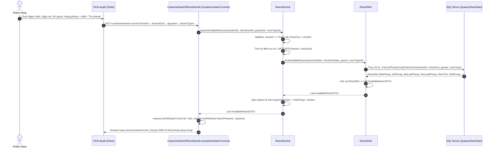
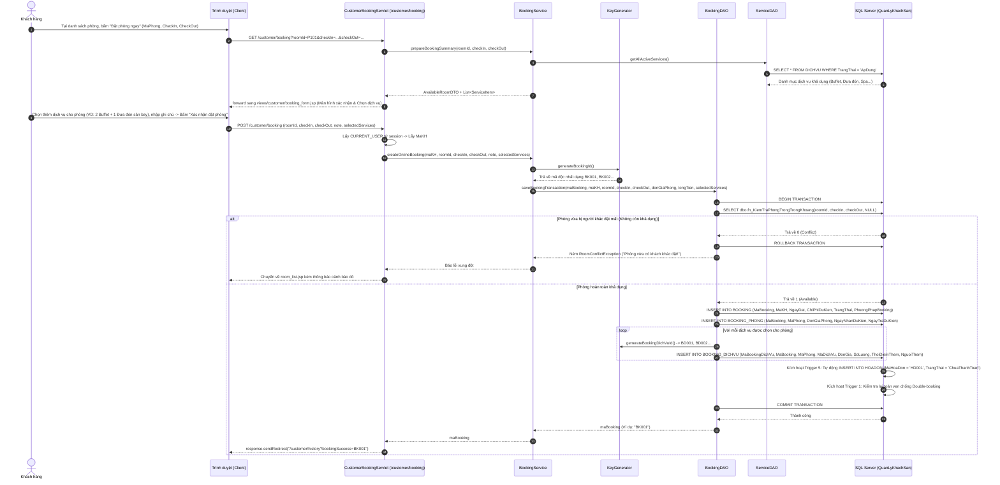
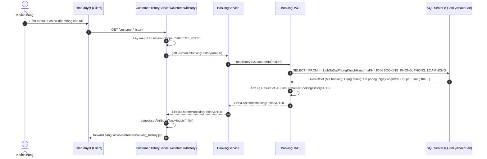
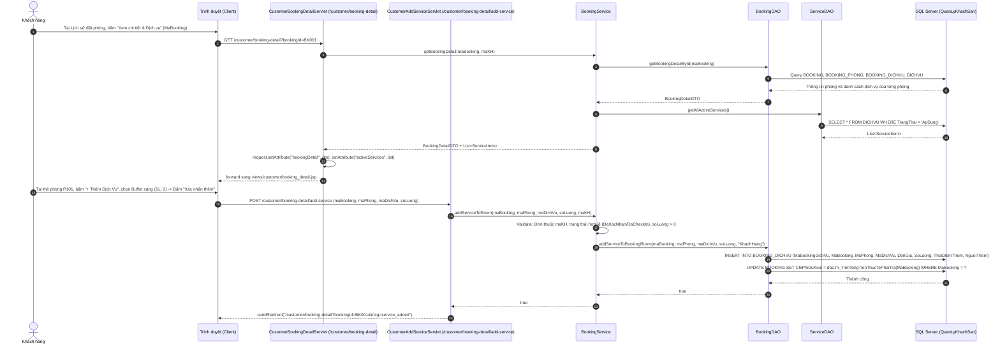

# BÁO CÁO THỰC THI GIAI ĐOẠN 2: PHÂN HỆ KHÁCH HÀNG — TRA CỨU, TÌM KIẾM & ĐẶT PHÒNG TRỰC TUYẾN
*(Customer Portal: Room Search, Real-Time Availability & Online Booking Flow)*

**Dự án:** Hệ Thống Quản Lý Khách Sạn (Hotel Management System) — Nhóm 10  
**Môn học:** Lập Trình Web (JSP/Servlet) & Hệ Quản Trị CSDL — HCMUTE  
**Người lập:** AI Assistant  
**Trạng thái:** ⏳ **ĐANG TRÌNH DUYỆT (CHỜ LẬP TRÌNH VIÊN ĐÁNH GIÁ & PHÊ DUYỆT TRƯỚC KHI VIẾT CODE)**  

---

## MỤC LỤC

1. [Mục Tiêu & Quy Tắc Nghiệp Vụ Cốt Lõi Giai Đoạn 2](#1-mục-tiêu--quy-tắc-nghiệp-vụ-cốt-lõi-giai-đoạn-2)
2. [Sơ Đồ Luồng Dữ Liệu & Chu Trình Tương Tác Giữa Các Lớp (Sequence Diagrams)](#2-sơ-đồ-luồng-dữ-liệu--chu-trình-tương-tác-giữa-các-lớp-sequence-diagrams)
   - [2.1. Luồng Tra Cứu & Lọc Phòng Trống Thời Gian Thực](#21-luồng-tra-cứu--lọc-phòng-trống-thời-gian-thực)
   - [2.2. Luồng Xác Nhận & Đặt Phòng Kèm Dịch Vụ Tiện Ích Từng Phòng](#22-luồng-xác-nhận--đặt-phòng-kèm-dịch-vụ-tiện-ích-từng-phòng)
   - [2.3. Luồng Quản Lý Lịch Sử Đặt Phòng Cá Nhân](#23-luồng-quản-lý-lịch-sử-đặt-phòng-cá-nhân)
   - [2.4. Luồng Xem Chi Tiết Booking & Thêm Dịch Vụ Vào Từng Phòng (Add Service to Room Detail)](#24-luồng-xem-chi-tiết-booking--thêm-dịch-vụ-vào-từng-phòng-add-service-to-room-detail)
3. [Danh Sách Các Class Sinh Ra & Bảng Phân Định Trách Nhiệm Chi Tiết](#3-danh-sách-các-class-sinh-ra--bảng-phân-định-trách-nhiệm-chi-tiết)
4. [Các Điểm Nâng Cấp Kế Thừa Từ Giai Đoạn 1](#4-các-điểm-nâng-cấp-kế-thừa-từ-giai-đoạn-1)
5. [Đặc Tả Chi Tiết Từng Bước Triển Khai & Danh Sách Các Hàm](#5-đặc-tả-chi-tiết-từng-bước-triển-khai--danh-sách-các-hàm)
   - [Bước 1: Các Entity Model & DTO Mới](#bước-1-các-entity-model--dto-mới)
   - [Bước 2: Tầng DAO (RoomDAO, ServiceDAO & BookingDAO)](#bước-2-tầng-dao-roomdao-servicedao--bookingdao)
   - [Bước 3: Tầng Nghiệp Vụ Service (RoomService & BookingService)](#bước-3-tầng-nghiệp-vụ-service-roomservice--bookingservice)
   - [Bước 4: Tầng Điều Khiển Controller Servlet](#bước-4-tầng-điều-khiển-controller-servlet)
   - [Bước 5: Thiết Kế & Nâng Cấp Giao Diện UI/UX JSP](#bước-5-thiết-kế--nâng-cấp-giao-diện-uiux-jsp)
6. [Tương Tác CSDL: Phối Hợp Function, Trigger & Transaction](#6-tương-tác-csdl-phối-hợp-function-trigger--transaction)
7. [Giải Pháp Xử Lý Thách Thức Nghiệp Vụ Đặc Thù](#7-giải-pháp-xử-lý-thách-thức-nghiệp-vụ-đặc-thù)
   - [7.1. Chống Đặt Trùng Phòng Thời Gian Thực (Concurrency / Overbooking)](#71-chống-đặt-trùng-phòng-thời-gian-thực-concurrency--overbooking)
   - [7.2. Thống Nhất Tuyệt Đối Chuẩn Khóa Chính Liền Mạch (BK001, BD001, HD001)](#72-thống-nhất-tuyệt-đối-chuẩn-khóa-chính-liền-mạch-bk001-bd001-hd001)
   - [7.3. Cơ Chế Thời Gian Chết 1 Tiếng (Housekeeping Buffer) & Vòng Đời Phòng Hư Hỏng (Damaged)](#73-cơ-chế-thời-gian-chết-1-tiếng-housekeeping-buffer--vòng-đời-phòng-hư-hỏng-damaged)
   - [7.4. Quy Trình Lễ Tân Tiếp Khách Vãng Lai (Walk-in Double Validation)](#74-quy-trình-lễ-tân-tiếp-khách-vãng-lai-walk-in-double-validation)
   - [7.5. Cơ Chế Quản Lý Dịch Vụ Theo Từng Phòng (Room-Specific Add-on Services) & Toàn Vẹn 3NF](#75-cơ-chế-quản-lý-dịch-vụ-theo-từng-phòng-room-specific-add-on-services--toàn-vẹn-3nf)
8. [Kịch Bản Kiểm Thử Giai Đoạn 2 (Live Test Checklist)](#8-kịch-bản-kiểm-thử-giai-đoạn-2-live-test-checklist)
9. [Xin Ý Kiến Phê Duyệt Trước Khi Viết Code](#9-xin-ý-kiến-phê-duyệt-trước-khi-viết-code)

---

## 1. MỤC TIÊU & QUY TẮC NGHIỆP VỤ CỐT LÕI GIAI ĐOẠN 2

### 1.1. Mục tiêu giai đoạn 2
* **Xây dựng hoàn chỉnh Cổng Khách Hàng (Customer Portal):** Cho phép người dùng sau khi đăng ký/đăng nhập có thể tra cứu phòng trống theo khoảng ngày nhận - trả, số lượng người và hạng phòng mong muốn.
* **Tạo đơn đặt phòng trực tuyến (`BOOKING`) đầu tiên:** Làm nguyên liệu và tiền đề cho phân hệ Lễ tân check-in ở Giai đoạn 3, Thu ngân thanh toán ở Giai đoạn 4 và Buồng phòng dọn dẹp ở Giai đoạn 5.
* **Hỗ trợ chọn và thêm dịch vụ gia tăng vào chi tiết từng phòng (`BOOKING_PHONG` -> `BOOKING_DICHVU`):** Khách hàng có thể chọn dịch vụ ngay khi tạo đơn đặt phòng hoặc gọi thêm dịch vụ vào phòng cụ thể từ trang Chi tiết đặt phòng (`booking_detail.jsp`).
* **Tự động kích hoạt toàn bộ cơ chế tự động hóa CSDL:** 
  - Kích hoạt hàm kiểm tra phòng trống `fn_KiemTraPhongTrongTrongKhoang`.
  - Kích hoạt Trigger 1 (`trg_Check_XungDotDatPhong`) chống đặt trùng phòng.
  - Kích hoạt Trigger 5 (`trg_TuDongTaoHoaDonKhiDatPhong`) tự động sinh sẵn 1 Hóa đơn `HOADON` ở trạng thái `ChuaThanhToan` (theo đúng **Phương án A: 1 Booking — 1 Hóa đơn tổng duy nhất**).

### 1.2. Các quy tắc nghiệp vụ cốt lõi
1. **Khách hàng đại diện (Chủ đơn):**
   - Đơn đặt phòng gắn liền với Mã khách hàng (`MaKH`) của tài khoản đang đăng nhập trong `HttpSession` (`CURRENT_USER`).
   - Quản lý theo số lượng phòng và người đại diện nhận phòng, không đếm đầu người phức tạp.
2. **Tìm kiếm & Phân phối phòng trống thời gian thực (Real-time Availability & Smart Buffer):**
   - Người dùng bắt buộc chọn `NgayNhan` và `NgayTra` (Điều kiện: `NgayNhan >= Ngày hiện tại` và `NgayTra > NgayNhan`).
   - **Kênh Online (Web Khách Hàng):**
     1. **Loại trừ phòng hư hỏng (`Damaged`):** Ẩn 100% tất cả các phòng đang có trạng thái `Damaged`. Khách đặt online không bao giờ nhìn thấy phòng hỏng, loại bỏ hoàn toàn rủi ro bán nhầm phòng không ở được.
     2. **Cơ chế thời gian chết 1 tiếng (Turnaround Buffer = 60 phút):**
        - Đối với đơn đặt ngày mai trở đi (`NgayNhan > Hôm nay`): Bỏ qua trạng thái `Dirty`/`Cleaning` hiện tại (vì đến ngày mai buồng phòng chắc chắn đã dọn xong).
        - Đối với đơn đặt nhận phòng NGAY HÔM NAY: Phòng đang `Dirty`/`Cleaning` chỉ được hiển thị nếu khoảng cách giữa lúc khách trước check-out và giờ nhận phòng mới $\ge 60\text{ phút}$. Nếu $< 60$ phút thì tạm ẩn vì buồng phòng dọn không kịp.
     3. **Chống trùng lịch:** Không bị giao thoa thời gian với bất kỳ đơn đặt phòng nào khác đang có hiệu lực (`DaXacNhan` hoặc `DaCheckIn`) trong khoảng `[NgayNhan, NgayTra]`.
   - **Kênh Offline tại quầy (Lễ tân tiếp khách vãng lai - Walk-in):**
     1. **Ổ khóa 1 (Trạng thái tức thời):** Phòng bắt buộc phải là `Available` (sạch sẽ, sẵn sàng giao chìa khóa ngay lập tức). Tuyệt đối không giao phòng `Dirty`, `Cleaning` hay `Damaged`.
     2. **Ổ khóa 2 (Quét lịch tương lai):** Hệ thống tự động kiểm tra từ hôm nay đến ngày trả phòng của khách vãng lai, bảo đảm phòng này không có bất kỳ khách online nào đã đặt trước.
3. **Quy chuẩn sinh mã khóa chính thống nhất (Unified Primary Key Standard):**
   - Tuyệt đối tuân thủ chỉ đạo của lập trình viên: **Khóa chính toàn hệ thống phải thống nhất 100% định dạng liền mạch: `[TIỀN TỐ 2 KÝ TỰ] + [3 CHỮ SỐ]`** (Ví dụ: `TK001`, `KH001`, `NV001`, `BK001`, `BD001`, `HD001`).
   - Tuyệt đối không sinh mã có dấu gạch dưới như `BK_001` hay `BK_uuid`.
   - Sinh mã Booking mới thông qua `KeyGenerator.generateBookingId()` và mã dịch vụ booking qua `KeyGenerator.generateBookingDichVuId()` (quét MAX + 1 và kiểm tra tính độc nhất tuyệt đối trong CSDL).
   - Đồng bộ Trigger 5 để tự động sinh mã `HOADON` dạng `HD001` tương ứng với `BK001`.
4. **Phương thức đặt phòng và trạng thái ban đầu:**
   - Đơn đặt qua Web được gán `PhuongPhapBooking = 'Online'`.
   - Trạng thái ban đầu của Booking là `'DaXacNhan'` (sẵn sàng chờ khách đến quầy để Lễ tân check-in).
   - Cột `MaNV` trong `BOOKING` ban đầu để `NULL` (chờ Lễ tân tiếp nhận xử lý check-in ghi nhận sau).
5. **Quản lý Dịch vụ tiện ích gắn liền chi tiết từng phòng (Add-on Services per Room Detail):**
   - Trong mô hình dữ liệu, mỗi phòng trong đơn đặt phòng là một bản ghi trong `BOOKING_PHONG(MaBooking, MaPhong)`.
   - Bảng `BOOKING_DICHVU` tham chiếu trực tiếp cặp khóa ngoại `(MaBooking, MaPhong)` trỏ về `BOOKING_PHONG` (chuẩn hóa 3NF), cho phép quản lý dịch vụ gắn chính xác vào từng phòng:
     * **Chọn dịch vụ khi đặt phòng (`booking_form.jsp`):** Khách hàng có thể tích chọn các dịch vụ tiện ích bổ sung cho phòng đang đặt (Buffet sáng, Đưa đón sân bay, Giường phụ...) và chọn số lượng. Tổng tiền dự kiến sẽ tự động tính = `Tiền phòng (Đơn giá x Số đêm) + Tổng tiền dịch vụ đã chọn`.
     * **Xem chi tiết & gọi thêm dịch vụ sau khi đặt (`booking_detail.jsp`):** Khách hàng có thể vào màn hình Chi tiết đặt phòng để xem danh sách dịch vụ của từng phòng và bấm nút **"+ Thêm Dịch Vụ Cho Phòng"** để gọi thêm dịch vụ mới bất kỳ lúc nào khi đơn đang ở trạng thái `DaXacNhan` hoặc `DaCheckIn`.
   - Cột `NguoiThem` được gán giá trị `'KhachHang'` (khi khách tự thêm qua web) hoặc `'NhanVien'` (khi lễ tân thêm tại quầy ở Giai đoạn 3). Cột `MaNV` để `NULL` khi khách tự thêm.
   - Cột `DonGia` trong `BOOKING_DICHVU` được lưu cố định theo đơn giá niêm yết tại thời điểm thêm (lấy từ `DICHVU.DonGia`), đảm bảo không bị ảnh hưởng nếu sau này khách sạn tăng hoặc giảm giá dịch vụ.
   - Công thức tổng chi phí dự kiến:
     $$\text{ChiPhiDuKien} = \sum_{\text{phòng}} (\text{DonGiaPhong} \times \text{SoDem}) + \sum_{\text{dịch vụ}} (\text{DonGiaDichVu} \times \text{SoLuong})$$

---

## 2. SƠ ĐỒ LUỒNG DỮ LIỆU & CHU TRÌNH TƯƠNG TÁC GIỮA CÁC LỚP (SEQUENCE DIAGRAMS)

### 2.1. Luồng Tra Cứu & Lọc Phòng Trống Thời Gian Thực



### 2.2. Luồng Xác Nhận & Đặt Phòng Kèm Dịch Vụ Tiện Ích Từng Phòng (Online Booking with Add-on Services)



### 2.3. Luồng Quản Lý Lịch Sử Đặt Phòng Cá Nhân



### 2.4. Luồng Xem Chi Tiết Booking & Thêm Dịch Vụ Vào Từng Phòng (Add Service to Room Detail)



---

## 3. DANH SÁCH CÁC CLASS SINH RA & BẢNG PHÂN ĐỊNH TRÁCH NHIỆM CHI TIẾT

| STT | Tên Class / Tệp tin | Gói (Package) / Thư mục | Nhiệm vụ cụ thể | Tương tác trực tiếp |
| :---: | :--- | :--- | :--- | :--- |
| 1 | **`RoomType.java`** | `model` | Entity ánh xạ bảng `LOAIPHONG` (`maLoaiPhong`, `tenLoaiPhong`, `dienTich`, `loaiGiuong`, `soNguoiToiDa`, `giaPhong`, `trangThai`). | Dùng bởi `RoomDAO`, `RoomService`. |
| 2 | **`Room.java`** | `model` | Entity ánh xạ bảng `PHONG` (`maPhong`, `soPhong`, `maLoaiPhong`, `trangThai`, `moTa`). | Dùng bởi `RoomDAO`, `RoomService`. |
| 3 | **`Booking.java`** | `model` | Entity ánh xạ bảng `BOOKING` (`maBooking`, `maKH`, `maNV`, `ngayDat`, `trangThai`, `chiPhiDuKien`, `phuongPhapBooking`, `thoiDiemHuy`, `phiHuy`). | Dùng bởi `BookingDAO`, `BookingService`. |
| 4 | **`BookingRoom.java`** | `model` | Entity ánh xạ bảng `BOOKING_PHONG` (`maBooking`, `maPhong`, `donGiaPhong`, `ngayNhanDuKien`, `ngayTraDuKien`, `ngayCheckInThucTe`, `ngayCheckOutThucTe`). | Dùng bởi `BookingDAO`. |
| 5 | **`ServiceItem.java`** | `model` | Entity ánh xạ bảng `DICHVU` (`maDichVu`, `tenDichVu`, `donGia`, `trangThai`). | Dùng bởi `ServiceDAO`, `BookingService`. |
| 6 | **`BookingDichVu.java`** | `model` | Entity ánh xạ bảng `BOOKING_DICHVU` (`maBookingDichVu`, `maBooking`, `maPhong`, `maDichVu`, `donGia`, `soLuong`, `thoiDiemThem`, `nguoiThem`, `maNV`). | Dùng bởi `BookingDAO`, `BookingService`. |
| 7 | **`Invoice.java`** | `model` | Entity ánh xạ bảng `HOADON` (`maHoaDon`, `maBooking`, `ngayLap`, `tongTienCuoiCung`, `maNV`, `trangThai`). | Dùng bởi `BookingDAO`, `InvoiceDAO`. |
| 8 | **`AvailableRoomDTO.java`** | `dto.room` | Chứa dữ liệu hiển thị thẻ phòng kết quả tìm kiếm: `maPhong`, `soPhong`, `maLoaiPhong`, `tenLoaiPhong`, `dienTich`, `loaiGiuong`, `soNguoiToiDa`, `giaPhong`, `moTaPhong`, `soDem`, `tongTienDuKien`. | `RoomDAO` $\to$ `RoomService` $\to$ `room_list.jsp`. |
| 9 | **`BookingRequestDTO.java`** | `dto.booking` | Chứa dữ liệu yêu cầu đặt phòng gửi từ Client: `maKH`, `maPhong`, `ngayNhan`, `ngayTra`, `ghiChu`, `selectedServices` (`Map<String, Integer>`). | `CustomerBookingServlet` $\to$ `BookingService`. |
| 10 | **`CustomerBookingHistoryDTO.java`** | `dto.booking` | Dữ liệu hiển thị bảng lịch sử đặt phòng: `maBooking`, `soPhong`, `tenLoaiPhong`, `ngayDat`, `ngayNhanDuKien`, `ngayTraDuKien`, `soDem`, `chiPhiDuKien`, `trangThaiBooking`, `maHoaDon`, `trangThaiHoaDon`. | `BookingDAO` $\to$ `BookingService` $\to$ `booking_history.jsp`. |
| 11 | **`BookingDetailDTO.java`** | `dto.booking` | Chứa toàn bộ thông tin chi tiết của 1 đơn đặt phòng: Thông tin chung đơn (`maBooking`, `ngayDat`, `trangThai`, `chiPhiDuKien`, `maHoaDon`), và danh sách chi tiết từng phòng `List<RoomBookingDetailDTO>`. | `BookingDAO` $\to$ `BookingService` $\to$ `booking_detail.jsp`. |
| 12 | **`RoomBookingDetailDTO.java`** | `dto.booking` | Chứa thông tin 1 phòng đã đặt (`maPhong`, `soPhong`, `tenLoaiPhong`, `donGiaPhong`, `ngayNhan`, `ngayTra`, `soDem`, `tienPhong`) và danh sách các dịch vụ gọi riêng cho phòng đó `List<BookingDichVuItemDTO>`. | Dùng trong `BookingDetailDTO`. |
| 13 | **`BookingDichVuItemDTO.java`** | `dto.booking` | Thông tin 1 dòng dịch vụ gắn vào phòng: `maBookingDichVu`, `maDichVu`, `tenDichVu`, `donGia`, `soLuong`, `thanhTien`, `thoiDiemThem`, `nguoiThem`. | Dùng trong `RoomBookingDetailDTO`. |
| 14 | **`RoomDAO.java`** | `dao.room` | Tương tác CSDL về phòng: `getAllActiveRoomTypes()`, `searchAvailableRooms(checkIn, checkOut, guests, roomTypeId)`, `getRoomDetailById(maPhong)`, `isRoomAvailable(maPhong, checkIn, checkOut)`. | Gọi `DBContext`, thực thi câu lệnh SQL/Function. |
| 15 | **`ServiceDAO.java`** | `dao.service` | Tương tác CSDL về dịch vụ: `getAllActiveServices()` (lấy toàn bộ dịch vụ đang áp dụng), `getServiceById(maDichVu)`. | Gọi `DBContext`, tương tác bảng `DICHVU`. |
| 16 | **`BookingDAO.java`** | `dao.booking` | Quản lý giao dịch đặt phòng: `createOnlineBooking(bookingRequest, services)`, `addServiceToBookingRoom(bdv)`, `removeServiceFromRoom(maBookingDichVu, maKH)`, `getBookingHistoryByCustomer(maKH)`, `getBookingDetailById(maBooking)`. | Mở Transaction, dùng `KeyGenerator`, tương tác bảng `BOOKING`, `BOOKING_PHONG`, `BOOKING_DICHVU`, `HOADON`. |
| 17 | **`RoomService.java`** | `service.room` | Xử lý logic tìm phòng: validate ngày nhận/trả, tính số đêm lưu trú, tính tổng tiền tạm tính, lọc kết quả phòng trống. | Gọi `RoomDAO`, được gọi bởi Servlets. |
| 18 | **`BookingService.java`** | `service.booking` | Logic nghiệp vụ đặt phòng & dịch vụ: validate điều kiện đặt phòng, xử lý tranh chấp phòng, tạo booking kèm dịch vụ, thêm/xóa dịch vụ vào từng phòng, lấy chi tiết booking & lịch sử. | Gọi `BookingDAO`, `ServiceDAO`, `RoomDAO`. |
| 19 | **`CustomerSearchRoomServlet.java`** | `controller.customer` (`/customer/search-rooms`) | Tiếp nhận tham số tìm kiếm (`checkIn`, `checkOut`, `guests`, `roomType`), gọi `RoomService`, chuyển tiếp dữ liệu sang `views/customer/room_list.jsp`. | Gọi `RoomService`, forward sang `room_list.jsp`. |
| 20 | **`CustomerBookingServlet.java`** | `controller.customer` (`/customer/booking`) | GET: Hiển thị form xác nhận đặt phòng (`booking_form.jsp`) kèm chi phí chi tiết & danh mục dịch vụ. POST: Submit đặt phòng kèm dịch vụ đã chọn, gọi `BookingService.createBooking()`, redirect về lịch sử. | Gọi `BookingService`, `RoomService`. |
| 21 | **`CustomerHistoryServlet.java`** | `controller.customer` (`/customer/history`) | GET: Lấy danh sách booking của khách hàng, hiển thị `booking_history.jsp`. POST: Hỗ trợ hủy đơn (nếu chưa check-in). | Gọi `BookingService`, forward sang `booking_history.jsp`. |
| 22 | **`CustomerBookingDetailServlet.java`** | `controller.customer` (`/customer/booking-detail`) | GET: Xem chi tiết đơn đặt phòng, hiển thị thông tin từng phòng và các dịch vụ đã add vào phòng đó, nạp danh mục dịch vụ phục vụ Modal gọi thêm. | Gọi `BookingService`, forward sang `booking_detail.jsp`. |
| 23 | **`CustomerAddServiceServlet.java`** | `controller.customer` (`/customer/booking-detail/add-service`) | POST: Nhận yêu cầu thêm dịch vụ vào phòng (`maBooking`, `maPhong`, `maDichVu`, `soLuong`), gọi `BookingService.addServiceToRoom()`, redirect về chi tiết đơn kèm thông báo thành công. POST (action=remove): Xóa dịch vụ khi chưa check-in. | Gọi `BookingService`. |
| 24 | **`home.jsp` (Nâng cấp)** | `views/customer/` | Màn hình chính Customer Portal: Tích hợp thanh Search Bar trực quan, bộ lọc ngày nhận/trả phòng, số người, hạng phòng. | Gửi form GET sang `/customer/search-rooms`. |
| 25 | **`room_list.jsp`** | `views/customer/` | Màn hình hiển thị danh sách phòng trống dưới dạng thẻ card hiện đại, hình ảnh minh họa, thông số tiện ích, giá tiền và nút "Chọn đặt phòng". | Gửi tham số sang `/customer/booking`. |
| 26 | **`booking_form.jsp`** | `views/customer/` | Màn hình xác nhận đặt phòng & tóm tắt chi phí (Checkout Confirmation): 2 cột (Thông tin người đặt, phòng đã chọn, **phần chọn thêm dịch vụ cho phòng** & Hóa đơn dự kiến). | Gửi form POST sang `/customer/booking`. |
| 27 | **`booking_history.jsp`** | `views/customer/` | Màn hình "Lịch sử đặt phòng của tôi": Danh sách các đơn đã đặt, timeline trạng thái, thông tin phòng, mã hóa đơn liên kết, nút **"Xem chi tiết & Dịch vụ"**. | Tương tác với `/customer/history` và `/customer/booking-detail`. |
| 28 | **`booking_detail.jsp` (Mới)** | `views/customer/` | Màn hình Chi tiết đơn đặt phòng: Hiển thị chi tiết từng phòng đã đặt, bảng kê dịch vụ phát sinh của từng phòng, nút **"+ Thêm Dịch Vụ Cho Phòng"** và Popup Modal gọi dịch vụ. | Tương tác với `/customer/booking-detail` và `/customer/booking-detail/add-service`. |

---

## 4. CÁC ĐIỂM NÂNG CẤP KẾ THỪA TỪ GIAI ĐOẠN 1

1. **Tận dụng phiên đăng nhập định danh `UserSessionDTO`:**
   - Trong Giai đoạn 1, khi người dùng đăng nhập bằng Email hoặc SĐT, hệ thống đã lưu đối tượng `UserSessionDTO` vào `session.setAttribute("CURRENT_USER", ...)`.
   - Đối tượng này chứa sẵn: `maKH` (trong `maDinhDanh`), `hoTen`, `email`, `soDT`.
   - Trong Giai đoạn 2, khi khách hàng thực hiện đặt phòng, Servlet tự động trích xuất `maKH` từ `CURRENT_USER` mà không bắt khách phải nhập lại thông tin cá nhân.
2. **Kế thừa bộ lọc bảo vệ an ninh `AuthFilter`:**
   - Mọi URL bắt đầu bằng `/customer/*` đã được `AuthFilter` bảo vệ nghiêm ngặt.
   - Nếu khách hàng vãng lai chưa đăng nhập mà bấm vào link đặt phòng, `AuthFilter` tự động chặn lại và chuyển hướng về `/login?redirect=...`. Sau khi đăng nhập thành công, khách sẽ được đưa quay lại đúng trang đặt phòng dang dở.
3. **Kế thừa tiện ích sinh mã `KeyGenerator.java`:**
   - Sử dụng hàm `KeyGenerator.generateBookingId()` đã viết ở Giai đoạn 1 để sinh mã đặt phòng dạng `BK001`, `BK002`... tự tăng và kiểm tra tính độc nhất trong CSDL.
   - Đồng bộ hóa triệt để cách đặt tên mã giữa Java và SQL Trigger.

---

## 5. ĐẶC TẢ CHI TIẾT TỪNG BƯỚC TRIỂN KHAI & DANH SÁCH CÁC HÀM

### Bước 1: Các Entity Model & DTO Mới

#### 1.1. `RoomType.java` (Package: `model`)
Ánh xạ trực tiếp bảng `LOAIPHONG`:
* **Thuộc tính:**
  - `String maLoaiPhong`: Khóa chính (ví dụ: `LP001`, `LP002`).
  - `String tenLoaiPhong`: Tên hạng phòng (Standard, Deluxe, Suite, VIP...).
  - `double dienTich`: Diện tích phòng ($m^2$).
  - `String loaiGiuong`: Loại giường (Đơn, Đôi, King, Queen...).
  - `int soNguoiToiDa`: Sức chứa tối đa.
  - `double giaPhong`: Đơn giá niêm yết theo đêm (VNĐ).
  - `String trangThai`: Trạng thái áp dụng kinh doanh (`ApDung`, `NgungApDung`).
* **Hàm / Phương thức:** Constructor mặc định, Constructor đầy đủ tham số, Getters và Setters.

#### 1.2. `Room.java` (Package: `model`)
Ánh xạ trực tiếp bảng `PHONG`:
* **Thuộc tính:**
  - `String maPhong`: Khóa chính (ví dụ: `P101`, `P102`).
  - `String soPhong`: Số phòng hiển thị trên cửa (101, 102...).
  - `String maLoaiPhong`: Khóa ngoại trỏ đến `LOAIPHONG`.
  - `String trangThai`: Trạng thái vật lý (`Available`, `Booked`, `Occupied`, `Dirty`, `Cleaning`, `Damaged`).
  - `String moTa`: Ghi chú mô tả thêm về hướng phòng, ban công, view biển.
* **Hàm / Phương thức:** Getters, Setters, Constructor.

#### 1.3. `Booking.java` (Package: `model`)
Ánh xạ trực tiếp bảng `BOOKING`:
* **Thuộc tính:**
  - `String maBooking`: Khóa chính dạng `BK001`, `BK002`.
  - `String maKH`: Mã khách hàng đại diện.
  - `String maNV`: Mã nhân viên xử lý (NULL khi đặt online).
  - `Timestamp ngayDat`: Thời điểm tạo đơn.
  - `String trangThai`: Trạng thái đơn (`DaXacNhan`, `DaCheckIn`, `DaCheckOut`, `DaHuy`).
  - `double chiPhiDuKien`: Tổng tiền phòng dự kiến.
  - `String phuongPhapBooking`: `'Online'` hoặc `'Offline'`.
  - `Timestamp thoiDiemHuy`: Thời điểm khách hủy phòng (nếu có).
  - `double phiHuy`: Phí phạt hủy phòng (nếu có).

#### 1.4. `BookingRoom.java` (Package: `model`)
Ánh xạ trực tiếp bảng `BOOKING_PHONG`:
* **Thuộc tính:**
  - `String maBooking`: Khóa ngoại trỏ đến `BOOKING`.
  - `String maPhong`: Khóa ngoại trỏ đến `PHONG`.
  - `double donGiaPhong`: Đơn giá chốt tại thời điểm đặt phòng.
  - `Date ngayNhanDuKien`: Ngày khách dự kiến nhận phòng.
  - `Date ngayTraDuKien`: Ngày khách dự kiến trả phòng.
  - `Timestamp ngayCheckInThucTe`: Ghi nhận giờ khách nhận phòng thực tế.
  - `Timestamp ngayCheckOutThucTe`: Ghi nhận giờ khách trả phòng thực tế.

#### 1.5. `ServiceItem.java` (Package: `model`)
Ánh xạ trực tiếp bảng `DICHVU`:
* **Thuộc tính:**
  - `String maDichVu`: Khóa chính (ví dụ: `DV001`, `DV002`... `DV008`).
  - `String tenDichVu`: Tên dịch vụ (Buffet sáng, Đưa đón sân bay, Giặt ủi, Nước suối, Giường phụ...).
  - `double donGia`: Đơn giá niêm yết (VNĐ).
  - `String trangThai`: Trạng thái kinh doanh (`ApDung`, `NgungApDung`).

#### 1.6. `BookingDichVu.java` (Package: `model`)
Ánh xạ trực tiếp bảng `BOOKING_DICHVU` (Dịch vụ gắn vào từng phòng trong booking):
* **Thuộc tính:**
  - `String maBookingDichVu`: Khóa chính tự sinh dạng `BD001`, `BD002`...
  - `String maBooking`: Khóa ngoại trỏ đến `BOOKING`.
  - `String maPhong`: Khóa ngoại trỏ đến `PHONG` (thuộc cặp `(MaBooking, MaPhong)` trong `BOOKING_PHONG`).
  - `String maDichVu`: Khóa ngoại trỏ đến `DICHVU`.
  - `double donGia`: Đơn giá chốt tại thời điểm thêm dịch vụ.
  - `int soLuong`: Số lượng dịch vụ sử dụng (mặc định $\ge 1$).
  - `Timestamp thoiDiemThem`: Thời điểm thêm dịch vụ (`GETDATE()`).
  - `String nguoiThem`: `'KhachHang'` hoặc `'NhanVien'`.
  - `String maNV`: Mã nhân viên thực hiện (NULL nếu khách tự đặt online).

#### 1.7. `AvailableRoomDTO.java` (Package: `dto.room`)
Đối tượng mang dữ liệu phục vụ trực tiếp màn hình kết quả tìm kiếm `room_list.jsp` và màn hình xác nhận `booking_form.jsp`:
* **Thuộc tính:**
  - `String maPhong`, `String soPhong`, `String maLoaiPhong`, `String tenLoaiPhong`
  - `double dienTich`, `String loaiGiuong`, `int soNguoiToiDa`, `double giaPhong`, `String moTaPhong`
  - `String ngayNhan`, `String ngayTra`: Ngày tìm kiếm đã format chuỗi `dd/MM/yyyy`
  - `int soDem`: Số đêm lưu trú tính toán được
  - `double tongTienDuKien`: Bằng `giaPhong * soDem`
  - `String hinhAnhMinhHoa`: Đường dẫn ảnh đại diện của loại phòng

#### 1.8. `CustomerBookingHistoryDTO.java` (Package: `dto.booking`)
Đối tượng mang dữ liệu hiển thị lịch sử đặt phòng `booking_history.jsp`:
* **Thuộc tính:**
  - `String maBooking`: Mã đơn (ví dụ: `BK001`)
  - `String soPhong`, `String tenLoaiPhong`: Thông tin phòng đã đặt
  - `Timestamp ngayDat`: Ngày giờ đặt phòng
  - `Date ngayNhanDuKien`, `Date ngayTraDuKien`: Khoảng thời gian lưu trú
  - `int soDem`: Số đêm ở
  - `double chiPhiDuKien`: Tổng chi phí
  - `String trangThaiBooking`: `DaXacNhan`, `DaCheckIn`, `DaCheckOut`, `DaHuy`
  - `String maHoaDon`: Mã hóa đơn tương ứng (ví dụ: `HD001`)
  - `String trangThaiHoaDon`: `ChuaThanhToan`, `MotPhan`, `DaThanhToanDu`
  - `boolean coTheHuy`: Cờ boolean đánh giá khách có được quyền bấm hủy đơn không (`trangThaiBooking.equals("DaXacNhan")`)

#### 1.9. `BookingDetailDTO.java` (Package: `dto.booking`)
Dữ liệu hiển thị chi tiết toàn diện đơn đặt phòng tại `booking_detail.jsp`:
* **Thuộc tính:**
  - `String maBooking`, `Timestamp ngayDat`, `String trangThaiBooking`, `String phuongPhapBooking`, `String ghiChu`
  - `String maKH`, `String hoTenKhachHang`, `String soDT`, `String email`
  - `String maHoaDon`, `String trangThaiHoaDon`
  - `double tongTienPhong`, `double tongTienDichVu`, `double tongChiPhiDuKien`
  - `List<RoomBookingDetailDTO> danhSachPhong`: Danh sách các phòng đã đặt kèm chi tiết dịch vụ của từng phòng

#### 1.10. `RoomBookingDetailDTO.java` & `BookingDichVuItemDTO.java` (Package: `dto.booking`)
Chi tiết từng phòng và dịch vụ của phòng:
* **`RoomBookingDetailDTO`:**
  - `String maPhong`, `String soPhong`, `String tenLoaiPhong`, `double donGiaPhong`
  - `Date ngayNhanDuKien`, `Date ngayTraDuKien`, `int soDem`, `double tienPhong`
  - `List<BookingDichVuItemDTO> danhSachDichVu`: Danh sách các dịch vụ đã gọi riêng cho phòng này
  - `double tongTienDichVuPhong`: Tổng tiền dịch vụ của riêng phòng này
* **`BookingDichVuItemDTO`:**
  - `String maBookingDichVu`, `String maDichVu`, `String tenDichVu`, `double donGia`, `int soLuong`, `double thanhTien`
  - `Timestamp thoiDiemThem`, `String nguoiThem`

---

### Bước 2: Tầng DAO (RoomDAO, ServiceDAO & BookingDAO)

#### 2.1. `RoomDAO.java` (Package: `dao.room`)
* **Nhiệm vụ:** Thực thi các truy vấn liên quan đến phòng, hạng phòng và tính khả dụng của phòng.
* **Danh sách hàm triển khai:**
  1. `public List<RoomType> getAllActiveRoomTypes()`: Lấy danh sách toàn bộ hạng phòng đang áp dụng (`TrangThai = 'ApDung'`).
  2. `public List<AvailableRoomDTO> searchAvailableRooms(java.sql.Date checkIn, java.sql.Date checkOut, Integer guests, String roomTypeId)`: Gọi `dbo.fn_TraCuuPhongTrongTheoYeuCau(?, ?, ?, ?)`.
  3. `public AvailableRoomDTO getRoomDetailForBooking(String maPhong, java.sql.Date checkIn, java.sql.Date checkOut)`: Truy vấn thông tin chi tiết phòng để hiển thị trên màn hình xác nhận `booking_form.jsp`.
  4. `public boolean isRoomAvailable(String maPhong, java.sql.Date checkIn, java.sql.Date checkOut)`: Gọi `SELECT dbo.fn_KiemTraPhongTrongTrongKhoang(?, ?, ?, NULL)`.

#### 2.2. `ServiceDAO.java` (Package: `dao.service`)
* **Nhiệm vụ:** Tương tác với bảng `DICHVU` để phục vụ khách hàng chọn tiện ích.
* **Danh sách hàm triển khai:**
  1. `public List<ServiceItem> getAllActiveServices()`:
     - Truy vấn tất cả dịch vụ đang kinh doanh:
       ```sql
       SELECT MaDichVu, TenDichVu, DonGia, TrangThai 
       FROM DICHVU 
       WHERE TrangThai = 'ApDung' 
       ORDER BY DonGia ASC
       ```
  2. `public ServiceItem getServiceById(String maDichVu)`:
     - Lấy thông tin 1 dịch vụ cụ thể theo mã để kiểm tra đơn giá niêm yết.

#### 2.3. `BookingDAO.java` (Package: `dao.booking`)
* **Nhiệm vụ:** Quản lý giao dịch tạo đơn đặt phòng kèm dịch vụ cho từng phòng, thêm/xóa dịch vụ vào chi tiết phòng, và truy xuất chi tiết đơn.
* **Danh sách hàm triển khai:**
  1. `public String createOnlineBookingWithServices(String maKH, String maPhong, java.sql.Date checkIn, java.sql.Date checkOut, double donGiaPhong, double tongChiPhi, Map<String, Integer> selectedServices) throws Exception`:
     - **Triển khai JDBC Transaction toàn vẹn:**
       ```java
       Connection conn = DBContext.getConnection();
       conn.setAutoCommit(false);
       ```
     - **Bước 1:** Kiểm tra lại tính khả dụng của phòng bằng `fn_KiemTraPhongTrongTrongKhoang`. Nếu xung đột $\to$ `conn.rollback()` và ném `RoomConflictException`.
     - **Bước 2:** Sinh mã `MaBooking` bằng `KeyGenerator.generateBookingId()` (ví dụ: `BK001`).
     - **Bước 3:** Chèn `BOOKING` (với `ChiPhiDuKien = tongChiPhi`, `TrangThai = 'DaXacNhan'`, `PhuongPhapBooking = 'Online'`).
     - **Bước 4:** Chèn `BOOKING_PHONG` (`MaBooking`, `MaPhong`, `DonGiaPhong`, `NgayNhanDuKien`, `NgayTraDuKien`).
     - **Bước 5 (Gắn Dịch Vụ Vào Phòng):** Nếu khách có chọn dịch vụ:
       * Với mỗi dịch vụ trong `selectedServices`:
         - Lấy `DonGia` dịch vụ từ bảng `DICHVU`.
         - Sinh `MaBookingDichVu` bằng `KeyGenerator.generateBookingDichVuId()` (ví dụ: `BD001`, `BD002`).
         - Thực thi câu lệnh chèn vào `BOOKING_DICHVU`:
           ```sql
           INSERT INTO BOOKING_DICHVU (MaBookingDichVu, MaBooking, MaPhong, MaDichVu, DonGia, SoLuong, ThoiDiemThem, NguoiThem, MaNV)
           VALUES (?, ?, ?, ?, ?, ?, GETDATE(), 'KhachHang', NULL)
           ```
     - **Bước 6:** Trigger 5 tự động sinh `HOADON` (`HD001`, `ChuaThanhToan`).
     - **Bước 7:** `conn.commit()`, trả về chuỗi `maBooking`.
  2. `public boolean addServiceToBookingRoom(String maBooking, String maPhong, String maDichVu, int soLuong, String nguoiThem) throws Exception`:
     - **Thêm dịch vụ mới vào phòng đã đặt:**
       * Kiểm tra phòng `maPhong` có thực sự thuộc `MaBooking` không (`SELECT 1 FROM BOOKING_PHONG WHERE MaBooking = ? AND MaPhong = ?`).
       * Lấy đơn giá hiện tại của dịch vụ từ `DICHVU`.
       * Sinh mã `MaBookingDichVu` mới qua `KeyGenerator.generateBookingDichVuId()`.
       * Chèn bản ghi mới vào `BOOKING_DICHVU`:
         ```sql
         INSERT INTO BOOKING_DICHVU (MaBookingDichVu, MaBooking, MaPhong, MaDichVu, DonGia, SoLuong, ThoiDiemThem, NguoiThem, MaNV)
         VALUES (?, ?, ?, ?, ?, ?, GETDATE(), ?, NULL)
         ```
       * Cập nhật lại tổng tiền tạm tính trong `BOOKING`:
         ```sql
         UPDATE BOOKING 
         SET ChiPhiDuKien = dbo.fn_TinhTongTienThucTePhaiTra(?)
         WHERE MaBooking = ?
         ```
  3. `public boolean removeServiceFromBookingRoom(String maBookingDichVu, String maBooking) throws Exception`:
     - Cho phép xóa dịch vụ khỏi phòng (khi đơn chưa Check-in).
     - Xóa khỏi `BOOKING_DICHVU` và cập nhật lại `BOOKING.ChiPhiDuKien = dbo.fn_TinhTongTienThucTePhaiTra(MaBooking)`.
  4. `public BookingDetailDTO getBookingDetailById(String maBooking)`:
     - Truy vấn thông tin `BOOKING`, `HOADON`, danh sách phòng `BOOKING_PHONG`, và danh sách các dịch vụ `BOOKING_DICHVU` gắn với từng phòng để nạp vào `BookingDetailDTO`.
  5. `public List<CustomerBookingHistoryDTO> getBookingHistoryByCustomer(String maKH)`: Truy vấn danh sách booking của khách hàng.
  6. `public boolean cancelBooking(String maBooking, String maKH)`: Hủy đơn nếu đơn chưa Check-in.

---

### Bước 3: Tầng Nghiệp Vụ Service (RoomService & BookingService)

#### 3.1. `RoomService.java` (Package: `service.room`)
* **Nhiệm vụ:** Kiểm tra tính hợp lệ của dữ liệu đầu vào khi tìm kiếm phòng và tính toán các chỉ số lưu trú.
* **Danh sách hàm triển khai:**
  1. `public List<RoomType> getActiveRoomTypes()`: Gọi `RoomDAO.getAllActiveRoomTypes()`.
  2. `public List<AvailableRoomDTO> searchRooms(String checkInStr, String checkOutStr, String guestsStr, String roomTypeId) throws ValidationException`: Validate ngày tháng, tính số đêm, gọi `RoomDAO.searchAvailableRooms(...)` và tính tổng tiền tạm tính.
  3. `public AvailableRoomDTO getRoomBookingDetail(String maPhong, String checkInStr, String checkOutStr) throws ValidationException`: Lấy chi tiết phòng phục vụ hiển thị màn hình xác nhận.

#### 3.2. `BookingService.java` (Package: `service.booking`)
* **Nhiệm vụ:** Điều phối nghiệp vụ đặt phòng và quản lý dịch vụ gắn vào phòng của khách hàng.
* **Danh sách hàm triển khai:**
  1. `public List<ServiceItem> getActiveServices()`: Gọi `ServiceDAO.getAllActiveServices()`.
  2. `public String createBookingWithServices(String maKH, String maPhong, String checkInStr, String checkOutStr, String note, Map<String, Integer> selectedServices) throws Exception`:
     - Kiểm tra `maKH` hợp lệ.
     - Tính tiền phòng: `donGiaPhong * soDem`.
     - Tính tổng tiền các dịch vụ đã chọn.
     - `tongChiPhi = tongTienPhong + tongTienDichVu`.
     - Gọi `BookingDAO.createOnlineBookingWithServices(...)`.
  3. `public BookingDetailDTO getBookingDetail(String maBooking, String maKH) throws SecurityException`:
     - Lấy chi tiết đơn phòng.
     - Kiểm tra quyền bảo mật: Đơn phòng này bắt buộc phải thuộc sở hữu của `maKH` đang đăng nhập, chống truy cập trái phép đơn của người khác (IDOR protection).
  4. `public boolean addServiceToRoom(String maBooking, String maPhong, String maDichVu, int soLuong, String maKH) throws Exception`:
     - Kiểm tra quyền sở hữu của `maKH` đối với `maBooking`.
     - Kiểm tra trạng thái đơn: Chỉ cho phép thêm dịch vụ khi đơn ở trạng thái `DaXacNhan` hoặc `DaCheckIn`.
     - Kiểm tra số lượng `soLuong > 0`.
     - Gọi `BookingDAO.addServiceToBookingRoom(maBooking, maPhong, maDichVu, soLuong, "KhachHang")`.
  5. `public boolean removeServiceFromRoom(String maBookingDichVu, String maBooking, String maKH) throws Exception`:
     - Kiểm tra quyền sở hữu đơn của `maKH` và trạng thái đơn chưa Check-in (`DaXacNhan`).
     - Gọi `BookingDAO.removeServiceFromBookingRoom(maBookingDichVu, maBooking)`.
  6. `public List<CustomerBookingHistoryDTO> getCustomerHistory(String maKH)`: Lấy lịch sử đặt phòng của khách.
  7. `public boolean cancelBooking(String maBooking, String maKH) throws BusinessException`: Xử lý hủy đơn phòng.

---

### Bước 4: Tầng Điều Khiển Controller Servlet

#### 4.1. `CustomerSearchRoomServlet.java` (URL: `/customer/search-rooms`)
* Tiếp nhận tham số tìm kiếm (`checkIn`, `checkOut`, `guests`, `roomType`), gọi `RoomService.searchRooms(...)`, forward sang `views/customer/room_list.jsp`.

#### 4.2. `CustomerBookingServlet.java` (URL: `/customer/booking`)
* **Phương thức GET (Màn hình xác nhận đặt phòng & Chọn dịch vụ):**
  - Nhận `roomId`, `checkIn`, `checkOut`.
  - Gọi `RoomService.getRoomBookingDetail(...)`.
  - Gọi `BookingService.getActiveServices()` lấy danh mục dịch vụ khả dụng.
  - Lấy thông tin khách từ `CURRENT_USER`.
  - Đặt vào request: `roomDetail`, `activeServices`, `customerInfo`.
  - Chuyển tiếp (forward) đến `views/customer/booking_form.jsp`.
* **Phương thức POST (Submit đơn đặt phòng kèm dịch vụ đã chọn):**
  - Lấy `roomId`, `checkIn`, `checkOut`, `note`.
  - Quét các tham số dịch vụ gửi lên dạng `service_[MaDichVu]` và số lượng `quantity_[MaDichVu]`.
  - Gọi `BookingService.createBookingWithServices(...)`.
  - Thành công: Redirect về `/customer/booking-detail?bookingId=` + `maBooking` + `&bookingSuccess=true`.

#### 4.3. `CustomerHistoryServlet.java` (URL: `/customer/history`)
* Hiển thị bảng lịch sử đặt phòng cá nhân và tiếp nhận yêu cầu hủy phòng.

#### 4.4. `CustomerBookingDetailServlet.java` (URL: `/customer/booking-detail`)
* **Phương thức GET:**
  - Nhận tham số `bookingId`.
  - Lấy `maKH` từ `sessionScope.CURRENT_USER`.
  - Gọi `BookingService.getBookingDetail(bookingId, maKH)`.
  - Gọi `BookingService.getActiveServices()` lấy danh sách dịch vụ đang kinh doanh (để nạp vào Modal "+ Thêm Dịch Vụ Cho Phòng").
  - Đặt vào request: `bookingDetail`, `activeServices`.
  - Forward đến `views/customer/booking_detail.jsp`.

#### 4.5. `CustomerAddServiceServlet.java` (URL: `/customer/booking-detail/add-service`)
* **Phương thức POST (Thêm dịch vụ vào chi tiết phòng):**
  - Nhận các tham số: `bookingId`, `roomId` (`maPhong`), `serviceId` (`maDichVu`), `quantity`.
  - Lấy `maKH` từ `CURRENT_USER`.
  - Gọi `BookingService.addServiceToRoom(bookingId, roomId, serviceId, quantity, maKH)`.
  - Thành công: Redirect về `/customer/booking-detail?bookingId=` + `bookingId` + `&msg=service_added`.
  - Thất bại: Redirect về kèm thông báo lỗi `&error=add_failed`.
* **Phương thức POST (action=remove) (Xóa dịch vụ khỏi phòng):**
  - Nhận `serviceBookingId` (`maBookingDichVu`), `bookingId`.
  - Gọi `BookingService.removeServiceFromRoom(serviceBookingId, bookingId, maKH)`.
  - Redirect về `/customer/booking-detail?bookingId=` + `bookingId` + `&msg=service_removed`.

---

### Bước 5: Thiết Kế & Nâng Cấp Giao Diện UI/UX JSP

#### 5.1. Nâng cấp `views/customer/home.jsp` (Hero Banner & Search Bar)
* Thiết kế thanh tìm kiếm nhanh (**Search Bar**) đặt ngay vị trí trung tâm: Ngày nhận, Ngày trả, Số lượng khách, Hạng phòng.

#### 5.2. Xây dựng mới `views/customer/room_list.jsp` (Danh sách phòng trống khả dụng)
* Hiển thị danh sách thẻ phòng hiện đại: Ảnh đại diện, thông số tiện ích, đơn giá mỗi đêm, tổng chi phí dự kiến, nút "Chọn Đặt Phòng Này".

#### 5.3. Xây dựng mới `views/customer/booking_form.jsp` (Xác nhận đặt phòng & Chọn dịch vụ tiện ích)
* Bố cục 2 cột chuyên nghiệp:
  - **Cột trái:**
    - Khối 1: Thông tin khách hàng đặt phòng (Họ tên, SĐT, Email - Read-only từ `CURRENT_USER`).
    - Khối 2: **Dịch vụ tiện ích kèm theo phòng (Add-on Services per Room):**
      * Danh sách các dịch vụ kèm theo phòng dạng thẻ checkbox kèm icon trực quan: Buffet sáng, Đưa đón sân bay, Giường phụ, Giặt ủi...
      * Mỗi dịch vụ có hiển thị đơn giá niêm yết và ô tăng/giảm số lượng (`+` / `-`).
      * JavaScript tự động tính tiền dịch vụ theo thời gian thực và cộng trực tiếp vào tổng tiền tạm tính.
    - Khối 3: Ghi chú lưu trú của khách.
  - **Cột phải (Tóm tắt kỳ lưu trú & Chi phí):**
    - Chi tiết phòng: Số phòng, Hạng phòng, Ngày nhận $\to$ Ngày trả, Số đêm.
    - Tiền phòng tạm tính: `Đơn giá phòng x Số đêm`.
    - Tiền dịch vụ tạm tính: `Tổng tiền dịch vụ đã tích chọn`.
    - **Tổng chi phí dự kiến**: Được cập nhật động nhảy số mượt mà khi khách tích/bỏ chọn dịch vụ.
    - Nút bấm xác nhận: **"Xác Nhận Đặt Phòng Ngay"**.

#### 5.4. Xây dựng mới `views/customer/booking_history.jsp` (Lịch sử đặt phòng của tôi)
* Danh sách các đơn đặt phòng: Mã đơn, Phòng, Ngày đặt, Kỳ lưu trú, Tổng chi phí, Trạng thái đơn, Trạng thái hóa đơn.
* Cột hành động:
  - Nút **"🔍 Chi Tiết & Dịch Vụ"**: Điều hướng sang trang `booking_detail.jsp`.
  - Nút **"Hủy đơn"**: Chỉ hiển thị khi đơn ở trạng thái `DaXacNhan`.

#### 5.5. Xây dựng mới `views/customer/booking_detail.jsp` (Chi Tiết Đơn Đặt Phòng & Quản Lý Dịch Vụ Từng Phòng)
* Màn hình quản lý chi tiết đơn đặt phòng toàn diện:
  - **Header đơn phòng:** Mã đơn (`BK001`), Ngày đặt, Trạng thái (Badge: `Đã xác nhận`), Mã hóa đơn (`HD001`).
  - **Khu vực danh sách các phòng trong đơn (`BOOKING_PHONG`):**
    * Thẻ card hiển thị thông tin từng phòng: Tên hạng phòng, Số phòng, Ngày nhận - Ngày trả, Đơn giá phòng, Thành tiền phòng.
    * **Bảng kê dịch vụ đã gọi của phòng đó (`BOOKING_DICHVU`):**
      - Bảng hiển thị: Tên dịch vụ, Đơn giá, Số lượng, Thời điểm gọi, Thành tiền, Người thêm (`Khách hàng` / `Lễ tân`).
      - Nút Xóa dịch vụ (Icon thùng rác màu đỏ) nếu đơn chưa Check-in.
      - **Nút bấm nổi bật: `[+ Thêm Dịch Vụ Cho Phòng Này]`**:
        * Bấm vào sẽ mở Popup Modal: Chọn dịch vụ từ combobox (tự động hiện đơn giá), nhập số lượng, hiển thị thành tiền tạm tính.
        * Bấm "Xác Nhận Thêm" $\to$ Gọi `CustomerAddServiceServlet` ghi nhận ngay lập tức vào CSDL.
  - **Footer tổng kết tài chính:**
    * Bảng tóm tắt: Tổng tiền phòng + Tổng tiền dịch vụ của toàn bộ các phòng = **Tổng Chi Phí Cuối Cùng**.

---

## 6. TƯƠNG TÁC CSDL: PHỐI HỢP FUNCTION, TRIGGER & TRANSACTION

### 6.1. Function 5: `fn_TraCuuPhongOnline` (Nâng cấp từ `fn_TraCuuPhongTrongTheoYeuCau`)
Được `RoomDAO` gọi trực tiếp khi khách hàng tìm kiếm phòng trên Web:
* **Loại bỏ phòng hư hỏng (`Damaged`):** Điều kiện `p.TrangThai <> 'Damaged'` bảo đảm 100% không bao giờ lộ phòng hỏng ra ngoài web.
* **Cơ chế Housekeeping Buffer 1 tiếng:** 
  - Nếu nhận phòng từ ngày mai trở đi: Bỏ qua trạng thái `Dirty`/`Cleaning` hiện tại (vì ngày mai phòng chắc chắn đã dọn xong).
  - Nếu nhận phòng ngay hôm nay: Chỉ hiển thị phòng `Dirty`/`Cleaning` khi khoảng cách giữa lúc khách cũ check-out và giờ nhận phòng $\ge 60\text{ phút}$.
* **Kiểm tra trùng lịch:** Lồng kiểm tra không giao thoa với bất kỳ đơn đặt phòng nào khác trong `BOOKING_PHONG` (`DaXacNhan` hoặc `DaCheckIn`).

### 6.2. Function 4: `fn_KiemTraPhongTrongTrongKhoang`
Được gọi 2 lần:
* Lần 1: Trong câu lệnh SELECT tìm kiếm phòng online.
* Lần 2: Trong khối TRANSACTION của `BookingDAO` ngay trước khi bấm INSERT để chặn dứt điểm hiện tượng 2 khách cùng bấm đặt 1 phòng trong cùng 1 giây (Race Condition).
* **Quy chuẩn mới:** Nhận thêm tham số `@GioNhanDuKien TIME = '14:00'` để tính toán chính xác khoảng thời gian chết 60 phút khi khách nhận phòng trong ngày.

### 6.3. Trigger 1: `trg_Check_XungDotDatPhong`
* "Người gác cổng" tầng sâu nhất trong CSDL trên bảng `BOOKING_PHONG`: Nếu vì lý do nào đó có 2 luồng đồng thời vượt qua tầng ứng dụng, Trigger này sẽ tự động `ROLLBACK TRANSACTION` và ném lỗi tiếng Việt rõ ràng, bảo đảm CSDL không bao giờ bị vi phạm toàn vẹn.

### 6.4. Trigger 5: `trg_TuDongTaoHoaDonKhiDatPhong`
* Ngay sau khi bảng `BOOKING` có bản ghi mới, Trigger này tự động chèn 1 dòng vào bảng `HOADON` với trạng thái `ChuaThanhToan`.
* **Cập nhật quy chuẩn mã:** Đồng bộ mã `HOADON` theo đúng chuẩn liền mạch `HD001` tương ứng với `BK001` (xem chi tiết mục 7.2).

### 6.5. Tương Tác Bảng `BOOKING_DICHVU` & Hàm Tính Tiền Dịch Vụ `fn_TinhTienDichVuBooking`
* **Ghi nhận dịch vụ phát sinh theo phòng:** Bảng `BOOKING_DICHVU` lưu trữ chính xác dịch vụ gắn vào từng phòng với `(MaBooking, MaPhong, MaDichVu, DonGia, SoLuong, ThoiDiemThem, NguoiThem)`.
* **Cập nhật tổng chi phí tức thời:** Sử dụng hàm CSDL:
  ```sql
  SELECT dbo.fn_TinhTongTienThucTePhaiTra(@MaBooking)
  ```
  Hàm này tự động tính gộp: `fn_TinhTienPhongBooking(@MaBooking) + fn_TinhTienDichVuBooking(@MaBooking)`, đảm bảo số liệu tổng chi phí trong `BOOKING` luôn khớp 100% với chi tiết phòng và dịch vụ.
* **Hỗ trợ gọi thêm dịch vụ linh hoạt:** Khách hàng có thể gọi thêm dịch vụ khi đơn ở trạng thái `DaXacNhan` hoặc `DaCheckIn`, không bị giới hạn chỉ được đặt dịch vụ lúc ban đầu.

---

## 7. GIẢI PHÁP XỬ LÝ THÁCH THỨC NGHIỆP VỤ ĐẶC THÙ

### 7.1. Chống Đặt Trùng Phòng Thời Gian Thực (Concurrency / Overbooking)
* **Vấn đề thực tế:** Khách hàng A và Khách hàng B cùng mở trang web, cùng nhìn thấy phòng 101 đang trống từ ngày 01/10 đến 03/10. Cả 2 cùng bấm nút "Đặt phòng" vào đúng 10:15:30.
* **Giải pháp 3 lớp bảo vệ khép kín:**
  1. **Lớp 1 (Validation tại Service):** Kiểm tra trạng thái khả dụng trước khi mở transaction.
  2. **Lớp 2 (Transaction Isolation & Re-check tại DAO):** Bên trong `conn.setAutoCommit(false)`, thực hiện kiểm tra lại `fn_KiemTraPhongTrongTrongKhoang`. Nếu thấy có booking khác vừa được commit chen ngang $\to$ Hủy ngay lập tức và ném `RoomConflictException`.
  3. **Lớp 3 (Database Trigger 1):** `trg_Check_XungDotDatPhong` tự động kích hoạt ở mức CSDL và `ROLLBACK TRANSACTION` nếu thời gian giao thoa.
* **Trải nghiệm người dùng:** Người thứ 2 sẽ không bị sập ứng dụng (không bị lỗi 500), mà màn hình sẽ hiển thị thông báo lịch sự màu vàng: *"Rất tiếc! Phòng này vừa được một khách hàng khác hoàn tất đặt trước bạn ít giây. Vui lòng chọn một phòng khác!"*.

### 7.2. Thống Nhất Tuyệt Đối Chuẩn Khóa Chính Liền Mạch (BK001, BD001, HD001)
* **Yêu cầu nghiêm ngặt từ lập trình viên:** Khóa chính toàn hệ thống phải thống nhất 1 kiểu: `TK001`, `KH001`, `NV001`, `BK001`, `BD001`, `HD001` (không dùng gạch dưới `BK_001` hay `BK_uuid`).
* **Triển khai trong Java (`KeyGenerator.java`):**
  - `KeyGenerator.generateBookingId()`: Sinh mã Booking dạng `BK001`, `BK002`...
  - `KeyGenerator.generateBookingDichVuId()`: Sinh mã Dịch vụ Booking dạng `BD001`, `BD002`...
    ```java
    public static String generateBookingDichVuId() {
        return generateNextId("BOOKING_DICHVU", "MaBookingDichVu", "BD", 3);
    }
    ```
    Thuật toán: Quét `MAX(TRY_CAST(SUBSTRING(MaBookingDichVu, 3, 10) AS INT))` $\to$ Lấy MAX + 1 $\to$ Định dạng `BD%03d` $\to$ Kiểm tra tính độc nhất tuyệt đối trong DB.
* **Đồng bộ mã Trigger 5 trong SQL Server:**
  - Script SQL ban đầu sinh `'HD_' + SUBSTRING(i.MaBooking, 4, 7)`.
  - Cập nhật Trigger 5 sang dạng liền mạch chuẩn:
    ```sql
    CREATE OR ALTER TRIGGER trg_TuDongTaoHoaDonKhiDatPhong
    ON BOOKING
    AFTER INSERT
    AS
    BEGIN
        SET NOCOUNT ON;
        INSERT INTO HOADON (MaHoaDon, MaBooking, NgayLap, TongTienCuoiCung, MaNV, TrangThai)
        SELECT 
            'HD' + SUBSTRING(i.MaBooking, 3, 8), -- Từ BK001 -> HD001 (chuẩn hóa liền mạch 100%)
            i.MaBooking,
            GETDATE(),
            NULL,
            ISNULL(i.MaNV, 'NV001'),
            'ChuaThanhToan'
        FROM inserted i
        WHERE NOT EXISTS (SELECT 1 FROM HOADON WHERE MaBooking = i.MaBooking);
    END;
    GO
    ```
  - Khi Java chèn `BK001`, Trigger 5 sẽ tự động sinh hóa đơn mang mã `HD001` hoàn toàn đồng bộ, sạch sẽ và nhất quán.

### 7.3. Cơ Chế Thời Gian Chết 1 Tiếng (Housekeeping Buffer) & Vòng Đời Phòng Hư Hỏng (Damaged)
* **Vấn đề thực tế:** Khi khách cũ A vừa check-out lúc 11:30 trưa, phòng chuyển sang `Dirty`. Nếu web ẩn phòng thì khách tìm phòng cho ngày mai hoặc chiều nay sẽ không thấy $\to$ mất khách. Ngược lại, nếu phòng bị hư hại (`Damaged`) mà vẫn hiện thì có nguy cơ bán nhầm phòng hỏng.
* **Ma trận quyết định tính khả dụng phòng (Availability Decision Matrix):**

| Trạng thái vật lý | Thời điểm nhận phòng | Kênh áp dụng | Quyết định hệ thống | Cơ chế bảo vệ nghiệp vụ |
| :--- | :--- | :--- | :---: | :--- |
| **Damaged (Hư hỏng)** | Bất kỳ ngày nào | **Web Online** | ❌ **Ẩn 100%** | Khách online không thấy phòng hỏng, tránh rủi ro đền bù/khiếu nại. |
| **Damaged (Hư hỏng)** | Hôm nay | **Lễ tân tại quầy** | ❌ **Khóa Check-in** | Nút Check-in bị vô hiệu hóa, hiện cờ lê cảnh báo sự cố kỹ thuật. |
| **Dirty / Cleaning** | Ngày mai trở đi | **Web Online** | ✅ **Cho phép hiện** | Khách nhận sau hơn 24 tiếng, buồng phòng chắc chắn đã dọn xong. |
| **Dirty / Cleaning** | Hôm nay ($\Delta T < 1\text{h}$) | **Web Online** | ❌ **Tạm ẩn** | Cách lúc check-out chưa đủ 1 tiếng, buồng phòng dọn không kịp. |
| **Dirty / Cleaning** | Hôm nay ($\Delta T \ge 1\text{h}$) | **Web Online** | ✅ **Cho phép hiện** | Đủ khoảng đệm $\ge 1$ tiếng để buồng phòng dọn dẹp sạch sẽ. |
| **Dirty / Cleaning** | Hôm nay (ở ngay) | **Lễ tân tại quầy** | ❌ **Không giao chìa khóa** | Khách đứng tại quầy đòi nhận phòng ngay, chưa dọn xong không thể giao. |
| **Available (Sạch)** | Hôm nay (ở ngay) | **Lễ tân tại quầy** | ✅ **Giao phòng ngay** | Kiểm tra ổ khóa 2: Không bị đè lịch tương lai. |

* **Vòng đời phòng hư hỏng (Damaged Lifecycle):**
  - Buồng phòng phát hiện hỏng thiết bị $\to$ Lập `BAOCAOHUHAI` $\to$ Phòng đổi sang `Damaged` $\to$ Tự động ẩn khỏi Web Online & Khóa Check-in tại quầy.
  - Kỹ thuật sửa chữa xong $\to$ Buồng phòng kiểm tra và dọn dẹp $\to$ Bấm "Hoàn thành" $\to$ Phòng chuyển về `Available`.
  - **Ngay lập tức:** Phòng tự động xuất hiện trở lại trên Web Online và trên Sơ đồ phòng của Lễ tân để đón khách mới.

### 7.4. Quy Trình Lễ Tân Tiếp Khách Vãng Lai (Walk-in Double Validation)
* **Vấn đề thực tế:** Khách vãng lai đến quầy muốn thuê phòng ngay từ hôm nay đến ngày X. Lễ tân cần biết phòng nào đang trống mà **không được đè lên lịch của khách đã đặt online trong tương lai**.
* **Giải pháp 2 ổ khóa kiểm tra (Double Validation):**
  1. **Ổ khóa 1 (Trạng thái tức thời):** Bắt buộc `PHONG.TrangThai = 'Available'` (sạch sẽ, sẵn sàng giao phòng ngay).
  2. **Ổ khóa 2 (Quét lịch tương lai):** Hệ thống quét bảng `BOOKING_PHONG`: Từ hôm nay đến ngày X không có bất kỳ khách online nào đã đặt trước.
  - **Hàm hỗ trợ SQL:** `fn_TraCuuPhongChoKhachVangLai(@NgayTraDuKien, @MaLoaiPhong)`.

### 7.5. Cơ Chế Quản Lý Dịch Vụ Theo Từng Phòng (Room-Specific Add-on Services) & Toàn Vẹn 3NF
* **Vấn đề thực tế:** Một khách hàng đặt phòng không chỉ trả tiền lưu trú mà thường phát sinh nhu cầu tiện ích: Buffet sáng cho 2 người ở phòng P101, xe đưa đón sân bay cho phòng P102... Nếu chỉ lưu dịch vụ chung chung theo mã booking mà không biết dịch vụ đó phục vụ cho phòng nào thì lễ tân và buồng phòng không thể điều phối phục vụ chính xác.
* **Thiết kế chuẩn hóa CSDL (3NF):**
  - `BOOKING_DICHVU` tham chiếu khóa ngoại kép `CONSTRAINT FK_BDV_BOOKING_PHONG FOREIGN KEY (MaBooking, MaPhong) REFERENCES BOOKING_PHONG (MaBooking, MaPhong)`.
  - Điều này bắt buộc mọi dịch vụ được gọi phải gắn chính xác vào một phòng đã đặt trong đơn, ngăn chặn tuyệt đối tình trạng gán dịch vụ vào phòng không thuộc về đơn đó.
* **Bảo vệ toàn vẹn giá (Price Integrity):**
  - Cột `DonGia` trong `BOOKING_DICHVU` lưu cố định giá trị tại thời điểm thêm. Dù sau này quản lý có tăng giá Buffet từ 150.000đ lên 200.000đ trong bảng `DICHVU`, đơn đặt phòng cũ vẫn giữ nguyên giá 150.000đ, bảo vệ quyền lợi minh bạch cho khách hàng.
* **Kiểm soát phân quyền thêm/xóa:**
  - Khách hàng chỉ được thêm dịch vụ vào phòng của chính mình (`maKH` khớp session) và khi đơn đang có hiệu lực (`DaXacNhan` hoặc `DaCheckIn`).
  - Khách chỉ được hủy dịch vụ khi đơn **chưa check-in** (`DaXacNhan`). Khi đã check-in, mọi thao tác hủy dịch vụ phải do Lễ tân kiểm tra thực tế (tránh trường hợp khách đã ăn sáng buffet xong rồi tự bấm hủy trên web).

---

## 8. KỊCH BẢN KIỂM THỬ GIAI ĐOẠN 2 (LIVE TEST CHECKLIST)

Sau khi được phê duyệt và hoàn thành lập trình, hệ thống sẽ được kiểm thử ngay trên môi trường thực tế thông qua các Test Case sau:

| Mã Test | Thao Tác Thực Hiện | Kết Quả Kỳ Vọng | Trạng Thái |
| :---: | :--- | :--- | :---: |
| **TC-2.1** | Đăng nhập tài khoản khách hàng $\to$ Vào Cổng Khách Hàng $\to$ Chọn Ngày nhận: Hôm nay, Ngày trả: Ngày mai $\to$ Bấm "Tìm phòng". | Trang `room_list.jsp` hiển thị đầy đủ danh sách các phòng trống khả dụng. | ⏳ Chờ test |
| **TC-2.2** | Cố tình chọn Ngày trả phòng $\le$ Ngày nhận phòng $\to$ Bấm "Tìm phòng". | Hệ thống chặn ngay tại giao diện hoặc Service ném lỗi validation: "Ngày trả phòng phải sau ngày nhận phòng!". | ⏳ Chờ test |
| **TC-2.3** | Lọc theo số lượng người (VD: 3 người) hoặc lọc theo Hạng phòng cụ thể (VD: `LP001`). | Danh sách kết quả chỉ hiển thị đúng các phòng có sức chứa $\ge 3$ người hoặc đúng mã hạng phòng đã chọn. | ⏳ Chờ test |
| **TC-2.4** | Bấm "Chọn Đặt Phòng Này" trên thẻ phòng P101. | Chuyển đến màn hình `booking_form.jsp`: Hiển thị đúng họ tên, SĐT của khách đang đăng nhập, hiển thị danh mục dịch vụ khả dụng và tổng tiền tạm tính ban đầu. | ⏳ Chờ test |
| **TC-2.5** | Trên `booking_form.jsp`, tích chọn dịch vụ: Buffet sáng (SL: 2) + Đưa đón sân bay (SL: 1). | JavaScript tự động cập nhật tổng chi phí dự kiến tăng tương ứng với tổng tiền dịch vụ. | ⏳ Chờ test |
| **TC-2.6** | Bấm "Xác Nhận Đặt Phòng Ngay". | Hệ thống tạo đơn thành công, sinh mã `BK001`, tự động chuyển hướng về `booking_detail.jsp` kèm thông báo màu xanh. | ⏳ Chờ test |
| **TC-2.7** | Mở SQL Server kiểm tra bảng `BOOKING`, `BOOKING_PHONG`, `BOOKING_DICHVU` và `HOADON`. | `BOOKING` có `BK001` (`ChiPhiDuKien` gồm cả phòng + dịch vụ); `BOOKING_PHONG` có `P101`; `BOOKING_DICHVU` có 2 bản ghi mang mã `BD001`, `BD002` gắn với `P101`; và `HOADON` có `HD001` (`ChuaThanhToan`). | ⏳ Chờ test |
| **TC-2.8** | Mở tab ẩn danh, tìm kiếm lại phòng P101 trong cùng khoảng ngày vừa đặt. | Phòng P101 **không còn xuất hiện** trong kết quả tìm kiếm nữa (chống Double-booking thời gian thực). | ⏳ Chờ test |
| **TC-2.9** | Vào menu "Lịch sử đặt phòng của tôi" (`booking_history.jsp`) $\to$ Bấm nút "Chi Tiết & Dịch Vụ" trên đơn vừa đặt. | Chuyển đến `booking_detail.jsp`: Hiển thị đầy đủ thông tin phòng P101 và bảng 2 dịch vụ vừa đặt (Buffet và Đưa đón). | ⏳ Chờ test |
| **TC-2.10** | Tại thẻ phòng P101 trên `booking_detail.jsp`, bấm nút **`[+ Thêm Dịch Vụ Cho Phòng]`** $\to$ Chọn dịch vụ Giặt ủi (SL: 1) $\to$ Bấm "Xác nhận thêm". | Hệ thống chèn thành công bản ghi mới `BD003` vào `BOOKING_DICHVU`, tổng chi phí đơn phòng tự động tăng thêm đúng số tiền giặt ủi. | ⏳ Chờ test |
| **TC-2.11** | Tại bảng dịch vụ của phòng P101 trên `booking_detail.jsp`, bấm nút "Xóa" trên dòng dịch vụ Giặt ủi vừa thêm. | Dịch vụ được xóa khỏi CSDL, tổng chi phí đơn đặt phòng tự động giảm trừ chính xác. | ⏳ Chờ test |
| **TC-2.12** | Tại `booking_history.jsp`, bấm nút "Hủy đơn" trên đơn phòng vừa đặt. | Đơn chuyển sang `DaHuy`. Tìm kiếm lại phòng P101 trong khoảng ngày đó $\to$ Phòng P101 xuất hiện trở lại danh sách trống! | ⏳ Chờ test |
| **TC-2.13** | Cho phòng P102 trạng thái `Dirty` (vừa check-out lúc 10:00). Tìm kiếm phòng nhận lúc 14:00 hôm nay ($\Delta T = 4\text{h} \ge 1\text{h}$). | Phòng P102 **vẫn xuất hiện** trên Web (Badge: *"Đang dọn dẹp - Sẵn sàng lúc 14:00"*), khách đặt thành công. | ⏳ Chờ test |
| **TC-2.14** | Cho phòng P103 trạng thái `Damaged` (bị sự cố hỏng thiết bị). Tìm kiếm phòng trên Web cho bất kỳ ngày nào. | Phòng P103 **tuyệt đối không xuất hiện** trên kết quả tìm kiếm Web Online. | ⏳ Chờ test |
| **TC-2.15** | Cho phòng P104 trạng thái `Available` nhưng đã có khách Online đặt nhận phòng vào ngày mai. Khách vãng lai đến quầy thuê 3 đêm. | Hệ thống tại quầy từ chối hoặc cảnh báo: Phòng P104 bị đè lịch ngày mai, chỉ cho phép thuê tối đa 1 đêm. | ⏳ Chờ test |

---

## 9. XIN Ý KIẾN PHÊ DUYỆT TRƯỚC KHI VIẾT CODE

Kính trình lập trình viên trưởng xem xét và đánh giá toàn bộ bản thiết kế kỹ thuật của **Giai Đoạn 2 (Phân hệ Khách hàng: Tìm phòng, Đặt phòng trực tuyến & Quản lý Dịch vụ gắn theo từng phòng)** trên đây:
* Về cấu trúc các Model, DTO, DAO, Service và Controller sinh ra (đặc biệt là `ServiceDAO`, `BookingDichVu`, `BookingDetailDTO`).
* Về luồng xử lý Transaction và giải pháp chống tranh chấp đặt trùng phòng (Double-booking).
* Về cơ chế gắn dịch vụ vào chi tiết từng phòng (`BOOKING_PHONG` $\to$ `BOOKING_DICHVU`), toàn vẹn dữ liệu chuẩn 3NF và tính toán tổng chi phí dự kiến động.
* Về cơ chế thống nhất mã khóa chính liền mạch `BK001`, `BD001`, `HD001` kế thừa từ `KeyGenerator.java` và đồng bộ với Trigger 5.
* Về bố cục giao diện người dùng (`home.jsp`, `room_list.jsp`, `booking_form.jsp`, `booking_history.jsp`, `booking_detail.jsp`).

**Quy tắc:** AI Assistant tuân thủ nghiêm ngặt nguyên tắc **KHÔNG TỰ Ý VIẾT CODE** cho đến khi nhận được xác nhận và chấp thuận chính thức từ bạn. Xin vui lòng cho biết ý kiến hoặc các điểm cần điều chỉnh!
