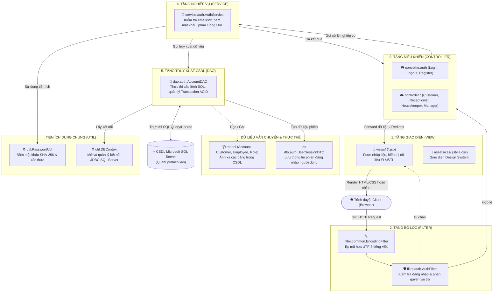

# TÀI LIỆU KIẾN TRÚC VÀ NHIỆM VỤ CÁC THƯ MỤC TRONG HỆ THỐNG
## DỰ ÁN HỆ THỐNG QUẢN LÝ KHÁCH SẠN (HOTEL MANAGER SYSTEM)

---

## 1. TỔNG QUAN MÔ HÌNH KIẾN TRÚC ĐA TẦNG (ENTERPRISE MULTI-TIER MVC)

Dự án **HotelManagerSystem** được tổ chức theo mô hình kiến trúc chuẩn doanh nghiệp nhiều tầng (**Layered Enterprise MVC Architecture**). 

Mục tiêu cốt lõi của việc chia tách thư mục:
* **Độc lập trách nhiệm (Separation of Concerns):** Mỗi tầng chỉ làm đúng một nhiệm vụ duy nhất, không làm thay việc của tầng khác.
* **Dễ bảo trì và mở rộng (Maintainability & Scalability):** Khi dự án phát triển thêm nhiều giai đoạn (Phòng, Đặt phòng, Hóa đơn, Thống kê), code không bị rối và dễ dàng tìm kiếm.
* **Module hóa theo phân hệ (Modular Structure):** Các thư mục con (`auth`, `customer`, `receptionist`, `housekeeper`, `manager`) được gom theo từng nhóm chức năng thực tế của trang web.

---

### Sơ Đồ Luồng Dữ Liệu Giữa Các Tầng (Data Flow)

---

## 2. BẢNG TỔNG HỢP VAI TRÒ CỦA TỪNG THƯ MỤC

| Thư Mục (Folder / Package) | Tên Tầng Kiến Trúc | Trách Nhiệm Cốt Lõi (Một Câu Tóm Tắt) | Ví Dụ Điển Hình Trong Dự Án |
| :--- | :--- | :--- | :--- |
| `src/main/java/.../controller/` | **Presentation Controller** | Cầu nối giữa Giao diện và Nghiệp vụ: Nhận request, lấy tham số, gọi Service và chọn View hiển thị. | `LoginServlet`, `RegisterServlet` |
| `src/main/java/.../service/` | **Business Logic Layer** | Não bộ của hệ thống: Chứa toàn bộ quy tắc nghiệp vụ, kiểm tra tính hợp lệ dữ liệu, băm mật khẩu. | `AuthService` |
| `src/main/java/.../dao/` | **Data Access Object** | Cầu nối trực tiếp với CSDL: Soạn câu lệnh SQL, kết nối JDBC, nạp dữ liệu và kiểm soát Transaction. | `AccountDAO` |
| `src/main/java/.../model/` | **Domain Entity Model** | Đại diện cho các bảng dữ liệu trong SQL Server dưới dạng các Object Java thuần (POJO). | `Account`, `Customer`, `Employee`, `Role` |
| `src/main/java/.../dto/` | **Data Transfer Object** | Đóng gói dữ liệu tùy biến truyền giữa các tầng mà không làm lộ cấu trúc CSDL thực tế. | `UserSessionDTO` |
| `src/main/java/.../filter/` | **HTTP Filter / Interceptor** | Người gác cổng: Đứng trước Controller để ép font UTF-8, chặn người chưa đăng nhập hoặc vào sai quyền. | `EncodingFilter`, `AuthFilter` |
| `src/main/java/.../util/` | **Common Utilities** | Cung cấp các công cụ tiện ích dùng chung (kết nối CSDL, thuật toán băm mật khẩu). | `DBContext`, `PasswordUtil` |
| `src/main/webapp/views/` | **View Layer (JSP)** | Giao diện hiển thị tới người dùng bằng HTML/CSS/JSTL, tuyệt đối không chứa logic Java phức tạp. | `login.jsp`, `home.jsp`, `error_403.jsp` |
| `src/main/webapp/assets/` | **Static Assets** | Chứa các tài nguyên tĩnh như CSS giao diện, hình ảnh, JavaScript bổ trợ. | `style.css` |

---

## 3. CHI TIẾT NHIỆM VỤ TỪNG THƯ MỤC VÀ CÁC THƯ MỤC CON

### 3.1. Thư mục `controller/` (Tầng Điều Khiển)
* **Vị trí:** `src/main/java/com/mycompany/hotelmanagersystem/controller/`
* **Nhiệm vụ:**
  1. Lắng nghe các HTTP Request (`GET`, `POST`) từ phía Client thông qua các URL Pattern (ví dụ: `/login`, `/register`).
  2. Trích xuất dữ liệu đầu vào người dùng nhập trên form (`request.getParameter(...)`).
  3. Gọi sang tầng `service/` tương ứng để xử lý nghiệp vụ, không tự tiện viết mã kiểm tra phức tạp tại Servlet.
  4. Đặt dữ liệu kết quả vào `request.setAttribute(...)` hoặc lưu phiên qua `session.setAttribute(...)`.
  5. Quyết định hướng điều hướng:
     - `request.getRequestDispatcher("...").forward(...)`: Giữ nguyên URL, nạp file JSP hiển thị.
     - `response.sendRedirect(...)`: Đổi sang một địa chỉ URL mới (tránh trùng lặp khi người dùng F5).

* **Các thư mục con (Sub-packages):**
  - **`controller/auth/`**:
    - [LoginServlet.java](file:///d:/Learn/College/Lap%20trinh%20web/HotelManagerSystem/src/main/java/com/mycompany/hotelmanagersystem/controller/auth/LoginServlet.java): Điều khiển hiển thị trang đăng nhập và tiếp nhận submit form login.
    - [LogoutServlet.java](file:///d:/Learn/College/Lap%20trinh%20web/HotelManagerSystem/src/main/java/com/mycompany/hotelmanagersystem/controller/auth/LogoutServlet.java): Xóa bỏ session và đưa người dùng về trạng thái đăng xuất.
    - [RegisterServlet.java](file:///d:/Learn/College/Lap%20trinh%20web/HotelManagerSystem/src/main/java/com/mycompany/hotelmanagersystem/controller/auth/RegisterServlet.java): Tiếp nhận thông tin đăng ký tài khoản khách hàng mới.
  - **`controller/customer/`**:
    - [CustomerPortalServlet.java](file:///d:/Learn/College/Lap%20trinh%20web/HotelManagerSystem/src/main/java/com/mycompany/hotelmanagersystem/controller/customer/CustomerPortalServlet.java): Tiếp nhận yêu cầu truy cập các trang thuộc phân hệ Khách hàng (`/customer/home`, `/customer/history`).
  - **`controller/receptionist/`**:
    - [ReceptionistPortalServlet.java](file:///d:/Learn/College/Lap%20trinh%20web/HotelManagerSystem/src/main/java/com/mycompany/hotelmanagersystem/controller/receptionist/ReceptionistPortalServlet.java): Điều phối giao diện Lễ tân (`/receptionist/room-map`, `/receptionist/checkin`).
  - **`controller/housekeeper/`**:
    - [HousekeeperPortalServlet.java](file:///d:/Learn/College/Lap%20trinh%20web/HotelManagerSystem/src/main/java/com/mycompany/hotelmanagersystem/controller/housekeeper/HousekeeperPortalServlet.java): Điều phối giao diện Buồng phòng (`/housekeeper/tasks`).
  - **`controller/manager/`**:
    - [ManagerPortalServlet.java](file:///d:/Learn/College/Lap%20trinh%20web/HotelManagerSystem/src/main/java/com/mycompany/hotelmanagersystem/controller/manager/ManagerPortalServlet.java): Điều phối bảng điều khiển Quản trị (`/manager/dashboard`).

---

### 3.2. Thư mục `service/` (Tầng Nghiệp Vụ - Business Logic Layer)
* **Vị trí:** `src/main/java/com/mycompany/hotelmanagersystem/service/`
* **Nhiệm vụ:**
  1. Là **trung tâm tính toán logic** của toàn bộ ứng dụng.
  2. Kiểm tra tính hợp lệ dữ liệu (Validation Rules): kiểm tra mật khẩu xác nhận có khớp không, email có đúng định dạng không, số điện thoại có từ 9 - 11 số không.
  3. Xử lý thuật toán bảo mật: gọi `PasswordUtil.hashPassword(...)` để băm mật khẩu người dùng trước khi chuyển xuống tầng CSDL.
  4. Xác định luồng điều hướng nghiệp vụ: ví dụ tài khoản mang vai trò `VT01` thì phải điều hướng về `/customer/home`, `VT04` thì về `/manager/dashboard`.
  5. Đảm bảo Controller hoàn toàn "mỏng" (Thin Controller), chỉ nhận việc và chuyển tiếp chứ không chứa logic nghiệp vụ.

* **Các thư mục con (Sub-packages):**
  - **`service/auth/`**:
    - [AuthService.java](file:///d:/Learn/College/Lap%20trinh%20web/HotelManagerSystem/src/main/java/com/mycompany/hotelmanagersystem/service/auth/AuthService.java): Đảm nhiệm toàn bộ logic kiểm tra tài khoản, xác thực đăng nhập, mã hóa mật khẩu và tạo mới khách hàng.

---

### 3.3. Thư mục `dao/` (Tầng Truy Cập CSDL - Data Access Object)
* **Vị trí:** `src/main/java/com/mycompany/hotelmanagersystem/dao/`
* **Nhiệm vụ:**
  1. Là tầng **DUY NHẤT** trong ứng dụng được phép viết các câu lệnh SQL (`SELECT`, `INSERT`, `UPDATE`, `DELETE`).
  2. Mở kết nối qua `DBContext.getConnection()` và sử dụng `PreparedStatement` để chống tấn công SQL Injection.
  3. Đọc dữ liệu từ `ResultSet` và đóng gói thành các đối tượng `Model` hoặc `DTO`.
  4. Đảm bảo tính toàn vẹn dữ liệu thông qua **Transaction ACID**: ví dụ khi đăng ký khách hàng mới, phải ghi thành công vào cả 2 bảng `TAIKHOAN` và `KHACHHANG`, nếu một bảng thất bại thì tự động `conn.rollback()`.

* **Các thư mục con (Sub-packages):**
  - **`dao/auth/`**:
    - [AccountDAO.java](file:///d:/Learn/College/Lap%20trinh%20web/HotelManagerSystem/src/main/java/com/mycompany/hotelmanagersystem/dao/auth/AccountDAO.java): Chuyên trách các thao tác CSDL liên quan đến tài khoản: `checkLogin`, `checkEmailExists`, `checkPhoneExists`, `registerCustomer`.

---

### 3.4. Thư mục `model/` (Tầng Thực Thể Cơ Sở Dữ Liệu - Entity Model)
* **Vị trí:** `src/main/java/com/mycompany/hotelmanagersystem/model/`
* **Nhiệm vụ:**
  1. Đại diện cho các bảng dữ liệu trong CSDL quan hệ dưới dạng các Java Class thuần túy (JavaBeans).
  2. Mỗi thuộc tính trong Class tương ứng với một cột trong bảng CSDL.
  3. Triển khai `Serializable` để dữ liệu có thể truyền tải qua mạng hoặc lưu vào session an toàn.
  4. Chỉ chứa thuộc tính (fields), constructor, getters/setters, tuyệt đối không chứa code truy vấn CSDL hay logic nghiệp vụ.

* **Các Class hiện có:**
  - [Account.java](file:///d:/Learn/College/Lap%20trinh%20web/HotelManagerSystem/src/main/java/com/mycompany/hotelmanagersystem/model/Account.java): Ánh xạ bảng `TAIKHOAN` (`MaTaiKhoan`, `TenDangNhap`, `MatKhau`, `MaVaiTro`, `TrangThai`).
  - [Customer.java](file:///d:/Learn/College/Lap%20trinh%20web/HotelManagerSystem/src/main/java/com/mycompany/hotelmanagersystem/model/Customer.java): Ánh xạ bảng `KHACHHANG` (`MaKH`, `MaTaiKhoan`, `HoTen`, `Email`, `SoDT`, `CCCD`).
  - [Employee.java](file:///d:/Learn/College/Lap%20trinh%20web/HotelManagerSystem/src/main/java/com/mycompany/hotelmanagersystem/model/Employee.java): Ánh xạ bảng `NHANVIEN` (`MaNV`, `MaTaiKhoan`, `HoTen`, `Email`, `SoDienThoai`, `NgayVaoLam`, `NgayNghiLam`, `TrangThaiLamViec`).
  - [Role.java](file:///d:/Learn/College/Lap%20trinh%20web/HotelManagerSystem/src/main/java/com/mycompany/hotelmanagersystem/model/Role.java): Ánh xạ bảng `VAITRO` (`MaVaiTro`, `TenVaiTro`).

---

### 3.5. Thư mục `dto/` (Tầng Vận Chuyển Dữ Liệu - Data Transfer Object)
* **Vị trí:** `src/main/java/com/mycompany/hotelmanagersystem/dto/`
* **Nhiệm vụ:**
  1. Tạo ra các đối tượng dữ liệu tổng hợp phục vụ một mục đích chuyên biệt (ví dụ: phiên làm việc Session, kết quả báo cáo thống kê, chi tiết hóa đơn).
  2. Tránh làm lộ các trường nhạy cảm trong `Model` (như cột `MatKhau` trong `Account` tuyệt đối không được đưa lên session).
  3. Gom thông tin từ nhiều bảng khác nhau mà không cần tạo bảng mới trong CSDL.

* **Các thư mục con (Sub-packages):**
  - **`dto/auth/`**:
    - [UserSessionDTO.java](file:///d:/Learn/College/Lap%20trinh%20web/HotelManagerSystem/src/main/java/com/mycompany/hotelmanagersystem/dto/auth/UserSessionDTO.java): Gom thông tin người dùng đang đăng nhập (`maTaiKhoan`, `email`, `soDT`, `maVaiTro`, `tenVaiTro`, `hoTen`, `maDinhDanh`, `trangThai`) và cung cấp các hàm tiện ích kiểm tra vai trò nhanh (`isCustomer()`, `isReceptionist()`, `isHousekeeper()`, `isManager()`).

---

### 3.6. Thư mục `filter/` (Tầng Bộ Lọc Kiểm Soát HTTP Request)
* **Vị trí:** `src/main/java/com/mycompany/hotelmanagersystem/filter/`
* **Nhiệm vụ:**
  1. Đóng vai trò là **"người gác cổng"** (Gatekeeper) đứng phía trước toàn bộ Servlet/JSP.
  2. Bắt giữ (intercept) request gửi từ client trước khi nó kịp chạm tới Controller.
  3. Xử lý các tác vụ xuyên suốt (Cross-cutting Concerns) như ép mã hóa ký tự UTF-8, kiểm tra đăng nhập, xác thực quyền hạn.

* **Các thư mục con (Sub-packages):**
  - **`filter/common/`**:
    - [EncodingFilter.java](file:///d:/Learn/College/Lap%20trinh%20web/HotelManagerSystem/src/main/java/com/mycompany/hotelmanagersystem/filter/common/EncodingFilter.java): Lắng nghe `/*`, tự động ép `UTF-8` cho toàn bộ Request & Response, loại bỏ triệt để lỗi hiển thị font dấu tiếng Việt `???`.
  - **`filter/auth/`**:
    - [AuthFilter.java](file:///d:/Learn/College/Lap%20trinh%20web/HotelManagerSystem/src/main/java/com/mycompany/hotelmanagersystem/filter/auth/AuthFilter.java): Lắng nghe `/customer/*`, `/receptionist/*`, `/housekeeper/*`, `/manager/*`. Kiểm tra nếu chưa đăng nhập thì đẩy về `/login?redirect=...`; nếu đăng nhập sai quyền (ví dụ khách hàng gõ link `/manager/dashboard`) thì lập tức chặn lại và trả về trang lỗi `error_403.jsp`.

---

### 3.7. Thư mục `util/` (Tầng Tiện Ích Dùng Chung - Utilities)
* **Vị trí:** `src/main/java/com/mycompany/hotelmanagersystem/util/`
* **Nhiệm vụ:**
  1. Chứa các hàm tĩnh (Static methods) hỗ trợ kỹ thuật cho toàn hệ thống.
  2. Không phụ thuộc vào ngữ cảnh Servlet (`HttpServletRequest/Response`) và không mang tính nghiệp vụ riêng lẻ của bất kỳ trang nào.

* **Các Class hiện có:**
  - [DBContext.java](file:///d:/Learn/College/Lap%20trinh%20web/HotelManagerSystem/src/main/java/com/mycompany/hotelmanagersystem/util/DBContext.java): Cung cấp hàm `getConnection()` kết nối Microsoft SQL Server qua JDBC Driver, cùng các hàm đóng kết nối an toàn.
  - [PasswordUtil.java](file:///d:/Learn/College/Lap%20trinh%20web/HotelManagerSystem/src/main/java/com/mycompany/hotelmanagersystem/util/PasswordUtil.java): Cung cấp thuật toán băm mật khẩu `hashPassword` bằng SHA-256 một chiều 64 ký tự và hàm `verifyPassword` so khớp mật khẩu kèm cơ chế tương thích ngược (fallback).

---

### 3.8. Thư mục `views/` và `assets/` (Tầng Giao Diện - Presentation Layer)
* **Vị trí:** `src/main/webapp/`
* **Nhiệm vụ:**
  1. Trình diễn giao diện người dùng trên trình duyệt web.
  2. **`views/` (JSP):** Nhận dữ liệu do Controller chuyển tiếp sang, sử dụng thư viện thẻ JSTL (`<c:forEach>`, `<c:if>`, `<c:choose>`) và biểu thức Expression Language (`${...}`) để hiển thị dữ liệu sinh động. Tuyệt đối không dùng Scriptlet Java (`<% ... %>`) trong View.
  3. **`assets/css/`:** Định nghĩa toàn bộ hệ thống màu sắc, kiểu chữ, hiệu ứng hover, layout theo chuẩn Design System sang trọng.

* **Cấu trúc phân vùng trong `views/`:**
  - **`views/common/`**: Các trang và thành phần dùng chung:
    - `navbar.jsp`: Thanh điều hướng thông minh đổi menu theo vai trò người dùng đang đăng nhập.
    - `footer.jsp`: Chân trang chuẩn.
    - `login.jsp`: Giao diện form đăng nhập.
    - `register.jsp`: Giao diện form đăng ký tài khoản khách hàng mới.
    - `error_403.jsp`: Trang thông báo lỗi từ chối truy cập (403 Forbidden).
  - **`views/customer/`**: Giao diện cổng khách hàng (`home.jsp`).
  - **`views/receptionist/`**: Giao diện cổng lễ tân (`room_map.jsp`).
  - **`views/housekeeper/`**: Giao diện cổng buồng phòng (`tasks.jsp`).
  - **`views/manager/`**: Giao diện cổng quản trị (`dashboard.jsp`).

---

## 4. BẢNG NGUYÊN TẮC RANH GIỚI TRÁCH NHIỆM (CODE BOUNDARY RULES)

Để giữ cho kiến trúc hệ thống luôn sạch sẽ và chuyên nghiệp, mọi thành viên phát triển phải tuân thủ nghiêm ngặt bảng quy tắc sau:

| Tầng (Layer) | ĐƯỢC PHÉP LÀM (Allowed) | TUYỆT ĐỐI CẤM (Forbidden) |
| :--- | :--- | :--- |
| **`View (JSP)`** | * Hiển thị dữ liệu qua `${...}` và thẻ `<c:...>`. * Gửi form hoặc đường link đến URL Servlet. | ❌ Cấm viết code Java scriptlet (`<% ... %>`). ❌ Cấm gọi trực tiếp `DAO` hay `DBContext`. |
| **`Controller`** | * Nhận `request`, đọc `getParameter(...)`. * Gọi tầng `Service` để lấy kết quả. * Điều hướng (`forward` hoặc `sendRedirect`). | ❌ Cấm viết câu lệnh SQL. ❌ Cấm viết logic tính toán nghiệp vụ phức tạp (chuyển việc này cho Service). |
| **`Service`** | * Kiểm tra dữ liệu (Validation). * Xử lý thuật toán, mã hóa mật khẩu. * Quyết định gọi DAO nào để nạp dữ liệu. | ❌ Cấm truy cập trực tiếp `HttpServletRequest` / `HttpServletResponse`. ❌ Cấm viết câu lệnh SQL (chuyển việc này cho DAO). |
| **`DAO`** | * Mở kết nối JDBC qua `DBContext`. * Thực thi các lệnh T-SQL an toàn. * Quản lý Transaction ACID (Commit/Rollback). | ❌ Cấm thực hiện chuyển trang hay chứa thông tin HTTP. ❌ Cấm chứa logic hiển thị giao diện. |
| **`Filter`** | * Chặn request trước khi đến Controller. * Kiểm tra session và vai trò. * Ép mã hóa ký tự UTF-8. | ❌ Cấm thực hiện các xử lý nghiệp vụ nặng như đăng ký hay thanh toán. |

---

## 5. VÍ DỤ MINH HỌA: VÒNG ĐỜI CỦA MỘT CHỨC NĂNG (ĐĂNG NHẬP)

Để thấy rõ sự phối hợp nhịp nhàng giữa các thư mục, hãy xem chu trình khi người dùng đăng nhập:

1. **Người dùng** mở trình duyệt, gõ email `an.nguyen@gmail.com`, mật khẩu `1234` và bấm nút **"Đăng Nhập"** trên giao diện [views/common/login.jsp](file:///d:/Learn/College/Lap%20trinh%20web/HotelManagerSystem/src/main/webapp/views/common/login.jsp).
2. **Yêu cầu HTTP POST `/login`** được gửi tới máy chủ:
   - [EncodingFilter.java](file:///d:/Learn/College/Lap%20trinh%20web/HotelManagerSystem/src/main/java/com/mycompany/hotelmanagersystem/filter/common/EncodingFilter.java) (trong `filter.common`) lập tức đón đầu và ép toàn bộ dữ liệu sang mã hóa chuẩn `UTF-8`.
3. Yêu cầu đi tiếp vào [LoginServlet.java](file:///d:/Learn/College/Lap%20trinh%20web/HotelManagerSystem/src/main/java/com/mycompany/hotelmanagersystem/controller/auth/LoginServlet.java) (trong `controller.auth`):
   - Servlet lấy 2 tham số: `loginIdentifier = "an.nguyen@gmail.com"` và `password = "1234"`.
   - Servlet gọi sang [AuthService.java](file:///d:/Learn/College/Lap%20trinh%20web/HotelManagerSystem/src/main/java/com/mycompany/hotelmanagersystem/service/auth/AuthService.java) (trong `service.auth`) phương thức: `authService.login(loginIdentifier, password)`.
4. **`AuthService`** thực hiện kiểm tra:
   - Kiểm tra hai ô có bị bỏ trống hay không.
   - Gọi sang [AccountDAO.java](file:///d:/Learn/College/Lap%20trinh%20web/HotelManagerSystem/src/main/java/com/mycompany/hotelmanagersystem/dao/auth/AccountDAO.java) (trong `dao.auth`) phương thức: `accountDAO.checkLogin(...)`.
5. **`AccountDAO`** thực hiện truy vấn CSDL:
   - Gọi [DBContext.getConnection()](file:///d:/Learn/College/Lap%20trinh%20web/HotelManagerSystem/src/main/java/com/mycompany/hotelmanagersystem/util/DBContext.java) (trong `util`) để lấy kết nối tới SQL Server.
   - Chạy lệnh `SELECT tk.MatKhau, tk.MaVaiTro, ... FROM TAIKHOAN tk ... WHERE kh.Email = ?`.
   - Khi có kết quả từ SQL Server, gọi [PasswordUtil.verifyPassword(...)](file:///d:/Learn/College/Lap%20trinh%20web/HotelManagerSystem/src/main/java/com/mycompany/hotelmanagersystem/util/PasswordUtil.java) (trong `util`) để kiểm tra mật khẩu.
   - Khi mật khẩu chính xác, DAO đóng gói thông tin người dùng vào đối tượng [UserSessionDTO.java](file:///d:/Learn/College/Lap%20trinh%20web/HotelManagerSystem/src/main/java/com/mycompany/hotelmanagersystem/dto/auth/UserSessionDTO.java) (trong `dto.auth`) và trả về cho Service.
6. **`AuthService`** kiểm tra tài khoản có bị khóa (`Locked`) hay không. Nếu hợp lệ, trả `UserSessionDTO` về cho `LoginServlet`.
7. **`LoginServlet`**:
   - Lưu thông tin người dùng vào Session: `session.setAttribute("CURRENT_USER", user)`.
   - Hỏi Service địa chỉ cần chuyển hướng theo vai trò (ví dụ: Khách hàng `VT01` $\to$ `/customer/home`).
   - Gửi lệnh `response.sendRedirect(contextPath + "/customer/home")` đưa người dùng vào cổng riêng của họ.
8. Trình duyệt tiếp tục gửi yêu cầu truy cập `/customer/home`:
   - [AuthFilter.java](file:///d:/Learn/College/Lap%20trinh%20web/HotelManagerSystem/src/main/java/com/mycompany/hotelmanagersystem/filter/auth/AuthFilter.java) (trong `filter.auth`) chặn lại kiểm tra Session: xác nhận người dùng đã đăng nhập và đúng quyền `VT01`, cho phép đi qua tiếp.
   - [CustomerPortalServlet.java](file:///d:/Learn/College/Lap%20trinh%20web/HotelManagerSystem/src/main/java/com/mycompany/hotelmanagersystem/controller/customer/CustomerPortalServlet.java) chuyển tiếp sang [views/customer/home.jsp](file:///d:/Learn/College/Lap%20trinh%20web/HotelManagerSystem/src/main/webapp/views/customer/home.jsp).
   - Trang JSP nạp [views/common/navbar.jsp](file:///d:/Learn/College/Lap%20trinh%20web/HotelManagerSystem/src/main/webapp/views/common/navbar.jsp), hiển thị lời chào: *"👤 Nguyễn Văn An (Customer)"* cùng nút Đăng xuất.

---
*Tài liệu này được lưu trữ tại `TaiLieu_YTuong_Va_BaoCao/KienTruc_Va_NhiemVu_Cac_ThuMuc_Code.md` làm cẩm nang chuẩn cho toàn bộ quá trình phát triển mã nguồn của dự án HotelManagerSystem.*
