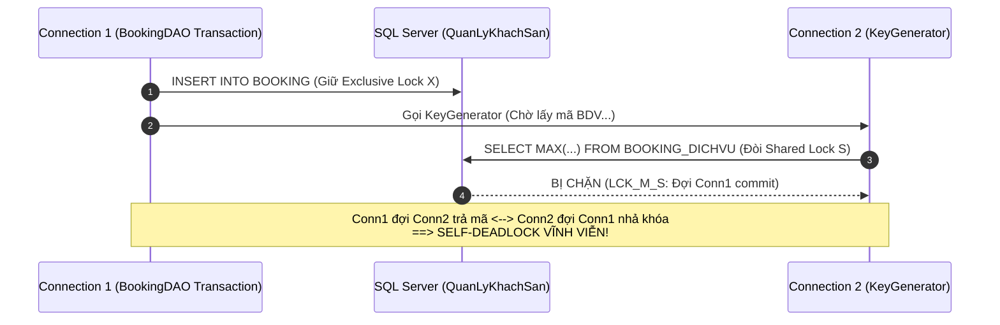

# KẾ HOẠCH CHI TIẾT THỰC THI HỆ THỐNG TRIGGER & VIEW
**Dự án:** Hệ Thống Quản Lý Khách Sạn (Hotel Management System) — Nhóm 10  
**Môn học:** Hệ Quản Trị Cơ Sở Dữ Liệu (DBMS330284) — Trường ĐH Sư Phạm Kỹ Thuật TP.HCM (HCMUTE)  
**Tiêu chuẩn định dạng:** Tiếng Việt UTF-8 chuẩn, giao diện văn bản rõ ràng, dễ đọc

---

## MỤC LỤC

1. NGUYÊN TẮC THIẾT KẾ & QUY ƯỚC NGHIỆP VỤ
2. CHI TIẾT 7 TRIGGER CỐT LÕI
   - Trigger 1: Chống đặt trùng phòng và chặn phòng bẩn/đang dọn/hư hại (trg_Check_XungDotDatPhong)
   - Trigger 2: Chặn hủy phòng sau khi đã Check-in (trg_ChanHuyBookingSaiChinhSach)
   - Trigger 3: Tự động đổi trạng thái phòng khi Check-in (trg_DongBoTrangThaiPhongCheckIn)
   - Trigger 4: Tự động đổi phòng sang Dirty và tạo việc dọn dẹp khi Check-out (trg_TuDongDonPhongSauCheckOut)
   - Trigger 5: Tự động sinh Hóa đơn tổng duy nhất khi tạo Booking (trg_TuDongTaoHoaDonKhiDatPhong)
   - Trigger 6: Tự động tính tiền và cập nhật trạng thái thanh toán hóa đơn (trg_CapNhatTrangThaiHoaDon)
   - Trigger 7: Tự động khóa tài khoản khi nhân viên nghỉ việc (trg_KhoaTaiKhoanKhiNghiViec)
3. CHI TIẾT 7 VIEW BÁO CÁO & QUẢN TRỊ
   - View 1: Danh sách phòng trống khả dụng (v_DanhSachPhongKhaDung)
   - View 2: Danh sách phòng cần dọn dẹp hàng ngày (v_DanhSachPhongCanDonDep)
   - View 3: Danh sách phòng hư hại cần bảo trì (v_DanhSachPhongHuHaiCanBaoTri)
   - View 4: Theo dõi công nợ và quyết toán hóa đơn (v_CongNoHoaDonKhachHang)
   - View 5: Báo cáo tài chính doanh thu tổng hợp theo tháng (v_BaoCaoDoanhThuTheoThang)
   - View 6: Thống kê dịch vụ gia tăng được ưa chuộng (v_ThongKeDichVuBanChay)
   - View 7: Báo cáo tỷ lệ công suất phòng (v_TyLeLapDayPhong)
4. BẢNG ĐỐI CHIẾU TRÁCH NHIỆM VẬN HÀNH

---

## 1. NGUYÊN TẮC THIẾT KẾ & QUY ƯỚC NGHIỆP VỤ

1. **Khách hàng đại diện (Chủ đơn):** Bảng `KHACHHANG` liên kết với `BOOKING` đại diện cho chủ đơn đặt phòng (họ tên, CCCD, SĐT liên hệ). Hệ thống quản lý số lượng phòng được thuê, không đếm số lượng người thực tế đi cùng. Do đó, các ràng buộc và view chỉ tập trung vào quản lý theo **Mã phòng** và **Người đại diện**.
2. **Phương án A (1 Booking — 1 Hóa đơn tổng duy nhất):** Mỗi khi phát sinh đơn đặt phòng, một hóa đơn duy nhất tương ứng được tạo ra. Khách hàng có thể trả tiền nhiều đợt (đặt cọc trước, trả nốt lúc trả phòng) qua bảng `THANHTOAN`.
3. **Phân định rõ ràng vai trò Trigger và View:**
   * **Trigger:** Đóng vai trò là "người gác cổng" tự động, bảo đảm toàn vẹn dữ liệu liên bảng mà lệnh `CHECK` thông thường không làm được, đồng thời tự động kích hoạt trạng thái giữa các bộ phận (Lễ tân -> Buồng phòng -> Thu ngân).
   * **View:** Đóng vai trò là "màn hình hiển thị", gom dữ liệu từ nhiều bảng giúp lập trình viên Java Servlet chỉ cần gọi câu lệnh `SELECT` đơn giản, không phải viết các câu lệnh `JOIN` phức tạp.

---

## 2. CHI TIẾT 7 TRIGGER CỐT LÕI

---

### Trigger 1: Chống đặt trùng phòng và chặn đặt phòng bẩn / đang dọn / hư hại (`trg_Check_XungDotDatPhong`)

* **Bảng tác động:** `BOOKING_PHONG` (Sự kiện: `AFTER INSERT, UPDATE`).
* **Ý tưởng & Mục đích nghiệp vụ:**
  * Đây là nghiệp vụ quan trọng số 1 bảo vệ chất lượng dịch vụ khách sạn:
    1. **Chống Overbooking / Double-booking:** Ngăn chặn việc 2 khách hàng cùng đặt 1 phòng trong các khoảng thời gian bị giao nhau.
    2. **Đảm bảo chất lượng buồng phòng:** Nghiêm cấm đặt phòng đang trong quá trình dọn dẹp (`Dirty`, `Cleaning`) hoặc đang bị hư hỏng chờ bảo trì (`Damaged`). Chỉ phòng sạch sẽ, đạt chuẩn sẵn sàng (`Available`) mới được phép nhận đặt phòng.
* **Phương thức thực hiện:**
  * Khi có bản ghi phòng mới được thêm hoặc sửa đổi trong `BOOKING_PHONG`, Trigger đọc dữ liệu từ bảng ảo `inserted`:
    1. **Kiểm tra trạng thái vật lý phòng:** `JOIN` với bảng `PHONG`, nếu `p.TrangThai IN ('Dirty', 'Cleaning', 'Damaged')` thì hủy giao dịch ngay.
    2. **Kiểm tra xung đột thời gian:** `JOIN` với các bản ghi khác của chính phòng đó trong `BOOKING_PHONG` (thuộc các Booking có hiệu lực: `DaXacNhan` hoặc `DaCheckIn`). Nếu khoảng ngày mới giao thoa với khoảng ngày cũ: `NOT (NgayTraMoi <= NgayNhanCu OR NgayNhanMoi >= NgayTraCu)` thì hủy giao dịch.
* **Đoạn mã đề xuất:**

```sql
CREATE OR ALTER TRIGGER trg_Check_XungDotDatPhong
ON BOOKING_PHONG
AFTER INSERT, UPDATE
AS
BEGIN
    SET NOCOUNT ON;

    -- Chỉ kiểm tra khi thêm mới dòng đặt phòng hoặc khi thay đổi phòng / ngày lưu trú dự kiến
    IF NOT EXISTS (SELECT 1 FROM deleted) 
       OR UPDATE(MaPhong) 
       OR UPDATE(NgayNhanDuKien) 
       OR UPDATE(NgayTraDuKien)
    BEGIN
        -- 1. Chặn đặt các phòng đang bẩn (Dirty), đang dọn (Cleaning) hoặc đang hư hại (Damaged)
        IF EXISTS (
            SELECT 1
            FROM inserted i
            INNER JOIN PHONG p ON i.MaPhong = p.MaPhong
            WHERE p.TrangThai IN ('Dirty', 'Cleaning', 'Damaged')
        )
        BEGIN
            RAISERROR(N'Lỗi nghiệp vụ: Phòng đang trong quá trình dọn dẹp (Dirty/Cleaning) hoặc bị hư hỏng (Damaged), không thể nhận đặt phòng!', 16, 1);
            ROLLBACK TRANSACTION;
            RETURN;
        END

        -- 2. Kiểm tra giao thoa thời gian giữa booking mới và booking cũ của cùng 1 phòng
        IF EXISTS (
            SELECT 1
            FROM inserted i
            INNER JOIN BOOKING b_new ON i.MaBooking = b_new.MaBooking
            INNER JOIN BOOKING_PHONG bp_old ON i.MaPhong = bp_old.MaPhong AND i.MaBooking <> bp_old.MaBooking
            INNER JOIN BOOKING b_old ON bp_old.MaBooking = b_old.MaBooking
            WHERE b_new.TrangThai IN ('DaXacNhan', 'DaCheckIn')
              AND b_old.TrangThai IN ('DaXacNhan', 'DaCheckIn')
              AND NOT (i.NgayTraDuKien <= bp_old.NgayNhanDuKien OR i.NgayNhanDuKien >= bp_old.NgayTraDuKien)
        )
        BEGIN
            RAISERROR(N'Lỗi nghiệp vụ: Phòng này đã có khách đặt trong khoảng thời gian yêu cầu!', 16, 1);
            ROLLBACK TRANSACTION;
            RETURN;
        END
    END
END;
GO
```

---

### Trigger 2: Chặn hủy phòng (`trg_ChanHuyBookingSaiChinhSach`)

* **Bảng tác động:** `BOOKING` (Sự kiện: `AFTER UPDATE`).
* **Ý tưởng & Mục đích nghiệp vụ:**
  * Ngăn chặn thao tác nhầm lẫn hoặc tiêu cực: Khách hàng hoặc nhân viên không được phép đổi trạng thái Booking sang `DaHuy` nếu khách đã làm thủ tục nhận phòng thực tế (`DaCheckIn` hoặc đã có `NgayCheckInThucTe`). Đã vào ở thì chỉ có thể Check-out và thanh toán tiền.
* **Phương thức thực hiện:**
  * Dùng `IF UPDATE(TrangThai)` để chỉ kích hoạt khi có thay đổi trạng thái đơn.
  * So sánh trạng thái mới trong bảng `inserted` (`TrangThai = 'DaHuy'`) với trạng thái cũ trong bảng `deleted` (`TrangThai = 'DaCheckIn'`) hoặc kiểm tra xem phòng trong `BOOKING_PHONG` đã có `NgayCheckInThucTe` chưa.
  * Nếu vi phạm, tiến hành `ROLLBACK TRANSACTION`.
* **Đoạn mã đề xuất:**

```sql
CREATE OR ALTER TRIGGER trg_ChanHuyBookingSaiChinhSach
ON BOOKING
AFTER UPDATE
AS
BEGIN
    SET NOCOUNT ON;

    IF UPDATE(TrangThai)
    BEGIN
        IF EXISTS (
            SELECT 1
            FROM inserted i
            INNER JOIN deleted d ON i.MaBooking = d.MaBooking
            INNER JOIN BOOKING_PHONG bp ON i.MaBooking = bp.MaBooking
            WHERE i.TrangThai = 'DaHuy'
              AND (d.TrangThai = 'DaCheckIn' OR bp.NgayCheckInThucTe IS NOT NULL)
        )
        BEGIN
            RAISERROR(N'Lỗi nghiệp vụ: Không thể hủy đơn đặt phòng khi khách đã Check-in lưu trú!', 16, 1);
            ROLLBACK TRANSACTION;
            RETURN;
        END
    END
END;
GO
```

---

### Trigger 3: Tự động đổi trạng thái phòng khi Check-in (`trg_DongBoTrangThaiPhongCheckIn`)

* **Bảng tác động:** `BOOKING_PHONG` (Sự kiện: `AFTER UPDATE`).
* **Ý tưởng & Mục đích nghiệp vụ:**
  * Đồng bộ tự động giữa phiếu đặt phòng và căn phòng vật lý: Khi lễ tân xác nhận khách đến nhận phòng (ghi nhận giờ vào `NgayCheckInThucTe`), Trigger tự động đổi trạng thái phòng trong bảng `PHONG` sang `'Occupied'` (màu đỏ) để toàn bộ nhân viên biết phòng đang có khách ở.
* **Phương thức thực hiện:**
  * Kiểm tra `IF UPDATE(NgayCheckInThucTe)`.
  * Lấy `MaPhong` từ bảng `inserted` và chạy lệnh `UPDATE PHONG SET TrangThai = 'Occupied'` cho các phòng có `NgayCheckInThucTe IS NOT NULL` và chưa check-out.
* **Đoạn mã đề xuất:**

```sql
CREATE OR ALTER TRIGGER trg_DongBoTrangThaiPhongCheckIn
ON BOOKING_PHONG
AFTER UPDATE
AS
BEGIN
    SET NOCOUNT ON;

    IF UPDATE(NgayCheckInThucTe)
    BEGIN
        UPDATE p
        SET p.TrangThai = 'Occupied'
        FROM PHONG p
        INNER JOIN inserted i ON p.MaPhong = i.MaPhong
        INNER JOIN deleted d ON i.MaBooking = d.MaBooking AND i.MaPhong = d.MaPhong
        WHERE d.NgayCheckInThucTe IS NULL AND i.NgayCheckInThucTe IS NOT NULL AND i.NgayCheckOutThucTe IS NULL;
    END
END;
GO
```

---

### Trigger 4: Tự động đổi phòng sang Dirty và tạo nhiệm vụ dọn dẹp (`trg_TuDongDonPhongSauCheckOut`)

* **Bảng tác động:** `BOOKING_PHONG` (Sự kiện: `AFTER UPDATE`).
* **Ý tưởng & Mục đích nghiệp vụ:**
  * Tự động hóa quy trình liên bộ phận: Khi khách trả phòng (lễ tân cập nhật giờ ra vào `NgayCheckOutThucTe`), phòng lập tức thành phòng bẩn (`Dirty`). Hệ thống tự động tạo một công việc mới trong bảng `NHIEMVUDOPHONG` để nhân viên buồng phòng biết mà đến nhận việc dọn dẹp. Lễ tân không cần gọi điện hay thao tác thêm nút bấm nào khác.
* **Phương thức thực hiện:**
  * Kiểm tra `IF UPDATE(NgayCheckOutThucTe)`.
  * Cập nhật `TrangThai = 'Dirty'` cho phòng tương ứng trong bảng `PHONG`.
  * Tự sinh mã nhiệm vụ dọn phòng ngẫu nhiên theo ngày giờ và chèn một dòng vào `NHIEMVUDOPHONG` với trạng thái `'ChoXuLy'`.
* **Đoạn mã đề xuất:**

```sql
CREATE OR ALTER TRIGGER trg_TuDongDonPhongSauCheckOut
ON BOOKING_PHONG
AFTER UPDATE
AS
BEGIN
    SET NOCOUNT ON;

    IF UPDATE(NgayCheckOutThucTe)
    BEGIN
        -- 1. Đổi trạng thái phòng sang 'Dirty' khi chuyển từ chưa check-out sang đã check-out
        UPDATE p
        SET p.TrangThai = 'Dirty'
        FROM PHONG p
        INNER JOIN inserted i ON p.MaPhong = i.MaPhong
        INNER JOIN deleted d ON i.MaBooking = d.MaBooking AND i.MaPhong = d.MaPhong
        WHERE d.NgayCheckOutThucTe IS NULL AND i.NgayCheckOutThucTe IS NOT NULL;

        -- 2. Tự động tạo nhiệm vụ dọn phòng nếu chưa có nhiệm vụ nào đang chờ xử lý
        INSERT INTO NHIEMVUDOPHONG (MaNhiemVu, MaPhong, MaNV, ThoiGianNhan, TrangThai)
        SELECT 
            'NV' + SUBSTRING(REPLACE(CONVERT(VARCHAR(36), NEWID()), '-', ''), 1, 8),
            i.MaPhong,
            NULL,
            GETDATE(),
            'ChoXuLy'
        FROM inserted i
        INNER JOIN deleted d ON i.MaBooking = d.MaBooking AND i.MaPhong = d.MaPhong
        WHERE d.NgayCheckOutThucTe IS NULL AND i.NgayCheckOutThucTe IS NOT NULL
          AND NOT EXISTS (
              SELECT 1 FROM NHIEMVUDOPHONG 
              WHERE MaPhong = i.MaPhong AND TrangThai IN ('ChoXuLy', 'DangDon')
          );
    END
END;
GO
```

---

### Trigger 5: Tự động sinh Hóa đơn tổng duy nhất (`trg_TuDongTaoHoaDonKhiDatPhong`)

* **Bảng tác động:** `BOOKING` (Sự kiện: `AFTER INSERT`).
* **Ý tưởng & Mục đích nghiệp vụ:**
  * Thực thi nghiêm ngặt **Phương án A (1 Booking — 1 Hóa đơn)**: Mỗi khi có một đơn đặt phòng phát sinh, hệ thống tự động sinh 1 hóa đơn tổng kết tương ứng ở trạng thái `ChuaThanhToan`. Tránh trường hợp quên tạo hóa đơn khiến khách hàng không thể nạp tiền đặt cọc.
* **Phương thức thực hiện:**
  * Sau khi có lệnh `INSERT` vào bảng `BOOKING`, Trigger lấy `MaBooking`, tạo mã hóa đơn tương ứng (dạng `HD_...`) và thêm vào bảng `HOADON`.
* **Đoạn mã đề xuất:**

```sql
CREATE OR ALTER TRIGGER trg_TuDongTaoHoaDonKhiDatPhong
ON BOOKING
AFTER INSERT
AS
BEGIN
    SET NOCOUNT ON;

    INSERT INTO HOADON (MaHoaDon, MaBooking, NgayLap, TongTienCuoiCung, MaNV, TrangThai)
    SELECT 
        'HD_' + SUBSTRING(i.MaBooking, 4, 7),
        i.MaBooking,
        GETDATE(),
        NULL,
        ISNULL(i.MaNV, 'NV001'),
        'ChuaThanhToan'
    FROM inserted i
    WHERE NOT EXISTS (SELECT 1 FROM HOADON WHERE MaBooking = i.MaBooking);
END;
GO
```

---

### Trigger 6: Tự động cập nhật trạng thái thanh toán (`trg_CapNhatTrangThaiHoaDon`)

* **Bảng tác động:** `THANHTOAN` (Sự kiện: `AFTER INSERT, UPDATE, DELETE`).
* **Ý tưởng & Mục đích nghiệp vụ:**
  * Quản lý công nợ khách quan và minh bạch: Khách có thể thanh toán nhiều đợt. Nhân viên không được phép tự sửa tay cột trạng thái của hóa đơn thành "Đã thanh toán đủ". Trigger sẽ tự động tính tổng các phiếu thu trong `THANHTOAN` và so khớp với số tiền phải trả để quyết định trạng thái hóa đơn.
* **Phương thức thực hiện:**
  * Gom danh sách các `MaHoaDon` bị tác động.
  * Tính Tổng đã thu = SUM(SoTien) trong THANHTOAN cho từng hóa đơn.
  * So sánh với TongTienCuoiCung (hoặc ChiPhiDuKien nếu chưa checkout):
    * Đã thu >= Phải trả -> Đổi sang 'DaThanhToanDu'.
    * Đã thu > 0 nhưng chưa đủ -> Đổi sang 'MotPhan'.
    * Chưa thu đồng nào -> Đổi sang 'ChuaThanhToan'.
* **Đoạn mã đề xuất:**

```sql
CREATE OR ALTER TRIGGER trg_CapNhatTrangThaiHoaDon
ON THANHTOAN
AFTER INSERT, UPDATE, DELETE
AS
BEGIN
    SET NOCOUNT ON;

    DECLARE @HoaDonList TABLE (MaHoaDon VARCHAR(10));
    INSERT INTO @HoaDonList SELECT DISTINCT MaHoaDon FROM inserted
    UNION SELECT DISTINCT MaHoaDon FROM deleted;

    UPDATE hd
    SET hd.TrangThai = 
        CASE 
            WHEN ISNULL(DaThu.TongThu, 0) >= ISNULL(hd.TongTienCuoiCung, b.ChiPhiDuKien) AND ISNULL(DaThu.TongThu, 0) > 0
                THEN 'DaThanhToanDu'
            WHEN ISNULL(DaThu.TongThu, 0) > 0
                THEN 'MotPhan'
            ELSE 'ChuaThanhToan'
        END
    FROM HOADON hd
    INNER JOIN BOOKING b ON hd.MaBooking = b.MaBooking
    INNER JOIN @HoaDonList hl ON hd.MaHoaDon = hl.MaHoaDon
    OUTER APPLY (
        SELECT SUM(SoTien) AS TongThu
        FROM THANHTOAN
        WHERE MaHoaDon = hd.MaHoaDon
    ) DaThu;
END;
GO
```

---

### Trigger 7: Tự động khóa tài khoản nhân viên nghỉ việc (`trg_KhoaTaiKhoanKhiNghiViec`)

* **Bảng tác động:** `NHANVIEN` (Sự kiện: `AFTER UPDATE`).
* **Ý tưởng & Mục đích nghiệp vụ:**
  * An toàn thông tin doanh nghiệp: Khi một nhân viên nghỉ việc (quản lý chuyển sang `NghiViec` hoặc nhập ngày nghỉ việc), tài khoản đăng nhập tương ứng trong bảng `TAIKHOAN` phải bị khóa ngay lập tức (`Locked`) để ngăn chặn việc đăng nhập trái phép vào phần mềm.
* **Phương thức thực hiện:**
  * Kiểm tra `IF UPDATE(TrangThaiLamViec) OR UPDATE(NgayNghiLam)`.
  * Tìm tài khoản liên kết qua `MaTaiKhoan` và chạy lệnh cập nhật `TAIKHOAN.TrangThai = 'Locked'`.
* **Đoạn mã đề xuất:**

```sql
CREATE OR ALTER TRIGGER trg_KhoaTaiKhoanKhiNghiViec
ON NHANVIEN
AFTER UPDATE
AS
BEGIN
    SET NOCOUNT ON;

    IF UPDATE(TrangThaiLamViec) OR UPDATE(NgayNghiLam)
    BEGIN
        UPDATE tk
        SET tk.TrangThai = 'Locked'
        FROM TAIKHOAN tk
        INNER JOIN inserted i ON tk.MaTaiKhoan = i.MaTaiKhoan
        WHERE i.TrangThaiLamViec = 'NghiViec' 
           OR (i.NgayNghiLam IS NOT NULL AND i.NgayNghiLam <= CAST(GETDATE() AS DATE));
    END
END;
GO
```

---

---

## 3. CHI TIẾT 7 VIEW BÁO CÁO & QUẢN TRỊ

---

### View 1: Danh sách phòng trống khả dụng (`v_DanhSachPhongKhaDung`)

* **Đối tượng phục vụ:** Khách hàng đặt phòng Online & Lễ tân nhận khách vãng lai tại quầy.
* **Mục đích:** Hiển thị tức thời các phòng đang sẵn sàng đón khách (`Available`), kèm thông tin hạng phòng, diện tích, giá niêm yết và sức chứa để phục vụ tìm kiếm.
* **Phương thức thực hiện:** Kết nối `INNER JOIN` giữa `PHONG` và `LOAIPHONG`, lọc điều kiện `p.TrangThai = 'Available'` và `lp.TrangThai = 'ApDung'`.
* **Đoạn mã đề xuất:**

```sql
CREATE OR ALTER VIEW v_DanhSachPhongKhaDung
AS
SELECT 
    p.MaPhong,
    p.SoPhong,
    lp.MaLoaiPhong,
    lp.TenLoaiPhong,
    lp.DienTich,
    lp.LoaiGiuong,
    lp.SoNguoiToiDa,
    lp.GiaPhong,
    p.MoTa AS MoTaPhong
FROM PHONG p
INNER JOIN LOAIPHONG lp ON p.MaLoaiPhong = lp.MaLoaiPhong
WHERE p.TrangThai = 'Available' AND lp.TrangThai = 'ApDung';
GO
```

---

### View 2: Danh sách phòng cần dọn dẹp (`v_DanhSachPhongCanDonDep`)

* **Đối tượng phục vụ:** Nhân viên buồng phòng (Housekeeper) & Quản lý buồng phòng.
* **Mục đích:** Màn hình phân công công việc hằng ngày của Housekeeper. Liệt kê các phòng đang ở trạng thái `Dirty` (chờ nhận việc) hoặc `Cleaning` (đang dọn), kèm tên nhân viên đang phụ trách.
* **Phương thức thực hiện:** Kết nối `NHIEMVUDOPHONG` với `PHONG`, `LOAIPHONG` và `LEFT JOIN` với `NHANVIEN`, lọc các trạng thái `ChoXuLy` hoặc `DangDon`.
* **Đoạn mã đề xuất:**

```sql
CREATE OR ALTER VIEW v_DanhSachPhongCanDonDep
AS
SELECT 
    nvdp.MaNhiemVu,
    p.MaPhong,
    p.SoPhong,
    lp.TenLoaiPhong,
    p.TrangThai AS TrangThaiPhong,
    nvdp.TrangThai AS TrangThaiNhiemVu,
    nv.MaNV AS MaNhanVienDon,
    nv.HoTen AS TenNhanVienDon,
    nvdp.ThoiGianNhan,
    nvdp.ThoiGianBatDau
FROM NHIEMVUDOPHONG nvdp
INNER JOIN PHONG p ON nvdp.MaPhong = p.MaPhong
INNER JOIN LOAIPHONG lp ON p.MaLoaiPhong = lp.MaLoaiPhong
LEFT JOIN NHANVIEN nv ON nvdp.MaNV = nv.MaNV
WHERE nvdp.TrangThai IN ('ChoXuLy', 'DangDon');
GO
```

---

### View 3: Danh sách phòng hư hại chờ bảo trì (`v_DanhSachPhongHuHaiCanBaoTri`)

* **Đối tượng phục vụ:** Quản lý khách sạn (Manager).
* **Mục đích:** Báo cáo tập trung tất cả các phòng đang bị hư hỏng (`Damaged`), chỉ rõ phòng nào bị hỏng cái gì (vỡ gương, hỏng máy lạnh...), mô tả hiện trạng để Quản lý điều phối kỹ thuật sửa chữa.
* **Phương thức thực hiện:** Chuẩn 3NF: Kết nối từ `BAOCAOHUHAI` qua `NHIEMVUDOPHONG` để biết phòng nào, kết nối `CHITIETBAOCAOHUHAI` và `LOAIHUHAI` để lấy tên món đồ bị hỏng.
* **Đoạn mã đề xuất:**

```sql
CREATE OR ALTER VIEW v_DanhSachPhongHuHaiCanBaoTri
AS
SELECT 
    bc.MaBaoCao,
    p.MaPhong,
    p.SoPhong,
    lp.TenLoaiPhong,
    bc.NgayPhatHien,
    lhh.TenLoaiHuHai,
    ct.MoTaChiTiet,
    bc.TrangThai AS TrangThaiBaoCao,
    nv.HoTen AS NhanVienPhatHien
FROM BAOCAOHUHAI bc
INNER JOIN NHIEMVUDOPHONG nvdp ON bc.MaNhiemVu = nvdp.MaNhiemVu
INNER JOIN PHONG p ON nvdp.MaPhong = p.MaPhong
INNER JOIN LOAIPHONG lp ON p.MaLoaiPhong = lp.MaLoaiPhong
INNER JOIN CHITIETBAOCAOHUHAI ct ON bc.MaBaoCao = ct.MaBaoCao
INNER JOIN LOAIHUHAI lhh ON ct.MaLoaiHuHai = lhh.MaLoaiHuHai
LEFT JOIN NHANVIEN nv ON nvdp.MaNV = nv.MaNV
WHERE bc.TrangThai = 'ChoXuLy';
GO
```

---

### View 4: Theo dõi công nợ và quyết toán hóa đơn (`v_CongNoHoaDonKhachHang`)

* **Đối tượng phục vụ:** Lễ tân và Kế toán thu ngân.
* **Mục đích:** Kiểm soát thanh toán theo từng đơn: Người đại diện đặt phòng là ai, số điện thoại nào, tổng số tiền phải trả là bao nhiêu, khách đã nạp bao nhiêu tiền cọc, và hiện tại còn nợ bao nhiêu tiền để thu đủ trước khi khách check-out.
* **Phương thức thực hiện:** Kết nối `HOADON`, `BOOKING`, `KHACHHANG` và `LEFT JOIN` với bảng `THANHTOAN`. Sử dụng hàm tổng hợp `SUM(tt.SoTien)` và `GROUP BY` theo từng hóa đơn.
* **Đoạn mã đề xuất:**

```sql
CREATE OR ALTER VIEW v_CongNoHoaDonKhachHang
AS
SELECT 
    hd.MaHoaDon,
    b.MaBooking,
    kh.HoTen AS NguoiDaiDienBooking,
    kh.SoDT,
    hd.NgayLap,
    ISNULL(hd.TongTienCuoiCung, b.ChiPhiDuKien) AS TongTienPhaiTra,
    ISNULL(SUM(tt.SoTien), 0) AS DaThanhToan,
    (ISNULL(hd.TongTienCuoiCung, b.ChiPhiDuKien) - ISNULL(SUM(tt.SoTien), 0)) AS ConThieu,
    hd.TrangThai AS TrangThaiHoaDon
FROM HOADON hd
INNER JOIN BOOKING b ON hd.MaBooking = b.MaBooking
INNER JOIN KHACHHANG kh ON b.MaKH = kh.MaKH
LEFT JOIN THANHTOAN tt ON hd.MaHoaDon = tt.MaHoaDon
GROUP BY hd.MaHoaDon, b.MaBooking, kh.HoTen, kh.SoDT, hd.NgayLap, hd.TongTienCuoiCung, b.ChiPhiDuKien, hd.TrangThai;
GO
```

---

### View 5: Báo cáo tài chính doanh thu theo tháng (`v_BaoCaoDoanhThuTheoThang`)

* **Đối tượng phục vụ:** Ban Giám đốc và Quản lý khách sạn.
* **Mục đích:** Cung cấp báo cáo tài chính định kỳ theo tháng/năm: Số lượt giao dịch thành công, số hóa đơn đã thanh toán và tổng doanh thu thực thu bằng tiền mặt/thẻ/chuyển khoản.
* **Phương thức thực hiện:** Dựa trên các giao dịch thực thu trong bảng `THANHTOAN`. Gom nhóm theo `YEAR(ThoiDiemThanhToan)` và `MONTH(ThoiDiemThanhToan)`. Dùng hàm `SUM(SoTien)`.
* **Đoạn mã đề xuất:**

```sql
CREATE OR ALTER VIEW v_BaoCaoDoanhThuTheoThang
AS
SELECT 
    YEAR(tt.ThoiDiemThanhToan) AS Nam,
    MONTH(tt.ThoiDiemThanhToan) AS Thang,
    COUNT(DISTINCT tt.MaThanhToan) AS SoLuotGiaoDich,
    COUNT(DISTINCT hd.MaHoaDon) AS SoHoaDonDaThanhToan,
    SUM(tt.SoTien) AS TongDoanhThuThucThu
FROM THANHTOAN tt
INNER JOIN HOADON hd ON tt.MaHoaDon = hd.MaHoaDon
GROUP BY YEAR(tt.ThoiDiemThanhToan), MONTH(tt.ThoiDiemThanhToan);
GO
```

---

### View 6: Thống kê dịch vụ gia tăng bán chạy (`v_ThongKeDichVuBanChay`)

* **Đối tượng phục vụ:** Bộ phận Kinh doanh & Quản lý khách sạn.
* **Mục đích:** Thống kê mức độ tiêu thụ của từng dịch vụ bổ sung (Buffet sáng, Giặt ủi, Spa, Mini bar...). Biết được dịch vụ nào được khách gọi nhiều nhất và đem lại doanh thu cao nhất để tối ưu kinh doanh.
* **Phương thức thực hiện:** Kết nối danh mục `DICHVU` với bảng phát sinh `BOOKING_DICHVU`. Tính tổng số lượng: `SUM(bdv.SoLuong)` và tổng doanh thu: `SUM(bdv.DonGia * bdv.SoLuong)`.
* **Đoạn mã đề xuất:**

```sql
CREATE OR ALTER VIEW v_ThongKeDichVuBanChay
AS
SELECT 
    dv.MaDichVu,
    dv.TenDichVu,
    dv.DonGia AS DonGiaHienTai,
    ISNULL(SUM(bdv.SoLuong), 0) AS TongSoLuongSuDung,
    ISNULL(SUM(bdv.DonGia * bdv.SoLuong), 0) AS TongDoanhThuDichVu
FROM DICHVU dv
LEFT JOIN BOOKING_DICHVU bdv ON dv.MaDichVu = bdv.MaDichVu
GROUP BY dv.MaDichVu, dv.TenDichVu, dv.DonGia;
GO
```

---

### View 7: Báo cáo tỷ lệ công suất phòng (`v_TyLeLapDayPhong`)

* **Đối tượng phục vụ:** Quản lý khách sạn (hiển thị trên Dashboard trực quan).
* **Mục đích:** Chỉ số công suất phòng (Occupancy Rate) hàng đầu của ngành khách sạn: Tổng số phòng hiện có, bao nhiêu phòng đang có khách ở (`Occupied`), bao nhiêu phòng trống (`Available`), tỷ lệ lấp đầy đạt bao nhiêu phần trăm.
* **Phương thức thực hiện:** Thực hiện câu lệnh đếm có điều kiện `COUNT(CASE WHEN ... THEN 1 END)` trên bảng `PHONG`.
* **Đoạn mã đề xuất:**

```sql
CREATE OR ALTER VIEW v_TyLeLapDayPhong
AS
SELECT 
    COUNT(*) AS TongSoPhong,
    COUNT(CASE WHEN TrangThai = 'Occupied' THEN 1 END) AS SoPhongDangCoKhach,
    COUNT(CASE WHEN TrangThai = 'Available' THEN 1 END) AS SoPhongTrong,
    COUNT(CASE WHEN TrangThai IN ('Dirty', 'Cleaning') THEN 1 END) AS SoPhongDangDon,
    COUNT(CASE WHEN TrangThai = 'Damaged' THEN 1 END) AS SoPhongHuHai,
    ROUND(
        (COUNT(CASE WHEN TrangThai = 'Occupied' THEN 1 END) * 100.0) / NULLIF(COUNT(*), 0), 
        2
    ) AS TyLeLapDayPhanTram
FROM PHONG;
GO
```

---

## 4. BẢNG ĐỐI CHIẾU TRÁCH NHIỆM VẬN HÀNH

| Tên Thành Phần | Thể Loại | Bộ Phận / Bảng Tác Động | Giá Trị Thực Tiễn |
| :--- | :---: | :--- | :--- |
| `trg_Check_XungDotDatPhong` | **TRIGGER** | `BOOKING_PHONG` | Chống đặt trùng phòng và chặn tuyệt đối đặt phòng đang Dirty, Cleaning hoặc Damaged. |
| `trg_ChanHuyBookingSaiChinhSach` | **TRIGGER** | `BOOKING` | Chặn hành vi tự ý hủy đơn phòng khi khách đã check-in. |
| `trg_DongBoTrangThaiPhongCheckIn` | **TRIGGER** | `BOOKING_PHONG` | Tự động đồng bộ trạng thái phòng sang `Occupied` khi nhận phòng. |
| `trg_TuDongDonPhongSauCheckOut` | **TRIGGER** | `BOOKING_PHONG` | Tự động chuyển phòng sang `Dirty` và sinh việc cho Housekeeper. |
| `trg_TuDongTaoHoaDonKhiDatPhong` | **TRIGGER** | `BOOKING` | Tự động sinh hóa đơn duy nhất theo Phương án A ngay khi có Booking. |
| `trg_CapNhatTrangThaiHoaDon` | **TRIGGER** | `THANHTOAN` | Tự động cập nhật công nợ `MotPhan` hoặc `DaThanhToanDu` sau mỗi lần thu tiền. |
| `trg_KhoaTaiKhoanKhiNghiViec` | **TRIGGER** | `NHANVIEN` | Tự động khóa tài khoản khi nhân viên nghỉ việc để bảo mật. |
| `v_DanhSachPhongKhaDung` | **VIEW** | Khách hàng & Lễ tân | Hiển thị các phòng sạch sẵn sàng đón khách để đặt phòng nhanh. |
| `v_DanhSachPhongCanDonDep` | **VIEW** | Housekeeper | Bảng điều phối phòng cần dọn dẹp hàng ngày. |
| `v_DanhSachPhongHuHaiCanBaoTri` | **VIEW** | Quản lý (Manager) | Quản lý phòng hư hỏng để gọi thợ sửa chữa và nghiệm thu. |
| `v_CongNoHoaDonKhachHang` | **VIEW** | Lễ tân & Thu ngân | Quản lý công nợ: Số tiền đã trả và còn nợ của từng người đại diện. |
| `v_BaoCaoDoanhThuTheoThang` | **VIEW** | Quản lý & Giám đốc | Báo cáo doanh thu thực thu định kỳ theo tháng/năm. |
| `v_ThongKeDichVuBanChay` | **VIEW** | Kinh doanh & Quản lý | Thống kê số lượng và doanh thu từng loại dịch vụ gia tăng. |
| `v_TyLeLapDayPhong` | **VIEW** | Dashboard Quản lý | Báo cáo tỷ lệ công suất lấp đầy phòng (%) tại thời điểm hiện tại. |
| `trg_AutoPK_BOOKING_DICHVU` | **TRIGGER** | `BOOKING_DICHVU` | Tự động cấp phát mã `BDV...` triệt tiêu Deadlock khi đặt dịch vụ đi kèm. |
| `trg_AutoPK_BOOKING` | **TRIGGER** | `BOOKING` | Tự động cấp phát mã `BK...` khi tạo đơn đặt phòng mới. |
| `trg_AutoPK_KHACHHANG` | **TRIGGER** | `KHACHHANG` | Tự động cấp phát mã `KH...` khi thêm mới khách hàng. |
| `trg_AutoPK_TAIKHOAN` | **TRIGGER** | `TAIKHOAN` | Tự động cấp phát mã `TK...` khi đăng ký tài khoản. |
| `trg_AutoPK_THANHTOAN` | **TRIGGER** | `THANHTOAN` | Tự động cấp phát mã `TT...` khi ghi nhận thanh toán. |
| `trg_AutoPK_HOADON` | **TRIGGER** | `HOADON` | Tự động cấp phát mã `HD...` khi lập hóa đơn mới. |

---

## 5. HỆ THỐNG TRIGGER TỰ ĐỘNG SINH KHÓA CHÍNH (AUTO-PK) & GIẢI PHÁP CHỐNG SELF-DEADLOCK

### 5.1. Bối cảnh & Phân tích hiện tượng Self-Deadlock thực tế

Trong quá trình kiểm thử tích hợp chéo giữa phân hệ khách hàng (Phase 2 - Online Booking) và phân hệ Lễ tân (FN-3.1), một lỗi tắc nghẽn nghiêm trọng đã được phát hiện tại test case `TC-3.1-P2.04`:
- **Hiện tượng:** Khi khách hàng đặt phòng trực tuyến có chọn thêm dịch vụ đi kèm (Ăn sáng, đồ uống...), hệ thống bị treo vĩnh viễn (Deadlock) ở tầng cơ sở dữ liệu và ném ra ngoại lệ `Connection reset by peer / The connection is closed`.
- **Nguyên nhân cốt lõi (Self-Deadlock):**
  1. Trong phương thức `BookingDAO.createOnlineBookingWithServices`, ứng dụng Java mở kết nối thứ nhất (`Connection 1`) và bật chế độ Transaction: `conn.setAutoCommit(false)`.
  2. `Connection 1` thực hiện chèn dữ liệu vào bảng `BOOKING` và bảng `BOOKING_PHONG`, lúc này SQL Server cấp **Khóa độc quyền (Exclusive Lock - X-Lock)** trên các trang dữ liệu của `BOOKING`.
  3. Để chèn tiếp vào bảng `BOOKING_DICHVU`, Java gọi hàm tiện ích `KeyGenerator.generateBookingDichVuId()` để lấy mã khóa chính tiếp theo.
  4. Bên trong hàm `KeyGenerator.generateNextId()`, ứng dụng lại tự mở một **kết nối JDBC thứ 2 độc lập (`Connection 2`)** và gửi câu lệnh `SELECT MAX(...) FROM BOOKING_DICHVU`.
  5. Bảng `BOOKING_DICHVU` có khóa ngoại tham chiếu đến `BOOKING`. Dưới mức cô lập mặc định `READ COMMITTED` của SQL Server, câu lệnh `SELECT` của `Connection 2` đòi hỏi **Khóa chia sẻ (Shared Lock - S-Lock)**. Khóa đọc này bị chặn lại bởi khóa ghi độc quyền `X-Lock` mà `Connection 1` đang nắm giữ (chờ `Connection 1` commit, wait type `LCK_M_S`).
  6. Tuy nhiên, luồng Java của `Connection 1` lại đang tạm dừng đồng bộ để **chờ `Connection 2` trả về mã ID** thì mới chạy tiếp tới lệnh `commit()`!
  7. **Hậu quả:** Hai kết nối của chính cùng một ứng dụng tự khóa lẫn nhau (Self-Deadlock), gây tê liệt toàn bộ luồng giao dịch.



---

### 5.2. Nguyên lý giải pháp: Trigger `INSTEAD OF INSERT` kết hợp `DEFAULT ''`

Thay vì để tầng ứng dụng Java phải tự truy vấn tìm số MAX rồi nối chuỗi mã thủ công (vừa tốn chi phí mở kết nối phụ, vừa sinh nguy cơ xung đột khóa), hệ thống chuyển giao hoàn toàn trách nhiệm sinh khóa chính tự tăng cho **Cơ sở dữ liệu SQL Server** thông qua cơ chế Trigger:

1. **Ràng buộc `DEFAULT ''` trên cột Khóa Chính:**
   - Đảm bảo câu lệnh `INSERT` từ client (Java) có thể bỏ qua cột khóa chính (hoặc truyền giá trị rỗng `''`) mà không bị lỗi vi phạm ràng buộc `NOT NULL` của SQL Server.
2. **Trigger `INSTEAD OF INSERT`:**
   - Chặn câu lệnh chèn trước khi ghi xuống bảng vật lý.
   - Quét tìm số thứ tự lớn nhất hiện tại bằng hàm `PATINDEX` và `TRY_CAST` kết hợp gợi ý khóa `WITH (NOLOCK)` để không bao giờ bị giữ khóa đợi.
   - Sử dụng hàm cửa sổ `ROW_NUMBER() OVER (...)` để hỗ trợ cấp phát hàng loạt khóa chính liên tiếp khi chèn nhiều dòng cùng lúc (Batch Insert).
   - Kiểm tra điều kiện:
     - Nếu bản ghi truyền vào có mã rỗng/null: Tự động ghép tiền tố và số thứ tự định dạng 3 chữ số (`001`, `002`...).
     - Nếu bản ghi truyền vào đã có mã cụ thể (từ script nạp dữ liệu mẫu hoặc mã cố định): Giữ nguyên mã người dùng cung cấp.
3. **Triệt tiêu hoàn toàn Deadlock (100%):**
   - Trigger chạy **trực tiếp trong cùng một Session/Connection** của câu lệnh `INSERT`. Không có kết nối phụ nào được tạo ra, triệt tiêu tận gốc hiện tượng tự bế tắc.

---

### 5.3. Chi tiết 6 Trigger tự động sinh khóa chính (Triggers 8 - 13)

#### 1. Trigger 8: Tự động sinh `MaBookingDichVu` (`BDV001`, `BDV002`...)
- **Bảng tác động:** `BOOKING_DICHVU` | **Sự kiện:** `INSTEAD OF INSERT`
- **Mã nguồn:**
```sql
CREATE OR ALTER TRIGGER trg_AutoPK_BOOKING_DICHVU
ON BOOKING_DICHVU
INSTEAD OF INSERT
AS
BEGIN
    SET NOCOUNT ON;

    DECLARE @MaxID INT;
    SELECT @MaxID = ISNULL(MAX(TRY_CAST(SUBSTRING(MaBookingDichVu, PATINDEX('%[0-9]%', MaBookingDichVu), 10) AS INT)), 0)
    FROM BOOKING_DICHVU WITH (NOLOCK);

    INSERT INTO BOOKING_DICHVU (
        MaBookingDichVu, MaBooking, MaPhong, MaDichVu, DonGia, SoLuong, ThoiDiemThem, NguoiThem, MaNV
    )
    SELECT
        CASE 
            WHEN ISNULL(i.MaBookingDichVu, '') = '' 
                THEN 'BDV' + RIGHT('000' + CAST(@MaxID + ROW_NUMBER() OVER (ORDER BY (SELECT NULL)) AS VARCHAR(10)), 3)
            ELSE i.MaBookingDichVu
        END,
        i.MaBooking, i.MaPhong, i.MaDichVu, i.DonGia, ISNULL(i.SoLuong, 1),
        ISNULL(i.ThoiDiemThem, GETDATE()), i.NguoiThem, i.MaNV
    FROM inserted i;
END;
GO
```

#### 2. Trigger 9: Tự động sinh `MaBooking` (`BK001`, `BK002`...)
- **Bảng tác động:** `BOOKING` | **Sự kiện:** `INSTEAD OF INSERT`
```sql
CREATE OR ALTER TRIGGER trg_AutoPK_BOOKING
ON BOOKING
INSTEAD OF INSERT
AS
BEGIN
    SET NOCOUNT ON;

    DECLARE @MaxID INT;
    SELECT @MaxID = ISNULL(MAX(TRY_CAST(SUBSTRING(MaBooking, PATINDEX('%[0-9]%', MaBooking), 10) AS INT)), 0)
    FROM BOOKING WITH (NOLOCK);

    INSERT INTO BOOKING (
        MaBooking, MaKH, MaTaiKhoan, MaNV, NgayDat, TrangThai, ChiPhiDuKien, PhuongPhapBooking, ThoiDiemHuy, PhiHuy
    )
    SELECT
        CASE 
            WHEN ISNULL(i.MaBooking, '') = '' 
                THEN 'BK' + RIGHT('000' + CAST(@MaxID + ROW_NUMBER() OVER (ORDER BY (SELECT NULL)) AS VARCHAR(10)), 3)
            ELSE i.MaBooking
        END,
        i.MaKH, i.MaTaiKhoan, i.MaNV, ISNULL(i.NgayDat, GETDATE()),
        ISNULL(i.TrangThai, 'ChoXacNhan'), i.ChiPhiDuKien,
        ISNULL(i.PhuongPhapBooking, 'Online'), i.ThoiDiemHuy, i.PhiHuy
    FROM inserted i;
END;
GO
```

#### 3. Trigger 10: Tự động sinh `MaKH` (`KH001`, `KH002`...)
- **Bảng tác động:** `KHACHHANG` | **Sự kiện:** `INSTEAD OF INSERT`
```sql
CREATE OR ALTER TRIGGER trg_AutoPK_KHACHHANG
ON KHACHHANG
INSTEAD OF INSERT
AS
BEGIN
    SET NOCOUNT ON;

    DECLARE @MaxID INT;
    SELECT @MaxID = ISNULL(MAX(TRY_CAST(SUBSTRING(MaKH, PATINDEX('%[0-9]%', MaKH), 10) AS INT)), 0)
    FROM KHACHHANG WITH (NOLOCK);

    INSERT INTO KHACHHANG (MaKH, MaTaiKhoan, HoTen, Email, SoDT, CCCD)
    SELECT
        CASE 
            WHEN ISNULL(i.MaKH, '') = '' 
                THEN 'KH' + RIGHT('000' + CAST(@MaxID + ROW_NUMBER() OVER (ORDER BY (SELECT NULL)) AS VARCHAR(10)), 3)
            ELSE i.MaKH
        END,
        i.MaTaiKhoan, i.HoTen, i.Email, i.SoDT, i.CCCD
    FROM inserted i;
END;
GO
```

#### 4. Trigger 11: Tự động sinh `MaTaiKhoan` (`TK001`, `TK002`...)
- **Bảng tác động:** `TAIKHOAN` | **Sự kiện:** `INSTEAD OF INSERT`
```sql
CREATE OR ALTER TRIGGER trg_AutoPK_TAIKHOAN
ON TAIKHOAN
INSTEAD OF INSERT
AS
BEGIN
    SET NOCOUNT ON;

    DECLARE @MaxID INT;
    SELECT @MaxID = ISNULL(MAX(TRY_CAST(SUBSTRING(MaTaiKhoan, PATINDEX('%[0-9]%', MaTaiKhoan), 10) AS INT)), 0)
    FROM TAIKHOAN WITH (NOLOCK);

    INSERT INTO TAIKHOAN (MaTaiKhoan, MatKhau, MaVaiTro, TrangThai, HoTenTaiKhoan, Email)
    SELECT
        CASE 
            WHEN ISNULL(i.MaTaiKhoan, '') = '' 
                THEN 'TK' + RIGHT('000' + CAST(@MaxID + ROW_NUMBER() OVER (ORDER BY (SELECT NULL)) AS VARCHAR(10)), 3)
            ELSE i.MaTaiKhoan
        END,
        i.MatKhau, i.MaVaiTro, ISNULL(i.TrangThai, 'Active'), i.HoTenTaiKhoan, i.Email
    FROM inserted i;
END;
GO
```

#### 5. Trigger 12: Tự động sinh `MaThanhToan` (`TT001`, `TT002`...)
- **Bảng tác động:** `THANHTOAN` | **Sự kiện:** `INSTEAD OF INSERT`
```sql
CREATE OR ALTER TRIGGER trg_AutoPK_THANHTOAN
ON THANHTOAN
INSTEAD OF INSERT
AS
BEGIN
    SET NOCOUNT ON;

    DECLARE @MaxID INT;
    SELECT @MaxID = ISNULL(MAX(TRY_CAST(SUBSTRING(MaThanhToan, PATINDEX('%[0-9]%', MaThanhToan), 10) AS INT)), 0)
    FROM THANHTOAN WITH (NOLOCK);

    INSERT INTO THANHTOAN (MaThanhToan, MaHoaDon, MaNV, SoTien, PhuongThucThanhToan, ThoiDiemThanhToan)
    SELECT
        CASE 
            WHEN ISNULL(i.MaThanhToan, '') = '' 
                THEN 'TT' + RIGHT('000' + CAST(@MaxID + ROW_NUMBER() OVER (ORDER BY (SELECT NULL)) AS VARCHAR(10)), 3)
            ELSE i.MaThanhToan
        END,
        i.MaHoaDon, i.MaNV, i.SoTien,
        ISNULL(i.PhuongThucThanhToan, 'TienMat'), ISNULL(i.ThoiDiemThanhToan, GETDATE())
    FROM inserted i;
END;
GO
```

#### 6. Trigger 13: Tự động sinh `MaHoaDon` (`HD001`, `HD002`...)
- **Bảng tác động:** `HOADON` | **Sự kiện:** `INSTEAD OF INSERT`
```sql
CREATE OR ALTER TRIGGER trg_AutoPK_HOADON
ON HOADON
INSTEAD OF INSERT
AS
BEGIN
    SET NOCOUNT ON;

    DECLARE @MaxID INT;
    SELECT @MaxID = ISNULL(MAX(TRY_CAST(SUBSTRING(MaHoaDon, PATINDEX('%[0-9]%', MaHoaDon), 10) AS INT)), 0)
    FROM HOADON WITH (NOLOCK);

    INSERT INTO HOADON (MaHoaDon, MaBooking, NgayLap, TongTienCuoiCung, MaNV, TrangThai)
    SELECT
        CASE 
            WHEN ISNULL(i.MaHoaDon, '') = '' 
                THEN 'HD' + RIGHT('000' + CAST(@MaxID + ROW_NUMBER() OVER (ORDER BY (SELECT NULL)) AS VARCHAR(10)), 3)
            ELSE i.MaHoaDon
        END,
        i.MaBooking, ISNULL(i.NgayLap, GETDATE()), i.TongTienCuoiCung,
        ISNULL(i.MaNV, 'NV001'), ISNULL(i.TrangThai, 'ChuaThanhToan')
    FROM inserted i;
END;
GO
```

---

### 5.4. Lợi ích kiến trúc và kết quả nghiệm thu

1. **Hiệu năng & Đồng thời (Concurrency):**
   - Loại bỏ 100% độ trễ mạng do ứng dụng Java phải gửi các truy vấn phụ `SELECT MAX` trước khi `INSERT`.
   - Kết hợp gợi ý khóa `WITH (NOLOCK)` giúp câu lệnh lấy số thứ tự không bao giờ bị nghẽn bởi các giao dịch ghi khác.
2. **Tính toàn vẹn & Tương thích ngược:**
   - Mã nguồn Java cũ vẫn có thể truyền mã tường minh nếu muốn; mã nguồn mới có thể bỏ trống để CSDL tự xử lý.
3. **Kết quả kiểm thử thực tế:**
   - Bộ 20 test case kiểm thử tác động chéo giữa Phase 2 và FN-3.1 ([BaoCao_KiemThu_Phase2_TacDong_FN31.md](file:///d:/Learn/College/Lap%20trinh%20web/HotelManagerSystem/docs/02_Web_Application/BaoCao_ThucThi/03_TongKet_Va_KiemThu/BaoCao_KiemThu_Phase2_TacDong_FN31.md)) đạt tỷ lệ thành công tuyệt đối: **20/20 PASS (100%)**.

