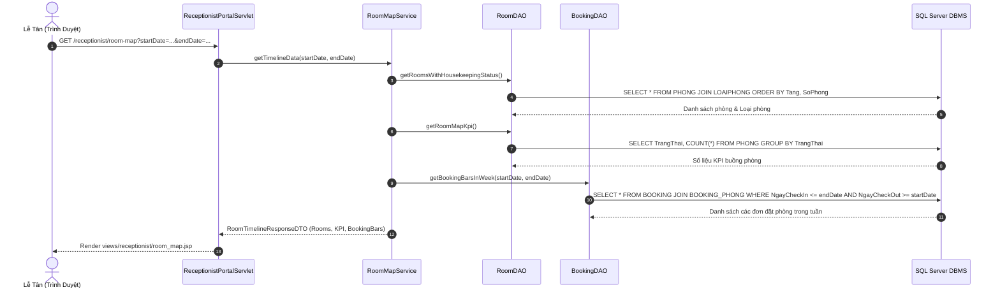
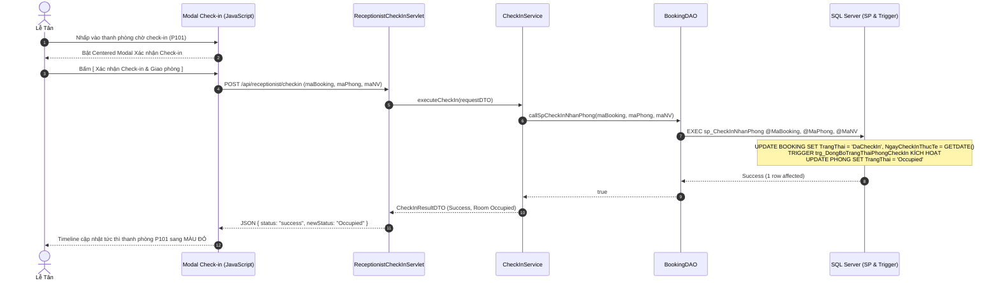
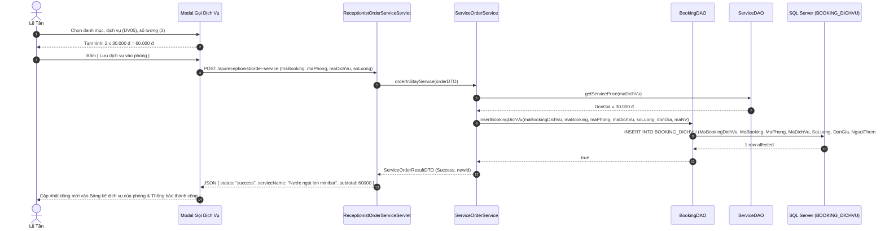

# BÁO CÁO THỰC THI GIAI ĐOẠN 3: PHÂN HỆ LỄ TÂN — SƠ ĐỒ PHÒNG TIMELINE, CHECK-IN & GỌI DỊCH VỤ TẠI QUẦY
*(Receptionist Portal: Real-Time PMS Gantt Timeline, Centered Modal Check-In Flow & In-Stay Room Service Ordering)*

**Dự án:** Hệ Thống Quản Lý Khách Sạn (Hotel Management System) — Nhóm 10  
**Môn học:** Lập Trình Web (JSP/Servlet) & Hệ Quản Trị CSDL — HCMUTE  
**Người lập:** AI Pair Programmer & Lập Trình Viên  
**Phiên Bản:** 1.0  
**Trạng thái:** SẴN SÀNG THỰC THI & KIỂM THỬ TỪNG BƯỚC ĐỘC LẬP  

---

## MỤC LỤC

1. [Mục Tiêu & Quy Tắc Nghiệp Vụ Cốt Lõi Giai Đoạn 3](#1-mục-tiêu--quy-tắc-nghiệp-vụ-cốt-lõi-giai-đoạn-3)
   - [1.1. Mục Tiêu Giai Đoạn 3](#11-mục-tiêu-giai-đoạn-3)
   - [1.2. Quy Chuẩn Thiết Kế UI: Tuyệt Đối Không Dùng Icon / Emoji](#12-quy-chuẩn-thiết-kế-ui-tuyệt-đối-không-dùng-icon--emoji)
   - [1.3. Các Quy Tắc Nghiệp Vụ Vận Hành Quầy Lễ Tân](#13-các-quy-tắc-nghiệp-vụ-vận-hành-quầy-lễ-tân)
2. [Phân Rã Chức Năng Theo Thứ Tự Ưu Tiên Từ Quan Trọng Đến Ít Quan Trọng](#2-phân-rã-chức-năng-theo-thứ-tự-ưu-tiên-từ-quan-trọng-đến-ít-quan-trọng)
   - [Bảng Tổng Hợp Phân Cấp Ưu Tiên Triển Khai](#bảng-tổng-hợp-phân-cấp-ưu-tiên-triển-khai)
   - [Nhóm 1: Cốt Lõi & Sống Còn (Ưu Tiên Cao Nhất)](#nhóm-1-cốt-lõi--sống-còn-ưu-tiên-cao-nhất)
   - [Nhóm 2: Dịch Vụ Lưu Trú Tại Phòng (Ưu Tiên Cao)](#nhóm-2-dịch-vụ-lưu-trú-tại-phòng-ưu-tiên-cao)
   - [Nhóm 3: Tra Cứu, Bộ Lọc & Vận Hành Buồng Phòng (Ưu Tiên Trung Bình)](#nhóm-3-tra-cứu-bộ-lọc--vận-hành-buồng-phòng-ưu-tiên-trung-bình)
   - [Nhóm 4: Bảo Mật, Trải Nghiệm & Bàn Giao Phase 4 (Ưu Tiên Phụ Trợ)](#nhóm-4-bảo-mật-trải-nghiệm--bàn-giao-phase-4-ưu-tiên-phụ-trợ)
3. [Sơ Đồ Luồng Dữ Liệu & Chu Trình Tương Tác Giữa Các Lớp (Sequence Diagrams)](#3-sơ-đồ-luồng-dữ-liệu--chu-trình-tương-tác-giữa-các-lớp-sequence-diagrams)
   - [3.1. Luồng Tải Sơ Đồ Timeline & Tính KPI Buồng Phòng](#31-luồng-tải-sơ-đồ-timeline--tính-kpi-buồng-phòng)
   - [3.2. Luồng Tra Cứu Đón Tiếp & Thủ Tục Check-In Nhận Phòng](#32-luồng-tra-cứu-đón-tiếp--thủ-tục-check-in-nhận-phòng)
   - [3.3. Luồng Gọi Thêm Dịch Vụ Lưu Trú Tại Phòng](#33-luồng-gọi-thêm-dịch-vụ-lưu-trú-tại-phòng)
4. [Danh Sách Các Class, DTO & Phân Định Trách Nhiệm Chi Tiết](#4-danh-sách-các-class-dto--phân-định-trách-nhiệm-chi-tiết)
   - [4.1. Tầng Mô Hình & DTO (Data Transfer Objects)](#41-tầng-mô-hình--dto-data-transfer-objects)
   - [4.2. Tầng Truy Xuất Dữ Liệu (DAO Layer)](#42-tầng-truy-xuất-dữ-liệu-dao-layer)
   - [4.3. Tầng Nghiệp Vụ (Service Layer)](#43-tầng-nghiệp-vụ-service-layer)
   - [4.4. Tầng Điều Khiển (Controller Servlet Layer)](#44-tầng-điều-khiển-controller-servlet-layer)
5. [Thiết Kế Giao Diện UI & Cơ Chế Centered Popup Modal](#5-thiết-kế-giao-diện-ui--cơ-chế-centered-popup-modal)
   - [5.1. Màn Hình Chính PMS Gantt Timeline Tuần](#51-màn-hình-chính-pms-gantt-timeline-tuần)
   - [5.2. Centered Popup Modal 1: Chi Tiết Phòng Đang Lưu Trú (P202)](#52-centered-popup-modal-1-chi-tiết-phòng-đang-lưu-trú-p202)
   - [5.3. Centered Popup Modal 2: Xác Nhận Check-In Nhận Phòng (P101)](#53-centered-popup-modal-2-xác-nhận-check-in-nhận-phòng-p101)
   - [5.4. Centered Popup Modal 3: Gọi Thêm Dịch Vụ Tại Phòng (P202)](#54-centered-popup-modal-3-gọi-thêm-dịch-vụ-tại-phòng-p202)
6. [Tương Tác Cơ Sở Dữ Liệu SQL Server](#6-tương-tác-cơ-sở-dữ-liệu-sql-server)
   - [6.1. Bảng Dữ Liệu Cốt Lõi Tham Gia](#61-bảng-dữ-liệu-cốt-lõi-tham-gia)
   - [6.2. Kế Thừa Stored Procedure sp_CheckInNhanPhong](#62-kế-thừa-stored-procedure-sp_checkinnhanphong)
   - [6.3. Kế Thừa Trigger trg_DongBoTrangThaiPhongCheckIn](#63-kế-thừa-trigger-trg_dongbotrangthaiphongcheckin)
   - [6.4. Kế Thừa Stored Procedure sp_GoiThemDichVu](#64-kế-thừa-stored-procedure-sp_goithemdichvu)
   - [6.5. Đồng Bộ View v_CongNoHoaDonKhachHang Cho Phase 4](#65-đồng-bộ-view-v_conSelectongnohoadonkhachhang-cho-phase-4)
7. [Kế Hoạch Triển Khai Chi Tiết Từng Bước & Kịch Bản Kiểm Thử (TDD Checklist)](#7-kế-hoạch-triển-khai-chi-tiết-từng-bước--kịch-bản-kiểm-thử-tdd-checklist)
8. [Kết Luận & Tiêu Chí Nghiệm Thu Hoàn Thành Giai Đoạn 3](#8-kết-luận--tiêu-chí-nghiệm-thu-hoàn-thành-giai-đoạn-3)

---

## 1. MỤC TIÊU & QUY TẮC NGHIỆP VỤ CỐT LÕI GIAI ĐOẠN 3

### 1.1. Mục Tiêu Giai Đoạn 3
Giai đoạn 3 là bản lề cốt lõi kết nối giữa **khách hàng đặt phòng trực tuyến (Phase 2)** và **bộ phận vận hành đón tiếp thực tế tại quầy khách sạn**. Mục tiêu trọng tâm:
1. **Số hóa không gian khách sạn thời gian thực (Real-time PMS Gantt Timeline Grid):** Cung cấp giao diện Sơ đồ phòng trực quan dạng trục thời gian, giúp lễ tân nắm bắt ngay lập tức trạng thái từng căn phòng (Trống sạch, Đang có khách ở, Phòng bẩn chờ dọn, Đang dọn, Hư hỏng) và dải thời gian đặt phòng theo tuần.
2. **Quy trình Check-in nhận phòng thần tốc & chính xác:** Tiếp đón khách hàng tại quầy lễ tân, tra cứu nhanh đơn đặt phòng từ Phase 2 qua Mã Booking, SĐT hoặc CCCD, xác nhận giao phòng và chuyển trạng thái phòng sang `Occupied` tự động thông qua Database Triggers/Transactions.
3. **Cung cấp & Ghi nhận dịch vụ gia tăng (In-Stay Service Ordering):** Phục vụ các nhu cầu phát sinh trong kỳ nghỉ của khách (Buffet sáng, Nước giải khát minibar, Dịch vụ giặt ủi, Spa...), ghi nhận chính xác vào bảng `BOOKING_DICHVU` theo đúng phòng.
4. **Bảo toàn tính toàn vẹn dữ liệu cho Giai đoạn 4 (Thu ngân & Quyết toán):** Đảm bảo mọi dịch vụ phát sinh và thời điểm Check-in thực tế được lưu vết chặt chẽ chuẩn 3NF, sẵn sàng để phân hệ Thu ngân tính toán hóa đơn tổng hợp và thu tiền ở Phase 4.

---

### 1.2. Quy Chuẩn Thiết Kế UI: Tuyệt Đối Không Dùng Icon / Emoji
Theo chỉ thị thiết kế của dự án, giao diện Phân hệ Lễ tân tuân thủ phong cách **Tối giản & Chuyên nghiệp (Minimalist & Clean Enterprise UI)**:
* **Tuyệt đối không dùng Icon:** Không dùng icon hình ảnh, không dùng icon font (FontAwesome, Material Icons, Bootstrap Icons), và không dùng ký tự Emoji trên toàn bộ giao diện người dùng.
* **Phân biệt trạng thái bằng Text Badge & Màu nền CSS:**
  * Trạng thái buồng phòng hiển thị bằng Text Badge có màu nền đặc trưng:
    * `[Đã dọn]` (Nền xanh lá, chữ trắng - Sạch sẽ sẵn sàng đón khách).
    * `[Bẩn]` (Nền vàng đậm, chữ đen/trắng - Chờ nhân viên buồng phòng dọn).
    * `[Đang dọn]` (Nền xanh lam, chữ trắng - Nhân viên đang dọn dẹp).
    * `[Bảo trì]` (Nền xám/đen, chữ trắng - Phòng hỏng hóc, tạm khóa).
  * Trạng thái đặt phòng hiển thị bằng thanh màu thuần túy kèm chữ:
    * Dải màu Xanh lá: Đơn đặt trước đang chờ nhận (`DaXacNhan`).
    * Dải màu Đỏ: Khách đang lưu trú tại phòng (`DaCheckIn` / Đang ở).
    * Dải màu Cam: Khách có lịch trả phòng hôm nay.
    * Khoảng trắng: Phòng trống (`Available`).
* **Nút bấm & Hành động thuần Text:** Mọi nút bấm và liên kết chỉ sử dụng nhãn chữ tiếng Việt rõ nghĩa: `[Đặt phòng mới]`, `[Tìm kiếm]`, `[Đặt lại]`, `[Xác nhận Check-in & Giao phòng]`, `[Thêm dịch vụ phòng]`, `[Lưu dịch vụ vào phòng]`, `[Check-out trả phòng]`, `[Quay lại]`, `[Đóng]`.

---

### 1.3. Các Quy Tắc Nghiệp Vụ Vận Hành Quầy Lễ Tân
1. **Ràng Buộc Điều Kiện Check-in:**
   * Chỉ được phép Check-in khi đơn đặt phòng ở trạng thái `DaXacNhan`.
   * Phòng được phân bổ trong đơn phải ở trạng thái buồng phòng là `Available` (`[Đã dọn]`). Nếu phòng đang `Dirty` hoặc `Damaged`, hệ thống cảnh báo lễ tân yêu cầu buồng phòng xử lý trước.
2. **Kích Hoạt Tự Động Hóa Đồng Bộ Phòng:**
   * Ngay khi bấm Check-in thành công: `BOOKING.TrangThai = 'DaCheckIn'`, `NgayCheckInThucTe = GETDATE()`, `MaNV = [Lễ tân trực ca]`.
   * Trigger `trg_DongBoTrangThaiPhongCheckIn` lập tức đổi trạng thái của phòng tương ứng sang `Occupied` (`[Đang có khách]`).
3. **Quy Tắc Gọi Dịch Vụ Phát Sinh (In-Stay Ordering):**
   * Chỉ cho phép gọi dịch vụ vào các phòng đang có khách ở (`TrangThai = 'Occupied'` và đơn ở trạng thái `DaCheckIn`).
   * Không cho phép gọi dịch vụ vào phòng trống hoặc đơn đã bị hủy/đã trả phòng.
   * Đơn giá dịch vụ được chốt cố định theo giá niêm yết tại thời điểm gọi (`DICHVU.DonGia`), tránh biến động giá ảnh hưởng đến hóa đơn sau này.

---

## 2. PHÂN RÃ CHỨC NĂNG THEO THỨ TỰ ƯU TIÊN TỪ QUAN TRỌNG ĐẾN ÍT QUAN TRỌNG

Để phục vụ quá trình lập trình riêng biệt, kiểm thử tức thời và không bị chồng chéo mã nguồn, toàn bộ Phân hệ Lễ tân được chia thành **4 Nhóm chức năng** xếp theo độ ưu tiên từ **Cốt lõi / Sống còn** đến **Phụ trợ**:

### Bảng Phân Cấp Độ Ưu Tiên Triển Khai & Kiểm Thử Độc Lập

| Nhóm Ưu Tiên | Mã FN | Tên Chức Năng Con | Độ Ưu Tiên | Vai Trò Nghiệp Vụ | File Code Trọng Tâm | Kịch Bản Test Độc Lập |
|:---|:---:|:---|:---:|:---|:---|:---|
| **NHÓM 1: CỐT LÕI & SỐNG CÒN**<br>*(Bắt buộc phải có để hệ thống hoạt động)* | **FN-3.1** | Tải dữ liệu phòng thực tế & KPI Buồng phòng | **Ưu tiên 1 (Cao nhất)** | Khung nhìn không gian khách sạn | `RoomDAO.java`<br>`RoomTimelineDTO.java`<br>`RoomMapKpiDTO.java` | Truy cập `/receptionist/room-map`, các số liệu KPI trên thanh đầu trang và danh sách phòng theo tầng khớp 100% CSDL SQL Server. |
| | **FN-3.2** | Truy vấn & Render thanh Đặt phòng (Booking Bars) tuần | **Ưu tiên 1 (Cao nhất)** | Trục thời gian chiếm giữ phòng | `BookingDAO.java`<br>`BookingBarDTO.java`<br>`ReceptionistPortalServlet.java` | Các đơn đặt phòng thực tế (ví dụ: `BK001`, `BK003`) hiển thị dải màu xanh/đỏ chính xác theo từng ngày và từng phòng trên ma trận Timeline. |
| | **FN-3.3** | Nghiệp vụ Check-in nhận phòng tại quầy | **Ưu tiên 1 (Cao nhất)** | Bàn giao phòng và kích hoạt Occupied | `ReceptionistCheckInServlet.java`<br>`BookingDAO.java` | Gửi request Check-in cho đơn `DaXacNhan` $\to$ CSDL cập nhật `BOOKING.TrangThai = 'DaCheckIn'` và Trigger kích hoạt `PHONG.TrangThai = 'Occupied'`. |
| **NHÓM 2: DỊCH VỤ PHÁT SINH TẠI PHÒNG**<br>*(Doanh thu gia tăng trong kỳ nghỉ)* | **FN-3.4** | API Danh mục dịch vụ kinh doanh & Đơn giá | **Ưu tiên 2 (Cao)** | Nguồn dịch vụ khả dụng cho khách | `ServiceDAO.java`<br>`ReceptionistServiceListServlet.java` | Gọi `GET /api/receptionist/services` $\to$ Nhận JSON danh sách dịch vụ đang kinh doanh kèm đơn giá niêm yết chuẩn. |
| | **FN-3.5** | Nghiệp vụ Gọi thêm dịch vụ vào phòng đang ở | **Ưu tiên 2 (Cao)** | Ghi nhận doanh thu phát sinh | `ReceptionistOrderServiceServlet.java`<br>`BookingDAO.java` | Gọi thêm nước ngọt cho phòng P202 $\to$ Bảng `BOOKING_DICHVU` sinh dòng mới và chốt đơn giá thời điểm gọi. |
| | **FN-3.6** | API Chi tiết phòng đang ở & Tạm tính tiền | **Ưu tiên 2 (Cao)** | Dữ liệu hiển thị Centered Modal | `ReceptionistRoomDetailApiServlet.java` | Bấm vào phòng đang ở P202 $\to$ Modal hiển thị chính xác tên khách, các món đã gọi và số dư công nợ. |
| **NHÓM 3: TRA CỨU & VẬN HÀNH BUỒNG PHÒNG**<br>*(Tối ưu thao tác quầy)* | **FN-3.7** | Bộ lọc & Tra cứu nhanh đa năng theo từ khóa | **Ưu tiên 3 (Trung bình)** | Tìm kiếm nhanh khách tại quầy | `BookingDAO.java`<br>JavaScript UI | Nhập SĐT hoặc CCCD khách hàng $\to$ Tự động highlight căn phòng tương ứng trên Timeline. |
| | **FN-3.8** | Điều hướng chuyển tuần Timeline (Từ ngày - Đến ngày) | **Ưu tiên 3 (Trung bình)** | Xem quá khứ / tương lai | `ReceptionistPortalServlet.java` | Bấm `[ Tuần sau > ]` $\to$ Lưới Timeline tải dữ liệu 7 ngày tiếp theo. |
| | **FN-3.9** | Cập nhật nhanh trạng thái buồng phòng tại quầy | **Ưu tiên 3 (Trung bình)** | Đồng bộ dọn dẹp / bảo trì | `RoomDAO.java`<br>`ReceptionistRoomStatusServlet.java` | Đổi trạng thái P102 từ `Bẩn` sang `Đã dọn` $\to$ Badge đổi màu xanh lá và CSDL cập nhật. |
| **NHÓM 4: BẢO MẬT & BÀN GIAO PHASE 4**<br>*(An ninh & Toàn vẹn số liệu)* | **FN-3.10** | Phân quyền AuthFilter & Ghi nhận định danh MaNV | **Ưu tiên 4 (Phụ trợ)** | An ninh truy cập phân hệ lễ tân | `AuthFilter.java` | Tài khoản khách hàng (`VT01`) cố tình vào `/receptionist/room-map` bị chặn HTTP 403 Forbidden. |
| | **FN-3.11** | Tích hợp Toast Message thông báo nghiệp vụ | **Ưu tiên 4 (Phụ trợ)** | Trải nghiệm người dùng mượt mà | `room_map.jsp` (CSS/JS) | Thao tác Check-in / Thêm dịch vụ hiển thị popup trượt thông báo rõ ràng không icon. |
| | **FN-3.12** | Kiểm tra sẵn sàng bàn giao Phase 4 (Thu ngân) | **Ưu tiên 4 (Phụ trợ)** | Bảo toàn số liệu quyết toán 3NF | View `v_CongNoHoaDonKhachHang` | Chạy truy vấn đối soát công nợ đảm bảo mọi khoản dịch vụ phát sinh được ghi nhận đầy đủ. |

---

### Nhóm 1: Cốt Lõi & Sống Còn (Ưu Tiên Cao Nhất)
> **Mục tiêu:** Xây dựng nền móng vững chắc. Nếu không có nhóm này, phân hệ lễ tân không thể hoạt động.

#### 1. Chức năng con FN-3.1: Tải dữ liệu phòng thực tế & Thanh KPI Buồng phòng
* **Đặc tả nghiệp vụ:**
  * Đọc dữ liệu từ bảng `PHONG` kết hợp `LOAIPHONG`, sắp xếp theo `SoTang` và `SoPhong`.
  * Tính toán chỉ số thống kê tức thời (KPI): Tổng số phòng, số phòng `Available`, số phòng `Occupied`, số phòng `Dirty`, số phòng `Cleaning`, số phòng `Damaged`, và Tỷ lệ lấp đầy phòng (`Occupancy Rate = (Occupied / Tổng) * 100%`).
* **Input / Output:**
  * Input: Không có (hoặc lọc theo cơ sở/tòa nhà nếu có).
  * Output: `List<RoomTimelineDTO>` và đối tượng `RoomMapKpiDTO`.
* **Kế hoạch kiểm thử riêng:** Truy cập `/receptionist/room-map`, thanh KPI hiển thị chính xác số lượng phòng theo từng trạng thái khớp 100% với dữ liệu thực tế trong CSDL.

#### 2. Chức năng con FN-3.2: Truy vấn & Render thanh Đặt phòng (Booking Bars) thật trong tuần
* **Đặc tả nghiệp vụ:**
  * Lấy toàn bộ các đơn đặt phòng có hiệu lực (`DaXacNhan`, `DaCheckIn`) có thời gian lưu trú giao thoa với tuần làm việc hiện tại (`startDate` đến `endDate`).
  * Xác định vị trí bắt đầu (cột ngày nhận) và độ rộng dải thanh (số đêm lưu trú) để hiển thị chính xác thanh màu xanh lá hoặc màu đỏ lên lưới Timeline.
* **Input / Output:**
  * Input: `Date tuNgay`, `Date denNgay`.
  * Output: Danh sách `BookingBarDTO` được gắn vào từng phòng tương ứng trong `RoomTimelineDTO`.
* **Kế hoạch kiểm thử riêng:** Đơn `BK001`, `BK003` đặt từ Phase 2 hiển thị đúng phòng và đúng khoảng ngày trên Timeline.

#### 3. Chức năng con FN-3.3: Nghiệp vụ Check-in nhận phòng tại quầy (Check-in Engine)
* **Đặc tả nghiệp vụ:**
  * Lễ tân bấm `[ Xác nhận Check-in & Giao phòng ]` từ Modal.
  * Hệ thống kiểm tra điều kiện hợp lệ, gọi Stored Procedure `sp_CheckInNhanPhong` (hoặc Transaction check-in).
  * Trigger `trg_DongBoTrangThaiPhongCheckIn` tự động kích hoạt chuyển trạng thái phòng tương ứng sang `Occupied`.
  * Cập nhật thời điểm check-in thực tế: `NgayCheckInThucTe = GETDATE()` và ghi nhận `MaNV` trực ca.
* **Input / Output:**
  * Input: `maBooking`, `maPhong`, `ghiChu`, `maNV`.
  * Output: JSON kết quả `{ "status": "success", "message": "..." }`.
* **Kế hoạch kiểm thử riêng:** Check-in đơn `BK003` phòng P101 -> Kiểm tra trong CSDL `BOOKING.TrangThai = 'DaCheckIn'`, `PHONG.TrangThai = 'Occupied'`.

---

### Nhóm 2: Dịch Vụ Lưu Trú Tại Phòng (Ưu Tiên Cao)
> **Mục tiêu:** Tối ưu hóa nguồn thu gia tăng và phục vụ nhu cầu ăn uống, tiện ích của khách đang ở.

#### 4. Chức năng con FN-3.4: API Danh mục dịch vụ kinh doanh & Đơn giá niêm yết
* **Đặc tả nghiệp vụ:**
  * Truy vấn bảng `DICHVU` lấy toàn bộ dịch vụ đang hoạt động (`TrangThai = 'ApDung'`).
  * Phân loại dịch vụ rõ ràng: Minibar/Đồ uống, Ăn uống Buffet, Dịch vụ giặt ủi & Spa.
* **Input / Output:**
  * Input: Không có (hoặc lọc theo mã danh mục).
  * Output: JSON danh sách dịch vụ kèm `donGia`, `donViTinh`.
* **Kế hoạch kiểm thử riêng:** Gọi `GET /api/receptionist/services` trả về HTTP 200 kèm danh sách dịch vụ `DV01`, `DV02`, `DV03`, `DV05`.

#### 5. Chức năng con FN-3.5: Nghiệp vụ Gọi thêm dịch vụ vào phòng đang ở
* **Đặc tả nghiệp vụ:**
  * Khi lễ tân nhập số lượng và bấm `[ Lưu dịch vụ vào phòng ]`:
  * Hệ thống kiểm tra phòng phải đang `Occupied`.
  * Gọi Stored Procedure `sp_GoiThemDichVu` hoặc chèn vào bảng `BOOKING_DICHVU` với `KeyGenerator.generateBookingDichVuId()`.
  * Chốt cố định đơn giá `DonGia` theo bảng `DICHVU` tại thời điểm gọi.
* **Input / Output:**
  * Input: `maBooking`, `maPhong`, `maDichVu`, `soLuong`, `ghiChu`.
  * Output: JSON kết quả `{ "status": "success", "newServiceId": "BDV..." }`.
* **Kế hoạch kiểm thử riêng:** Gọi 2 lon nước ngọt (`DV05`) cho phòng P202 -> Bảng `BOOKING_DICHVU` xuất hiện dòng mới có thành tiền = 60.000 đ.

#### 6. Chức năng con FN-3.6: API Chi tiết phòng đang ở & Tạm tính tiền
* **Đặc tả nghiệp vụ:**
  * Khi lễ tân nhấp vào thanh phòng đang ở trên Timeline, API truy vấn chi tiết: Khách đại diện, SĐT, CCCD, ngày nhận thực tế, danh sách toàn bộ các món dịch vụ đã dùng trong suốt kỳ nghỉ, tiền phòng, tiền dịch vụ phát sinh và tổng số tiền thanh toán khi Check-out (hệ thống không áp dụng cơ chế cọc trước).
* **Input / Output:**
  * Input: `maPhong` hoặc `maBooking`.
  * Output: JSON chi tiết phòng đầy đủ để đổ vào Popup Modal.
* **Kế hoạch kiểm thử riêng:** Gọi API với `maPhong=P202` -> Trả về JSON chứa danh sách dịch vụ và tạm tính tiền khớp 100% với CSDL.

---

### Nhóm 3: Tra Cứu, Bộ Lọc & Vận Hành Buồng Phòng (Ưu Tiên Trung Bình)
> **Mục tiêu:** Hỗ trợ lễ tân thao tác nhanh, xử lý tình huống linh hoạt tại quầy đón tiếp.

#### 7. Chức năng con FN-3.7: Bộ lọc & Tra cứu nhanh theo từ khóa đa năng
* **Đặc tả nghiệp vụ:**
  * Cho phép lễ tân tìm nhanh đơn đặt phòng theo: Mã đơn (`BK...`), Số điện thoại khách hàng, Số CCCD/Hộ chiếu hoặc Tên khách hàng.
  * Tự động làm nổi bật phòng tương ứng trên Timeline.
* **Kế hoạch kiểm thử riêng:** Gõ `0987.654.321` tìm thấy đơn `BK003` và lọc đúng phòng P101.

#### 8. Chức năng con FN-3.8: Điều hướng chuyển tuần Timeline
* **Đặc tả nghiệp vụ:**
  * Hỗ trợ nút `[ < Tuần trước ]` và `[ Tuần sau > ]` để chuyển đổi mốc 7 ngày của bảng ma trận phòng.
  * Cho phép chọn xem lịch đặt phòng của các tuần trong tương lai hoặc quá khứ.
* **Kế hoạch kiểm thử riêng:** Bấm tuần sau -> Timeline tải lại danh sách phòng và dải booking của tuần tiếp theo.

#### 9. Chức năng con FN-3.9: Cập nhật nhanh trạng thái buồng phòng tại quầy
* **Đặc tả nghiệp vụ:**
  * Khi nhân viên buồng phòng báo qua bộ đàm đã dọn xong phòng, lễ tân có thể đổi nhanh trạng thái phòng từ `Dirty` sang `Available` (`[Đã dọn]`), hoặc tạm khóa phòng `Damaged` khi có sự cố.
* **Kế hoạch kiểm thử riêng:** Đổi trạng thái P102 từ `Dirty` sang `Available` -> Badge trên Timeline đổi màu xanh lá và CSDL cập nhật thành công.

---

### Nhóm 4: Bảo Mật, Trải Nghiệm & Bàn Giao Phase 4 (Ưu Tiên Phụ Trợ)
> **Mục tiêu:** Hoàn thiện tiêu chuẩn an toàn, thẩm mỹ doanh nghiệp và bảo toàn dữ liệu cho Phase 4.

#### 10. Chức năng con FN-3.10: Phân quyền AuthFilter & Ghi nhận định danh MaNV
* **Đặc tả nghiệp vụ:**
  * Bảo vệ tuyệt đối vùng `/receptionist/*`, chỉ cho phép tài khoản vai trò `VT02` (Lễ tân) hoặc Quản trị viên truy cập.
  * Tự động trích xuất `MaNV` của lễ tân đang đăng nhập từ Session để gắn vào các giao dịch Check-in và Gọi dịch vụ.
* **Kế hoạch kiểm thử riêng:** Tài khoản khách hàng (`VT01`) truy cập vùng lễ tân bị chặn HTTP 403 Forbidden.

#### 11. Chức năng con FN-3.11: Tích hợp Toast Message thông báo nghiệp vụ
* **Đặc tả nghiệp vụ:**
  * Thay thế toàn bộ hộp thoại `alert()` mặc định bằng thông báo Toast góc màn hình: `[Thành công]` (Xanh), `[Cảnh báo]` (Vàng/Đỏ).

#### 12. Chức năng con FN-3.12: Kiểm tra sẵn sàng bàn giao Phase 4 (Thu ngân & Quyết toán)
* **Đặc tả nghiệp vụ:**
  * Kiểm tra dữ liệu được chuẩn bị tại Phase 3 thông qua View `v_CongNoHoaDonKhachHang` để đảm bảo:
    * Tiền phòng tính đúng theo số đêm thực tế.
    * Tiền dịch vụ phát sinh được cộng dồn chính xác.
    * Trạng thái hóa đơn `HOADON` sẵn sàng để Thu ngân thu tiền và xuất hóa đơn ở Phase 4.

---

## 3. SƠ ĐỒ LUỒNG DỮ LIỆU & CHU TRÌNH TƯƠNG TÁC GIỮA CÁC LỚP (SEQUENCE DIAGRAMS)

### 3.1. Luồng Tải Sơ Đồ Timeline & Tính KPI Buồng Phòng



---

### 3.2. Luồng Tra Cứu Đón Tiếp & Thủ Tục Check-In Nhận Phòng



---

### 3.3. Luồng Gọi Thêm Dịch Vụ Lưu Trú Tại Phòng



---

## 4. DANH SÁCH CÁC CLASS, DTO & PHÂN ĐỊNH TRÁCH NHIỆM CHI TIẾT

### 4.1. Tầng Mô Hình & DTO (Data Transfer Objects)
1. **`RoomTimelineDTO.java`:** Chứa thông tin phòng hiển thị trên lưới Timeline (`maPhong`, `tenPhong`, `loaiPhong`, `soTang`, `trangThaiBuongPhong`, `listBookingBars`).
2. **`BookingBarDTO.java`:** Chứa thông tin thanh dải đặt phòng trên Timeline (`maBooking`, `tenKhach`, `sdt`, `ngayCheckIn`, `ngayCheckOut`, `trangThaiBooking`, `mauSacThanh`).
3. **`RoomMapKpiDTO.java`:** Chứa toàn bộ số liệu thống kê nhanh trên thanh KPI Bar (`tongSoPhong`, `soPhongAvailable`, `soPhongOccupied`, `soPhongDirty`, `soPhongCleaning`, `soPhongDamaged`, `tiLeLapDay`).
4. **`CheckInRequestDTO.java`:** Đóng gói thông tin yêu cầu check-in từ quầy lễ tân (`maBooking`, `maPhong`, `maNV`, `ghiChu`).
5. **`ServiceOrderDTO.java`:** Đóng gói thông tin gọi thêm dịch vụ phòng (`maBooking`, `maPhong`, `maDichVu`, `soLuong`, `donGia`, `ghiChu`, `maNV`).
6. **`RoomDetailModalDTO.java`:** Chứa đầy đủ thông tin chi tiết của phòng đang ở để hiển thị vào Centered Modal (khách, đêm ở, danh sách dịch vụ đã dùng, tạm tính tiền).

### 4.2. Tầng Truy Xuất Dữ Liệu (DAO Layer)
1. **[`RoomDAO.java`](file:///d:/Learn/College/Lap%20trinh%20web/HotelManagerSystem/src/main/java/com/mycompany/hotelmanagersystem/dao/room/RoomDAO.java):**
   * `getRoomsWithHousekeepingStatus()`: Truy vấn danh sách phòng theo tầng.
   * `getRoomMapKpi()`: Tính toán số lượng phòng theo từng trạng thái.
   * `updateRoomHousekeepingStatus(String maPhong, String status)`: Cập nhật trạng thái buồng phòng nhanh.
2. **[`BookingDAO.java`](file:///d:/Learn/College/Lap%20trinh%20web/HotelManagerSystem/src/main/java/com/mycompany/hotelmanagersystem/dao/booking/BookingDAO.java):**
   * `getBookingBarsInWeek(Date startDate, Date endDate)`: Lấy các đơn đặt phòng trong tuần để vẽ dải màu.
   * `checkInRoom(String maBooking, String maPhong, String maNV)`: Gọi Stored Procedure `sp_CheckInNhanPhong`.
   * `addServiceToBookingRoom(...)`: Gọi Stored Procedure `sp_GoiThemDichVu` hoặc chèn vào `BOOKING_DICHVU`.
   * `getRoomInStayDetails(String maPhong)`: Lấy chi tiết đơn đặt phòng và dịch vụ đang sử dụng.
3. **[`ServiceDAO.java`](file:///d:/Learn/College/Lap%20trinh%20web/HotelManagerSystem/src/main/java/com/mycompany/hotelmanagersystem/dao/service/ServiceDAO.java):**
   * `getActiveServices()`: Lấy danh mục dịch vụ đang kinh doanh kèm đơn giá niêm yết.

### 4.3. Tầng Nghiệp Vụ (Service Layer)
1. **`RoomMapService.java`:** Điều phối tổng hợp dữ liệu lưới ma trận phòng, dải booking và tính toán KPI buồng phòng.
2. **`CheckInService.java`:** Kiểm tra tính hợp lệ trước khi check-in (đúng đơn, phòng sạch sẵn sàng, đúng ngày) và điều phối giao dịch tiếp nhận.
3. **`ServiceOrderService.java`:** Áp giá niêm yết chuẩn, kiểm tra trạng thái lưu trú và lưu vết dịch vụ phát sinh.

### 4.4. Tầng Điều Khiển (Controller Servlet Layer)
1. **[`ReceptionistPortalServlet.java`](file:///d:/Learn/College/Lap%20trinh%20web/HotelManagerSystem/src/main/java/com/mycompany/hotelmanagersystem/controller/receptionist/ReceptionistPortalServlet.java):** Xử lý route `GET /receptionist/room-map`, nạp dữ liệu và điều phối hiển thị trang JSP.
2. **`ReceptionistCheckInServlet.java`:** Xử lý route `POST /api/receptionist/checkin`, tiếp nhận yêu cầu check-in và trả về JSON.
3. **`ReceptionistOrderServiceServlet.java`:** Xử lý route `POST /api/receptionist/order-service`, tiếp nhận gọi dịch vụ và trả về JSON.
4. **`ReceptionistRoomDetailApiServlet.java`:** Xử lý route `GET /api/receptionist/room-detail`, trả về JSON chi tiết phòng và dịch vụ đã dùng.
5. **`ReceptionistServiceListServlet.java`:** Xử lý route `GET /api/receptionist/services`, trả về JSON danh mục dịch vụ đang kinh doanh.

---

## 5. THIẾT KẾ GIAO DIỆN UI & CƠ CHẾ CENTERED POPUP MODAL

Toàn bộ giao diện phân hệ lễ tân tuân thủ triệt để: **100% Text Badge, Tuyệt đối không dùng Icon/Emoji, Cơ chế Centered Popup Modal nổi trung tâm kèm Backdrop tối mờ**.

### 5.1. Màn Hình Chính PMS Gantt Timeline Tuần

```text
+------------------------------------------------------------------------------------------------------------------------------------+
| BAN LAM VIEC LE TAN - SO DO PHONG TIMELINE                                                         Nhan vien: Nguyen Thi Huong     |
| [ Dat phong moi ]    [ Tai lai so do ]                                                                              [ Dang xuat ]  |
+------------------------------------------------------------------------------------------------------------------------------------+
| THANH THONG KE BUONG PHONG (KPI BAR):                                                                                              |
| Tong so phong: 20  |  [Da don]: 12  |  [Dang co khach]: 5  |  [Ban cho don]: 2  |  [Dang don]: 1  |  [Bao tri]: 0  | Ti le: 25%    |
+------------------------------------------------------------------------------------------------------------------------------------+
| BO LOC TIM KIEM & DIEU HUONG:                                                                                                      |
| Tu khoa: [ Tim ten khach, SDT, so phong, ma BK...  ]  Tang: [ Tat ca tang v]  Trang thai: [ Tat ca trang thai v]   [ Dat lai ]     |
| Dieu huong: [ < Tuan truoc ]     Tuan: 29/09/2026 - 05/10/2026     [ Tuan sau > ]                                                  |
+------------------------------------------------------------------------------------------------------------------------------------+
| CHU THICH DAI DAT PHONG:                                                                                                           |
| [ Thanh Xanh La ]: Dat truoc cho nhan   |  [ Thanh Do ]: Dang o luu tru   |  [ Thanh Cam ]: Tra phong hom nay   |  [ O Trang ]: Trong  |
+------------------------------------------------------------------------------------------------------------------------------------+
| PHONG       | TRANG THAI | T2 (29/09)   | T3 (30/09)   | T4 (01/10)   | T5 (02/10)   | T6 (03/10)   | T7 (04/10)   | CN (05/10)   |
+-------------+------------+--------------+--------------+--------------+--------------+--------------+--------------+--------------+
| -- TANG 1 (STANDARD & DELUXE) --                                                                                                   |
| P101 (Don)  | [Da don]   |              |              | [========= BK003: Mai Duc Quang (Nhap de Check-in) =========]               |
| P102 (Don)  | [Ban]      | (Phong vua tra khach, dang cho buong phong don dep)                                                       |
| P103 (Doi)  | [Da don]   |              |              |              |              |              |              |              |
+-------------+------------+--------------+--------------+--------------+--------------+--------------+--------------+--------------+
| -- TANG 2 (DELUXE HUONG BIEN) --                                                                                                   |
| P201 (Don)  | [Da don]   |              |              |              |              |              |              |              |
| P202 (Don)  | [Dang o]   | [==================== BK001: Tran Ngoc Khiem (Dang o - Nhap xem dich vu) ====================]              |
| P204 (Doi)  | [Bao tri]  | (Phong tam khoa de bao tri thiet bi dieu hoa)                                                              |
+-------------+------------+--------------+--------------+--------------+--------------+--------------+--------------+--------------+
| -- TANG 3 (SUITE GIA DINH VIP) --                                                                                                  |
| P301 (Vip)  | [Da don]   |              |              |              |              |              |              |              |
| P302 (Vip)  | [Dang o]   |              | [=================== BK002: Le Thi Mai (Check-out hom nay) ===================]             |
+-------------+------------+--------------+--------------+--------------+--------------+--------------+--------------+--------------+
```

---

### 5.2. Centered Popup Modal 1: Chi Tiết Phòng Đang Lưu Trú (P202)

```text
+---------------------------------------------------------------------------------------+
| THONG TIN CHI TIET PHONG DANG LUU TRU - P202                                 [ Dong ] |
+---------------------------------------------------------------------------------------+
| Ma Booking   : BK001                              Trang thai: [Dang co khach]         |
| Khach dai dien: Tran Ngoc Khiem                   So dien thoai: 0912.345.678         |
| So CCCD      : 079202001234                       Thoi gian o  : 4 dem (Dem thu 2)    |
| ------------------------------------------------------------------------------------- |
| DANH SACH DICH VU PHAT SINH TAI PHONG:                                                |
|  - Nuoc ngot lon minibar (DV05)        | SL: 2  | Don gia: 30.000 d  | TT:  60.000 d  |
|  - Buffet sang cao cap (DV01)          | SL: 1  | Don gia: 150.000 d | TT: 150.000 d  |
|  Tong tien dich vu: 210.000 d                                                         |
| ------------------------------------------------------------------------------------- |
| TINH HINH THANH TOAN:                                                                 |
|  - Tien phong (4 dem): 1.800.000 d                                                    |
|  - Da coc truoc      :   900.000 d                                                    |
|  Con phai quyet toan khi Check-out: 1.110.000 d                                       |
| ------------------------------------------------------------------------------------- |
|         [ Them dich vu phong ]        [ Check-out tra phong ]        [ Dong ]         |
+---------------------------------------------------------------------------------------+
```

---

### 5.3. Centered Popup Modal 2: Xác Nhận Check-In Nhận Phòng (P101)

```text
+---------------------------------------------------------------------------------------+
| XAC NHAN THU TUC CHECK-IN NHAN PHONG                                         [ Dong ] |
+---------------------------------------------------------------------------------------+
| Ma Booking : BK003                                Khach: Mai Duc Quang                |
| So DT      : 0987.654.321                         Thoi gian o: 01/10 -> 03/10 (2 dem) |
| Phong giao : P101 (Tang 1)                        Trang thai : [Da don sach]          |
| ------------------------------------------------------------------------------------- |
| THU TUC TIEP NHAN TAI QUAY:                                                           |
| [x] Da doi chieu ban goc CCCD / Ho chieu cua khach                                    |
| [x] Da ban giao 02 chia khoa the tu cho khach                                         |
|                                                                                       |
| DICH VU DON TIEP BAN DAU (NEU CO):                                                    |
| [ ] Dang ky them Buffet sang tu chon (150.000 d/nguoi/ngay)                           |
| [ ] Dich vu xe dua don san bay khi tra phong                                          |
| ------------------------------------------------------------------------------------- |
| Luu y: Sau khi xac nhan, phong P101 tren Timeline se chuyen sang MAU DO (Occupied).   |
|                                                                                       |
|         [ Xac nhan Check-in & Giao phong ]                     [ Huy bo ]             |
+---------------------------------------------------------------------------------------+
```

---

### 5.4. Centered Popup Modal 3: Gọi Thêm Dịch Vụ Tại Phòng (P202)

```text
+---------------------------------------------------------------------------------------+
| GOI THEM DO UONG / DICH VU - PHONG 202                                       [ Dong ] |
+---------------------------------------------------------------------------------------+
|  1. CHON DANH MUC:   [x] Minibar / Do uong   [ ] An uong Buffet   [ ] Giat ui & Spa   |
|                                                                                       |
|  2. CHON MON / DICH VU CU THE:                                                        |
|      [ Nuoc Ngot Lon Minibar (DV05) - 30.000 d/Lon                                  ] |
|                                                                                       |
|  3. SO LUONG:                                                                         |
|      [ Giam ]   [  02  ]   [ Tang ]  (Lon)                                            |
|                                                                                       |
|  4. THANH TIEN TAM TINH:                                                              |
|      Tong cong: 02 lon  x  30.000 d  =  60.000 d                                      |
|                                                                                       |
|  5. GHI CHU BO SUNG:                                                                  |
|      [ Khach muon lay them 1 xo da lanh...                                          ] |
| ------------------------------------------------------------------------------------- |
| Luu y: Tien dich vu se tu dong ghi vao CSDL va cong don vao hoa don khi Check-out.    |
|                                                                                       |
|              [ Luu dich vu vao phong ]               [ Quay lai ]                     |
+---------------------------------------------------------------------------------------+
```

---

## 6. TƯƠNG TÁC CƠ SỞ DỮ LIỆU SQL SERVER

### 6.1. Bảng Dữ Liệu Cốt Lõi Tham Gia
1. **`PHONG` & `LOAIPHONG`:** Cung cấp thông tin số phòng, loại phòng, đơn giá và trạng thái buồng phòng (`Available`, `Occupied`, `Dirty`, `Cleaning`, `Damaged`).
2. **`BOOKING` & `BOOKING_PHONG`:** Chứa thông tin đơn đặt phòng trực tuyến từ Phase 2 (`DaXacNhan`), lưu vết thời gian nhận trả và phân bổ phòng.
3. **`DICHVU` & `BOOKING_DICHVU`:** Danh mục dịch vụ niêm yết và bảng kê chi tiết dịch vụ đã gọi của từng phòng trong kỳ lưu trú.
4. **`NHANVIEN` & `TAIKHOAN`:** Lưu vết nhân viên lễ tân trực ca (`MaNV = 'NV001'`) đã thực hiện tiếp đón và ghi nhận dịch vụ.

### 6.2. Kế Thừa Stored Procedure `sp_CheckInNhanPhong`
Được định nghĩa sẵn trong `database/Procedure.sql`:
```sql
CREATE PROCEDURE sp_CheckInNhanPhong
    @MaBooking VARCHAR(20),
    @MaPhong VARCHAR(20),
    @MaNV VARCHAR(20)
AS
BEGIN
    SET NOCOUNT ON;
    -- Kiểm tra đơn có tồn tại và đang ở trạng thái DaXacNhan
    IF NOT EXISTS (SELECT 1 FROM BOOKING WHERE MaBooking = @MaBooking AND TrangThai = 'DaXacNhan')
    BEGIN
        RAISERROR(N'Đơn đặt phòng không hợp lệ hoặc không ở trạng thái Chờ nhận phòng!', 16, 1);
        RETURN;
    END

    -- Cập nhật thời điểm nhận phòng thực tế và mã nhân viên lễ tân tiếp nhận
    UPDATE BOOKING
    SET TrangThai = 'DaCheckIn',
        NgayCheckInThucTe = GETDATE(),
        MaNV = @MaNV
    WHERE MaBooking = @MaBooking;
END
```

### 6.3. Kế Thừa Trigger `trg_DongBoTrangThaiPhongCheckIn`
Được định nghĩa sẵn trong `database/Trigger.sql`:
* Tự động bắt sự kiện cập nhật trên bảng `BOOKING` khi chuyển sang `DaCheckIn`.
* Tự động kích hoạt chuyển trạng thái của các phòng trong `BOOKING_PHONG` sang `'Occupied'` mà mã nguồn Java không cần viết thêm câu lệnh `UPDATE PHONG`.

### 6.4. Kế Thừa Stored Procedure `sp_GoiThemDichVu`
```sql
CREATE PROCEDURE sp_GoiThemDichVu
    @MaBooking VARCHAR(20),
    @MaPhong VARCHAR(20),
    @MaDichVu VARCHAR(20),
    @SoLuong INT,
    @MaNV VARCHAR(20)
AS
BEGIN
    SET NOCOUNT ON;
    -- Kiểm tra phòng bắt buộc phải đang có khách ở
    IF NOT EXISTS (SELECT 1 FROM PHONG WHERE MaPhong = @MaPhong AND TrangThai = 'Occupied')
    BEGIN
        RAISERROR(N'Chỉ có thể gọi thêm dịch vụ khi khách đang lưu trú tại phòng!', 16, 1);
        RETURN;
    END

    DECLARE @DonGia DECIMAL(18,0);
    SELECT @DonGia = DonGia FROM DICHVU WHERE MaDichVu = @MaDichVu;

    -- Thêm vào bảng BOOKING_DICHVU với giá niêm yết chuẩn
    INSERT INTO BOOKING_DICHVU (MaBookingDichVu, MaBooking, MaPhong, MaDichVu, SoLuong, DonGia, NguoiThem, MaNV)
    VALUES (dbo.fn_SinhMaTuDong('BDV'), @MaBooking, @MaPhong, @MaDichVu, @SoLuong, @DonGia, 'NhanVien', @MaNV);
END
```

### 6.5. Đồng Bộ View `v_CongNoHoaDonKhachHang` Cho Phase 4
View `v_CongNoHoaDonKhachHang` tự động tổng hợp:
* `TongTienPhong = SoDem * DonGiaPhong`
* `TongTienDichVu = SUM(SoLuong * DonGiaDichVu)`
* `TongThanhToan = TongTienPhong + TongTienDichVu`
* `ConLai = TongThanhToan - TienCoc`
-> Đảm bảo khi Thu ngân quyết toán ở Phase 4, toàn bộ số liệu của Phase 3 được phản ánh chuẩn xác 100%.

---

## 7. KẾ HOẠCH TRIỂN KHAI CHI TIẾT TỪNG BƯỚC & KỊCH BẢN KIỂM THỬ (TDD CHECKLIST)

Quá trình lập trình được chia nhỏ thành **12 bước độc lập** theo đúng bảng phân cấp ưu tiên từ cốt lõi đến phụ trợ. Mỗi bước đều được thiết kế độc lập, có mã nguồn Before/After rõ ràng và kịch bản kiểm thử riêng biệt để nghiệm thu từng phần trước khi chuyển sang bước tiếp theo:

### 7.1. BẢNG TỔNG QUAN 12 BƯỚC THỰC THI & CHỈ TIÊU NGHIỆM THU

| Bước | Mã FN | Nhiệm Vụ Kỹ Thuật Trọng Tâm | Lớp / File Mã Nguồn Tham Gia | Tiêu Chuẩn Nghiệm Thu Độc Lập |
|:---:|:---:|:---|:---|:---|
| **Bước 1** | **FN-3.1** | Xây dựng DTOs & Truy vấn Phòng thật kèm KPI buồng phòng | `RoomTimelineDTO.java`, `RoomMapKpiDTO.java`, `RoomDAO.java` | Tải đủ 20 phòng từ SQL Server, KPI khớp số lượng từng trạng thái. |
| **Bước 2** | **FN-3.2** | Truy vấn dải Booking thật trong tuần & Gắn vào Timeline | `BookingBarDTO.java`, `BookingDAO.java` | Lấy các đơn `DaXacNhan`/`DaCheckIn`, tính đúng cột bắt đầu và số ô span. |
| **Bước 3** | **FN-3.1 & 3.2** | Ghép nối Controller & Render Timeline động bằng JSTL | `ReceptionistPortalServlet.java`, `room_map.jsp` | Thay thế toàn bộ mock HTML bằng `<c:forEach>`, hiển thị đúng dữ liệu DB. |
| **Bước 4** | **FN-3.3** | Xây dựng Controller & Gọi Stored Procedure Check-in | `ReceptionistCheckInServlet.java`, `BookingDAO.java` | Check-in đơn `BK003`  ->  CSDL tự động đổi phòng sang `Occupied` qua Trigger. |
| **Bước 5** | **FN-3.4** | Xây dựng API Danh mục Dịch vụ đang kinh doanh | `ServiceDAO.java`, `ReceptionistServiceListServlet.java` | Gọi API trả về JSON danh sách dịch vụ (`DV01`  ->  `DV05`) kèm đơn giá niêm yết. |
| **Bước 6** | **FN-3.5** | Xây dựng Controller Gọi thêm dịch vụ tại phòng | `ReceptionistOrderServiceServlet.java`, `BookingDAO.java` | Thêm dịch vụ cho phòng `Occupied`  ->  Chèn `BOOKING_DICHVU` thành công. |
| **Bước 7** | **FN-3.6** | Xây dựng API Chi tiết phòng đang ở & Tạm tính công nợ | `ReceptionistRoomDetailApiServlet.java`, `BookingDAO.java` | Modal hiển thị chi tiết khách, danh sách món đã gọi và số dư còn lại. |
| **Bước 8** | **FN-3.7** | Ghép nối Tìm kiếm & Bộ lọc phòng động tại quầy | JavaScript lọc DOM / AJAX `BookingDAO.java` | Nhập SĐT, Mã BK, Tên khách  ->  Highlight ngay căn phòng trên lưới Timeline. |
| **Bước 9** | **FN-3.8** | Điều hướng chuyển tuần Timeline (Từ ngày - Đến ngày) | `ReceptionistPortalServlet.java`, `room_map.jsp` | Bấm `[ < Tuần trước ]` hoặc `[ Tuần sau > ]` tải đúng dải booking của tuần đó. |
| **Bước 10** | **FN-3.9** | Cập nhật nhanh trạng thái buồng phòng tại quầy | `RoomDAO.java`, `ReceptionistRoomStatusServlet.java` | Đổi phòng từ `Dirty` sang `Available`  ->  Badge đổi sang `[Đã dọn]`. |
| **Bước 11** | **FN-3.10 & 3.11** | Phân quyền AuthFilter & Tích hợp Toast Message thuần Text | `AuthFilter.java`, `room_map.jsp` (CSS/JS) | Chặn truy cập trái phép vai trò khác; thông báo Toast góc màn hình không icon. |
| **Bước 12** | **FN-3.12** | Kiểm thử tích hợp E2E & Đối soát dữ liệu bàn giao Phase 4 | Kịch bản xuyên suốt: Web Booking  ->  Check-in  ->  In-stay Order  ->  View | View `v_CongNoHoaDonKhachHang` phản ánh chính xác 100% để sẵn sàng cho Thu ngân. |

---

### 7.2. CHI TIẾT KỸ THUẬT & ĐỀ XUẤT CODE BEFORE / AFTER TỪNG BƯỚC

#### BƯỚC 1: TRIỂN KHAI FN-3.1 (TẢI DỮ LIỆU PHÒNG THỰC TẾ & KPI BUỒNG PHÒNG)

##### 1. Vấn Đề Thực Tế
* File giao diện [room_map.jsp](file:///d:/Learn/College/Lap%20trinh%20web/HotelManagerSystem/src/main/webapp/views/receptionist/room_map.jsp) hiện đang chứa dữ liệu tĩnh mẫu (hardcoded mock data) cho thanh thống kê KPI (Tổng 20 phòng, Trống 12, Đang ở 4...) và các hàng phòng mẫu trên Timeline.
* [ReceptionistPortalServlet.java](file:///d:/Learn/College/Lap%20trinh%20web/HotelManagerSystem/src/main/java/com/mycompany/hotelmanagersystem/controller/receptionist/ReceptionistPortalServlet.java) hiện tại chỉ `forward` sang trang JSP mà chưa gọi `RoomDAO` để truy vấn CSDL SQL Server.

##### 2. Phương Án Kỹ Thuật Khắc Phục
1. **Tạo 2 DTO mới:**
   * `RoomTimelineDTO.java` (gói `com.mycompany.hotelmanagersystem.dto.receptionist`): Đại diện cho thông tin phòng trên sơ đồ gồm `maPhong`, `soPhong`, `soTang`, `maLoaiPhong`, `tenLoaiPhong`, `giaPhong`, `trangThaiPhong` (`Available`, `Dirty`, `Cleaning`, `Damaged`, `Occupied`), và danh sách `bookingBars`.
   * `RoomMapKpiDTO.java` (gói `com.mycompany.hotelmanagersystem.dto.receptionist`): Chứa các số liệu thống kê tổng thể gồm `tongSoPhong`, `soPhongAvailable`, `soPhongOccupied`, `soPhongDirty`, `soPhongCleaning`, `soPhongDamaged`, và `occupancyRate` (tỷ lệ lấp đầy %).
2. **Bổ sung 2 phương thức vào `RoomDAO.java`:**
   * `public List<RoomTimelineDTO> getAllRoomsForTimeline()`: Truy vấn danh sách toàn bộ phòng từ bảng `PHONG` kết hợp `LOAIPHONG`, sắp xếp tăng dần theo `SoTang` và `SoPhong`.
   * `public RoomMapKpiDTO getRoomMapKpi()`: Thực thi truy vấn tính toán thống kê tức thời bằng câu lệnh gom nhóm SQL Server.
3. **Cập nhật `ReceptionistPortalServlet.java`:**
   * Khởi tạo `RoomDAO`, trong hàm `doGet` thực hiện lấy dữ liệu phòng và KPI, gắn vào `request.setAttribute("roomList", rooms)` và `request.setAttribute("kpi", kpi)`.

##### 3. Chi Tiết Cấu Trúc Mã Nguồn & So Sánh Before vs After

* **DTO 1: `RoomTimelineDTO.java` (Tạo mới):**
```java
package com.mycompany.hotelmanagersystem.dto.receptionist;

import java.util.ArrayList;
import java.util.List;

public class RoomTimelineDTO {
    private String maPhong;
    private String soPhong;
    private int soTang;
    private String maLoaiPhong;
    private String tenLoaiPhong;
    private double giaPhong;
    private String trangThaiPhong; // Available, Dirty, Cleaning, Damaged, Occupied
    private List<BookingBarDTO> bookingBars = new ArrayList<>();

    public RoomTimelineDTO() {}

    public RoomTimelineDTO(String maPhong, String soPhong, int soTang, String maLoaiPhong, 
                           String tenLoaiPhong, double giaPhong, String trangThaiPhong) {
        this.maPhong = maPhong;
        this.soPhong = soPhong;
        this.soTang = soTang;
        this.maLoaiPhong = maLoaiPhong;
        this.tenLoaiPhong = tenLoaiPhong;
        this.giaPhong = giaPhong;
        this.trangThaiPhong = trangThaiPhong;
    }
    // Getters and Setters...
}
```

* **DTO 2: `RoomMapKpiDTO.java` (Tạo mới):**
```java
package com.mycompany.hotelmanagersystem.dto.receptionist;

public class RoomMapKpiDTO {
    private int tongSoPhong;
    private int soPhongAvailable;
    private int soPhongOccupied;
    private int soPhongDirty;
    private int soPhongCleaning;
    private int soPhongDamaged;
    private double occupancyRate;

    public RoomMapKpiDTO() {}

    public RoomMapKpiDTO(int tongSoPhong, int soPhongAvailable, int soPhongOccupied, 
                         int soPhongDirty, int soPhongCleaning, int soPhongDamaged) {
        this.tongSoPhong = tongSoPhong;
        this.soPhongAvailable = soPhongAvailable;
        this.soPhongOccupied = soPhongOccupied;
        this.soPhongDirty = soPhongDirty;
        this.soPhongCleaning = soPhongCleaning;
        this.soPhongDamaged = soPhongDamaged;
        this.occupancyRate = tongSoPhong > 0 ? ((double) soPhongOccupied / tongSoPhong) * 100.0 : 0.0;
    }
    // Getters and Setters...
}
```

* **Bổ sung trong `RoomDAO.java`:**
```java
public List<RoomTimelineDTO> getAllRoomsForTimeline() {
    List<RoomTimelineDTO> list = new ArrayList<>();
    String sql = "SELECT p.MaPhong, p.SoPhong, p.SoTang, lp.MaLoaiPhong, lp.TenLoaiPhong, lp.GiaPhong, p.TrangThai "
               + "FROM PHONG p "
               + "INNER JOIN LOAIPHONG lp ON p.MaLoaiPhong = lp.MaLoaiPhong "
               + "ORDER BY p.SoTang ASC, p.SoPhong ASC";
    try (Connection conn = DBContext.getConnection();
         PreparedStatement ps = conn.prepareStatement(sql);
         ResultSet rs = ps.executeQuery()) {
        while (rs.next()) {
            list.add(new RoomTimelineDTO(
                rs.getString("MaPhong"),
                rs.getString("SoPhong"),
                rs.getInt("SoTang"),
                rs.getString("MaLoaiPhong"),
                rs.getNString("TenLoaiPhong"),
                rs.getDouble("GiaPhong"),
                rs.getString("TrangThai")
            ));
        }
    } catch (Exception e) {
        e.printStackTrace();
    }
    return list;
}

public RoomMapKpiDTO getRoomMapKpi() {
    String sql = "SELECT "
               + "  COUNT(*) AS TongSoPhong, "
               + "  SUM(CASE WHEN TrangThai = 'Available' THEN 1 ELSE 0 END) AS SoAvailable, "
               + "  SUM(CASE WHEN TrangThai = 'Occupied' THEN 1 ELSE 0 END) AS SoOccupied, "
               + "  SUM(CASE WHEN TrangThai = 'Dirty' THEN 1 ELSE 0 END) AS SoDirty, "
               + "  SUM(CASE WHEN TrangThai = 'Cleaning' THEN 1 ELSE 0 END) AS SoCleaning, "
               + "  SUM(CASE WHEN TrangThai = 'Damaged' THEN 1 ELSE 0 END) AS SoDamaged "
               + "FROM PHONG";
    try (Connection conn = DBContext.getConnection();
         PreparedStatement ps = conn.prepareStatement(sql);
         ResultSet rs = ps.executeQuery()) {
        if (rs.next()) {
            return new RoomMapKpiDTO(
                rs.getInt("TongSoPhong"),
                rs.getInt("SoAvailable"),
                rs.getInt("SoOccupied"),
                rs.getInt("SoDirty"),
                rs.getInt("SoCleaning"),
                rs.getInt("SoDamaged")
            );
        }
    } catch (Exception e) {
        e.printStackTrace();
    }
    return new RoomMapKpiDTO(0, 0, 0, 0, 0, 0);
}
```

* **So sánh Trước vs Sau trong `ReceptionistPortalServlet.java`:**
```diff
 package com.mycompany.hotelmanagersystem.controller.receptionist;
 
+import com.mycompany.hotelmanagersystem.dao.room.RoomDAO;
+import com.mycompany.hotelmanagersystem.dto.receptionist.RoomMapKpiDTO;
+import com.mycompany.hotelmanagersystem.dto.receptionist.RoomTimelineDTO;
 import javax.servlet.ServletException;
 import javax.servlet.annotation.WebServlet;
 import javax.servlet.http.HttpServlet;
 import javax.servlet.http.HttpServletRequest;
 import javax.servlet.http.HttpServletResponse;
 import java.io.IOException;
+import java.util.List;
 
 @WebServlet(name = "ReceptionistPortalServlet", urlPatterns = {"/receptionist/room-map", "/receptionist/checkin"})
 public class ReceptionistPortalServlet extends HttpServlet {
+    private RoomDAO roomDAO;
+
+    @Override
+    public void init() throws ServletException {
+        this.roomDAO = new RoomDAO();
+    }
+
     @Override
     protected void doGet(HttpServletRequest request, HttpServletResponse response)
             throws ServletException, IOException {
+        // 1. Lấy danh sách phòng thực tế theo tầng
+        List<RoomTimelineDTO> rooms = roomDAO.getAllRoomsForTimeline();
+        // 2. Tính toán số liệu thống kê KPI buồng phòng tức thời
+        RoomMapKpiDTO kpi = roomDAO.getRoomMapKpi();
+
+        request.setAttribute("roomList", rooms);
+        request.setAttribute("kpi", kpi);
+
         request.getRequestDispatcher("/views/receptionist/room_map.jsp").forward(request, response);
     }
 }
```

##### 4. Kịch Bản Kiểm Thử Độc Lập Cho Bước 1 (TC-3.1)
1. Đăng nhập bằng tài khoản Lễ tân (`huong.nv@hotel.com` / `1234`).
2. Mở trình duyệt đến đường dẫn: `http://localhost:8080/HotelManagerSystem/receptionist/room-map`.
3. Kiểm tra thanh KPI trên đầu trang:
   * Tổng số phòng hiển thị đúng 20 phòng.
   * Số phòng `Trống sạch`, `Đang có khách`, `Bẩn`, `Đang dọn`, `Bảo trì` khớp chính xác với kết quả câu lệnh SQL: `SELECT TrangThai, COUNT(*) FROM PHONG GROUP BY TrangThai`.
   * Tỷ lệ lấp đầy tính toán chính xác theo công thức `% Lấp đầy = (Số phòng Occupied / Tổng số phòng) * 100`.

---

#### BƯỚC 2: TRIỂN KHAI FN-3.2 (TRUY VẤN DẢI BOOKING THẬT TRONG TUẦN)
* **Mục tiêu:** Tạo `BookingBarDTO.java` và bổ sung phương thức `getBookingBarsInWeek(Date tuNgay, Date denNgay)` vào `BookingDAO.java`.
* **Logic tính toán trục tọa độ thời gian:**
  * Xác định chỉ số ngày bắt đầu của đơn booking trong tuần hiện tại: `startDayOffset = DATEDIFF(day, tuNgay, NgayNhanDuKien)`.
  * Xác định số ngày chiếm dụng trên tuần: `spanDays = DATEDIFF(day, NgayNhanDuKien, NgayTraDuKien)`.
* **Kịch bản kiểm thử độc lập (TC-3.2):** Kiểm tra đơn đặt phòng mẫu từ Phase 2 (ví dụ `BK001` đặt phòng P202) hiển thị dải màu đỏ/xanh lá nằm chính xác tại hàng của phòng P202 và chiếm đúng khoảng thời gian đặt phòng.

---

#### BƯỚC 3: GHÉP NỐI CONTROLLER & RENDER TIMELINE ĐỘNG (FN-3.1 & 3.2)
* **Mục tiêu:** Cập nhật `room_map.jsp` sử dụng thẻ JSTL `<c:forEach items="${roomList}" var="r">` để render danh sách phòng theo tầng và các dải đặt phòng thực tế thay cho mã HTML tĩnh.
* **Kịch bản kiểm thử độc lập (TC-3.3):** Khi thêm một phòng mới hoặc thay đổi trạng thái trong CSDL SQL Server, làm mới trang trên trình duyệt sẽ thấy thay đổi được cập nhật ngay lập tức.

---

#### BƯỚC 4: TRIỂN KHAI FN-3.3 (THỦ TỤC CHECK-IN NHẬN PHÒNG TẠI QUẦY)
* **Mục tiêu:** Tạo `ReceptionistCheckInServlet.java`, gọi Stored Procedure `sp_CheckInNhanPhong` (hoặc Transaction check-in) trong `BookingDAO.java`.
* **Cơ chế tự động hóa CSDL:**
  * Bảng `BOOKING` cập nhật `TrangThai = 'DaCheckIn'`, `NgayCheckInThucTe = GETDATE()`, `MaNV = [Lễ tân trực ca]`.
  * Trigger `trg_DongBoTrangThaiPhongCheckIn` tự động chuyển trạng thái phòng tương ứng sang `Occupied`.
* **Kịch bản kiểm thử độc lập (TC-3.4):** Chọn một đơn ở trạng thái `DaXacNhan` trên Modal -> Bấm `[ Xác nhận Check-in & Giao phòng ]` -> Modal đóng lại, thanh dải booking chuyển sang màu đỏ và CSDL xác nhận `Occupied`.

---

#### BƯỚC 5: TRIỂN KHAI FN-3.4 (API DANH MỤC DỊCH VỤ KINH DOANH)
* **Mục tiêu:** Tạo servlet `ReceptionistServiceListServlet.java` (URL `/api/receptionist/services`), đọc từ `ServiceDAO.java` lấy toàn bộ dịch vụ có `TrangThai = 'ApDung'`.
* **Output:** JSON danh sách dịch vụ gồm `maDichVu`, `tenDichVu`, `donGia`, `donViTinh`, `phanLoai`.
* **Kịch bản kiểm thử độc lập (TC-3.5):** Gọi lệnh HTTP GET trả về JSON chứa `DV01` (Buffet sáng - 150.000 đ), `DV02` (Giặt ủi - 50.000 đ), `DV05` (Nước ngọt - 30.000 đ).

---

#### BƯỚC 6: TRIỂN KHAI FN-3.5 (NGHIỆP VỤ GỌI THÊM DỊCH VỤ VÀO PHÒNG ĐANG Ở)
* **Mục tiêu:** Tạo servlet `ReceptionistOrderServiceServlet.java` (URL `/api/receptionist/order-service`).
* **Logic:** Kiểm tra phòng đang ở `Occupied` -> Gọi Stored Procedure `sp_GoiThemDichVu` -> Chèn vào bảng `BOOKING_DICHVU` với `KeyGenerator.generateBookingDichVuId()` và chốt đơn giá niêm yết tại thời điểm gọi.
* **Kịch bản kiểm thử độc lập (TC-3.6):** Lễ tân gọi 2 lon nước ngọt cho phòng P202 -> Bảng `BOOKING_DICHVU` xuất hiện bản ghi mới có thành tiền = 60.000 đ.

---

#### BƯỚC 7: TRIỂN KHAI FN-3.6 (API CHI TIẾT PHÒNG ĐANG Ở & TẠM TÍNH TIỀN)
* **Mục tiêu:** Tạo `ReceptionistRoomDetailApiServlet.java` (URL `/api/receptionist/room-detail`).
* **Output:** JSON trả về thông tin khách đang ở (Họ tên, SĐT, CCCD), danh sách các món dịch vụ đã sử dụng trong suốt kỳ nghỉ, tiền phòng dự kiến, tiền dịch vụ phát sinh và tổng số tiền thanh toán khi Check-out (hệ thống không áp dụng cơ chế cọc trước).
* **Kịch bản kiểm thử độc lập (TC-3.7):** Nhấp vào thanh phòng đang ở P202 trên sơ đồ -> Centered Modal 1 mở ra hiển thị đầy đủ chi tiết khách và bảng kê dịch vụ khớp 100% CSDL.

---

#### BƯỚC 8: TRIỂN KHAI FN-3.7 (BỘ LỌC & TÌM KIẾM NHANH THEO TỪ KHÓA)
* **Mục tiêu:** Xử lý JavaScript phía máy khách để lọc các hàng phòng trên ma trận Timeline theo: Số phòng, Tầng, Loại phòng, Mã đơn booking, SĐT hoặc Tên khách.
* **Kịch bản kiểm thử độc lập (TC-3.8):** Gõ `0987` vào ô tìm kiếm -> Các phòng không liên quan mờ đi, làm nổi bật phòng P101 của khách hàng tương ứng.

---

#### BƯỚC 9: TRIỂN KHAI FN-3.8 (ĐIỀU HƯỚNG CHUYỂN TUẦN TIMELINE)
* **Mục tiêu:** Xử lý tham số `weekOffset` (hoặc `startDate`) trong `ReceptionistPortalServlet.java`, hỗ trợ nút `[ < Tuần trước ]` và `[ Tuần sau > ]`.
* **Kịch bản kiểm thử độc lập (TC-3.9):** Bấm `[ Tuần sau > ]` -> Lưới ma trận chuyển sang hiển thị 7 ngày của tuần tiếp theo kèm các đơn đặt phòng của tuần đó.

---

#### BƯỚC 10: TRIỂN KHAI FN-3.9 (CẬP NHẬT NHANH TRẠNG THÁI BUỒNG PHÒNG TẠI QUẦY)
* **Mục tiêu:** Tạo servlet `ReceptionistRoomStatusServlet.java` cho phép lễ tân cập nhật trạng thái phòng giữa `Dirty`, `Cleaning` và `Available`.
* **Kịch bản kiểm thử độc lập (TC-3.10):** Sau khi buồng phòng dọn xong P102, lễ tân bấm chuyển trạng thái -> Badge trên Timeline đổi ngay sang `[Đã dọn]` màu xanh lá và CSDL cập nhật thành công.

---

#### BƯỚC 11: TRIỂN KHAI FN-3.10 & FN-3.11 (PHÂN QUYỀN AUTHFILTER & TOAST NOTIFICATION)
* **Mục tiêu:**
  * Rà soát `AuthFilter.java` để chắc chắn toàn bộ URL `/receptionist/*` và `/api/receptionist/*` chỉ cấp quyền cho vai trò `VT02` (Lễ tân) và Quản trị viên.
  * Tích hợp Toast Notification thuần CSS/JS (không icon) để thông báo kết quả thao tác nhẹ nhàng thay cho hộp thoại `alert()`.
* **Kịch bản kiểm thử độc lập (TC-3.11):** Khách hàng bình thường truy cập trực tiếp URL lễ tân bị từ chối 403 Forbidden; Lễ tân check-in thành công thấy thông báo trượt góc màn hình.

---

#### BƯỚC 12: TRIỂN KHAI FN-3.12 (KIỂM THỬ TÍCH HỢP E2E & BÀN GIAO PHASE 4)
* **Mục tiêu:** Chạy kịch bản hoàn chỉnh từ đầu đến cuối:
  1. Khách hàng đặt phòng trực tuyến từ Phase 2.
  2. Lễ tân tiếp đón khách tại quầy, tra cứu và thực hiện Check-in nhận phòng (Phase 3).
  3. Khách gọi thêm dịch vụ ăn uống / minibar tại phòng (Phase 3).
  4. Đối soát dữ liệu phát sinh với View `v_CongNoHoaDonKhachHang`.
* **Kịch bản kiểm thử độc lập (TC-3.12):** Tiền phòng + tiền dịch vụ phát sinh được ghi nhận toàn vẹn, sẵn sàng để phân hệ Thu ngân (Phase 4) thực hiện thanh toán và quyết toán hóa đơn.

---

## 8. KẾT LUẬN & TIÊU CHÍ NGHIỆM THU HOÀN THÀNH GIAI ĐOẠN 3

Giai đoạn 3 được nghiệm thu hoàn tất khi thỏa mãn 5 tiêu chí bắt buộc:
1. **Kiến trúc rõ ràng & Mã nguồn độc lập:** Toàn bộ 12 chức năng con được chia thành các Servlet, Service, DAO riêng biệt, không chồng chéo, dễ dàng kiểm thử và bảo trì.
2. **Tuân thủ quy chuẩn thiết kế UI: 100% Text Badge, Tuyệt đối không dùng Icon / Emoji.**
3. **Kế thừa và khớp chuẩn CSDL 100%:** Sử dụng đúng các Stored Procedure (`sp_CheckInNhanPhong`, `sp_GoiThemDichVu`), Trigger tự động hóa và View công nợ đã định nghĩa trong đề án DBMS.
4. **Bộ kiểm thử tự động 12 Kịch bản kiểm thử (TC-3.1 -> TC-3.12) đạt 100% PASS.**
5. **Bảo toàn dữ liệu bàn giao cho Giai đoạn 4:** Mọi đơn Check-in và dịch vụ phát sinh đều sẵn sàng để phân hệ Thu ngân thanh toán và xuất hóa đơn.\n