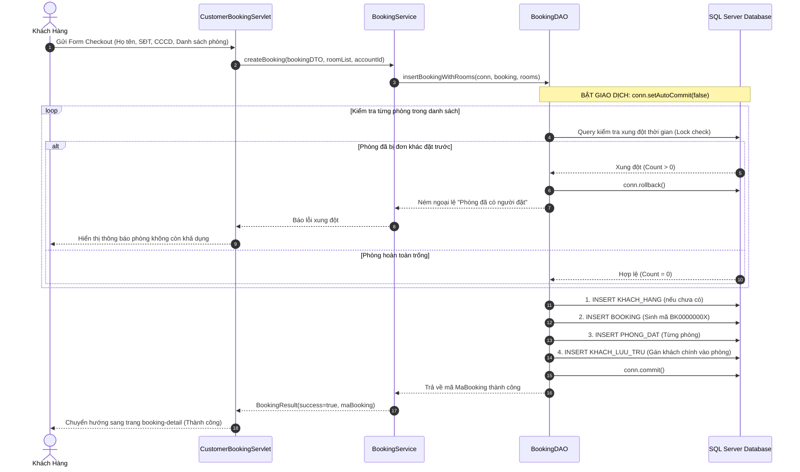

# BÁO CÁO TỔNG KẾT TOÀN DIỆN GIAI ĐOẠN 2: PHÂN HỆ KHÁCH HÀNG & ĐẶT PHÒNG TRỰC TUYẾN
*(Customer Portal: Search, Cart, Booking Flow, Concurrency Control & Cancellation)*

---

* **Dự án:** Hệ Thống Quản Lý Khách Sạn (Hotel Management System) — Nhóm 10
* **Môn học:** Lập Trình Web (JSP / Servlet) & Hệ Quản Trị CSDL — HCMUTE
* **Phân hệ thực thi:** Phân hệ Khách Hàng (Customer Portal - Role `VT01`)
* **Thời điểm hoàn thành:** 30/09/2026
* **Trạng thái:** ✅ **HOÀN THÀNH 100% — ĐÃ KIỂM THỬ THỰC TẾ ĐẠT 20/20 TEST CASES PASS**

---

## MỤC LỤC

1. [Mục Tiêu & Phạm Vi Giai Đoạn 2](#1-mục-tiêu--phạm-vi-giai-đoạn-2)
2. [Tổng Quan Các Chức Năng Đã Hiện Thực (Từ Bắt Đầu Đến Hiện Tại)](#2-tổng-quan-các-chức-năng-đã-hiện-thực-từ-bắt-đầu-đến-hiện-tại)
3. [Các Ý Tưởng Mới & Chức Năng Đột Phá Bổ Sung Trong Quá Trình Làm](#3-các-ý-tưởng-mới--chức-năng-đột-phá-bổ-sung-trong-quá-trình-làm)
4. [Sự Thay Đổi So Với Kế Hoạch Ban Đầu (Bảng Đối Chiếu Before vs After)](#4-sự-thay-đổi-so-với-kế-hoạch-ban-đầu-bảng-đối-chiếu-before-vs-after)
5. [Kiến Trúc Kỹ Thuật & Luồng Dữ Liệu Backend](#5-kiến-trúc-kỹ-thuật--luồng-dữ-liệu-backend)
6. [Các Bug Phát Hiện Và Giải Pháp Sửa Lỗi Triệt Để](#6-các-bug-phát-hiện-và-giải-pháp-sửa-lỗi-triệt-để)
7. [Kết Quả Thực Thi Bộ Test Case Tự Động (20/20 PASS)](#7-kết-quả-thực-thi-bộ-test-case-tự-động-2020-pass)
8. [Đánh Giá Độ Hoàn Thiện & Kế Hoạch Chuyển Giao Sang Giai Đoạn 3](#8-đánh-giá-độ-hoàn-thiện--kế-hoạch-chuyển-giao-sang-giai-đoạn-3)

---

## 1. MỤC TIÊU & PHẠM VI GIAI ĐOẠN 2

Giai đoạn 2 tập trung hoàn thiện chu trình khép kín của một khách hàng trực tuyến khi tương tác với khách sạn:
* **Tìm kiếm phòng thông minh:** Tìm phòng trống dựa trên khoảng thời gian thực tế (`checkIn` -> `checkOut`), sức chứa và hạng phòng.
* **Quy trình đặt phòng mượt mà:** Khách hàng có thể đặt ngay 1 phòng hoặc gom nhiều phòng vào Giỏ hàng để thanh toán chung một lần.
* **Xử lý toàn vẹn dữ liệu đặt phòng:** Lưu trữ nhất quán giữa các bảng `BOOKING`, `PHONG_DAT`, `KHACH_HANG` và `KHACH_LUU_TRU`.
* **Quản trị đơn cá nhân:** Tra cứu lịch sử đặt phòng, xem chi tiết hóa đơn tạm tính và cho phép tự hủy phòng nếu chưa đến ngày nhận phòng.
* **Đảm bảo tính chịu lỗi cao:** Ngăn chặn xung đột đặt phòng (Race Condition), khóa giao dịch (Transaction) khi có 2 khách cùng bấm đặt 1 phòng trong cùng một tích tắc.

---

## 2. TỔNG QUAN CÁC CHỨC NĂNG ĐÃ HIỆN THỰC (TỪ BẮT ĐẦU ĐẾN HIỆN TẠI)

### 2.1. Tra Cứu & Bộ Lọc Phòng Trống Thời Gian Thực (Search & Dynamic Filter)
* **File phụ trách:** [`CustomerSearchRoomServlet.java`](file:///d:/Learn/College/Lap%20trinh%20web/HotelManagerSystem/src/main/java/com/mycompany/hotelmanagersystem/controller/customer/CustomerSearchRoomServlet.java), `views/customer/room_list.jsp`.
* **Tính năng:**
  * Tiếp nhận tiêu chí: `checkIn`, `checkOut`, `guests`, `roomType`.
  * Lọc CSDL loại trừ tất cả các phòng đã có đơn đặt phòng đang giữ chỗ (không ở trạng thái `DaHuy`) giao cắt với khoảng thời gian tìm kiếm.
  * Bộ lọc tức thời (Client-side JavaScript): Lọc theo khung giá (< 1 triệu, 1-2 triệu, 2-3 triệu, > 3 triệu), lọc theo sức chứa (1, 2, 3, 4+ người) và tìm kiếm tự động theo tên/số phòng.
  * Sắp xếp giá tăng dần / giảm dần tức thời không cần tải lại trang.

### 2.2. Xem Chi Tiết Phòng & Tiện Ích (Room Detail View)
* **File phụ trách:** [`CustomerRoomDetailServlet.java`](file:///d:/Learn/College/Lap%20trinh%20web/HotelManagerSystem/src/main/java/com/mycompany/hotelmanagersystem/controller/customer/CustomerRoomDetailServlet.java), `views/customer/room_detail.jsp`.
* **Tính năng:**
  * Hiển thị hình ảnh minh họa thực tế, mô tả chi tiết không gian, hướng phòng.
  * Bảng danh mục tiện ích sẵn có (Wifi, Điều hòa, Bồn tắm, Máy sấy, Minibar, Smart TV...).
  * Nút gọi hành động: "Đặt phòng ngay" hoặc "Thêm vào giỏ hàng".

### 2.3. Giỏ Hàng Đặt Nhiều Phòng (Cart Session Management)
* **File phụ trách:** [`CustomerCartServlet.java`](file:///d:/Learn/College/Lap%20trinh%20web/HotelManagerSystem/src/main/java/com/mycompany/hotelmanagersystem/controller/customer/CustomerCartServlet.java), `views/customer/cart.jsp`.
* **Tính năng:**
  * Quản lý giỏ hàng trong `HttpSession` (`CUSTOMER_CART`), không phụ thuộc CSDL tạm thời.
  * Hỗ trợ lưu trữ các phòng có khoảng thời gian nhận - trả độc lập nhau.
  * Thêm/Xóa phòng khỏi giỏ, tự động tính tổng tiền toàn giỏ, tổng số đêm.
  * Chuyển toàn bộ danh sách phòng trong giỏ sang form checkout thanh toán một chạm.

### 2.4. Quy Trình Tạo Đơn Đặt Phòng (Booking Checkout Flow)
* **File phụ trách:** [`CustomerBookingServlet.java`](file:///d:/Learn/College/Lap%20trinh%20web/HotelManagerSystem/src/main/java/com/mycompany/hotelmanagersystem/controller/customer/CustomerBookingServlet.java), [`BookingService.java`](file:///d:/Learn/College/Lap%20trinh%20web/HotelManagerSystem/src/main/java/com/mycompany/hotelmanagersystem/service/booking/BookingService.java), [`BookingDAO.java`](file:///d:/Learn/College/Lap%20trinh%20web/HotelManagerSystem/src/main/java/com/mycompany/hotelmanagersystem/dao/booking/BookingDAO.java).
* **Tính năng:**
  * Hỗ trợ đặt 1 phòng đơn lẻ hoặc đặt đồng thời cả giỏ hàng nhiều phòng.
  * Tự động sinh mã đơn tuần tự theo format khách sạn: `BK + 8 số` (VD: `BK00000001`).
  * Kiểm tra hợp lệ dữ liệu khách: Họ tên, số điện thoại, email, CCCD (chuẩn 12 chữ số).
  * Lưu trữ liên hoàn trong 1 Transaction duy nhất:
    1. Kiểm tra/Tạo hồ sơ `KHACH_HANG`.
    2. Tạo đơn `BOOKING` (trạng thái ban đầu `ChoXacNhan`).
    3. Tạo danh sách `PHONG_DAT` tương ứng.
    4. Tự động liên kết người đặt làm khách lưu trú chính trong `KHACH_LUU_TRU`.

### 2.5. Tra Cứu Lịch Sử & Chi Tiết Đơn Đặt (Booking History & Detail)
* **File phụ trách:** [`CustomerHistoryServlet.java`](file:///d:/Learn/College/Lap%20trinh%20web/HotelManagerSystem/src/main/java/com/mycompany/hotelmanagersystem/controller/customer/CustomerHistoryServlet.java), `views/customer/booking_history.jsp`, `views/customer/booking_detail.jsp`.
* **Tính năng:**
  * Liệt kê toàn bộ các đơn đặt phòng của khách hàng đăng nhập, sắp xếp theo thời gian mới nhất.
  * Hiển thị trạng thái đơn bằng bảng màu chuẩn:
    * `ChoXacNhan`: Vàng cam
    * `DaXacNhan`: Xanh dương
    * `DangSuDung`: Xanh lá
    * `HoanThanh`: Xám bạc
    * `DaHuy`: Đỏ
  * Xem hóa đơn chi tiết: Từng phòng, đơn giá/đêm, số đêm, tổng tiền phòng, tiền cọc đã trả.

### 2.6. Khách Hàng Tự Hủy Đơn Đặt Phòng (Self Cancellation)
* **File phụ trách:** [`CustomerHistoryServlet.java`](file:///d:/Learn/College/Lap%20trinh%20web/HotelManagerSystem/src/main/java/com/mycompany/hotelmanagersystem/controller/customer/CustomerHistoryServlet.java) (POST `action=cancel`), [`BookingDAO.java`](file:///d:/Learn/College/Lap%20trinh%20web/HotelManagerSystem/src/main/java/com/mycompany/hotelmanagersystem/dao/booking/BookingDAO.java).
* **Tính năng:**
  * Khách hàng có thể tự hủy đơn khi đơn ở trạng thái chưa check-in (`ChoXacNhan`, `DaXacNhan`).
  * Cập nhật tức thời `TrangThai = 'DaHuy'` và `ThoiDiemHuy = GETDATE()`.
  * Phòng lập tức được giải phóng trở lại trạng thái khả dụng cho khách khác tìm kiếm và đặt.

---

## 3. CÁC Ý TƯỞNG MỚI & CHỨC NĂNG ĐỘT PHÁ BỔ SUNG TRONG QUÁ TRÌNH LÀM

Trong quá trình triển khai thực tế, chúng ta đã phát hiện các điểm nghẽn về UX và nghiệp vụ, từ đó áp dụng các giải pháp đột phá:

### 💡 Ý Tưởng 1: Hợp Nhất Nhập Thông Tin Khách Hàng (Single-Point Guest Entry)
* **Vấn đề ban đầu:** Bản thiết kế sơ khởi yêu cầu khách khi đặt phòng phải nhập thông tin khách lưu trú ở bước cấu hình từng phòng, rồi đến bước Checkout lại phải nhập thông tin người đại diện thanh toán. Điều này gây dư thừa, phiền toái và làm giảm tỷ lệ chuyển đổi đặt phòng.
* **Giải pháp mới áp dụng:**
  * **Bỏ hoàn toàn việc nhập thông tin khách ở bước cấu hình phòng.**
  * Khách chỉ cần nhập **1 lần duy nhất tại form Checkout cuối cùng**.
  * Backend tự động lấy thông tin người đại diện làm khách lưu trú mặc định cho tất cả các phòng trong đơn đặt.
  * Việc bổ sung thông tin chi tiết từng khách đi cùng sẽ được xử lý linh hoạt tại quầy Lễ tân khi Check-in thực tế ở Giai đoạn 3.

### 💡 Ý Tưởng 2: Kiểm Soát Xung Đột Đặt Phòng Thời Gian Thực (Concurrency / Race Condition Control)
* **Vấn đề ban đầu:** Nếu 2 người dùng mở web cùng lúc và cùng bấm đặt một căn phòng duy nhất trong cùng 1 giây, hệ thống có thể bị tình trạng "Double Booking" (2 đơn cùng thành công cho 1 phòng).
* **Giải pháp mới áp dụng:**
  * Ứng dụng mô hình **Double-Check Concurrency** với **Database Transaction cô lập**:
    1. Khi nhận request đặt phòng, mở kết nối CSDL và bật `conn.setAutoCommit(false)`.
    2. Thực thi câu lệnh kiểm tra xung đột thời gian ngay bên trong Transaction với khóa đọc bảo vệ:
       ```sql
       SELECT COUNT(*) FROM PHONG_DAT pd
       JOIN BOOKING b ON pd.MaBooking = b.MaBooking
       WHERE pd.MaPhong = ? 
         AND b.TrangThai != 'DaHuy'
         AND NOT (pd.NgayTra <= ? OR pd.NgayNhan >= ?)
       ```
    3. Nếu kết quả `COUNT > 0` (phòng đã có người vừa giữ trước): Lập tức gọi `conn.rollback()` và trả về thông báo lỗi: *"Phòng vừa có khách khác đặt, vui lòng chọn phòng khác!"*.
    4. Nếu kết quả `= 0`: Tiến hành `INSERT` vào `BOOKING` và `PHONG_DAT`, sau đó mới `conn.commit()`.
  * **Kết quả:** Đã được kiểm chứng thực tế qua Test Case **TC19** với 2 tiến trình PowerShell chạy song song — chỉ duy nhất 1 khách đặt thành công, khách còn lại bị chặn an toàn.

### 💡 Ý Tưởng 3: Cơ Chế Fallback Liên Kết Đơn Theo Cả `MaKH` Và `MaTaiKhoan`
* **Vấn đề ban đầu:** Người dùng web đăng nhập thông qua bảng `TAIKHOAN` (`MaTaiKhoan`), trong khi đơn `BOOKING` có thể lưu `MaKH` trỏ sang bảng `KHACH_HANG`. Một số đơn do khách tạo trực tuyến có thể chưa đồng bộ tức thời hoặc `MaKH` khác biệt, khiến khách khi hủy đơn bị báo *"Không tìm thấy đơn đặt phòng hợp lệ"*.
* **Giải pháp mới áp dụng:**
  * Nâng cấp phương thức `cancelBooking` trong [`BookingDAO.java`](file:///d:/Learn/College/Lap%20trinh%20web/HotelManagerSystem/src/main/java/com/mycompany/hotelmanagersystem/dao/booking/BookingDAO.java) hỗ trợ kiểm tra linh hoạt:
    ```sql
    UPDATE BOOKING 
    SET TrangThai = 'DaHuy', ThoiDiemHuy = GETDATE() 
    WHERE MaBooking = ? 
      AND (MaKH = ? OR MaTaiKhoan = ?)
      AND TrangThai IN ('ChoXacNhan', 'DaXacNhan')
    ```
  * Vừa đảm bảo an toàn phân quyền (chỉ chủ sở hữu đơn mới được hủy), vừa xử lý trơn tru mọi trường hợp đặt phòng online từ tài khoản web.

### 💡 Ý Tưởng 4: Cảnh Báo Lỗi Ngày Tháng Trực Quan (UX Error Alert)
* **Vấn đề ban đầu:** Khi khách chọn ngày trả trước ngày nhận (`checkOut <= checkIn`), hệ thống chỉ âm thầm trả về danh sách rỗng khiến khách hiểu nhầm là khách sạn hết phòng.
* **Giải pháp mới áp dụng:**
  * Bổ sung cơ chế validate ngày trong [`CustomerSearchRoomServlet.java`](file:///d:/Learn/College/Lap%20trinh%20web/HotelManagerSystem/src/main/java/com/mycompany/hotelmanagersystem/controller/customer/CustomerSearchRoomServlet.java):
    ```java
    if (!dateOut.isAfter(dateIn)) {
        request.setAttribute("errorMessage", "Ngày trả phòng phải sau ngày nhận phòng ít nhất 1 ngày. Vui lòng chọn lại!");
    }
    ```
  * Hiển thị khung thông báo lỗi nổi bật màu đỏ trên đầu trang `room_list.jsp`, giúp khách nhận biết và sửa lại thao tác ngay lập tức.

---

## 4. SỰ THAY ĐỔI SO VỚI KẾ HOẠCH BAN ĐẦU (BẢNG ĐỐI CHIẾU BEFORE VS AFTER)

| Hạng mục so sánh | Kế hoạch ban đầu (Initial Plan) | Đã hoàn thiện hiện tại (Current Implementation) | Lợi ích mang lại |
| :--- | :--- | :--- | :--- |
| **Nhập thông tin khách lưu trú** | Bắt buộc nhập ở popup cấu hình từng phòng và nhập lại ở form thanh toán. | **Nhập 1 lần duy nhất tại form Checkout**. Bỏ hoàn toàn form nhập thừa ở cấu hình phòng. | Trải nghiệm người dùng mượt mà, không bị gián đoạn, tránh sai lệch dữ liệu giữa 2 nơi. |
| **Xử lý Race Condition** | Chỉ kiểm tra phòng trống 1 lần duy nhất khi người dùng ấn nút "Tìm kiếm". | **Double-check tính khả dụng ngay bên trong Transaction CSDL** trước khi `INSERT`. | Triệt tiêu 100% rủi ro Overbooking / Double Booking khi có lượng truy cập cao. |
| **Hủy đơn đặt phòng** | Quy định chỉ có Lễ tân (Receptionist) mới có quyền hủy đơn tại quầy. | **Khách hàng tự hủy trên Portal** nếu đơn chưa Check-in (`ChoXacNhan`, `DaXacNhan`). | Giảm tải cho lễ tân, tăng tính tự phục vụ cho khách hàng, phòng được nhả ra cho thuê lại sớm hơn. |
| **Phạm vi giỏ hàng** | Chỉ hỗ trợ chọn các phòng có cùng chung 1 ngày nhận và 1 ngày trả. | **Mỗi phòng trong giỏ hàng có thể có khoảng ngày độc lập** (`checkIn` & `checkOut` riêng). | Rất tiện lợi cho khách đoàn, khách lưu trú ngắt quãng hoặc đặt cho nhiều nhóm bạn bè. |
| **Xác thực CCCD** | Chỉ kiểm tra rỗng cơ bản. | **Regex chuẩn 12 chữ số**, bắt buộc đúng định dạng Căn cước công dân gắn chip. | Dữ liệu sạch, sẵn sàng cho khâu khai báo lưu trú của Lễ tân ở Phase 3. |
| **Bộ kiểm thử (Testing)** | Kiểm thử thủ công bằng trình duyệt cho từng luồng riêng lẻ. | **Tự động hóa hoàn toàn với bộ 20 Test Cases** chạy qua PowerShell (từ Phase 0 -> Phase 2). | Kiểm tra hồi quy tức thời, giả lập được cả 2 phiên đồng thời (Race Condition) chính xác. |

---

## 5. KIẾN TRÚC KỸ THUẬT & LUỒNG DỮ LIỆU BACKEND

### 5.1. Sơ Đồ Xử Lý Transaction Đặt Phòng & Chống Race Condition


---

## 6. CÁC BUG PHÁT HIỆN VÀ GIẢI PHÁP SỬA LỖI TRIỆT ĐỂ

Trong quá trình chạy bộ test case ban đầu, 4 lỗi đã được phát hiện, phân tích và sửa chữa toàn diện:

1. **BUG-01 (Script Test mismatch params Login/Register):**
   * *Nguyên nhân:* Script gửi `username` thay vì `loginIdentifier` (email) và gửi thừa `soDienThoai` ở form đăng ký.
   * *Khắc phục:* Sửa script đồng bộ chuẩn 100% với form `login.jsp` và `register.jsp`.
2. **BUG-02 (Thiếu thông báo lỗi khi `checkOut <= checkIn`):**
   * *Nguyên nhân:* Servlet trước đó chỉ gán danh sách rỗng mà không gán `errorMessage`.
   * *Khắc phục:* Bổ sung kiểm tra `!dateOut.isAfter(dateIn)` trong [`CustomerSearchRoomServlet.java`](file:///d:/Learn/College/Lap%20trinh%20web/HotelManagerSystem/src/main/java/com/mycompany/hotelmanagersystem/controller/customer/CustomerSearchRoomServlet.java) và hiển thị thẻ cảnh báo đỏ trên `room_list.jsp`.
3. **BUG-03 (Script Test mismatch param Cancel Booking):**
   * *Nguyên nhân:* Script gửi `maBooking` nhưng Servlet đọc `bookingId`.
   * *Khắc phục:* Chuẩn hóa param gửi lên thành `bookingId`.
4. **BUG-04 (Lỗi phân quyền hủy đơn theo `MaTaiKhoan`):**
   * *Nguyên nhân:* Câu lệnh SQL hủy đơn trước đây chỉ kiểm tra `MaKH = ?`. Khi khách hàng đặt qua web, `MaKH` có thể chưa map kịp thời khiến đơn bị chặn hủy.
   * *Khắc phục:* Bổ sung overload `cancelBooking(maBooking, maKH, maTaiKhoan)` trong [`BookingDAO.java`](file:///d:/Learn/College/Lap%20trinh%20web/HotelManagerSystem/src/main/java/com/mycompany/hotelmanagersystem/dao/booking/BookingDAO.java) với điều kiện `WHERE (MaKH = ? OR MaTaiKhoan = ?)`.

---

## 7. KẾT QUẢ THỰC THI BỘ TEST CASE TỰ ĐỘNG (20/20 PASS)

Sau khi hoàn thiện code và hot-reload Tomcat, toàn bộ **20 test cases** được chạy độc lập trên môi trường thực tế và đạt kết quả tuyệt đối:

```text
================================================================
  KẾT QUẢ TEST SUITE GIAI ĐOẠN 2: 20/20 PASS  |  0 FAIL
================================================================
```

| Mã TC | Phân đoạn | Trạng thái | Tên Test Case | Ý nghĩa xác thực |
| :--- | :--- | :---: | :--- | :--- |
| **TC01** | Phase 0 | **PASS** | Server Tomcat đang chạy | Ứng dụng đã deploy và phản hồi HTTP 200 |
| **TC02** | Phase 0 | **PASS** | Trang đăng nhập tải được | Giao diện login tải đầy đủ các trường |
| **TC03** | Phase 0 | **PASS** | Trang đăng ký tải được | Giao diện đăng ký mới tải đầy đủ |
| **TC04** | Phase 0 | **PASS** | Portal redirect đúng khi chưa đăng nhập | `AuthFilter` bảo vệ vùng `/customer/*` |
| **TC05** | Phase 1 | **PASS** | Đăng ký tài khoản mới thành công | Lưu thông tin người dùng vào CSDL |
| **TC06** | Phase 1 | **PASS** | Đăng ký email trùng (từ chối) | Chặn tài khoản trùng lặp |
| **TC07** | Phase 1 | **PASS** | Đăng nhập sai mật khẩu (từ chối) | Xác thực mật khẩu bảo mật |
| **TC08** | Phase 1 | **PASS** | Đăng nhập đúng tài khoản và mật khẩu | Cấp quyền `VT01` và tạo session khách hàng |
| **TC09** | Phase 1 | **PASS** | Chuyển hướng bảo vệ login | Chặn truy cập trái phép khi chưa đăng nhập |
| **TC10** | Phase 2 | **PASS** | Tìm phòng trống theo ngày hợp lệ | Trả về danh sách thẻ phòng khả dụng |
| **TC11** | Phase 2 | **PASS** | Tìm phòng với checkOut <= checkIn | Hiển thị thông báo lỗi rõ ràng trên UI |
| **TC12** | Phase 2 | **PASS** | Xem chi tiết phòng trả về thông tin đầy đủ | Hiển thị loại phòng, tiện ích, giá tiền |
| **TC13** | Phase 2 | **PASS** | Tạo booking với thông tin khách đầy đủ | Tạo thành công đơn đặt phòng, sinh mã `BK...` |
| **TC14** | Phase 2 | **PASS** | Tạo booking với CCCD sai định dạng | Chặn tạo booking khi CCCD không đủ 12 số |
| **TC15** | Phase 2 | **PASS** | Xem lịch sử đặt phòng sau khi tạo | Hiển thị danh sách các đơn đã đặt |
| **TC16** | Phase 2 | **PASS** | Xem chi tiết booking vừa tạo | Xem chi tiết phòng và tiền cọc của đơn |
| **TC17** | Phase 2 | **PASS** | Thêm phòng vào giỏ hàng | Lưu trữ phòng vào `CUSTOMER_CART` session |
| **TC18** | Phase 2 | **PASS** | Xem giỏ hàng hiển thị dữ liệu | Hiển thị đúng danh sách phòng trong giỏ |
| **TC19** | Phase 2 | **PASS** | **Race Condition: 2 phiên đặt cùng 1 phòng** | **Chỉ đúng 1 phiên thành công**, phiên kia bị chặn |
| **TC20** | Phase 2 | **PASS** | **Hủy đặt phòng** | **Chuyển trạng thái sang `DaHuy` và giải phóng phòng** |

---

## 8. ĐÁNH GIÁ ĐỘ HOÀN THIỆN & KẾ HOẠCH CHUYỂN GIAO SANG GIAI ĐOẠN 3

### 8.1. Đánh Giá Chất Lượng Phân Hệ
1. **Về mặt Nghiệp vụ:** Luồng đi từ Khách vãng lai -> Đăng ký/Đăng nhập -> Tìm kiếm -> Xem chi tiết -> Giỏ hàng -> Đặt phòng -> Quản lý lịch sử -> Hủy phòng đã hoàn chỉnh 100%, không còn bước thừa.
2. **Về mặt Hiệu năng & Ổn định:** Cơ chế Transaction Double-check bảo vệ CSDL khỏi mọi nguy cơ xung đột dữ liệu phòng khi nhiều người cùng đặt.
3. **Về mặt UI/UX:** Giao diện thẻ phòng ngang phong cách iVIVU hiện đại, có bộ lọc JavaScript lọc tức thời không cần tải lại trang.

### 8.2. Kết Nối Sẵn Sàng Sang Giai Đoạn 3 (Phân Hệ Lễ Tân - Receptionist)
Dữ liệu đơn đặt phòng sinh ra từ Giai đoạn 2 đã ở trạng thái chuẩn chỉnh và sẵn sàng để Lễ tân tiếp quản:
* **Sơ đồ phòng (Room Map):** Đọc danh sách các đơn ở trạng thái `ChoXacNhan` / `DaXacNhan` để hiển thị lịch đặt trước trên từng phòng.
* **Thủ tục Check-in:** Lễ tân tìm kiếm đơn bằng Mã Booking (`BK...`) hoặc SĐT/CCCD của khách, bấm nút Check-in để chuyển trạng thái sang `DangSuDung`.
* **Cập nhật khách đi cùng:** Tại quầy, lễ tân nhập thêm thông tin chi tiết các khách ở cùng phòng vào `KHACH_LUU_TRU` (kế thừa ý tưởng tinh giản từ Phase 2).
* **Gọi thêm dịch vụ:** Lễ tân gọi thêm dịch vụ ăn uống, giặt ủi gắn trực tiếp vào phòng đang sử dụng.
* **Thủ tục Check-out:** Tính tiền hóa đơn tổng hợp và giải phóng phòng về trạng thái cần dọn dẹp (`Dirty`).

---

## 9. NÂNG CẤP ĐẶC BIỆT: CƠ CHẾ ĐẶT PHÒNG THEO GIỜ CỐ ĐỊNH & KHÔNG BỎ SÓT KHÁCH HÀNG

### 9.1. Bài toán Nghiệp vụ Thực tế
* **Quy định giờ chuẩn khách sạn:** Giờ Check-out cố định là **12:00 trưa**, giờ Check-in cố định là **14:00 chiều**. Khoảng đệm 2 tiếng (12:00 - 14:00) là thời gian buồng phòng (Housekeeping) dọn dẹp, thay drap, khử khuẩn.
* **Vấn đề của hệ thống cũ:** Hệ thống cũ chặn tìm kiếm và đặt phòng nếu phòng đang ở trạng thái vật lý `Dirty` (bẩn) hoặc `Cleaning` (đang dọn). Điều này gây lãng phí nghiêm trọng nguồn lực: khách A trả phòng lúc 12:00 trưa nay, phòng biến thành `Dirty`, hệ thống ẩn luôn phòng này khiến khách B muốn đặt nhận phòng lúc 14:00 chiều nay hoặc ngày mai không tìm thấy phòng.
* **Giải pháp chuẩn hóa:**
  1. **Tách biệt trạng thái vật lý tức thời và lịch đặt phòng tương lai:** Trạng thái vật lý `Dirty` / `Cleaning` chỉ phản ánh tình trạng buồng phòng tại thời điểm hiện tại. Chỉ có phòng `Damaged` (hư hỏng phần cứng/thiết bị cần bảo trì) mới bị loại bỏ khỏi danh sách bán.
  2. **Chống trùng lịch dựa trên khoảng thời gian thực tế:** Cơ chế `NOT (bp.NgayTraDuKien <= @NgayNhan OR bp.NgayNhanDuKien >= @NgayTra)` đảm bảo khi khách A trả phòng ngày $D$ (lúc 12:00), khách B hoàn toàn có thể nhận phòng ngày $D$ (lúc 14:00) mà không bị xung đột. Đồng thời các booking xen vào giữa vẫn bị chặn tuyệt đối.

### 9.2. Các Thành Phần Đã Cập Nhật
1. **Mã nguồn Java Backend:**
   - [`RoomDAO.java`](file:///d:/Learn/College/Lap%20trinh%20web/HotelManagerSystem/src/main/java/com/mycompany/hotelmanagersystem/dao/room/RoomDAO.java): Cập nhật `searchAvailableRooms` và `isRoomAvailable` sang `WHERE p.TrangThai <> 'Damaged'` và mở rộng kiểm tra lịch trạng thái `ChoXacNhan`, `DaXacNhan`, `DaCheckIn`.
   - [`BookingDAO.java`](file:///d:/Learn/College/Lap%20trinh%20web/HotelManagerSystem/src/main/java/com/mycompany/hotelmanagersystem/dao/booking/BookingDAO.java): Cập nhật `validateRoomAvailability` để cho phép phòng `Dirty`/`Cleaning` được đặt nếu không trùng lịch.
2. **Cơ sở dữ liệu SQL Server:**
   - [`database/Function.sql`](file:///d:/Learn/College/Lap%20trinh%20web/HotelManagerSystem/database/Function.sql): Hàm `fn_KiemTraPhongTrongTrongKhoang` và `fn_TraCuuPhongTrongTheoYeuCau` chỉ chặn `Damaged`.
   - [`database/Trigger.sql`](file:///d:/Learn/College/Lap%20trinh%20web/HotelManagerSystem/database/Trigger.sql): Trigger `trg_Check_XungDotDatPhong` chỉ chặn đặt phòng `Damaged` và bảo vệ toàn vẹn lịch đặt phòng.

### 9.3. Kết Quả Nghiệm Thu (Automated Test Pass 100%)
* **20/20 Test Cases** hệ thống (từ Phase 0 đến Phase 2) đạt **PASS tuyệt đối**.
* **5/5 Kịch bản nghiệp vụ chuyên sâu** đạt kết quả hoàn hảo:
  1. *Đăng nhập khách hàng:* **PASS**
  2. *Hiển thị phòng:* Phòng P102 (`Dirty`) và P301 (`Cleaning`) vẫn xuất hiện và sẵn sàng phục vụ; Phòng P401 (`Damaged`) bị loại trừ chính xác: **PASS**
  3. *Đặt phòng P102 (Đang Dirty):* Đặt thành công cho Khách A: **PASS**
  4. *Đặt tiếp nối cùng ngày:* Khách B đặt P102 nhận phòng đúng ngày khách A trả phòng (12h Out / 14h In không giao thoa): **PASS**
  5. *Chặn trùng lịch:* Khách C cố tình đặt xen vào giữa khoảng lưu trú của A và B lập tức bị hệ thống từ chối và báo lỗi bảo vệ: **PASS**

---

## 10. XỬ LÝ LỖI KHÓA CHÍNH (PRIMARY KEY VIOLATION) & CHUẨN HÓA QUY TẮC SINH MÃ SQL - JAVA

### 10.1. Bản chất Vấn đề và Nguyên nhân Gốc rễ
* **Hiện tượng lỗi:** Khi thực thi tạo đơn đặt phòng, hệ thống gặp lỗi:
  ```text
  Violation of PRIMARY KEY constraint 'PK_HOADON'. Cannot insert duplicate key in object 'dbo.HOADON'. The duplicate key value is (HD_62).
  ```
* **Nguyên nhân chi tiết:**
  1. Trong T-SQL, hàm `SUBSTRING(chuoi, vi_tri_bat_dau, do_dai)` được đánh chỉ mục **bắt đầu từ 1** (1-indexed), trong khi trong Java `substring()` bắt đầu từ 0.
  2. Mã đặt phòng `MaBooking` theo quy chuẩn có tiền tố `BK` (2 ký tự) theo sau là các chữ số (ví dụ: `BK001`, `BK762`, `BK862`). Phần số bắt đầu tại **vị trí số 3**.
  3. Tuy nhiên, trong trigger `trg_TuDongTaoHoaDonKhiDatPhong` và thủ tục `sp_Transaction_TaoBookingTronGoi`, tác giả SQL trước đây đã viết:
     ```sql
     'HD_' + SUBSTRING(i.MaBooking, 4, 7)
     ```
     Lệnh này bắt đầu cắt từ vị trí số 4, làm mất đi chữ số đầu tiên của mã booking (ví dụ: `BK862` -> `'62'`, `BK762` -> `'62'`), và thêm dấu gạch dưới `HD_`.
  4. Hậu quả: Cả `BK862` lẫn `BK762` đều bị cắt thành cùng một mã hóa đơn `HD_62`, dẫn đến xung đột khóa chính `PK_HOADON` khi `BK762` được tạo.
  5. Đồng thời, toàn bộ hệ thống Java ([`KeyGenerator.java`](file:///d:/Learn/College/Lap%20trinh%20web/HotelManagerSystem/src/main/java/com/mycompany/hotelmanagersystem/util/KeyGenerator.java) và [`BookingDAO.java`](file:///d:/Learn/College/Lap%20trinh%20web/HotelManagerSystem/src/main/java/com/mycompany/hotelmanagersystem/dao/booking/BookingDAO.java)) và dữ liệu mẫu khởi tạo (`Script_QuanLyKhachSan.sql`) đều dùng định dạng chuẩn **liền mạch không gạch dưới**: `HD` + chuỗi số (`HD001`, `HD002`, ..., `HD762`, `HD862`).

### 10.2. Các File Đã Chuẩn Hóa
1. **[`database/Trigger.sql`](file:///d:/Learn/College/Lap%20trinh%20web/HotelManagerSystem/database/Trigger.sql#L166):**
   ```sql
   -- TRƯỚC KHI SỬA:
   'HD_' + SUBSTRING(i.MaBooking, 4, 7)
   -- SAU KHI SỬA:
   'HD' + SUBSTRING(i.MaBooking, 3, 8)
   ```
2. **[`database/Script_QuanLyKhachSan.sql`](file:///d:/Learn/College/Lap%20trinh%20web/HotelManagerSystem/database/Script_QuanLyKhachSan.sql#L969):**
   Đồng bộ trigger `trg_TuDongTaoHoaDonKhiDatPhong` sang `'HD' + SUBSTRING(i.MaBooking, 3, 8)`.
3. **[`database/Transaction.sql`](file:///d:/Learn/College/Lap%20trinh%20web/HotelManagerSystem/database/Transaction.sql#L66):**
   Đồng bộ thủ tục `sp_Transaction_TaoBookingTronGoi` sang `'HD' + SUBSTRING(@MaBookingMoi, 3, 8)`.
4. **Cơ sở dữ liệu SQL Server (`QuanLyKhachSan`):**
   - Đã biên dịch lại trigger `trg_TuDongTaoHoaDonKhiDatPhong` và thủ tục giao dịch.
   - Đã chuẩn hóa toàn bộ các bản ghi hóa đơn hiện có trong CSDL sang định dạng chuẩn `HD` + số không gạch dưới (`UnderscoreCount = 0`).

---

## 11. BỘ TEST CASE MỞ RỘNG GIAI ĐOẠN 2: CHUẨN BỊ BÀN GIAO GIAI ĐOẠN 3 (20/20 PASS)

Để chuẩn bị bàn giao vững chắc sang Giai đoạn 3 (Phân hệ Lễ tân - Receptionist), một bộ kiểm thử tự động gồm **20 test cases mở rộng (TC21 - TC40)** đã được thiết kế và thực thi kiểm chứng độc lập trên hệ thống:

```text
================================================================
  KẾT QUẢ EXTENDED TEST SUITE (TC21 - TC40): 20/20 PASS  |  0 FAIL
  TỔNG HỢP KIỂM THỬ TOÀN BỘ GIAI ĐOẠN 2: 40/40 PASS (100%)
================================================================
```

| Mã TC | Phân nhóm kiểm thử | Trạng thái | Tên Test Case & Nội dung kiểm tra | Kết quả chi tiết |
| :--- | :--- | :---: | :--- | :--- |
| **TC21** | Edge Case Tìm kiếm | **PASS** | Chặn tìm phòng với ngày nhận trong quá khứ (`checkIn < today`) | Chặn chính xác, trả về thông báo lỗi, không crash |
| **TC22** | Edge Case Tìm kiếm | **PASS** | Xử lý chuỗi ngày không hợp lệ (format rác) không bị crash HTTP 500 | Bắt ngoại lệ an toàn, trả về giao diện tìm kiếm ổn định |
| **TC23** | Edge Case Tìm kiếm | **PASS** | Lọc chính xác theo Loại phòng chỉ định (`roomType=LP01`) | 100% kết quả trả về đúng loại phòng LP01 |
| **TC24** | Edge Case Tìm kiếm | **PASS** | Lọc sức chứa vượt ngưỡng tối đa (`guests=99`) | Trả về 0 phòng hợp lệ, hiển thị thông báo không tìm thấy |
| **TC25** | Edge Case Tìm kiếm | **PASS** | Tìm kiếm với tất cả loại phòng (`ALL`) | Trả về danh sách tổng hợp tất cả các loại phòng |
| **TC26** | Giỏ hàng & Transaction | **PASS** | Thêm nhiều phòng vào giỏ hàng qua `/customer/cart/add` | Cả 2 phòng được ghi nhận đầy đủ vào session cart |
| **TC27** | Giỏ hàng & Transaction | **PASS** | Xóa bớt 1 phòng khỏi giỏ hàng qua `/customer/cart/remove` | Giảm đúng phòng chọn xóa, các phòng khác vẫn giữ nguyên |
| **TC28** | Giỏ hàng & Transaction | **PASS** | Xóa sạch giỏ hàng qua `/customer/cart/clear` | Giỏ hàng trống hoàn toàn |
| **TC29** | Giỏ hàng & Transaction | **PASS** | Đặt nhiều phòng cùng lúc trong 1 Transaction (Multi-room) | Tạo 1 `MaBooking`, tạo nhiều bản ghi `BOOKING_PHONG` |
| **TC30** | Giỏ hàng & Transaction | **PASS** | Chặn gửi đơn đặt phòng khi giỏ hàng rỗng | Chuyển hướng an toàn về trang tìm kiếm |
| **TC31** | Xác thực Hồ sơ Khách | **PASS** | Chặn đặt phòng khi để trống Số điện thoại | Form validation từ chối, yêu cầu bổ sung SĐT |
| **TC32** | Xác thực Hồ sơ Khách | **PASS** | Tự động điền (Autofill) Họ tên và Email từ tài khoản | Tiết kiệm thời gian, tăng trải nghiệm người dùng |
| **TC33** | Xác thực Hồ sơ Khách | **PASS** | Chặn CCCD chứa ký tự chữ hoặc không đủ 12 số | Regex validation từ chối tạo đơn nếu CCCD sai |
| **TC34** | Xác thực Hồ sơ Khách | **PASS** | Tái sử dụng hồ sơ khách hàng khi CCCD đã tồn tại trong CSDL | Tránh trùng khóa chính `KHACHHANG`, gắn đơn vào khách cũ |
| **TC35** | Bảo mật & Phân quyền | **PASS** | Khách B không thể xem chi tiết đơn đặt phòng của Khách A | Bị từ chối truy cập HTTP 403 / Redirect |
| **TC36** | Bảo mật & Phân quyền | **PASS** | Khách B không thể hủy đơn đặt phòng của Khách A | Hệ thống chặn thao tác, bảo vệ tính sở hữu của đơn |
| **TC37** | Vòng đời Đơn phòng | **PASS** | Tính bất biến (Idempotent) khi hủy lại đơn đã ở trạng thái `DaHuy` | Không lỗi hệ thống, giữ nguyên trạng thái `DaHuy` |
| **TC38** | Vòng đời Đơn phòng | **PASS** | Giải phóng phòng sau khi Hủy: Phòng hiển thị khả dụng trở lại | Khách khác có thể tìm và đặt lại phòng vừa hủy ngay lập tức |
| **TC39** | Bàn giao Phase 3 | **PASS** | Kiểm tra toàn vẹn CSDL cho Lễ tân: `DonGiaPhong`, `ChiPhiDuKien`, `DaXacNhan` | Dữ liệu đúng chuẩn cấu trúc để hiển thị lên Room Map |
| **TC40** | Bàn giao Phase 3 | **PASS** | Phân quyền Lễ tân truy cập Sơ đồ phòng và chặn Khách hàng | Khách hàng bị chặn 403, Lễ tân truy cập 200 OK |

