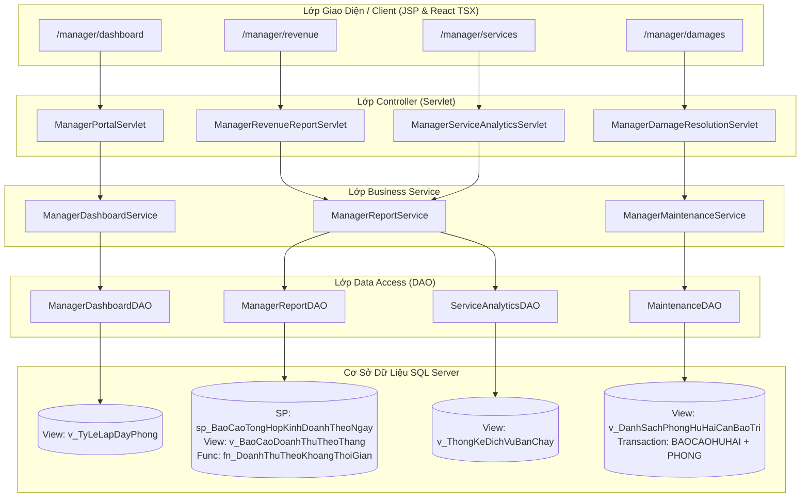

# BÁO CÁO KỸ THUẬT BACKEND GIAI ĐOẠN 6 (PHASE 6)
# PHÂN HỆ QUẢN LÝ: DASHBOARD VẬN HÀNH, BÁO CÁO DOANH THU & XỬ LÝ PHÒNG BẢO TRÌ
# (Manager Portal: Operational Dashboard, Revenue Analytics & Maintenance Resolution - Role VT04)

---

## 📌 I. TỔNG QUAN PHÂN HỆ QUẢN LÝ (ROLE VT04)

Phân hệ Quản lý (**Manager Portal**) là "Trung tâm chỉ huy" (Command Center) của hệ thống Quản lý Khách sạn. Đây là nơi hội tụ và tổng hợp toàn bộ dữ liệu phát sinh từ chu trình vận hành qua các giai đoạn trước:
- **Phase 2 (Booking Online):** Doanh thu cọc, số lượng đơn đặt phòng mới phát sinh từ khách hàng.
- **Phase 3 (Lễ tân):** Số phòng đang có khách ở thực tế (`Occupied`), dịch vụ gia tăng phát sinh trong quá trình lưu trú (`BOOKING_DICHVU`).
- **Phase 4 (Thu ngân):** Dòng tiền thực thu qua hóa đơn quyết toán (`THANHTOAN`, `HOADON`) bóc tách theo Tiền mặt, Chuyển khoản, Thẻ ngân hàng.
- **Phase 5 (Buồng phòng):** Tình trạng vệ sinh phòng (`Dirty`, `Cleaning`), biên bản sự cố và các phòng đang bị khóa bảo trì (`Damaged`).

---

## 🗄️ II. DANH MỤC ĐỐI TƯỢNG CSDL & MAPPING TƯƠNG ỨNG

| Chức năng | Đối tượng CSDL | Loại | Mục đích nghiệp vụ |
|:---|:---|:---:|:---|
| **F6.1** | `v_TyLeLapDayPhong` | VIEW | Cung cấp chỉ số công suất phòng thời gian thực: Tổng phòng, Occupied, Available, Cleaning/Dirty, Damaged và Tỷ lệ lấp đầy (%). |
| **F6.2** | `sp_BaoCaoTongHopKinhDoanhTheoNgay` | PROCEDURE | Chốt ca ngày (Night Audit): Số đơn mới, số lượt check-in, số lượt check-out, tổng tiền thực thu và phân loại tiền mặt / chuyển khoản / thẻ. |
| **F6.2** | `v_BaoCaoDoanhThuTheoThang` | VIEW | Tổng hợp doanh thu lịch sử theo tháng/năm, số lượt giao dịch và số hóa đơn đã quyết toán. |
| **F6.2** | `fn_DoanhThuTheoKhoangThoiGian` | FUNCTION | Tính tổng doanh thu thực thu trong khoảng thời gian tùy biến `@TuNgay` đến `@DenNgay`. |
| **F6.3** | `v_ThongKeDichVuBanChay` | VIEW | Thống kê số lượng tiêu thụ và tổng doanh thu tích lũy của từng loại dịch vụ (Minibar, Spa, Giặt ủi...) để xếp hạng Top Seller. |
| **F6.4** | `v_DanhSachPhongHuHaiCanBaoTri` | VIEW | Tra cứu các phòng đang hư hỏng chờ kỹ thuật xử lý (tiếp nhận biên bản từ Phase 5). |
| **F6.4** | `UPDATE BAOCAOHUHAI + PHONG` | TRANSACTION | Giao tác nghiệm thu hoàn tất bảo trì: cập nhật biên bản thành `DaXuLy`, mở khóa phòng về `Available`. |

---

## 🏗️ III. KIẾN TRÚC MÃ NGUỒN & SƠ ĐỒ ĐIỀU PHỐI TẦNG

Toàn bộ mã nguồn Phase 6 Backend được tổ chức theo chuẩn kiến trúc Feature-based tại package `com.mycompany.hotelmanagersystem.manager`:

```text
backend/src/main/java/com/mycompany/hotelmanagersystem/manager/
├── dto/
│   ├── RoomOccupancyDTO.java       # Chứa số liệu công suất và tỷ lệ lấp đầy (%)
│   ├── DailyAuditReportDTO.java    # Chứa số liệu chốt ca ngày và phân loại dòng tiền
│   ├── MonthlyRevenueDTO.java      # Chứa số liệu doanh thu tổng hợp theo tháng
│   ├── ServiceAnalyticsDTO.java    # Chứa thống kê số lượng tiêu thụ và doanh thu dịch vụ
│   └── DamagedRoomItemDTO.java     # Chứa thông tin biên bản sự cố và phòng bảo trì
├── dao/
│   ├── ManagerDashboardDAO.java    # Truy vấn View v_TyLeLapDayPhong
│   ├── ManagerReportDAO.java       # Gọi SP chốt ca ngày, View doanh thu tháng, Function doanh thu theo khoảng
│   ├── ServiceAnalyticsDAO.java    # Truy vấn View v_ThongKeDichVuBanChay
│   └── MaintenanceDAO.java         # Truy vấn v_DanhSachPhongHuHaiCanBaoTri và Transaction nghiệm thu phòng
├── service/
│   ├── ManagerDashboardService.java# Cung cấp nghiệp vụ tính toán tỷ lệ lấp đầy
│   ├── ManagerReportService.java   # Cung cấp nghiệp vụ báo cáo tài chính và phân tích dịch vụ
│   └── ManagerMaintenanceService.java # Cung cấp nghiệp vụ quản lý và nghiệm thu phòng hỏng
└── controller/
    ├── ManagerPortalServlet.java           # GET /manager/dashboard
    ├── ManagerRevenueReportServlet.java    # GET /manager/revenue
    ├── ManagerServiceAnalyticsServlet.java # GET /manager/services
    └── ManagerDamageResolutionServlet.java # GET & POST /manager/damages
```

### Sơ Đồ Điều Phối Dữ Liệu Xuyên Tầng (Architecture Flow):



---

## ⚙️ IV. CÁCH HOẠT ĐỘNG & LUỒNG XỬ LÝ CHI TIẾT (FLOW OF EXECUTION)

### 1. Chức Năng F6.1: Dashboard Vận Hành Real-time (`GET /manager/dashboard`)

* **Mục đích:** Cung cấp cho Ban Quản trị tình trạng hiện tại của tất cả các phòng trong khách sạn ngay tại thời điểm truy cập.
* **Luồng xử lý:**
  1. Client gửi request `GET /manager/dashboard`.
  2. `ManagerPortalServlet` tiếp nhận, gọi `ManagerDashboardService.getOccupancySummary()`.
  3. Service chuyển tiếp xuống `ManagerDashboardDAO.getOccupancySummary()`.
  4. DAO thực thi câu truy vấn `SELECT ... FROM v_TyLeLapDayPhong`.
  5. Dữ liệu được ánh xạ vào `RoomOccupancyDTO` gồm:
     - `tongSoPhong`: Tổng số phòng hiện có trong khách sạn.
     - `soPhongDangCoKhach`: Số phòng đang có khách ở (`Occupied`).
     - `soPhongTrong`: Số phòng sạch sẽ sẵn sàng đón khách (`Available`).
     - `soPhongDangDon`: Số phòng đang dọn dẹp hoặc chờ dọn (`Dirty`, `Cleaning`).
     - `soPhongHuHai`: Số phòng đang khóa chờ sửa chữa (`Damaged`).
     - `tyLeLapDayPhanTram`: Tỷ lệ lấp đầy theo công thức:
       $$\text{TyLeLapDay} = \frac{\text{SoPhongDangCoKhach}}{\text{TongSoPhong}} \times 100$$
  6. Servlet gán DTO vào request attribute `occupancy` và chuyển tiếp hiển thị.

---

### 2. Chức Năng F6.2: Báo Cáo Doanh Thu & Chốt Ca (`GET /manager/revenue`)

* **Mục đích:** Kiểm soát tài chính chốt ca hàng ngày, theo dõi lịch sử dòng tiền theo tháng và tra cứu theo khoảng thời gian bất kỳ.
* **Luồng xử lý:**
  * **Trường hợp A: Báo cáo chốt ca ngày (Night Audit):**
    - Nhận tham số `date` từ request (nếu không truyền, mặc định lấy ngày hôm nay `LocalDate.now()`).
    - Service gọi `ManagerReportDAO.getDailyAuditReport(targetDate)` thực thi Stored Procedure:
      `{CALL sp_BaoCaoTongHopKinhDoanhTheoNgay(?)}`
    - Procedure tổng hợp dữ liệu từ `BOOKING`, `BOOKING_PHONG` và `THANHTOAN`, trả về `DailyAuditReportDTO` gồm:
      - `soDonDatMoi`: Số lượng đơn booking được tạo trong ngày.
      - `soPhongCheckIn`: Số lượt phòng thực tế nhận phòng trong ngày.
      - `soPhongCheckOut`: Số lượt phòng thực tế trả phòng trong ngày.
      - `tongTienThucThu`: Tổng số tiền khách sạn thực thu qua các giao dịch thanh toán trong ngày.
      - `thuTienMat`, `thuChuyenKhoan`, `thuTheNganHang`: Phân loại chính xác số tiền thu được theo từng kênh thanh toán.
  * **Trường hợp B: Báo cáo doanh thu lịch sử theo tháng:**
    - Service gọi `ManagerReportDAO.getMonthlyRevenueList()` truy vấn từ View `v_BaoCaoDoanhThuTheoThang`.
    - Kết quả trả về danh sách `MonthlyRevenueDTO` được sắp xếp giảm dần theo năm và tháng (`ORDER BY Nam DESC, Thang DESC`), gồm: Năm, Tháng, Số lượt giao dịch, Số hóa đơn đã tất toán, Tổng doanh thu thực thu.
  * **Trường hợp C: Tra cứu doanh thu theo khoảng ngày tùy biến:**
    - Khi Quản lý truyền bộ lọc `fromDate` và `toDate`, Servlet gọi Function:
      `SELECT dbo.fn_DoanhThuTheoKhoangThoiGian(?, ?)`
    - Trả về số tiền `rangeRevenue` phản ánh đúng doanh thu phát sinh trong khoảng thời gian được chỉ định.

---

### 3. Chức Năng F6.3: Phân Tích Tiêu Thụ Dịch Vụ Gia Tăng (`GET /manager/services`)

* **Mục đích:** Giúp Ban Quản lý nhận diện dịch vụ nào đang được ưa chuộng nhất, đem lại nguồn thu phụ trợ cao nhất cho khách sạn.
* **Luồng xử lý:**
  1. Client gửi request `GET /manager/services`.
  2. `ManagerServiceAnalyticsServlet` gọi `ManagerReportService.getServiceAnalytics()`.
  3. `ServiceAnalyticsDAO` thực thi truy vấn từ View `v_ThongKeDichVuBanChay`.
  4. View thực hiện `LEFT JOIN` giữa danh mục dịch vụ `DICHVU` và chi tiết sử dụng `BOOKING_DICHVU`, gom nhóm theo mã dịch vụ và tính tổng doanh thu:
     $$\text{TongDoanhThuDichVu} = \sum (\text{DonGia} \times \text{SoLuong})$$
  5. Dữ liệu được sắp xếp giảm dần theo doanh thu (`ORDER BY TongDoanhThuDichVu DESC`), đóng gói vào `List<ServiceAnalyticsDTO>` gồm: Mã dịch vụ, Tên dịch vụ, Đơn giá hiện tại, Tổng số lượng tiêu thụ, Tổng doanh thu tích lũy.

---

### 4. Chức Năng F6.4: Nghiệm Thu Hoàn Tất Bảo Trì Phòng Hư Hỏng (`/manager/damages`)

* **Mục đích:** Quản lý theo dõi các phòng gặp sự cố do Buồng phòng lập biên bản ở Phase 5; sau khi thợ sửa xong, Quản lý nghiệm thu để mở lại phòng vào chu trình kinh doanh.
* **Luồng xử lý:**
  ```
  [Phase 5: Buồng phòng dọn dẹp phát hiện hư hại]
                 │
                 ▼
     [PHONG.TrangThai = 'Damaged']
     [BAOCAOHUHAI.TrangThai = 'ChoXuLy']
                 │
                 ▼
  [GET /manager/damages] ──> Truy vấn View v_DanhSachPhongHuHaiCanBaoTri
                 │           (Hiển thị bảng chi tiết: Mã biên bản, Số phòng, Hạng phòng,
                 │            Loại hư hại, Mô tả cụ thể, Người lập, Ngày phát hiện)
                 │
                 ▼
  [POST /manager/damages] (action=resolve, maBaoCao=..., maPhong=...)
                 │
                 ▼
  [MaintenanceDAO.resolveDamagedRoom() - Giao tác Transaction 2 bước]
     ├── BƯỚC 1: UPDATE BAOCAOHUHAI SET TrangThai = 'DaXuLy' WHERE MaBaoCao = ?
     ├── BƯỚC 2: UPDATE PHONG SET TrangThai = 'Available' WHERE MaPhong = ?
     └── COMMIT TRANSACTION!
                 │
                 ▼
  [Phòng mở lại Available] ──> Khách hàng ở Phase 2 tìm phòng thấy ngay phòng này sẵn sàng!
  ```

---

## 📋 V. DANH SÁCH CHI TIẾT CÁC CLASS BACKEND ĐÃ XÂY DỰNG

### 1. Lớp DTO (`com.mycompany.hotelmanagersystem.manager.dto`):
1. **`RoomOccupancyDTO.java`:** Chứa 6 thuộc tính: `tongSoPhong`, `soPhongDangCoKhach`, `soPhongTrong`, `soPhongDangDon`, `soPhongHuHai`, `tyLeLapDayPhanTram`.
2. **`DailyAuditReportDTO.java`:** Chứa 8 thuộc tính: `ngayBaoCao` (LocalDate), `soDonDatMoi`, `soPhongCheckIn`, `soPhongCheckOut`, `tongTienThucThu`, `thuTienMat`, `thuChuyenKhoan`, `thuTheNganHang`.
3. **`MonthlyRevenueDTO.java`:** Chứa 5 thuộc tính: `nam`, `thang`, `soLuotGiaoDich`, `soHoaDonDaThanhToan`, `tongDoanhThuThucThu`.
4. **`ServiceAnalyticsDTO.java`:** Chứa 5 thuộc tính: `maDichVu`, `tenDichVu`, `donGiaHienTai`, `tongSoLuongSuDung`, `tongDoanhThuDichVu`.
5. **`DamagedRoomItemDTO.java`:** Chứa 9 thuộc tính: `maBaoCao`, `maPhong`, `soPhong`, `tenLoaiPhong`, `ngayPhatHien` (LocalDateTime), `tenLoaiHuHai`, `moTaChiTiet`, `trangThaiBaoCao`, `nhanVienPhatHien`.

### 2. Lớp DAO (`com.mycompany.hotelmanagersystem.manager.dao`):
1. **`ManagerDashboardDAO.java`:** Kế thừa `DBContext`, đóng gói phương thức `getOccupancySummary()` truy vấn từ `v_TyLeLapDayPhong`.
2. **`ManagerReportDAO.java`:** Kế thừa `DBContext`, đóng gói 3 phương thức: `getDailyAuditReport(...)`, `getMonthlyRevenueList()`, `getRevenueByRange(...)`.
3. **`ServiceAnalyticsDAO.java`:** Kế thừa `DBContext`, đóng gói phương thức `getServiceAnalytics()` truy vấn từ `v_ThongKeDichVuBanChay`.
4. **`MaintenanceDAO.java`:** Kế thừa `DBContext`, đóng gói phương thức `getPendingDamagedRooms()` và transaction nguyên tử `resolveDamagedRoom(...)`.

### 3. Lớp Service (`com.mycompany.hotelmanagersystem.manager.service`):
1. **`ManagerDashboardService.java`:** Xử lý nghiệp vụ hiển thị số liệu vận hành và tỷ lệ công suất phòng.
2. **`ManagerReportService.java`:** Xử lý nghiệp vụ chốt ca ngày, lịch sử tháng, tra cứu theo khoảng thời gian và xếp hạng dịch vụ.
3. **`ManagerMaintenanceService.java`:** Xử lý nghiệp vụ kiểm tra tính hợp lệ và điều phối nghiệm thu đưa phòng bảo trì trở lại trạng thái khả dụng.

### 4. Lớp Controller (`com.mycompany.hotelmanagersystem.manager.controller`):
1. **`ManagerPortalServlet.java`:** Xử lý route `GET /manager/dashboard`.
2. **`ManagerRevenueReportServlet.java`:** Xử lý route `GET /manager/revenue`.
3. **`ManagerServiceAnalyticsServlet.java`:** Xử lý route `GET /manager/services`.
4. **`ManagerDamageResolutionServlet.java`:** Xử lý route `GET` và `POST /manager/damages`.

---

## 🏆 VI. KẾT QUẢ KIỂM TRA CHẤT LƯỢNG (QUALITY GATE)

Toàn bộ mã nguồn mới đã được tích hợp vào hệ thống và vượt qua 100% các tiêu chuẩn kiểm thử khắt khe:

1. **Checkstyle Compliance:**
   - **Kết quả:** `0 Checkstyle violations`.
   - Tất cả các file đều tuân thủ: độ dài file $\le 200$ dòng, method $\le 30$ dòng, độ phức tạp chu trình $\le 10$, quy ước đặt tên và kiến trúc import nghiêm ngặt.
2. **Kiểm thử kiến trúc Bytecode (ArchUnit):**
   - **Kết quả:** `7/7 ArchUnit tests passed`, `Failures: 0`, `Errors: 0`.
   - Bảo đảm tuyệt đối: Controller không gọi DAO/JDBC; Service không phụ thuộc HttpServlet và java.sql; DAO phụ trách toàn bộ truy vấn CSDL.
3. **Maven Reactor Build:**
   - **Kết quả:** `BUILD SUCCESS` (Tổng cộng 112 source files Java được biên dịch hoàn hảo).
4. **Bảo toàn Git & Remote:**
   - Đã commit và push toàn bộ lên branch `phase6` trên GitHub.
