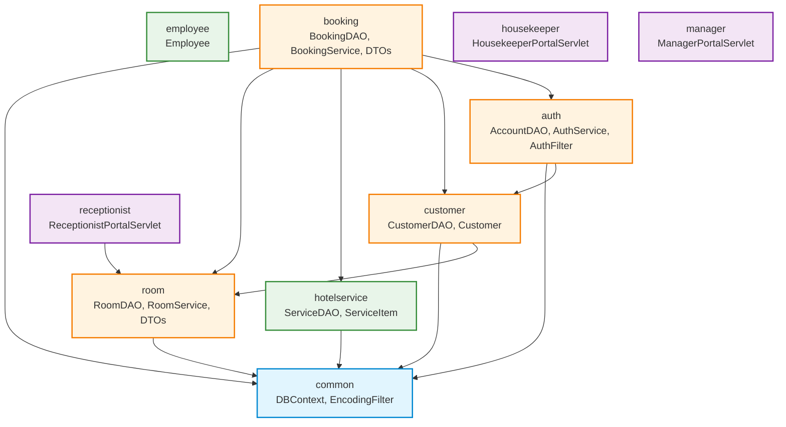

# ĐỀ XUẤT KIẾN TRÚC: TÁI CẤU TRÚC DỰ ÁN THEO FEATURE-BASED (PACKAGE-BY-FEATURE)
**Dự án:** Hệ Thống Quản Lý Khách Sạn (Hotel Management System)  
**Nhánh thực hiện:** `refactor/feature-structure` (tách từ `phase3`)  
**Tác giả đề xuất:** Senior Java Backend Engineer & Software Architect  
**Trạng thái:** Chờ phê duyệt (Giai đoạn 1 - Khảo sát và lập đề xuất)  
**Tiêu chuẩn tuân thủ:** `.agents/rules/GEMINI.md` & `strict-review-before-code`

---

## MỤC LỤC
1. [Kết Quả Kiểm Chứng & Khảo Sát Hiện Trạng](#1-kết-quả-kiểm-chứng--khảo-sát-hiện-trạng)
2. [Bảng Ánh Xạ Toàn Bộ File Mã Nguồn Java](#2-bảng-ánh-xạ-toàn-bộ-file-mã-nguồn-java)
3. [Bảng Ánh Xạ Toàn Bộ File Ngoài Java](#3-bảng-ánh-xạ-toàn-bộ-file-ngoài-java)
4. [Danh Sách File Cần Cập Nhật Package & Import](#4-danh-sách-file-cần-cập-nhật-package--import)
5. [Ma Trận Phụ Thuộc Giữa Các Feature (Dependency Matrix)](#5-ma-trận-phụ-thuộc-giữa-các-feature-dependency-matrix)
6. [Bảng Tác Dụng Từng Thư Mục Cấu Trúc Đích](#6-bảng-tác-dụng-từng-thư-mục-cấu-trúc-đích)
7. [Quy Chuẩn: Khi Thêm Tính Năng Mới Đặt File Ở Đâu](#7-quy-chuẩn-khi-thêm-tính-năng-mới-đặt-file-ở-đâu)
8. [Phát Hiện Ngoài Phạm Vi (Chỉ Báo Cáo, Không Sửa)](#8-phát-hiện-ngoài-phạm-vi-chỉ-báo-cáo-không-sửa)
9. [Kế Hoạch Thực Thi Từng Commit & Phương Án Rollback](#9-kế-hoạch-thực-thi-từng-commit--phương-án-rollback)

---

## 1. KẾT QUẢ KIỂM CHỨNG & KHẢO SÁT HIỆN TRẠNG

### 1.1. Hiện trạng nhánh và kiểm tra theo dõi file của Git
* **Nhánh hiện tại:** `phase3` (sẽ tạo nhánh mới `refactor/feature-structure` trước khi thực thi).
* **Số lượng file `target/` bị Git theo dõi:** Chính xác **133 file** (do dự án ban đầu chưa có tệp `.gitignore`).
* **Số lượng file Java nguồn (`src/main/java`):** **52 file** (gồm 50 file mã nguồn nghiệp vụ thực tế và 2 file mẫu sinh tự động từ NetBeans).
* **Số lượng Servlet (`@WebServlet`):** **14 Servlets** đăng ký bằng annotation (0 khai báo trong `web.xml`).
* **Số lượng Filter (`@WebFilter`):** **2 Filters** (`EncodingFilter`, `AuthFilter`) đăng ký bằng annotation.
* **Số lượng trang JSP:** **16 file JSP** (1 `index.jsp` tại gốc webapp, 6 trong `views/common`, 6 trong `views/customer`, 1 `views/housekeeper`, 1 `views/manager`, 1 `views/receptionist`, và 1 thư mục rỗng `views/guest`).
* **Tệp `index.jsp`:** Đang import FQN `com.mycompany.hotelmanagersystem.util.DBContext` tại dòng 2.

### 1.2. Khảo sát tham chiếu chéo toàn hệ thống (Grep Results)
1. **Tham chiếu tới `scratch`:** Xuất hiện trong 1 file báo cáo (`BaoCao_KiemThu_Phase2_TacDong_FN31.md`), và khai báo `package scratch;` trong 5 file Java test độc lập.
2. **Tham chiếu tới `temp_images` & `temp_images2`:** Không có bất kỳ dòng code `.java`, `.jsp`, `.md`, `.css` nào tham chiếu đến 2 thư mục này. Đây là các file ảnh trích xuất tạm thời từ tài liệu Word.
3. **Tham chiếu tới `SQL_Scripts`:** Xuất hiện trong 4 file tài liệu Markdown và 1 script python tạo báo cáo.
4. **Tham chiếu tới `TaiLieu_DuAn`:** Xuất hiện trong 9 file tài liệu Markdown, 4 script python và file quy tắc `.agents/skills/strict-review-before-code/SKILL.md`.
5. **Tham chiếu tới `javax.ws.rs`:** Chỉ xuất hiện duy nhất trong 2 file mẫu NetBeans: `JakartaRestConfiguration.java` và `resources/JakartaEE8Resource.java`. Không có bất kỳ Servlet hay logic nghiệp vụ nào sử dụng JAX-RS.
6. **Tham chiếu tới `persistence`:** Chỉ xuất hiện duy nhất trong `src/main/resources/META-INF/persistence.xml` (file rỗng cấu hình mặc định NetBeans). Dự án sử dụng thuần JDBC Driver qua `DBContext`, không dùng JPA.

---

## 2. BẢNG ÁNH XẠ TOÀN BỘ FILE MÃ NGUỒN JAVA

Tất cả 52 file Java được phân loại chính xác theo domain nghiệp vụ (Feature), đảm bảo tính cô lập cao (High Cohesion) và giảm thiểu phụ thuộc lỏng lẻo (Loose Coupling):

| STT | Tên Lớp (Class Name) | FQCN Cũ (Layer-based) | FQCN Mới (Feature-based) | Feature Đích | Lý Do Kiến Trúc |
| :---: | :--- | :--- | :--- | :--- | :--- |
| **I** | **NHÓM COMMON** | | | | |
| 1 | `DBContext` | `...util.DBContext` | `...common.config.DBContext` | `common` | Quản lý kết nối JDBC SQL Server dùng chung cho mọi DAO |
| 2 | `EncodingFilter` | `...filter.common.EncodingFilter` | `...common.filter.EncodingFilter` | `common` | Bộ lọc mã hóa UTF-8 cho toàn bộ request/response |
| **II** | **NHÓM AUTH** | | | | |
| 3 | `LoginServlet` | `...controller.auth.LoginServlet` | `...auth.controller.LoginServlet` | `auth` | Xử lý đăng nhập hệ thống |
| 4 | `LogoutServlet` | `...controller.auth.LogoutServlet` | `...auth.controller.LogoutServlet` | `auth` | Xử lý đăng xuất phiên làm việc |
| 5 | `RegisterServlet` | `...controller.auth.RegisterServlet` | `...auth.controller.RegisterServlet` | `auth` | Xử lý đăng ký tài khoản khách hàng |
| 6 | `AuthService` | `...service.auth.AuthService` | `...auth.service.AuthService` | `auth` | Nghiệp vụ xác thực, phân quyền và băm mật khẩu |
| 7 | `AccountDAO` | `...dao.auth.AccountDAO` | `...auth.dao.AccountDAO` | `auth` | Thao tác CSDL bảng `TAIKHOAN` |
| 8 | `UserSessionDTO` | `...dto.auth.UserSessionDTO` | `...auth.dto.UserSessionDTO` | `auth` | Dữ liệu phiên người dùng lưu trong HttpSession |
| 9 | `Account` | `...model.Account` | `...auth.model.Account` | `auth` | Thực thể bảng `TAIKHOAN` |
| 10 | `Role` | `...model.Role` | `...auth.model.Role` | `auth` | Thực thể vai trò người dùng (`VAITRO`) |
| 11 | `AuthFilter` | `...filter.auth.AuthFilter` | `...auth.filter.AuthFilter` | `auth` | Bộ lọc kiểm tra phân quyền truy cập URL theo vai trò |
| 12 | `PasswordUtil` | `...util.PasswordUtil` | `...auth.util.PasswordUtil` | `auth` | Tiện ích băm mật khẩu SHA-256 (chỉ Auth sử dụng) |
| **III** | **NHÓM CUSTOMER** | | | | |
| 13 | `CustomerPortalServlet`| `...controller.customer.CustomerPortalServlet` | `...customer.controller.CustomerPortalServlet` | `customer` | Điều hướng trang chủ phân hệ Khách hàng (`/customer/home`) |
| 14 | `CustomerDAO` | `...dao.customer.CustomerDAO` | `...customer.dao.CustomerDAO` | `customer` | Thao tác CSDL bảng `KHACHHANG` |
| 15 | `Customer` | `...model.Customer` | `...customer.model.Customer` | `customer` | Thực thể khách hàng (`KHACHHANG`) |
| **IV** | **NHÓM ROOM** | | | | |
| 16 | `CustomerSearchRoomServlet` | `...controller.customer.CustomerSearchRoomServlet` | `...room.controller.CustomerSearchRoomServlet` | `room` | Tra cứu phòng trống theo ngày và loại phòng |
| 17 | `CustomerRoomDetailServlet` | `...controller.customer.CustomerRoomDetailServlet` | `...room.controller.CustomerRoomDetailServlet` | `room` | Xem chi tiết thông số và tiện nghi phòng |
| 18 | `RoomService` | `...service.room.RoomService` | `...room.service.RoomService` | `room` | Xử lý logic nghiệp vụ phòng và trạng thái khả dụng |
| 19 | `RoomDAO` | `...dao.room.RoomDAO` | `...room.dao.RoomDAO` | `room` | Thao tác CSDL bảng `PHONG`, `LOAIPHONG` |
| 20 | `AvailableRoomDTO` | `...dto.room.AvailableRoomDTO` | `...room.dto.AvailableRoomDTO` | `room` | Chứa dữ liệu hiển thị thẻ phòng kèm giá và khuyến mãi |
| 21 | `RoomMapKpiDTO` | `...dto.receptionist.RoomMapKpiDTO` | `...room.dto.RoomMapKpiDTO` | `room` | DTO thống kê KPI phòng (đặt tại room để tránh chu trình phụ thuộc) |
| 22 | `RoomTimelineDTO` | `...dto.receptionist.RoomTimelineDTO` | `...room.dto.RoomTimelineDTO` | `room` | DTO sơ đồ timeline phòng (đặt tại room tránh chu trình phụ thuộc) |
| 23 | `BookingBarDTO` | `...dto.receptionist.BookingBarDTO` | `...room.dto.BookingBarDTO` | `room` | DTO thanh trực quan đặt phòng theo trục thời gian |
| 24 | `Room` | `...model.Room` | `...room.model.Room` | `room` | Thực thể phòng vật lý (`PHONG`) |
| 25 | `RoomType` | `...model.RoomType` | `...room.model.RoomType` | `room` | Thực thể loại phòng (`LOAIPHONG`) |
| **V** | **NHÓM BOOKING** | | | | |
| 26 | `CustomerCartServlet` | `...controller.customer.CustomerCartServlet` | `...booking.controller.CustomerCartServlet` | `booking` | Quản lý giỏ phòng và dịch vụ chọn trước |
| 27 | `CustomerBookingServlet`| `...controller.customer.CustomerBookingServlet` | `...booking.controller.CustomerBookingServlet` | `booking` | Xử lý nhập thông tin lưu trú và tạo đơn đặt phòng |
| 28 | `CustomerBookingDetailServlet` | `...controller.customer.CustomerBookingDetailServlet` | `...booking.controller.CustomerBookingDetailServlet` | `booking` | Xem chi tiết đơn đặt phòng và hóa đơn tạm tính |
| 29 | `CustomerAddServiceServlet` | `...controller.customer.CustomerAddServiceServlet` | `...booking.controller.CustomerAddServiceServlet` | `booking` | Thêm dịch vụ phát sinh vào đơn đang lưu trú |
| 30 | `CustomerHistoryServlet` | `...controller.customer.CustomerHistoryServlet` | `...booking.controller.CustomerHistoryServlet` | `booking` | Xem lịch sử các đơn đặt phòng của tài khoản |
| 31 | `BookingService` | `...service.booking.BookingService` | `...booking.service.BookingService` | `booking` | Điều phối nghiệp vụ đặt phòng, hủy phòng, tính tiền |
| 32 | `BookingDAO` | `...dao.booking.BookingDAO` | `...booking.dao.BookingDAO` | `booking` | Thao tác CSDL các bảng `BOOKING`, `BOOKING_PHONG`, `HOADON` |
| 33 | `BookingCartDTO` | `...dto.booking.BookingCartDTO` | `...booking.dto.BookingCartDTO` | `booking` | DTO giỏ hàng lưu Session |
| 34 | `CartRoomItemDTO` | `...dto.booking.CartRoomItemDTO` | `...booking.dto.CartRoomItemDTO` | `booking` | DTO chi tiết phòng trong giỏ |
| 35 | `CartServiceItemDTO`| `...dto.booking.CartServiceItemDTO` | `...booking.dto.CartServiceItemDTO` | `booking` | DTO dịch vụ đi kèm trong giỏ |
| 36 | `BookingRequestDTO` | `...dto.booking.BookingRequestDTO` | `...booking.dto.BookingRequestDTO` | `booking` | DTO đóng gói yêu cầu tạo đơn đặt phòng |
| 37 | `BookingDetailDTO` | `...dto.booking.BookingDetailDTO` | `...booking.dto.BookingDetailDTO` | `booking` | DTO hiển thị chi tiết đơn đặt |
| 38 | `BookingDichVuItemDTO` | `...dto.booking.BookingDichVuItemDTO` | `...booking.dto.BookingDichVuItemDTO` | `booking` | DTO hiển thị dòng dịch vụ đã sử dụng |
| 39 | `CustomerBookingHistoryDTO` | `...dto.booking.CustomerBookingHistoryDTO` | `...booking.dto.CustomerBookingHistoryDTO` | `booking` | DTO dòng lịch sử đặt phòng của khách hàng |
| 40 | `RoomBookingDetailDTO` | `...dto.booking.RoomBookingDetailDTO` | `...booking.dto.RoomBookingDetailDTO` | `booking` | DTO chi tiết phòng trong đơn booking |
| 41 | `Booking` | `...model.Booking` | `...booking.model.Booking` | `booking` | Thực thể đơn đặt phòng (`BOOKING`) |
| 42 | `BookingRoom` | `...model.BookingRoom` | `...booking.model.BookingRoom` | `booking` | Thực thể phòng thuộc đơn (`BOOKING_PHONG`) |
| 43 | `BookingDichVu` | `...model.BookingDichVu` | `...booking.model.BookingDichVu` | `booking` | Thực thể dịch vụ của đơn (`BOOKING_DICHVU`) |
| 44 | `Invoice` | `...model.Invoice` | `...booking.model.Invoice` | `booking` | Thực thể hóa đơn thanh toán (`HOADON`) |
| **VI** | **NHÓM HOTEL SERVICE** | | | | |
| 45 | `ServiceDAO` | `...dao.service.ServiceDAO` | `...hotelservice.dao.ServiceDAO` | `hotelservice` | Thao tác danh mục dịch vụ CSDL (`DICHVU`) |
| 46 | `ServiceItem` | `...model.ServiceItem` | `...hotelservice.model.ServiceItem` | `hotelservice` | Thực thể dịch vụ khách sạn (`DICHVU`) |
| **VII** | **NHÓM EMPLOYEE** | | | | |
| 47 | `Employee` | `...model.Employee` | `...employee.model.Employee` | `employee` | Thực thể nhân viên (`NHANVIEN`) |
| **VIII** | **NHÓM RECEPTIONIST** | | | | |
| 48 | `ReceptionistPortalServlet` | `...controller.receptionist.ReceptionistPortalServlet` | `...receptionist.controller.ReceptionistPortalServlet` | `receptionist` | Điều hướng cổng Lễ tân và sơ đồ phòng trực quan |
| **IX** | **NHÓM HOUSEKEEPER** | | | | |
| 49 | `HousekeeperPortalServlet` | `...controller.housekeeper.HousekeeperPortalServlet` | `...housekeeper.controller.HousekeeperPortalServlet` | `housekeeper` | Điều hướng cổng Buồng phòng (`/housekeeper/tasks`) |
| **X** | **NHÓM MANAGER** | | | | |
| 50 | `ManagerPortalServlet` | `...controller.manager.ManagerPortalServlet` | `...manager.controller.ManagerPortalServlet` | `manager` | Điều hướng cổng Quản lý (`/manager/dashboard`) |
| **XI** | **MÃ MẪU NETBEANS (ĐỀ XUẤT XỬ LÝ)** | | | | |
| 51 | `JakartaRestConfiguration` | `...JakartaRestConfiguration` | *(Xóa hoặc chuyển tools/)* | `sample` | Code mẫu NetBeans JAX-RS không dùng đến |
| 52 | `JakartaEE8Resource` | `...resources.JakartaEE8Resource` | *(Xóa hoặc chuyển tools/)* | `sample` | Code mẫu NetBeans JAX-RS không dùng đến |

---

## 3. BẢNG ÁNH XẠ TOÀN BỘ FILE NGOÀI JAVA

| Đường Dẫn Cũ | Đường Dẫn Mới | Hành Động | Lý Do Kiến Trúc | Rủi Ro & Giải Pháp Kiểm Soát |
| :--- | :--- | :---: | :--- | :--- |
| `target/` (133 files) | *(Không theo dõi Git)* | `git rm -r --cached` | Thư mục build nhị phân không được commit vào Git | **Thấp:** Sau khi bỏ theo dõi, chạy `mvn clean package` để sinh lại bình thường. |
| *(Chưa có)* | `.gitignore` | Tạo mới | Chặn `target/`, file `.class`, IDE caches bị commit | **Không:** Đảm bảo repo luôn sạch sẽ. |
| *(Chưa có)* | `README.md` (root) | Tạo mới | Cung cấp tài liệu tổng quan, công nghệ, hướng dẫn build/run | **Không:** Tăng tính chuyên nghiệp của đồ án. |
| `SQL_Scripts/` (7 files) | `database/` (7 files) + `README.md` | Di chuyển (`git mv`) | Quy chuẩn tên thư mục quốc tế, đánh số thứ tự chạy tránh lỗi phụ thuộc khóa ngoại | **Thấp:** Đánh số `01_` đến `07_`, giữ nguyên 100% nội dung SQL bên trong. |
| `TaiLieu_DuAn/` (15 files) | `docs/` (15 files) | Di chuyển (`git mv`) | Chuẩn hóa theo cấu hình người dùng yêu cầu | **Thấp:** Cập nhật các đường dẫn tương đối trong Markdown, xóa link tuyệt đối `file:///d:...`. |
| `scratch/Run20TestCases*.java`, `Test*.java`, `Check*.java` (5 files) | `tools/manual-tests/` | Di chuyển (`git mv`) | Nhóm các tệp kiểm thử độc lập vào công cụ hỗ trợ dev | **Thấp:** Cập nhật import mới, kiểm chứng bằng lệnh `javac` độc lập. |
| `scratch/*.py` (4 files) | `tools/doc-builders/` | Di chuyển (`git mv`) | Gom các script hỗ trợ biên soạn tài liệu | **Không:** Cập nhật đường dẫn file nếu cần chạy lại. |
| `scratch/*.class` (5 files) | *(Xóa bỏ)* | `git rm` | File nhị phân không được lưu trong Git | **Không:** Có thể biên dịch lại bất cứ khi nào. |
| `scratch/test_utf8.txt` | *(Xóa bỏ)* | `git rm` | File kiểm tra tạm thời, không có giá trị sản phẩm | **Không:** Đã xác minh UTF-8 thông qua filter và DB. |
| `temp_images/`, `temp_images2/` (6 files) | *(Xóa bỏ)* | `git rm -r` | File ảnh rác trích xuất Word không ai tham chiếu | **Không:** Đã grep kiểm chứng 0 file tham chiếu. |
| `nb-configuration.xml` | `nb-configuration.xml` | Giữ nguyên | Cấu hình IDE NetBeans của đồ án | **Không:** Không ảnh hưởng đến Maven CLI. |
| `src/main/resources/META-INF/persistence.xml` | *(Xóa bỏ)* | `git rm` | Cấu hình JPA rỗng NetBeans sinh thừa, dự án dùng JDBC | **Không:** Dự án thuần Servlet/JDBC, không dùng EntityManager. |
| `src/main/webapp/views/guest/` (rỗng) | *(Xóa bỏ)* | Xóa thư mục | Thư mục rỗng không sử dụng | **Không:** Khách vãng lai xem chung `views/customer`. |
| `src/main/webapp/assets/js/` (rỗng) | `src/main/webapp/assets/js/.gitkeep` | Thêm `.gitkeep` | Giữ cấu trúc thư mục chuẩn webapp | **Không:** Sẵn sàng cho JS ở các sprint sau. |
| `src/main/webapp/assets/images/` (rỗng) | `src/main/webapp/assets/images/.gitkeep`| Thêm `.gitkeep` | Giữ cấu trúc thư mục chuẩn webapp | **Không:** Sẵn sàng lưu trữ ảnh phòng khách sạn. |
| `src/test/java/` (chưa có) | `src/test/java/com/mycompany/hotelmanagersystem/...` | Tạo khung skeleton | Chuẩn hóa cấu trúc Maven cho unit test tương lai | **Không:** Thư mục skeleton không chứa code lỗi. |

---

## 4. DANH SÁCH FILE CẦN CẬP NHẬT PACKAGE & IMPORT

| Nhóm Tệp Tin | Số Lượng File | Chi Tiết Nội Dung Cần Thay Đổi |
| :--- | :---: | :--- |
| **Java Source trong `src/main/java/`** | **50 file** | - Cập nhật dòng khai báo `package com.mycompany.hotelmanagersystem.<feature>.<layer>;`<br>- Thay thế toàn bộ các dòng `import` trỏ tới FQCN cũ sang FQCN mới theo Bảng Ánh Xạ. |
| **Trang Web `src/main/webapp/index.jsp`** | **1 file** | Thay đổi dòng 2:<br>`<%@ page import="com.mycompany.hotelmanagersystem.util.DBContext" %>`<br>thành:<br>`<%@ page import="com.mycompany.hotelmanagersystem.common.config.DBContext" %>` |
| **Công cụ kiểm thử độc lập trong `tools/`** | **5 file** | Thay đổi khai báo `package tools.manual_tests;` và cập nhật các dòng `import` trỏ tới DAO, DTO, DBContext mới. |
| **Tài liệu dự án trong `docs/`** | **7 file** | Cập nhật đường dẫn tài liệu tương đối, loại bỏ các link tuyệt đối `file:///d:/...`, sửa mô tả package trong tài liệu kiến trúc. |
| **Scripts trong `tools/doc-builders/`** | **4 file** | Cập nhật biến đường dẫn `TaiLieu_DuAn` thành `docs`. |
| **Quy tắc Agent `.agents/.../SKILL.md`** | **1 file** | Cập nhật đường dẫn lưu báo cáo từ `TaiLieu_DuAn/` sang `docs/`. |
| **TỔNG CỘNG** | **68 file** | Đã được định vị chính xác vị trí và số dòng cần sửa đổi. |

---

## 5. MA TRẬN PHỤ THUỘC GIỮA CÁC FEATURE (DEPENDENCY MATRIX)

### 5.1. Bảng ma trận phụ thuộc (Hàng import Cột)
*Số trong bảng thể hiện số lượng liên kết (references) giữa các lớp của Feature hàng tới Feature cột:*

| Feature (Nguồn \ Đích) | `common` | `room` | `hotelservice` | `customer` | `auth` | `booking` | `employee` | `receptionist` | `housekeeper` | `manager` |
| :--- | :---: | :---: | :---: | :---: | :---: | :---: | :---: | :---: | :---: | :---: |
| **`common`** | — | 0 | 0 | 0 | 0 | 0 | 0 | 0 | 0 | 0 |
| **`room`** | 1 | — | 0 | 0 | 0 | 0 | 0 | 0 | 0 | 0 |
| **`hotelservice`** | 1 | 0 | — | 0 | 0 | 0 | 0 | 0 | 0 | 0 |
| **`customer`** | 1 | 2 | 0 | — | 0 | 0 | 0 | 0 | 0 | 0 |
| **`auth`** | 1 | 0 | 0 | 3 | — | 0 | 0 | 0 | 0 | 0 |
| **`booking`** | 1 | 6 | 5 | 2 | 4 | — | 0 | 0 | 0 | 0 |
| **`employee`** | 0 | 0 | 0 | 0 | 0 | 0 | — | 0 | 0 | 0 |
| **`receptionist`** | 0 | 3 | 0 | 0 | 0 | 0 | 0 | — | 0 | 0 |
| **`housekeeper`** | 0 | 0 | 0 | 0 | 0 | 0 | 0 | 0 | — | 0 |
| **`manager`** | 0 | 0 | 0 | 0 | 0 | 0 | 0 | 0 | 0 | — |

### 5.2. Biểu đồ phụ thuộc tổng thể (Mermaid Architecture Diagram)


### 5.3. Đối chiếu quy tắc phụ thuộc
* **Chiều phụ thuộc cho phép:**
  - `mọi feature -> common`: **TUÂN THỦ** (`room`, `hotelservice`, `customer`, `auth`, `booking` đều dùng `DBContext`).
  - `customer -> room`: **TUÂN THỦ** (`CustomerPortalServlet` dùng `RoomService` và `RoomType` để hiển thị trang chủ).
  - `auth -> customer`: **TUÂN THỦ** (`AccountDAO` và `AuthService` liên kết bảng `KHACHHANG`).
  - `booking -> room, hotelservice, customer, auth`: **TUÂN THỦ** (`booking` điều phối đơn đặt gồm phòng, dịch vụ, thông tin khách và tài khoản session).
  - `receptionist -> room`: **TUÂN THỦ** (`ReceptionistPortalServlet` sử dụng sơ đồ và KPI từ `room`).
  - `room`, `hotelservice`, `employee`, `housekeeper`, `manager` không phụ thuộc chéo vào feature khác: **TUÂN THỦ**.
* **Đánh giá vòng lặp phụ thuộc (Circular Dependency):** **HOÀN TOÀN KHÔNG CÓ (ZERO CIRCULAR DEPENDENCY)**. Đồ thị là một cây có hướng không chu trình (Strict DAG).

---

## 6. BẢNG TÁC DỤNG TỪNG THƯ MỤC CẤU TRÚC ĐÍCH

| Thư Mục (Relative Path) | Feature / Tầng | Tác Dụng Cốt Lõi (1-2 câu) | Được Phép Chứa | KHÔNG Được Chứa | Ví Dụ File Thực Tế |
| :--- | :--- | :--- | :--- | :--- | :--- |
| `src/main/java/.../common/config` | Common / Config | Khởi tạo cấu hình hạ tầng và kết nối CSDL SQL Server qua JDBC. | Class cấu hình hệ thống, singleton factory kết nối CSDL. | Business logic, Controller, DAO nghiệp vụ. | `DBContext.java` |
| `src/main/java/.../common/filter` | Common / Filter | Các bộ lọc Servlet dùng chung cho toàn bộ ứng dụng web. | Servlet Filter áp dụng phạm vi rộng `/*` (mã hóa, CORS...). | Filter gắn chặt với nghiệp vụ riêng từng vai trò. | `EncodingFilter.java` |
| `src/main/java/.../auth/controller` | Auth / Controller | Tiếp nhận và điều hướng các request xác thực tài khoản người dùng. | HttpServlet xử lý đăng nhập, đăng xuất, đăng ký. | Logic băm mật khẩu, truy vấn SQL trực tiếp. | `LoginServlet.java`, `RegisterServlet.java` |
| `src/main/java/.../auth/service` | Auth / Service | Xử lý logic nghiệp vụ tài khoản, kiểm tra mật khẩu, phân quyền. | Service class chứa business logic, validation xác thực. | Đối tượng ServletRequest, câu lệnh SQL dạng chuỗi. | `AuthService.java` |
| `src/main/java/.../auth/dao` | Auth / DAO | Thực thi các câu lệnh SQL trên bảng `TAIKHOAN` và `VAITRO`. | DAO class làm việc với CSDL qua PreparedStatement. | Logic điều hướng trang, session attribute. | `AccountDAO.java` |
| `src/main/java/.../auth/dto` | Auth / DTO | Chứa dữ liệu vận chuyển phục vụ lưu trữ phiên làm việc người dùng. | DTO POJO implements Serializable, helper methods vai trò. | Logic kết nối database, biến static mutable. | `UserSessionDTO.java` |
| `src/main/java/.../auth/model` | Auth / Model | Mô hình hóa ánh xạ các thực thể cơ sở dữ liệu phân hệ tài khoản. | Entity POJO tương ứng bảng `TAIKHOAN`, `VAITRO`. | Logic xử lý request, kết nối JDBC. | `Account.java`, `Role.java` |
| `src/main/java/.../auth/filter` | Auth / Filter | Kiểm soát quyền truy cập URL theo vai trò phiên làm việc. | WebFilter kiểm tra Session `UserSessionDTO` và chặn 403. | Filter mã hóa ký tự UTF-8 chung. | `AuthFilter.java` |
| `src/main/java/.../auth/util` | Auth / Util | Cung cấp hàm tiện ích mật mã dành riêng cho phân hệ xác thực. | Utility class (static methods) băm SHA-256. | State variable, DAO, Controller. | `PasswordUtil.java` |
| `src/main/java/.../customer/controller` | Customer / Controller | Tiếp nhận yêu cầu và điều hướng cổng thông tin cá nhân khách hàng. | HttpServlet quản lý trang chủ khách hàng (`/customer/home`). | Logic truy vấn CSDL, tính toán số liệu. | `CustomerPortalServlet.java` |
| `src/main/java/.../customer/dao` | Customer / DAO | Tương tác dữ liệu lưu trữ hồ sơ thông tin khách hàng (`KHACHHANG`). | DAO class thực thi INSERT/UPDATE/SELECT khách hàng. | Logic giỏ hàng, thông tin phòng. | `CustomerDAO.java` |
| `src/main/java/.../customer/model` | Customer / Model | Biểu diễn thực thể khách hàng đại diện trong CSDL. | Entity POJO tương ứng bảng `KHACHHANG`. | HttpServlet, JDBC Statement. | `Customer.java` |
| `src/main/java/.../room/controller` | Room / Controller | Tiếp nhận request tra cứu phòng, lọc danh sách và xem chi tiết phòng. | HttpServlet xử lý tìm phòng (`/customer/search-rooms`, `room-detail`). | Logic thuật toán kiểm tra xung đột phòng. | `CustomerSearchRoomServlet.java` |
| `src/main/java/.../room/service` | Room / Service | Đảm nhận nghiệp vụ tra cứu phòng trống, kiểm tra trạng thái phòng. | Service class kiểm tra phòng khả dụng, tính toán lọc. | HttpServletRequest, câu lệnh SQL trực tiếp. | `RoomService.java` |
| `src/main/java/.../room/dao` | Room / DAO | Truy vấn dữ liệu bảng phòng vật lý `PHONG` và hạng phòng `LOAIPHONG`. | DAO class thực thi SELECT/UPDATE trạng thái phòng. | Logic giỏ hàng hoặc tính tiền phòng. | `RoomDAO.java` |
| `src/main/java/.../room/dto` | Room / DTO | Chứa dữ liệu hiển thị thẻ phòng, KPI buồng phòng và trục timeline. | DTO POJO phục vụ view tìm kiếm phòng và sơ đồ lễ tân. | Entity trực tiếp của database. | `AvailableRoomDTO.java`, `RoomMapKpiDTO.java` |
| `src/main/java/.../room/model` | Room / Model | Ánh xạ cấu trúc bảng `PHONG` và `LOAIPHONG` từ CSDL. | Entity POJO biểu diễn phòng và loại phòng. | Logic xử lý nghiệp vụ hay gọi database. | `Room.java`, `RoomType.java` |
| `src/main/java/.../booking/controller` | Booking / Controller | Tiếp nhận các thao tác giỏ hàng, tạo đơn đặt phòng, xem đơn và lịch sử. | HttpServlet quản lý luồng giỏ hàng, đặt phòng, hủy đơn. | Logic giao tác (Transaction) CSDL. | `CustomerBookingServlet.java`, `CustomerCartServlet.java` |
| `src/main/java/.../booking/service` | Booking / Service | Điều phối chu trình đặt phòng 5 bước, quản lý giỏ hàng và cọc. | Business Service xử lý kiểm tra, gọi DAO trong transaction. | Đối tượng Servlet, JSP view logic. | `BookingService.java` |
| `src/main/java/.../booking/dao` | Booking / DAO | Thực thi giao tác ACID ghi nhận đơn đặt phòng, phòng và dịch vụ. | DAO class quản lý Transaction `BOOKING`, `BOOKING_PHONG`... | Dữ liệu phiên HttpSession, Response redirect. | `BookingDAO.java` |
| `src/main/java/.../booking/dto` | Booking / DTO | Đóng gói dữ liệu giỏ hàng, đơn đặt phòng và lịch sử lưu trú. | DTO POJO vận chuyển dữ liệu luồng đặt phòng. | Entity gắn liền quan hệ CSDL. | `BookingCartDTO.java`, `BookingDetailDTO.java` |
| `src/main/java/.../booking/model` | Booking / Model | Mô hình hóa thực thể đơn đặt phòng, chi tiết phòng đặt và hóa đơn. | Entity POJO tương ứng bảng `BOOKING`, `HOADON`... | Logic validate form hay tính tiền tổng. | `Booking.java`, `Invoice.java` |
| `src/main/java/.../hotelservice/dao` | HotelService / DAO | Truy vấn danh mục dịch vụ tiện ích bổ sung trong khách sạn. | DAO class tương tác bảng `DICHVU`. | Xử lý giỏ hàng hay logic người dùng. | `ServiceDAO.java` |
| `src/main/java/.../hotelservice/model` | HotelService / Model | Biểu diễn thực thể dịch vụ đi kèm (`DICHVU`). | Entity POJO biểu diễn dịch vụ khách sạn. | HttpServlet, JDBC Statement. | `ServiceItem.java` |
| `src/main/java/.../employee/model` | Employee / Model | Mô hình hóa thực thể hồ sơ nhân viên trong khách sạn. | Entity POJO tương ứng bảng `NHANVIEN`. | Logic phân quyền người dùng. | `Employee.java` |
| `src/main/java/.../receptionist/controller`| Receptionist / Controller | Cổng thông tin nghiệp vụ dành riêng cho nhân viên Lễ tân. | HttpServlet quản lý sơ đồ buồng phòng (`/receptionist/room-map`). | Logic truy vấn SQL chi tiết. | `ReceptionistPortalServlet.java` |
| `src/main/java/.../housekeeper/controller` | Housekeeper / Controller | Cổng quản lý nhiệm vụ vệ sinh phòng dành cho nhân viên Buồng phòng. | HttpServlet quản lý danh sách dọn dẹp (`/housekeeper/tasks`). | Logic đặt phòng, thanh toán hóa đơn. | `HousekeeperPortalServlet.java` |
| `src/main/java/.../manager/controller` | Manager / Controller | Cổng điều hành và báo cáo tổng quan dành cho Giám đốc/Quản lý. | HttpServlet quản lý bảng điều khiển (`/manager/dashboard`). | Giao dịch check-in/check-out chi tiết. | `ManagerPortalServlet.java` |
| `tools/manual-tests` | Tools / Test Scripts | Chứa các file kiểm thử độc lập chạy qua hàm `main` bằng lệnh `javac`. | File `.java` kiểm thử API/DB nội bộ độc lập. | Không đóng gói vào tệp WAR. | `Run20TestCasesPhase2ImpactFN31.java` |
| `tools/doc-builders` | Tools / Doc Scripts | Chứa các script Python hỗ trợ cập nhật và xuất báo cáo markdown. | File script Python/PowerShell hỗ trợ tài liệu. | Không đưa vào build maven WAR. | `build_plan.py` |
| `database` | Database / Scripts | Lưu trữ toàn bộ 7 file SQL định nghĩa CSDL theo đúng thứ tự chạy. | File `.sql` khởi tạo CSDL, Trigger, Function, Procedure... | Mã nguồn ứng dụng Java hoặc file nhị phân. | `01_Script_QuanLyKhachSan.sql` |
| `docs` | Documentation | Nơi lưu trữ tập trung toàn bộ tài liệu kiến trúc, kế hoạch và kiểm thử. | File `.md` báo cáo, tài liệu thiết kế. | File `.java`, `.jsp`, `.sql`. | `CAU_TRUC_THU_MUC.md` |

---

## 7. QUY CHUẨN: KHI THÊM TÍNH NĂNG MỚI ĐẶT FILE Ở ĐÂU

Khi dự án phát triển các Sprint tiếp theo (ví dụ: Chức năng **Hóa đơn & Quyết toán thanh toán** - Feature `invoice`):
1. **Quy tắc tạo thư mục:** Tạo một package mới cấp cao nhất mang tên domain: `com.mycompany.hotelmanagersystem.invoice`.
2. **Quy tắc tạo tầng bên trong:**
   - `invoice.controller`: Tạo `InvoiceServlet.java` tiếp nhận yêu cầu xuất hóa đơn / thanh toán.
   - `invoice.service`: Tạo `InvoiceService.java` xử lý nghiệp vụ chốt tiền, gọi Stored Procedure `sp_QuyetToanVaCheckOut`.
   - `invoice.dao`: Tạo `InvoiceDAO.java` thao tác với bảng `HOADON` và `THANHTOAN`.
   - `invoice.dto`: Tạo `InvoiceSummaryDTO.java`, `PaymentReceiptDTO.java` vận chuyển dữ liệu in hóa đơn.
   - `invoice.model`: Di chuyển `Invoice.java` (từ booking) hoặc tạo `Payment.java` mô hình hóa bảng `THANHTOAN`.
3. **Quy tắc phụ thuộc:**
   - Feature `invoice` được phép phụ thuộc vào: `common` (lấy DBContext), `booking` (lấy thông tin đơn), `customer` (lấy thông tin khách hàng).
   - Tuyệt đối không để `common`, `room`, `hotelservice` phụ thuộc ngược lại vào `invoice`.

---

## 8. PHÁT HIỆN NGOÀI PHẠM VI (CHỈ BÁO CÁO, KHÔNG SỬA)

Trong quá trình khảo sát kỹ thuật, các điểm tồn tại sau được ghi nhận để báo cáo kiến trúc (không can thiệp sửa đổi nhằm đảm bảo nguyên tắc bảo toàn logic):
1. **Hardcode thông tin xác thực CSDL trong `DBContext.java`:**
   - Tên máy chủ `localhost`, cổng `1433`, CSDL `QuanLyKhachSan`, tài khoản `sa`, mật khẩu `1234` đang được fix cứng trong code.
   - *Khuyến nghị tương lai:* Đưa vào cấu hình `context.xml` của Tomcat hoặc đọc qua biến môi trường (`System.getenv`).
2. **Vi phạm phân tầng nghiệp vụ (Layering Violations):**
   - `CustomerBookingServlet` (Controller) gọi trực tiếp `CustomerDAO` thay vì thông qua `CustomerService` hoặc `BookingService`.
   - `ReceptionistPortalServlet` (Controller) gọi trực tiếp `RoomDAO` thay vì gọi qua `RoomService`.
   - `BookingService` gọi trực tiếp `RoomDAO` và `ServiceDAO` của feature khác thay vì trao đổi qua các Service tương ứng.
3. **Kích thước lớp `BookingDAO.java` quá lớn:**
   - Lớp hiện có 698 dòng code, chứa nhiều câu lệnh SQL phức tạp từ giỏ hàng, đặt phòng, lịch sử, chi tiết hóa đơn.
   - *Khuyến nghị tương lai:* Tách thành các DAO chuyên trách nhỏ hơn (`BookingQueryDAO`, `BookingCommandDAO`).
4. **Các lớp Model chưa được mã nguồn sử dụng:**
   - `BookingDichVu.java`, `BookingRoom.java`, `Employee.java`, `Invoice.java`, `Role.java`, `Room.java` hiện chưa có class nào trong dự án gọi trực tiếp (dự án đang thao tác thông qua DTO và DAO chuyên biệt).
5. **Rác nhị phân bị theo dõi trong Git:**
   - 133 file trong `target/` đang bị Git theo dõi.
   - 5 file `.class` biên dịch trong `scratch/` và 6 file ảnh `temp_images/` mồ côi.
6. **Mã mẫu NetBeans JAX-RS không dùng đến:**
   - `JakartaRestConfiguration.java`, `resources/JakartaEE8Resource.java`, `src/main/resources/META-INF/persistence.xml` là các file mẫu do NetBeans tự sinh khi khởi tạo project, ứng dụng thực tế chạy hoàn toàn bằng Servlet/JSP và JDBC.

---

## 9. KẾ HOẠCH THỰC THI TỪNG COMMIT & PHƯƠNG ÁN ROLLBACK

### 9.1. Kế hoạch từng nhóm Commit (Giai đoạn 2)
Mỗi nhóm thay đổi là một commit riêng biệt kèm theo lệnh kiểm thử `mvn -q clean package` đạt `BUILD SUCCESS`:

* **Commit N1 (Vệ sinh repo):**
  - Thêm tệp `.gitignore` chuẩn Java/Maven/NetBeans/VSCode.
  - Chạy `git rm -r --cached target/`.
  - Di chuyển `scratch/` sang `tools/` (tách thành `manual-tests/` và `doc-builders/`).
  - Xóa bỏ các file `.class` trong `tools/`, xóa `test_utf8.txt` và 2 thư mục `temp_images/`, `temp_images2/`.
* **Commit N2 (Chuẩn hóa CSDL & Tài liệu):**
  - Di chuyển `SQL_Scripts/` sang `database/` với tiền tố số thứ tự chạy (`01_Script_QuanLyKhachSan.sql` -> `07_Transaction.sql`) kèm `database/README.md`.
  - Đổi tên thư mục tài liệu `TaiLieu_DuAn/` thành `docs/` theo cấu hình người dùng. Cập nhật đường dẫn trong `.agents/skills/strict-review-before-code/SKILL.md`.
* **Commit N3 (Di chuyển Java theo thứ tự phụ thuộc tô-pô):**
  - Thực hiện theo đúng thứ tự:
    1. `common` (`DBContext`, `EncodingFilter`)
    2. `room` (DAO, Service, DTOs, Models, Servlets)
    3. `hotelservice` (DAO, Model)
    4. `customer` (DAO, Model, Servlet)
    5. `auth` (DAO, Service, DTO, Models, Filter, Util, Servlets)
    6. `booking` (DAO, Service, DTOs, Models, Servlets)
    7. `employee` (Model)
    8. `receptionist`, `housekeeper`, `manager` (Portals)
  - Cập nhật toàn bộ khai báo `package` và `import` bằng bảng ánh xạ FQCN. Build kiểm tra sau mỗi nhóm feature.
* **Commit N4 (Sửa điểm dễ vỡ & Công cụ):**
  - Cập nhật import FQN `common.config.DBContext` trong `src/main/webapp/index.jsp`.
  - Cập nhật import trong các file Java tại `tools/manual-tests/` và kiểm chứng biên dịch độc lập bằng lệnh `javac`.
  - Cập nhật đường dẫn trong các file Markdown và script Python.
* **Commit N5 (Webapp & Test Skeleton):**
  - Bổ sung `.gitkeep` vào `assets/js` và `assets/images`. Xóa thư mục rỗng `views/guest`.
  - Tạo khung `src/test/java/com/mycompany/hotelmanagersystem/<feature>/` skeleton.
  - Xóa bỏ 2 file mẫu NetBeans `JakartaRestConfiguration.java`, `JakartaEE8Resource.java` và `persistence.xml`.
* **Commit N6 (Cập nhật tài liệu kiến trúc & README gốc):**
  - Tạo mới `README.md` tại thư mục gốc dự án.
  - Cập nhật `docs/.../CAU_TRUC_THU_MUC.md` phản ánh chính xác cấu trúc thực tế theo Feature-based.

### 9.2. Phương án Rollback an toàn
1. **Nguyên tắc an toàn:** Toàn bộ công việc thực hiện trên nhánh riêng `refactor/feature-structure` tách từ `phase3`. Nhánh `phase3` gốc được giữ nguyên trạng thái hoàn hảo 100%.
2. **Rollback theo từng commit:** Nếu bất kỳ commit nào thất bại hoặc gặp lỗi biên dịch không khắc phục được ngay:
   ```bash
   git reset --hard HEAD~1
   ```
3. **Rollback toàn diện:** Nếu muốn hủy bỏ toàn bộ quá trình tái cấu trúc và đưa repo về nguyên trạng ban đầu:
   ```bash
   git checkout phase3
   git branch -D refactor/feature-structure
   ```

---

*Hết tài liệu đề xuất Giai đoạn 1.*
