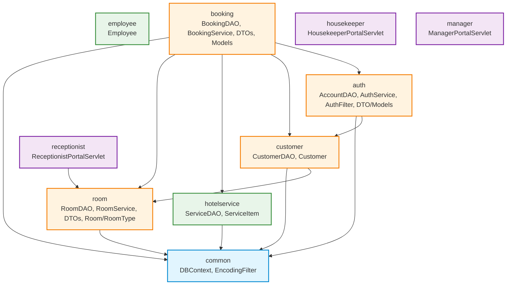

# CẨM NANG KIẾN TRÚC MÃ NGUỒN THEO FEATURE (PACKAGE-BY-FEATURE)
**Dự án:** Hệ Thống Quản Lý Khách Sạn (Hotel Management System)  
**Kiến trúc:** Feature-based / Package-by-Feature (Java Web Jakarta EE 8 / Servlet & JSP)  
**Cơ sở dữ liệu:** Microsoft SQL Server (14 bảng, JDBC Connection Pool qua `DBContext`)

---

## 1. NGUYÊN TẮC THIẾT KẾ CỐT LÕI

Dự án được chuẩn hóa từ mô hình phân tầng truyền thống (Layer-based: `controller`, `service`, `dao`, `model` ở cấp gốc) sang mô hình **Phân rã theo Tính năng / Nghiệp vụ (Package-by-Feature)**:
1. **Tính cô lập cao (High Cohesion):** Mỗi thư mục feature chứa toàn bộ các thành phần phục vụ riêng cho domain đó (`controller`, `service`, `dao`, `dto`, `model`, `filter`, `util`). Khi chỉnh sửa một tính năng, nhà phát triển chỉ cần làm việc tập trung trong một thư mục duy nhất.
2. **Phụ thuộc lỏng lẻo & Đơn hướng (Loose Coupling & Strict DAG):** Phụ thuộc giữa các feature tuân thủ nghiêm ngặt theo mô hình đồ thị có hướng không chu trình (Directed Acyclic Graph), tuyệt đối không có vòng lặp phụ thuộc (Zero Circular Dependencies).
3. **Phân định rõ ranh giới tầng:**
   - `controller`: Tiếp nhận request HTTP, validate input sơ bộ, gọi Service, điều hướng view JSP.
   - `service`: Chứa logic nghiệp vụ cốt lõi, điều phối giao tác (Transaction), chốt đơn giá, kiểm tra ràng buộc.
   - `dao`: Thao tác trực tiếp với CSDL qua JDBC `PreparedStatement` hoặc gọi Function/Stored Procedure.
   - `dto`: Vận chuyển dữ liệu giữa các tầng hoặc lưu trữ phiên làm việc `HttpSession`.
   - `model`: Ánh xạ cấu trúc các bảng thực thể trong cơ sở dữ liệu.

---

## 2. BIỂU ĐỒ PHỤ THUỘC GIỮA CÁC FEATURE (MERMAID DAG)

### Quy tắc chiều phụ thuộc cho phép:
- Mọi feature $\to$ `common`
- `customer` $\to$ `room`
- `auth` $\to$ `customer`
- `booking` $\to$ `room`, `hotelservice`, `customer`, `auth`
- `receptionist` $\to$ `room`
- `room`, `hotelservice`, `employee`, `housekeeper`, `manager`: Độc lập, không phụ thuộc feature nghiệp vụ khác.

---

## 3. BẢNG TÁC DỤNG TỪNG THƯ MỤC TRONG DỰ ÁN

| Thư Mục | Feature / Tầng | Tác Dụng Cốt Lõi | Được Chứa | KHÔNG Được Chứa | Ví Dụ File |
| :--- | :--- | :--- | :--- | :--- | :--- |
| `common/config` | Common / Hạ tầng | Khởi tạo kết nối JDBC SQL Server dùng chung. | Lớp kết nối CSDL, factory cấu hình. | Business logic, Controller, DAO. | `DBContext.java` |
| `common/filter` | Common / Bộ lọc | Bộ lọc request áp dụng toàn cầu trên ứng dụng. | Filter Servlet xử lý UTF-8, CORS. | Filter xác thực tài khoản vai trò. | `EncodingFilter.java` |
| `auth/controller` | Auth / Điều hướng | Tiếp nhận đăng nhập, đăng xuất, đăng ký. | HttpServlet xác thực tài khoản. | Logic băm mật khẩu, truy vấn SQL. | `LoginServlet.java` |
| `auth/service` | Auth / Nghiệp vụ | Xử lý logic nghiệp vụ đăng nhập, đăng ký, băm mật khẩu. | Service xác thực, kiểm tra định dạng. | ServletRequest, câu lệnh SQL chuỗi. | `AuthService.java` |
| `auth/dao` | Auth / Dữ liệu | Thực thi câu lệnh SQL trên bảng `TAIKHOAN`, `VAITRO`. | DAO làm việc trực tiếp với CSDL. | HttpSession, điều hướng view. | `AccountDAO.java` |
| `auth/dto` | Auth / Vận chuyển | Đóng gói thông tin phiên làm việc của người dùng. | DTO lưu trữ session (Serializable). | Kết nối database, biến mutable. | `UserSessionDTO.java` |
| `auth/model` | Auth / Thực thể | Mô hình hóa thực thể tài khoản và vai trò. | Entity ánh xạ bảng `TAIKHOAN`, `VAITRO`.| Xử lý nghiệp vụ, HTTP request. | `Account.java`, `Role.java` |
| `auth/filter` | Auth / Bảo mật | Chặn và kiểm soát quyền truy cập URL theo vai trò. | WebFilter kiểm tra quyền theo vai trò. | Filter UTF-8 chung. | `AuthFilter.java` |
| `auth/util` | Auth / Tiện ích | Tiện ích băm mật khẩu SHA-256 nội bộ phân hệ Auth. | Utility class thuần hàm static băm mã. | Controller, DAO, Servlet. | `PasswordUtil.java` |
| `customer/controller`| Customer / Cổng | Điều hướng trang chủ phân hệ khách hàng. | HttpServlet quản lý trang chủ khách. | Logic kiểm tra buồng phòng. | `CustomerPortalServlet.java`|
| `customer/dao` | Customer / Dữ liệu | Tương tác dữ liệu hồ sơ khách hàng `KHACHHANG`. | DAO thêm/sửa/tìm hồ sơ khách hàng. | Quản lý giỏ hàng, thông tin phòng. | `CustomerDAO.java` |
| `customer/model` | Customer / Thực thể | Ánh xạ cấu trúc bảng `KHACHHANG`. | Entity khách hàng đại diện lưu trú. | Câu lệnh SQL, HTTP response. | `Customer.java` |
| `room/controller` | Room / Điều hướng | Xử lý tra cứu phòng trống và xem chi tiết phòng. | HttpServlet tìm kiếm và chi tiết phòng. | Thuật toán kiểm tra xung đột lịch. | `CustomerSearchRoomServlet.java` |
| `room/service` | Room / Nghiệp vụ | Xử lý nghiệp vụ khả dụng buồng phòng, lọc phòng. | Service tính toán tình trạng phòng. | Đối tượng Servlet, SQL thô. | `RoomService.java` |
| `room/dao` | Room / Dữ liệu | Truy vấn bảng `PHONG`, `LOAIPHONG`, sơ đồ lễ tân. | DAO truy vấn phòng, giá, trạng thái. | Logic giỏ hàng, thanh toán. | `RoomDAO.java` |
| `room/dto` | Room / Vận chuyển | Đóng gói dữ liệu hiển thị thẻ phòng, sơ đồ KPI lễ tân. | DTO phục vụ danh sách phòng và timeline. | Entity CSDL trực tiếp. | `AvailableRoomDTO.java`, `RoomMapKpiDTO.java` |
| `room/model` | Room / Thực thể | Ánh xạ thực thể phòng vật lý và hạng phòng. | Entity `PHONG`, `LOAIPHONG`. | Logic nghiệp vụ, gọi JDBC. | `Room.java`, `RoomType.java` |
| `booking/controller` | Booking / Điều hướng | Quản lý giỏ hàng, đặt phòng, xem đơn và lịch sử. | HttpServlet luồng booking 5 bước. | Logic giao tác (Transaction) CSDL. | `CustomerBookingServlet.java`, `CustomerCartServlet.java` |
| `booking/service` | Booking / Nghiệp vụ | Điều phối quy trình đặt phòng, hủy đơn, tính tiền. | Service nghiệp vụ booking, hủy phòng. | HttpServletRequest, View JSP. | `BookingService.java` |
| `booking/dao` | Booking / Dữ liệu | Quản lý Transaction ghi nhận đơn đặt phòng và dịch vụ.| DAO thực thi ACID cho booking, hóa đơn.| Dữ liệu session, redirect URL. | `BookingDAO.java` |
| `booking/dto` | Booking / Vận chuyển | Chứa giỏ hàng, chi tiết đơn đặt và lịch sử đơn. | DTO đóng gói giỏ phòng, đơn booking. | Entity gắn liền CSDL. | `BookingCartDTO.java`, `BookingDetailDTO.java` |
| `booking/model` | Booking / Thực thể | Ánh xạ thực thể đơn đặt, phòng đặt, dịch vụ và hóa đơn.| Entity `BOOKING`, `HOADON`... | Logic tính tiền hoặc validate form.| `Booking.java`, `Invoice.java`|
| `hotelservice/dao` | HotelService / Dữ liệu| Truy vấn danh mục dịch vụ tiện ích bổ sung. | DAO làm việc với bảng `DICHVU`. | Xử lý giỏ hàng, session. | `ServiceDAO.java` |
| `hotelservice/model`| HotelService / Thực thể| Biểu diễn thực thể dịch vụ khách sạn. | Entity ánh xạ bảng `DICHVU`. | HttpServlet, JDBC connection. | `ServiceItem.java` |
| `employee/model` | Employee / Thực thể | Biểu diễn thực thể nhân viên khách sạn. | Entity ánh xạ bảng `NHANVIEN`. | Phân quyền hay servlet logic. | `Employee.java` |
| `receptionist/controller`| Receptionist / Cổng | Cổng điều hành sơ đồ buồng phòng của Lễ tân. | HttpServlet sơ đồ phòng trực quan. | Logic SQL chi tiết. | `ReceptionistPortalServlet.java`|
| `housekeeper/controller` | Housekeeper / Cổng | Cổng quản lý công việc vệ sinh buồng phòng. | HttpServlet xem và đổi trạng thái dọn. | Giao dịch check-out, hóa đơn. | `HousekeeperPortalServlet.java`|
| `manager/controller`| Manager / Cổng | Bảng điều khiển kinh doanh tổng quan cho Quản lý. | HttpServlet quản lý dashboard. | Xử lý nghiệp vụ đặt phòng lẻ. | `ManagerPortalServlet.java` |
| `tools/manual-tests` | Tools / Kiểm thử | Các bộ test runner độc lập kiểm thử chéo CSDL/API. | File Java chứa hàm `main` chạy độc lập. | Không đóng gói vào tệp WAR. | `Run20TestCasesPhase2ImpactFN31.java` |
| `tools/doc-builders` | Tools / Tài liệu | Các script Python tự động hóa cập nhật tài liệu. | File Python/PowerShell hỗ trợ dev. | Không đưa vào production. | `build_plan.py` |
| `database` | CSDL / Kịch bản SQL | Toàn bộ 7 kịch bản SQL theo thứ tự thực thi chuẩn. | File `.sql` khởi tạo CSDL, Trigger, Hàm... | Mã nguồn ứng dụng Java. | `01_Script_QuanLyKhachSan.sql` |
| `docs` | Tài liệu dự án | Tài liệu đặc tả kiến trúc, kế hoạch và kiểm thử. | File định dạng Markdown (`.md`). | File binary hoặc file code Java. | `README.md` |

---

## 4. QUY TRÌNH KHI THÊM TÍNH NĂNG MỚI (HOW-TO)

Khi phát triển thêm tính năng mới (ví dụ: Phân hệ **Hóa đơn & Thanh toán** - `invoice`):
1. **Tạo Package Domain:** `com.mycompany.hotelmanagersystem.invoice`.
2. **Tổ chức các tầng bên trong:**
   - `invoice.controller`: Tạo `InvoiceServlet.java`.
   - `invoice.service`: Tạo `InvoiceService.java`.
   - `invoice.dao`: Tạo `InvoiceDAO.java`.
   - `invoice.dto`: Tạo `InvoiceDetailDTO.java`.
   - `invoice.model`: Tạo hoặc di chuyển thực thể `Invoice.java`.
3. **Kiểm tra chiều phụ thuộc:** Đảm bảo `invoice` chỉ phụ thuộc xuống `common`, `booking`, `customer`; không tạo phụ thuộc ngược vòng tròn.
