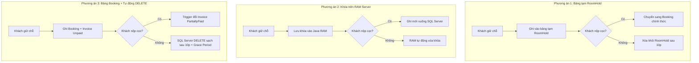
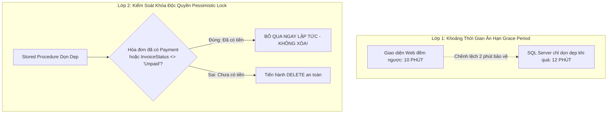

# BÁO CÁO PHÂN TÍCH KIẾN TRÚC GIẢI PHÁP
## QUẢN LÝ GIỮ CHỖ 10 PHÚT, ĐẶT CỌC TRỰC TUYẾN, RACE CONDITION VÀ HOÀN TIỀN
> **Dự án:** Hệ Thống Quản Lý Khách Sạn (Hotel Management System)  
> **Phân hệ:** Đặt phòng & Quản lý giao dịch tài chính (Booking & Deposit Flow)  
> **Mục tiêu:** Đảm bảo toàn vẹn dữ liệu CSDL 3NF, chống giữ phòng ảo, giải quyết triệt để xung đột tranh chấp (Race Condition).

---

## 1. BỐI CẢNH VÀ CÁC THÁCH THỨC NGHIỆP VỤ CẦN GIẢI QUYẾT

Trong các hệ thống đặt phòng trực tuyến hiện đại, luồng đặt phòng và thanh toán cọc đối mặt với 4 thách thức kỹ thuật lớn:

1. **Vấn đề Đơn giữ chỗ "Bỏ quên" (Abandoned Hold / Phantom Booking):**  
   Khách hàng chọn phòng, hệ thống tạo đơn và khóa phòng, nhưng khách không thanh toán cọc và tắt trình duyệt bỏ đi. Nếu không có cơ chế giải phóng, phòng bị "giam lỏng" vô thời hạn, làm thất thoát doanh thu của khách sạn.
2. **Vấn đề Tranh chấp cùng lúc (Race Condition / Overbooking):**  
   Khách A và Khách B cùng nhắm vào một phòng trong cùng một khoảng ngày. Cần một cơ chế đảm bảo người đến trước có thời gian hợp lý (10 phút) để quét mã QR chuyển khoản mà **không bị bất kỳ ai cướp mất phòng**.
3. **Vấn đề Dư thừa dữ liệu (Data Bloat):**  
   Nếu mỗi lượt khách vào bấm thử rồi bỏ dở đều tạo ra một bản ghi trong CSDL, theo thời gian các bảng nghiệp vụ chính (`Booking`, `Invoice`) sẽ bị phình to với hàng ngàn bản ghi rác.
4. **Vấn đề Xung đột sát nút (Edge-case Race Condition):**  
   Khách hàng chuyển khoản thành công ở phút thứ `09:59`, nhưng tiến trình dọn dẹp lại kích hoạt ở phút thứ `10:00`. Cần giải pháp chống xóa nhầm đơn của khách.

---

## 2. PHÂN TÍCH SO SÁNH 3 PHƯƠNG ÁN KIẾN TRÚC



---

### PHƯƠNG ÁN 1: BẢNG TẠM GIỮ CHỖ RIÊNG (`RoomHold` - Staging Table Pattern)
* **Nguyên lý:** Tạo một bảng tạm `RoomHold` riêng biệt trong CSDL. Trong 10 phút giữ chỗ, dữ liệu chỉ nằm trong `RoomHold`, bảng `Booking` và `Invoice` hoàn toàn chưa có gì. Chỉ khi có tiền cọc thật, hệ thống mới chuyển dữ liệu sang bảng `Booking`.
* **Điểm mạnh:**
  - Bảng `Booking` và `Invoice` sạch 100%, chỉ chứa đơn đã thanh toán cọc thành công.
  - Phân tách rõ ràng giữa dữ liệu tạm thời (Transient Data) và dữ liệu nghiệp vụ lâu dài (Persistent Data).
* **Điểm yếu:**
  - Phải tạo thêm 1 bảng mới trong file script CSDL (`CREATE TABLE RoomHold`), cần bảo trì thêm khóa ngoại và cấu trúc bảng mới.

---

### PHƯƠNG ÁN 2: KHÓA PHÒNG TRÊN BỘ NHỚ RAM (In-Memory Cache Pattern)
* **Nguyên lý:** Ứng dụng Java Web (Tomcat) dùng `ConcurrentHashMap` trên RAM để ghi nhận việc giữ chỗ phòng trong 10 phút. Dưới SQL Server hoàn toàn không ghi gì cả cho đến khi nhận được tiền cọc.
* **Điểm mạnh:**
  - CSDL SQL Server nguyên vẹn 100%, không thêm bảng, không thêm cột.
  - Tốc độ kiểm tra phòng nhanh tức thì vì đọc trực tiếp trên RAM.
* **Điểm yếu:**
  - **Mất khóa khi Server khởi động lại:** Nếu Tomcat restart hoặc crash trong lúc khách đang chuyển tiền, khóa trên RAM bốc hơi hoàn toàn, phòng bị mở ra cho người khác đặt đè lên.
  - **Không phù hợp tiêu chí Đồ án CSDL:** Toàn bộ logic giải quyết tranh chấp nằm ở code Java, không thể hiện được kỹ năng lập trình T-SQL (Stored Procedure, Transaction, Lock) trên SQL Server.
  - **Không đồng bộ:** Lễ tân mở SQL Server Management Studio (SSMS) tra cứu sẽ không thấy phòng đó đang bị giữ.

---

### PHƯƠNG ÁN 3: DÙNG BẢNG `Booking` HIỆN CÓ + TỰ ĐỘNG `DELETE` KHI QUÁ HẠN (Hard Delete & Grace Period)
👉 **PHƯƠNG ÁN ĐÃ ĐƯỢC LỰA CHỌN CHO DỰ ÁN NÀY**

* **Nguyên lý:**
  1. Tận dụng 100% cấu trúc các bảng sẵn có (`Booking`, `Booking_Room`, `Invoice`).
  2. Khi khách bấm đặt phòng: Ghi nhận đơn với `BookingStatus = 'Confirmed'` và `InvoiceStatus = 'Unpaid'` để khóa phòng độc quyền trong 10 phút.
  3. Nếu khách thanh toán cọc trong 10 phút: Ghi nhận `Payment` $\rightarrow$ Trigger 7 tự động chuyển `InvoiceStatus = 'PartiallyPaid'` $\rightarrow$ Đơn được lưu giữ vĩnh viễn.
  4. Nếu quá 10 phút mà hóa đơn vẫn là `Unpaid`: Stored Procedure của SQL Server chạy lệnh **`DELETE` dọn dẹp sạch sẽ** các bảng con và bảng cha của riêng đơn đó.
* **Điểm mạnh:**
  - **Không cần tạo thêm bảng mới:** Giữ nguyên 100% cấu trúc bảng CSDL hiện có của đồ án.
  - **Xử lý toàn bộ ở tầng Database:** Khai thác tối đa sức mạnh của T-SQL (Stored Procedure, Transaction, Function, Trigger), ghi điểm xuất sắc cho đồ án môn Hệ Quản Trị CSDL.
  - **0% Dư thừa dữ liệu:** Đơn hết hạn bị xóa sạch bằng `DELETE`, CSDL chỉ lưu trữ 100% các đơn có phát sinh tiền thật.
  - **An toàn trước sự cố sập server:** Dữ liệu giữ chỗ đã ghi xuống đĩa cứng, server có restart thì mốc thời gian `CreateDate` vẫn còn đó, không bị mất khóa như RAM.
* **Điểm yếu & Thách thức cần xử lý:**
  - Hiện tượng nhảy cóc mã đơn ID (Gaps in ID sequence).
  - Nguy cơ tranh chấp thời điểm sát nút (Race condition ở phút thứ `09:59`).

---

## 3. BẢNG TỔNG HỢP SO SÁNH 3 PHƯƠNG ÁN

| Tiêu chí đánh giá | Phương án 1 (Bảng tạm `RoomHold`) | Phương án 2 (Khóa trên RAM) | **Phương án 3 (SQL Server + Tự động DELETE) [ĐƯỢC CHỌN]** |
|---|---|---|---|
| **Cấu trúc bảng CSDL** | Phải thêm 1 bảng mới | Giữ nguyên 100% | **Giữ nguyên 100% các bảng sẵn có** |
| **Nơi xử lý logic chính** | SQL Server + Web | Tầng Web / Java RAM | **Tầng CSDL (SQL Server Stored Procedure)** |
| **Độ sạch của dữ liệu** | 0% Rác | 0% Rác | **0% Rác (Đơn quá hạn bị xóa sạch hoàn toàn)** |
| **An toàn khi sập Server** | An toàn (lưu đĩa cứng) | Rất rủi ro (Mất sạch khóa) | **An toàn tuyệt đối (Lưu đĩa cứng CSDL)** |
| **Mức độ phù hợp với Đồ án DBMS** | Tốt | Kém (Vì dồn cho Java) | **Xuất sắc (Tối ưu điểm số bảo vệ đồ án)** |

---

## 4. CHI TIẾT SỰ CỐ "RACE CONDITION SÁT NÚT" VÀ GIẢI PHÁP KHẮC PHỤC TRIỆT ĐỂ

### 4.1. Bản chất của sự cố sát nút (Edge-case Race Condition)

Giả sử hệ thống đặt cứng quy tắc: *"Đúng 10 phút (600 giây) chưa nộp cọc thì chạy lệnh DELETE"*:
* **Thời điểm 09 phút 59 giây:** Khách A quét mã QR thành công, tài khoản ngân hàng của khách đã bị trừ tiền, trình duyệt gửi request xác nhận thanh toán cọc về Server.
* **Thời điểm 10 phút 00 giây:** Tiến trình quét dọn tự động của SQL Server kích hoạt, thấy đơn đã chạm mốc 10 phút và tiến hành chạy lệnh `DELETE`.
* **Hậu quả nếu không có cơ chế bảo vệ:** 
  Lệnh `DELETE` chạy nhanh hơn lệnh ghi `Payment` chỉ 0.05 giây $\rightarrow$ Đơn của Khách A bị xóa mất tiêu ngay trước khi tiền được ghi nhận $\rightarrow$ Khách bị mất tiền nhưng đơn không còn tồn tại trên hệ thống!

```
[Khách A: Bấm xác nhận nộp cọc] ──(09:59)──► Đang gửi đến Server...
                                                      ▼ (Xung đột thời gian!)
[SQL Server: Chạy quét tự động] ──(10:00)──► DELETE FROM Booking WHERE BookingId = ...
```

---

### 4.2. Giải pháp 2 lớp giải quyết triệt để sự cố sát nút

Để giải quyết tận gốc vấn đề này trong Phương án 3, hệ thống áp dụng **2 lớp chốt chặn kỹ thuật**:



#### 🛡️ LỚP 1: Cơ chế Thời Gian Ân Hạn (Grace Period / Leeway Time)
* **Trên giao diện người dùng:** Đồng hồ đếm ngược hiển thị đúng **10 phút** (để tạo tính cấp thiết, buộc khách phải chuyển tiền nhanh chóng).
* **Dưới tầng SQL Server:** Stored Procedure dọn dẹp đặt ngưỡng thời gian là **12 phút** (hoặc 15 phút):
  $$\text{Điều kiện quét xóa: } \text{DATEDIFF}(\text{MINUTE}, b.\text{CreateDate}, \text{GETDATE}()) \ge 12$$
* **Tác dụng:** Tạo ra một **"vùng đệm an toàn 2 phút"**. Ngay cả khi khách nộp cọc ở giây thứ `09:59`, hệ thống vẫn còn dư trọn vẹn 2 phút để xử lý thanh toán, ngân hàng gửi biến động số dư và ghi nhận `Payment`. Không bao giờ có chuyện bị lệnh xóa đuổi kịp!

#### 🛡️ LỚP 2: Chốt chặn Transaction với Khóa Độc Quyền (`UPDLOCK, HOLDLOCK`)
* Khi tiến trình dọn dẹp chạy lệnh `DELETE`, nó bắt buộc phải kiểm tra lại hóa đơn trong cùng một Transaction:
  ```sql
  -- Kiểm tra kép: Tuyệt đối không xóa nếu đã có bản ghi thanh toán
  IF EXISTS (SELECT 1 FROM Payment WHERE InvoiceId = @InvoiceId)
     OR EXISTS (SELECT 1 FROM Invoice WHERE InvoiceId = @InvoiceId AND InvoiceStatus <> 'Unpaid')
  BEGIN
      -- Khách vừa kịp nộp tiền -> HỦY BỎ LỆNH XÓA NGAY LẬP TỨC!
      ROLLBACK TRANSACTION;
      RETURN 0;
  END
  ```
* Cơ chế này đảm bảo tính **ACID**: Nếu giao dịch thanh toán đang diễn ra, lệnh xóa phải xếp hàng đợi. Khi thanh toán thành công, lệnh xóa thấy đã có tiền sẽ tự động bỏ qua, bảo vệ an toàn 100% cho đơn của khách.

---

## 5. THIẾT KẾ KỸ THUẬT CHI TIẾT CHO PHƯƠNG ÁN 3 (BLUEPRINT)

### 5.1. Thiết kế T-SQL Stored Procedure & Function trên SQL Server

#### A. Hàm kiểm tra phòng trống tự động thời gian thực (`fn_KiemTraPhongTrongTrongKhoang`)
* **Trách nhiệm:** Tự động xem các đơn `Unpaid` quá 10 phút là đã hết hạn, phòng lập tức hiển thị trống cho người khác đặt:
```sql
CREATE OR ALTER FUNCTION dbo.fn_KiemTraPhongTrongTrongKhoang
(
    @RoomId VARCHAR(10),
    @ExpectedCheckIn DATE,
    @ExpectedCheckOut DATE,
    @IgnoreBookingId VARCHAR(10) = NULL
)
RETURNS BIT
AS
BEGIN
    IF EXISTS (
        SELECT 1 FROM Room
        WHERE RoomId = @RoomId AND RoomStatus IN ('Maintenance', 'OutOfService')
    )
        RETURN 0;

    IF EXISTS (
        SELECT 1
        FROM Booking_Room br
        JOIN Booking b ON br.BookingId = b.BookingId
        JOIN Invoice inv ON b.BookingId = inv.BookingId
        WHERE br.RoomId = @RoomId
          AND (@IgnoreBookingId IS NULL OR br.BookingId <> @IgnoreBookingId)
          AND br.BookingStatus IN ('Confirmed', 'CheckedIn')
          AND NOT (
              br.ExpectedCheckOutDate <= @ExpectedCheckIn
              OR br.ExpectedCheckInDate >= @ExpectedCheckOut
          )
          -- CHẶN PHÒNG NẾU: Đã có cọc (InvoiceStatus <> 'Unpaid') 
          -- HOẶC chưa cọc nhưng vẫn còn trong thời hạn 10 phút giữ chỗ
          AND (
              inv.InvoiceStatus <> 'Unpaid' 
              OR DATEDIFF(MINUTE, b.CreateDate, GETDATE()) < 10
          )
    )
        RETURN 0;

    RETURN 1;
END;
GO
```

---

#### B. Stored Procedure Xác Nhận Nộp Cọc (`sp_XacNhanThanhToanCoc`)
* **Trách nhiệm:** Nhận thanh toán cọc trong thời hạn 10 phút, ghi bản ghi `Payment`, Trigger tự động chuyển `InvoiceStatus = 'PartiallyPaid'`:
```sql
CREATE OR ALTER PROCEDURE dbo.sp_XacNhanThanhToanCoc
    @BookingId VARCHAR(10),
    @PaymentMethod VARCHAR(20) = 'BankTransfer',
    @Note NVARCHAR(300) = NULL,
    @NewPaymentId VARCHAR(10) OUTPUT
AS
BEGIN
    SET NOCOUNT ON;
    BEGIN TRY
        BEGIN TRANSACTION;

        DECLARE @CreateDate DATETIME, @InvoiceId VARCHAR(10), @DepositTotal DECIMAL(12,2);

        SELECT @CreateDate = b.CreateDate,
               @InvoiceId = inv.InvoiceId
        FROM Booking b
        JOIN Invoice inv ON b.BookingId = inv.BookingId
        WHERE b.BookingId = @BookingId;

        IF @InvoiceId IS NULL
        BEGIN
            RAISERROR(N'Lỗi: Đơn đặt phòng hoặc hóa đơn không tồn tại!', 16, 1);
            ROLLBACK;
            RETURN -1;
        END

        -- Kiểm tra thời hạn 10 phút giữ chỗ
        IF DATEDIFF(MINUTE, @CreateDate, GETDATE()) >= 10
        BEGIN
            RAISERROR(N'Đã hết thời gian giữ chỗ (10 phút)! Đơn đặt phòng không còn hiệu lực để thanh toán cọc.', 16, 1);
            ROLLBACK;
            RETURN -2;
        END

        -- Tính tổng tiền cọc của đơn
        SELECT @DepositTotal = ISNULL(SUM(Deposit), 0)
        FROM Booking_Room
        WHERE BookingId = @BookingId AND BookingStatus = 'Confirmed';

        IF @DepositTotal <= 0
        BEGIN
            RAISERROR(N'Đơn đặt phòng này không có khoản tiền cọc hợp lệ!', 16, 1);
            ROLLBACK;
            RETURN -3;
        END

        -- Ghi nhận giao dịch vào bảng Payment
        SET @NewPaymentId = dbo.fn_SinhMaPayment();
        INSERT INTO Payment (PaymentId, ProcessBy, InvoiceId, PaymentDate, PaymentMethod, TotalAmount, Note)
        VALUES (@NewPaymentId, NULL, @InvoiceId, GETDATE(), @PaymentMethod, @DepositTotal, ISNULL(@Note, N'Thanh toán tiền đặt cọc giữ chỗ'));

        -- Trigger trg_Payment_DongBoTrangThaiHoaDon sẽ tự động cập nhật InvoiceStatus = 'PartiallyPaid'
        COMMIT TRANSACTION;
        RETURN 0;
    END TRY
    BEGIN CATCH
        IF @@TRANCOUNT > 0 ROLLBACK;
        DECLARE @ErrMsg NVARCHAR(4000) = ERROR_MESSAGE();
        RAISERROR(@ErrMsg, 16, 1);
        RETURN -99;
    END CATCH
END;
GO
```

---

#### C. Stored Procedure Dọn Dẹp Đơn Hết Hạn (`sp_DonDepDonHetHanGiuCho`)
* **Trách nhiệm:** Dọn dẹp sạch sẽ bằng `DELETE` theo đúng thứ tự khóa ngoại an toàn, có Grace Period 12 phút:
```sql
CREATE OR ALTER PROCEDURE dbo.sp_DonDepDonHetHanGiuCho
AS
BEGIN
    SET NOCOUNT ON;
    BEGIN TRY
        BEGIN TRANSACTION;

        -- Tìm danh sách các đơn quá hạn 12 phút (có Grace Period) và chưa từng thanh toán
        DECLARE @ExpiredBookings TABLE (BookingId VARCHAR(10) PRIMARY KEY);

        INSERT INTO @ExpiredBookings (BookingId)
        SELECT b.BookingId
        FROM Booking b
        JOIN Invoice inv ON b.BookingId = inv.BookingId
        WHERE inv.InvoiceStatus = 'Unpaid'
          AND NOT EXISTS (SELECT 1 FROM Payment p WHERE p.InvoiceId = inv.InvoiceId)
          AND DATEDIFF(MINUTE, b.CreateDate, GETDATE()) >= 12;

        -- Xóa an toàn từ bảng con lên bảng cha theo đúng quan hệ Foreign Key:
        -- 1. Xóa dịch vụ đính kèm trong booking (nếu có)
        DELETE brs
        FROM Booking_Room_Service brs
        JOIN @ExpiredBookings eb ON brs.BookingId = eb.BookingId;

        -- 2. Xóa chi tiết phòng trong booking
        DELETE br
        FROM Booking_Room br
        JOIN @ExpiredBookings eb ON br.BookingId = eb.BookingId;

        -- 3. Xóa hóa đơn tương ứng
        DELETE inv
        FROM Invoice inv
        JOIN @ExpiredBookings eb ON inv.BookingId = eb.BookingId;

        -- 4. Xóa đơn đặt phòng chính
        DELETE b
        FROM Booking b
        JOIN @ExpiredBookings eb ON b.BookingId = eb.BookingId;

        COMMIT TRANSACTION;
        RETURN 0;
    END TRY
    BEGIN CATCH
        IF @@TRANCOUNT > 0 ROLLBACK;
        DECLARE @ErrMsg NVARCHAR(4000) = ERROR_MESSAGE();
        RAISERROR(@ErrMsg, 16, 1);
        RETURN -99;
    END CATCH
END;
GO
```

---

### 5.2. Thiết kế Tầng Web Java Backend

1. **Lớp `PaymentDAO.java` (Tầng DAO):**
   - Đóng gói hàm `confirmDepositPaymentSP(String bookingId, String paymentMethod)` sử dụng JDBC `CallableStatement` để gọi trực tiếp `sp_XacNhanThanhToanCoc`.
2. **Lớp `BookingService.java` (Tầng Service):**
   - `confirmDepositPayment(String bookingId, String paymentMethod)`: Điều phối xác nhận cọc.
   - `getRemainingHoldSeconds(String bookingId)`: Tính số giây đếm ngược còn lại của 10 phút để phục vụ đồng hồ đếm ngược trên web.
   - `cleanExpiredBookings()`: Gọi thực thi `sp_DonDepDonHetHanGiuCho`.
3. **Lớp `CustomerDepositServlet.java` (Tầng Controller):**
   - `doGet`: Nhận `bookingId`, tính thời gian còn lại, chuyển tiếp đến `deposit_checkout.jsp`. Nếu quá 10 phút, báo lỗi hết hạn.
   - `doPost`: Nhận thao tác xác nhận đã chuyển khoản từ khách $\rightarrow$ Gọi Service $\rightarrow$ Thành công chuyển đến `booking_detail.jsp`.

---

### 5.3. Thiết kế Giao diện Thanh toán Cọc (`deposit_checkout.jsp`)

* **Đồng hồ đếm ngược (Countdown JS):**
  - Hiển thị nổi bật: ⏳ **Thời gian giữ phòng còn lại: `09:45`** (màu cam $\rightarrow$ chuyển đỏ khi còn dưới 2 phút).
  - Khi đồng hồ về `00:00`: Tự động hiện popup *"Đã hết thời gian giữ chỗ! Phòng đã được giải phóng"* và điều hướng về trang chủ.
* **Mã QR Chuyển khoản (VietQR):**
  - Hiển thị thông tin tài khoản ngân hàng khách sạn và mã QR sinh tự động:
    - Số tiền: Đúng bằng tổng tiền cọc (`DepositTotal`).
    - Nội dung chuyển khoản: `COC [Mã Booking]` (ví dụ: `COC BK005`).
* **Nút bấm thao tác:**
  - Nút xanh nổi bật: **"Tôi Đã Chuyển Khoản Thành Công"**.
  - Nút xám: **"Hủy Đơn Giữ Chỗ"** (khách chủ động nhả phòng ngay lập tức nếu đổi ý).

---

## 6. KẾ HOẠCH TRIỂN KHAI VÀ KIỂM CHỨNG (ROADMAP)

1. **Giai đoạn 1: Cập nhật T-SQL trên SQL Server:**
   - Cập nhật hàm `fn_KiemTraPhongTrongTrongKhoang` trong [02_Function.sql](file:///d:/Learn/College/Lap%20trinh%20web/HotelManagerSystem/database/02_Function.sql).
   - Thêm thủ tục `sp_XacNhanThanhToanCoc` và `sp_DonDepDonHetHanGiuCho` vào [04_Procedure.sql](file:///d:/Learn/College/Lap%20trinh%20web/HotelManagerSystem/database/04_Procedure.sql).
   - Thực thi cập nhật trực tiếp vào cơ sở dữ liệu SQL Server localhost (`QuanLyKhachSan`).
2. **Giai đoạn 2: Phát triển Tầng Backend Java:**
   - Tạo mới `PaymentDAO.java` theo đúng quy tắc kiến trúc (≤ 300 dòng, 0 checkstyle violations).
   - Bổ sung phương thức điều phối trong `BookingService.java`.
   - Tạo servlet điều hướng `CustomerDepositServlet.java`.
3. **Giai đoạn 3: Phát triển Giao diện & Test:**
   - Xây dựng giao diện `deposit_checkout.jsp` kèm đồng hồ đếm ngược và VietQR.
   - Kết nối luồng đặt phòng từ `CustomerBookingServlet` sang trang đặt cọc.
   - Chạy kiểm thử tự động `mvn test` (đảm bảo 7/7 ArchUnit tests pass) và kiểm chứng luồng thực tế trên trình duyệt.

---
*Tài liệu này được lập để làm cơ sở kỹ thuật chính thức và kim chỉ nam cho việc triển khai mã nguồn.*
